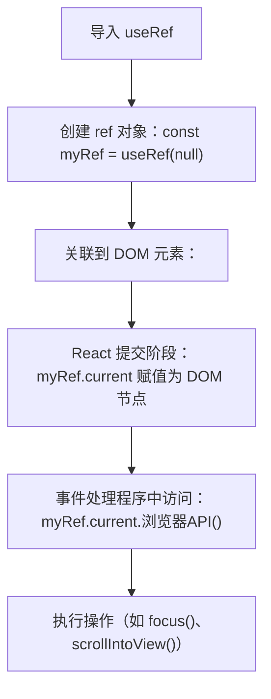

# 使用引用操作 DOM

原地址：<https://react.nodejs.cn/learn/manipulating-the-dom-with-refs>  

## 一、引用（Ref）的基本概念与用途

React 通常自动管理 DOM 更新，但在某些场景下需要直接访问 DOM 节点（如聚焦元素、滚动到指定位置、测量尺寸等）。此时需使用**引用（Ref）**，通过 `useRef` 钩子获取 DOM 节点的引用，实现对 DOM 的手动操作。

- **核心作用**：存储 DOM 节点的引用，允许在 React 管理之外直接操作 DOM。
- **与状态的区别**：ref 的值在渲染间保留，但修改 `current` 属性不会触发组件重新渲染（状态更新会触发重渲染）。

## 二、获取 DOM 节点引用的步骤

使用 `useRef` 钩子获取 DOM 节点引用的流程如下：

1. **导入 `useRef`**  

   ```jsx
   import { useRef } from 'react';
   ```

2. **创建 ref 对象**  
   `useRef` 返回一个包含 `current` 属性的对象，初始值为 `null`：  

   ```jsx
   const myRef = useRef(null); // myRef.current 初始为 null
   ```

3. **关联到 DOM 元素**  
   将 ref 对象通过 `ref` 属性传递给目标 JSX 标签，React 会在 DOM 节点创建后将其赋值给 `myRef.current`：  

   ```jsx
   <div ref={myRef}>目标元素</div>
   ```

4. **访问 DOM 节点**  
   在事件处理程序等时机，通过 `myRef.current` 访问 DOM 节点，并调用浏览器 API（如 `focus()`、`scrollIntoView()` 等）：  

   ```jsx
   // 示例：聚焦输入框
   myRef.current.focus();
   ```

## 三、实际示例

### 示例 1：聚焦文本输入框

通过 ref 实现点击按钮聚焦输入框：  

```jsx
import { useRef } from 'react';

export default function Form() {
  const inputRef = useRef(null); // 创建 ref

  function handleClick() {
    inputRef.current.focus(); // 访问 DOM 节点并调用 focus()
  }

  return (
    <>
      <input ref={inputRef} /> {/* 关联到输入框 */}
      <button onClick={handleClick}>聚焦输入框</button>
    </>
  );
}
```

### 示例 2：滚动到指定元素

通过多个 ref 实现点击按钮滚动到对应图片：  

```jsx
import { useRef } from 'react';

export default function CatFriends() {
  // 为每个图片创建单独的 ref
  const firstCatRef = useRef(null);
  const secondCatRef = useRef(null);
  const thirdCatRef = useRef(null);

  // 滚动到第一个图片
  function handleScrollToFirstCat() {
    firstCatRef.current.scrollIntoView({
      behavior: 'smooth', // 平滑滚动
      inline: 'center'
    });
  }

  // 类似实现滚动到第二、三个图片的函数...

  return (
    <>
      <nav>
        <button onClick={handleScrollToFirstCat}>Neo</button>
        {/* 其他按钮... */}
      </nav>
      <div>
        <ul>
          <li></li>
          <li></li>
          <li></li>
        </ul>
      </div>
    </>
  );
}
```

## 四、处理列表中的引用（Ref 回调）

当需要为动态列表（数量未知）中的每个元素创建 ref 时，不能在 `map` 循环中直接使用 `useRef`（钩子必须在组件顶层调用）。此时需使用**ref 回调**：

### 原理

- ref 回调是一个函数，React 会在 DOM 节点创建时传入节点，在节点移除时传入 `null`。
- 通过维护一个 `Map` 或数组，存储每个元素的 ref，实现通过索引或 ID 访问。

### 示例：滚动到列表中的任意元素

```jsx
import { useRef, useState } from "react";

export default function CatFriends() {
  const itemsRef = useRef(new Map()); // 用 Map 存储 ref（键：元素标识，值：DOM 节点）
  const [catList, setCatList] = useState(/* 初始化列表 */);

  // 滚动到指定元素
  function scrollToCat(cat) {
    const node = itemsRef.current.get(cat); // 从 Map 中获取 DOM 节点
    node.scrollIntoView({ behavior: 'smooth' });
  }

  return (
    <>
      <nav>
        <button onClick={() => scrollToCat(catList[0])}>第一个</button>
        {/* 其他按钮... */}
      </nav>
      <ul>
        {catList.map((cat) => (
          <li 
            key={cat}
            // ref 回调：添加到 Map，返回清除函数（移除）
            ref={(node) => {
              if (node) {
                itemsRef.current.set(cat, node); // 节点存在时添加到 Map
              } else {
                itemsRef.current.delete(cat); // 节点移除时从 Map 中删除
              }
            }}
          >
            
          </li>
        ))}
      </ul>
    </>
  );
}
```

## 五、访问其他组件的 DOM 节点

默认情况下，组件不会暴露内部 DOM 节点。如需访问子组件的 DOM 节点，需手动传递 ref：

### 基本方式：父组件传递 ref 给子组件

```jsx
import { useRef } from 'react';

// 子组件：接收 ref 并传递给内置 input
function MyInput({ ref }) {
  return <input ref={ref} />;
}

// 父组件：创建 ref 并传递给子组件
export default function MyForm() {
  const inputRef = useRef(null);

  function handleClick() {
    inputRef.current.focus(); // 访问子组件内部的 input DOM 节点
  }

  return (
    <>
      <MyInput ref={inputRef} />
      <button onClick={handleClick}>聚焦输入框</button>
    </>
  );
}
```

### 限制暴露的 API：`useImperativeHandle`

如需限制父组件可操作的方法（而非暴露完整 DOM 节点），可使用 `useImperativeHandle` 自定义暴露的 API：

```jsx
import { useRef, useImperativeHandle } from "react";

function MyInput({ ref }) {
  const realInputRef = useRef(null); // 内部 ref 指向真实 input

  // 自定义暴露给父组件的方法（仅允许 focus）
  useImperativeHandle(ref, () => ({
    focus() {
      realInputRef.current.focus();
    }
  }));

  return <input ref={realInputRef} />;
}

export default function Form() {
  const inputRef = useRef(null);

  function handleClick() {
    inputRef.current.focus(); // 只能调用暴露的 focus 方法
  }

  return (
    <>
      <MyInput ref={inputRef} />
      <button onClick={handleClick}>聚焦输入框</button>
    </>
  );
}
```

## 六、React 中 Ref 的附加时机

React 的更新分为两个阶段：

1. **渲染阶段**：计算组件输出（此时 DOM 未更新，`ref.current` 可能为 `null`）。
2. **提交阶段**：将计算结果应用到 DOM（此时 React 会设置 `ref.current` 为 DOM 节点）。

- **注意**：避免在渲染阶段访问 `ref.current`（可能为 `null` 或过时值），通常在事件处理程序中使用。
- 如需在无事件触发时操作 ref（如初始加载后），可能需要配合 `useEffect`（后续章节介绍）。

## 七、同步刷新状态更新：`flushSync`

React 状态更新默认是异步的，若需在状态更新后立即操作 DOM（如添加元素后滚动到末尾），需使用 `flushSync` 强制同步更新 DOM：

```jsx
import { useState, useRef } from 'react';
import { flushSync } from 'react-dom'; // 导入 flushSync

export default function TodoList() {
  const listRef = useRef(null);
  const [todos, setTodos] = useState([]);

  function handleAdd(todoText) {
    const newTodo = { id: Date.now(), text: todoText };
    // 强制同步更新 DOM
    flushSync(() => {
      setTodos([...todos, newTodo]);
    });
    // 此时 DOM 已更新，可安全滚动
    listRef.current.lastChild.scrollIntoView({ behavior: 'smooth' });
  }

  return (
    <>
      <button onClick={() => handleAdd('新任务')}>添加任务</button>
      <ul ref={listRef}>
        {todos.map(todo => <li key={todo.id}>{todo.text}</li>)}
      </ul>
    </>
  );
}
```

## 八、使用 Ref 操作 DOM 的最佳实践

1. **仅作为应急方案**：优先使用 React 声明式语法（如状态驱动 UI），仅在必须直接操作 DOM 时使用 ref（如聚焦、滚动、测量尺寸）。

2. **避免修改 React 管理的 DOM**：
   - 手动修改 React 控制的 DOM 节点（如删除、修改子元素）可能导致 React 状态与 DOM 不一致，引发错误。
   - 可安全修改 React 不会更新的部分（如始终为空的 `<div>` 的子元素）。

3. **非破坏性操作优先**：聚焦、滚动等操作不会修改 DOM 结构，风险较低；避免手动添加/删除 React 管理的元素。

## 九、使用 Ref 操作 DOM 的流程流程图



## 十、总结

- **Ref 的核心用途**：获取 React 管理的 DOM 节点引用，实现聚焦、滚动等手动操作。
- **使用步骤**：导入 `useRef` → 创建 ref → 关联到 JSX → 通过 `current` 访问 DOM 节点。
- **列表处理**：通过 ref 回调维护 `Map` 存储动态元素的 ref。
- **跨组件访问**：父组件传递 ref 给子组件，或通过 `useImperativeHandle` 限制暴露的 API。
- **最佳实践**：仅用于必要场景，避免修改 React 管理的 DOM，优先使用声明式语法。
