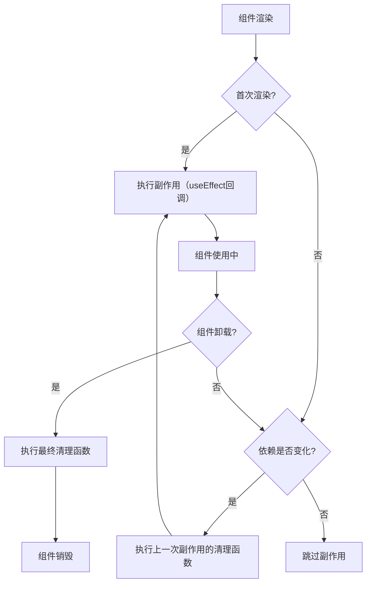

# 使用副作用进行同步

原地址：<https://react.nodejs.cn/learn/synchronizing-with-effects>

在 React 中，组件常需要与外部系统（如浏览器 API、网络、第三方库）同步。副作用（Effect）允许组件在渲染后运行代码，实现这种同步，而不会干扰 React 的渲染逻辑。本文详细讲解了副作用的概念、使用方法、依赖管理、清理机制及开发中的特殊行为，帮助开发者正确处理组件与外部系统的交互。

## 一、副作用的核心概念

副作用是 React 中用于处理组件与外部系统同步的机制，其核心是在渲染后运行代码，以响应渲染本身（而非特定用户交互）引起的副作用。

### 1. 组件中的三种逻辑

React 组件中存在三种逻辑，需明确区分：

- **渲染代码**：组件顶层的代码，用于计算并返回 JSX，必须是纯函数（无副作用，仅做计算）。
- **事件处理程序**：嵌套在组件中的函数，由特定用户交互（如点击、输入）触发，可包含副作用（如更新状态、发送请求）。
- **副作用（Effect）**：由渲染本身引起的副作用（如连接服务器、操作 DOM），需通过 `useEffect` 声明，在渲染后执行。

### 2. 副作用与事件的区别

| **特性**       | **副作用（Effect）**                | **事件处理程序**                  |
|----------------|-------------------------------------|-----------------------------------|
| **触发原因**   | 由渲染本身引起（组件挂载、更新）    | 由特定用户交互（如点击、输入）引起 |
| **执行时机**   | 渲染后（屏幕更新完成）              | 交互发生时（渲染前或后，取决于逻辑） |
| **用途**       | 与外部系统同步（如连接服务器、操作 DOM） | 响应用户操作（如提交表单、导航）  |

### 3. 何时需要使用副作用

副作用主要用于组件与 **外部系统** 同步，常见场景包括：

- 控制非 React 组件（如浏览器的 `<video>` 标签、第三方 UI 库）。
- 建立/断开网络连接（如聊天服务器）。
- 订阅事件（如滚动、窗口大小变化）。
- 发送分析日志（组件挂载时）。
- 触发动画或 DOM 操作（如自动聚焦输入框）。

**注意**：若逻辑仅涉及 React 内部状态（如根据一个状态更新另一个状态），无需使用副作用，可直接在渲染中计算或通过事件处理。

## 二、副作用的使用步骤

使用副作用需遵循三个核心步骤：声明副作用、指定依赖、添加清理函数（如需）。

### 1. 步骤1：声明副作用

通过 `useEffect` 钩子声明副作用，确保代码在渲染后执行（避免干扰纯渲染逻辑）。

#### 语法

```javascript
import { useEffect } from 'react';

function MyComponent() {
  useEffect(() => {
    // 副作用代码（如操作DOM、连接服务器）
    // 此代码在每次渲染后运行
  });
  return <div />;
}
```

#### 示例：控制视频播放

```javascript
import { useEffect, useRef } from 'react';

function VideoPlayer({ src, isPlaying }) {
  const videoRef = useRef(null);

  // 声明副作用：同步视频播放状态与isPlaying
  useEffect(() => {
    if (isPlaying) {
      videoRef.current.play(); // 调用DOM方法，属于副作用
    } else {
      videoRef.current.pause();
    }
  });

  return <video ref={videoRef} src={src} loop />;
}
```

- **解析**：副作用在渲染后执行，确保 `<video>` 元素已存在于 DOM 中，避免渲染期间操作 DOM 的错误。

### 2. 步骤2：指定副作用依赖

默认情况下，副作用在 **每次渲染后** 运行，这可能导致不必要的性能问题或逻辑错误。通过依赖数组可控制副作用仅在必要时重新运行。

#### 依赖数组的作用

- 依赖数组是 `useEffect` 的第二个参数，用于声明副作用依赖的变量（属性或状态）。
- 若依赖数组中的所有变量与上一次渲染的值相同（通过 `Object.is` 比较），React 会跳过此次副作用。
- 若省略依赖数组，副作用在 **每次渲染后** 运行；若为空数组 `[]`，副作用仅在 **组件挂载时** 运行一次。

#### 示例：优化视频播放副作用

```javascript
useEffect(() => {
  if (isPlaying) {
    videoRef.current.play();
  } else {
    videoRef.current.pause();
  }
}, [isPlaying]); // 仅当isPlaying变化时重新运行
```

- **效果**：输入框变化（不影响 `isPlaying`）时，副作用不会重新运行；仅点击播放/暂停按钮（改变 `isPlaying`）时，副作用才执行。

#### 注意事项

- 依赖数组必须包含副作用中使用的 **所有属性和状态**，否则会导致逻辑错误（如使用旧值）。
- 无需包含 `useRef` 返回的 ref 对象（其引用稳定）或 `useState` 返回的 setState 函数（其引用稳定）。

### 3. 步骤3：添加清理函数（如需）

某些副作用需要“撤销”操作（如断开连接、取消订阅），避免内存泄漏或逻辑错误。通过返回清理函数可实现这一点。

#### 清理函数的调用时机

- 副作用重新运行前（依赖变化时）。
- 组件卸载时（从 DOM 中移除）。

#### 示例：连接聊天服务器

```javascript
import { useEffect } from 'react';
import { createConnection } from './chat.js';

function ChatRoom({ roomId }) {
  useEffect(() => {
    // 建立连接（副作用）
    const connection = createConnection(roomId);
    connection.connect();

    // 清理函数：断开连接
    return () => {
      connection.disconnect();
    };
  }, [roomId]); // 仅当roomId变化时重新连接

  return <h1>Welcome to {roomId}!</h1>;
}
```

- **效果**：
  - 组件挂载或 `roomId` 变化时，建立新连接。
  - 组件卸载或 `roomId` 变化前，断开旧连接。

## 三、开发中的特殊行为：副作用运行两次

在开发环境（严格模式下），React 会 **故意重新挂载组件一次**，导致副作用运行两次（第一次挂载 → 清理 → 第二次挂载）。这是为了检测未正确清理的副作用（如未断开的连接），提前暴露潜在问题。

### 原因与解决方法

- **原因**：验证副作用的清理逻辑是否正确。若清理不彻底（如连接未关闭），开发中会出现明显错误（如重复连接）。
- **解决方法**：实现正确的清理函数，确保副作用可被安全撤销。生产环境中不会有此行为，副作用仅运行一次。

### 常见场景的正确处理

| **场景**         | **副作用**                  | **清理函数**                  |
|------------------|-----------------------------|-------------------------------|
| 订阅事件         | `window.addEventListener`   | `window.removeEventListener`  |
| 定时器/间隔器    | `setTimeout`/`setInterval`  | `clearTimeout`/`clearInterval` |
| 网络请求         | `fetch`                     | 忽略旧请求（如设置标志位）    |
| 动画             | 触发动画（如 `opacity: 1`） | 重置动画（如 `opacity: 0`）   |

## 四、副作用的常见使用场景

### 1. 控制非 React 组件

如操作浏览器原生组件（`<video>`、`<dialog>`）或第三方库，需通过副作用同步 React 状态与组件行为。

#### 示例：控制对话框显示

```javascript
import { useEffect, useRef } from 'react';

function Popup() {
  const dialogRef = useRef(null);

  useEffect(() => {
    const dialog = dialogRef.current;
    dialog.showModal(); // 显示对话框（副作用）
    return () => dialog.close(); // 关闭对话框（清理）
  }, []); // 仅挂载时运行

  return <dialog ref={dialogRef}>Hello!</dialog>;
}
```

### 2. 订阅事件

监听浏览器事件（如滚动、窗口大小变化），需在副作用中订阅，在清理函数中取消订阅。

#### 示例：监听滚动事件

```javascript
import { useEffect, useState } from 'react';

function ScrollTracker() {
  const [scrollY, setScrollY] = useState(0);

  useEffect(() => {
    function handleScroll() {
      setScrollY(window.scrollY); // 更新滚动位置
    }
    window.addEventListener('scroll', handleScroll); // 订阅
    return () => window.removeEventListener('scroll', handleScroll); // 取消订阅
  }, []); // 仅挂载时订阅

  return <p>Scrolled {scrollY}px</p>;
}
```

### 3. 数据请求

虽可在副作用中请求数据，但需注意避免竞态条件（如旧请求结果覆盖新请求）。

#### 示例：安全请求数据

```javascript
import { useEffect, useState } from 'react';

function UserTodos({ userId }) {
  const [todos, setTodos] = useState(null);

  useEffect(() => {
    let ignore = false; // 标志位：忽略旧请求结果

    async function fetchTodos() {
      const response = await fetch(`/api/user/${userId}/todos`);
      const data = await response.json();
      if (!ignore) { // 仅处理未被忽略的请求
        setTodos(data);
      }
    }

    fetchTodos();

    return () => {
      ignore = true; // 清理：标记为忽略
    };
  }, [userId]); // 仅userId变化时重新请求

  if (!todos) return <p>Loading...</p>;
  return <ul>{todos.map(t => <li key={t.id}>{t.text}</li>)}</ul>;
}
```

### 4. 发送分析日志

组件挂载时发送分析事件，无需清理（但需避免开发环境干扰）。

#### 示例：记录页面访问

```javascript
import { useEffect } from 'react';

function ProductPage({ productId }) {
  useEffect(() => {
    // 发送分析日志（副作用）
    logVisit(`/product/${productId}`);
  }, [productId]); // 产品变化时重新记录

  return <h1>Product {productId}</h1>;
}

// 开发环境不发送日志
function logVisit(url) {
  if (process.env.NODE_ENV === 'production') {
    fetch('/api/log', { method: 'POST', body: JSON.stringify({ url }) });
  }
}
```

## 五、不需要使用副作用的场景

- **仅调整 React 内部状态**：若需根据一个状态更新另一个状态，可直接在渲染中计算或使用事件处理。
- **初始化应用逻辑**：如检查认证令牌，应放在组件外部（仅运行一次）。
- **响应用户交互**：如购买商品、提交表单，应放在事件处理程序中（由特定操作触发）。

## 六、核心要点回顾

1. **副作用的作用**：同步组件与外部系统（如 DOM、网络、第三方库），由渲染引起。
2. **使用步骤**：
   - 声明：通过 `useEffect` 定义副作用代码。
   - 依赖：通过依赖数组控制副作用的重新运行时机。
   - 清理：返回清理函数以撤销副作用（如断开连接、取消订阅）。
3. **开发特性**：严格模式下副作用运行两次，用于验证清理逻辑，生产环境不会出现。
4. **适用场景**：控制非 React 组件、网络连接、事件订阅、动画触发等。
5. **常见错误**：
   - 依赖数组遗漏变量，导致使用旧值。
   - 未实现清理函数，导致内存泄漏。
   - 在副作用中处理纯 React 状态逻辑（无需副作用）。

## 七、副作用生命周期流程图



流程图说明：

- 组件首次渲染后，直接执行副作用。
- 重新渲染时，若依赖变化，先执行上一次副作用的清理函数，再执行新副作用。
- 组件卸载时，执行最后一次副作用的清理函数，确保资源正确释放。
