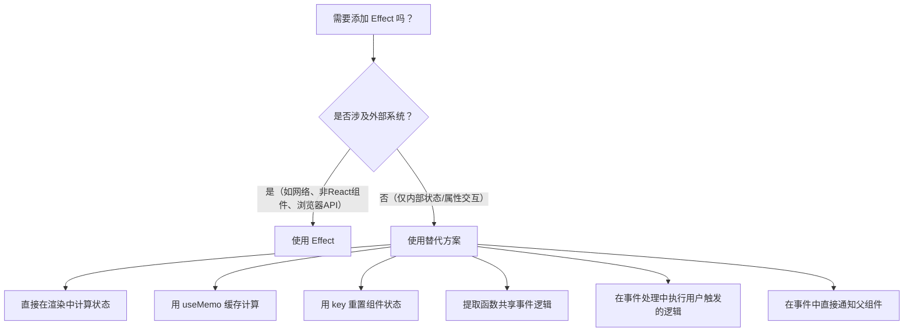

# 你可能不需要副作用

原地址：<https://react.nodejs.cn/learn/you-might-not-need-an-effect>  

## 一、副作用（Effect）的本质与适用场景

副作用（Effect）是 React 中用于“跳出”React 范式的应急方案，其核心作用是**将组件与外部系统同步**，例如：

- 非 React 组件（如第三方 UI 插件）
- 网络请求（如 API 调用）
- 浏览器 DOM 操作（如手动修改 DOM 样式、监听 resize 事件）

**注意**：若逻辑不涉及外部系统（仅涉及组件内部的状态、属性交互），则不需要使用副作用。删除不必要的副作用可使代码更易理解、执行更快且更少出错。

## 二、不需要使用副作用的常见场景及替代方案

### 1. 根据 props 或状态更新组件状态

**问题**：当需要根据 props 或其他状态的变化更新本地状态时，使用 `useEffect` 监听变化后调用 `setState` 是不必要的。  
**原因**：`useEffect` 是异步执行的，可能导致状态更新延迟或不一致；而直接在渲染过程中计算状态更及时、更可靠。  

**替代方案**：在组件渲染时直接根据依赖计算状态。  

```jsx
// 不推荐：使用 Effect 监听 props 变化更新状态
function UserProfile({ userId }) {
  const [user, setUser] = useState(null);
  useEffect(() => {
    setUser(getUserById(userId)); // 异步更新，可能延迟
  }, [userId]);
  // ...
}

// 推荐：直接在渲染中计算
function UserProfile({ userId }) {
  const user = getUserById(userId); // 渲染时同步计算
  // ...
}
```

### 2. 缓存昂贵的计算结果

**问题**：使用 `useEffect` 结合 `useState` 缓存计算结果（如复杂数据处理），会导致冗余的状态更新和渲染。  
**原因**：`useEffect` 会在渲染后执行，而计算结果应与依赖同步更新，`useMemo` 是专门用于缓存计算的 Hook，更高效。  

**替代方案**：使用 `useMemo` 缓存计算结果，依赖变化时自动重新计算。  

```jsx
// 不推荐：Effect + useState 缓存
function ProductList({ products, filter }) {
  const [filteredProducts, setFilteredProducts] = useState([]);
  useEffect(() => {
    setFilteredProducts(products.filter(...)); // 昂贵计算
  }, [products, filter]);
  // ...
}

// 推荐：useMemo 缓存
function ProductList({ products, filter }) {
  const filteredProducts = useMemo(
    () => products.filter(...), // 依赖变化时自动更新
    [products, filter]
  );
  // ...
}
```

### 3. 重置组件状态

**问题**：使用 `useEffect` 监听 `key` 或 props 变化，手动重置组件状态（如 `setState(initialState)`），会增加冗余逻辑。  
**原因**：React 中，当组件的 `key` 属性变化时，会销毁旧组件并创建新实例，状态会自动重置，无需手动操作。  

**替代方案**：通过修改组件的 `key` 触发重新初始化，实现状态重置。  

```jsx
// 不推荐：Effect 监听 key 重置状态
function UserEditor({ userId, key }) {
  const [formData, setFormData] = useState({});
  useEffect(() => {
    setFormData(initialFormData(userId)); // 手动重置
  }, [key, userId]);
  // ...
}

// 推荐：通过 key 自动重置
function UserManager({ currentUserId }) {
  // 切换 userId 时，key 变化，UserEditor 重新初始化
  return <UserEditor key={currentUserId} userId={currentUserId} />;
}
```

### 4. 共享事件处理逻辑

**问题**：多个事件处理程序（如 `onClick`、`onChange`）需要共享逻辑时，使用 `useEffect` 提取逻辑会导致逻辑与触发时机分离。  
**原因**：`useEffect` 是在渲染后执行，而事件处理是用户主动触发的，将逻辑提取为独立函数更清晰，且避免不必要的执行。  

**替代方案**：将共享逻辑提取为普通函数，在事件处理程序中调用。  

```jsx
// 不推荐：用 Effect 共享逻辑（逻辑与触发分离）
function Form() {
  const [value, setValue] = useState('');
  useEffect(() => {
    // 共享逻辑（如验证）
    function validate() { /* ... */ }
    // 但无法直接关联到事件
  }, [value]);

  return <input onChange={(e) => setValue(e.target.value)} />;
}

// 推荐：提取共享函数，在事件中调用
function Form() {
  const [value, setValue] = useState('');
  // 共享逻辑
  const validate = (val) => { /* ... */ };

  return (
    <input 
      onChange={(e) => {
        const val = e.target.value;
        setValue(val);
        validate(val); // 事件中直接调用共享逻辑
      }} 
    />
  );
}
```

### 5. 由用户操作触发的逻辑

**问题**：将用户行为（如按钮点击、表单提交）触发的逻辑放在 `useEffect` 中，会导致逻辑执行时机与用户操作脱节。  
**原因**：`useEffect` 响应的是“渲染变化”，而用户操作应直接触发逻辑，放在事件处理程序中更符合直觉。  

**替代方案**：将逻辑直接放在对应的事件处理程序中。  

```jsx
// 不推荐：用 Effect 处理用户操作逻辑
function Search() {
  const [query, setQuery] = useState('');
  useEffect(() => {
    if (query) {
      fetchResults(query); // 由输入变化触发，但属于用户操作
    }
  }, [query]);

  return <input onChange={(e) => setQuery(e.target.value)} />;
}

// 推荐：在事件处理中直接执行
function Search() {
  const [query, setQuery] = useState('');
  const handleSearch = () => {
    if (query) {
      fetchResults(query); // 用户点击搜索按钮时触发
    }
  };

  return (
    <>
      <input onChange={(e) => setQuery(e.target.value)} />
      <button onClick={handleSearch}>搜索</button>
    </>
  );
}
```

### 6. 通知父组件状态变化

**问题**：子组件通过 `useEffect` 监听本地状态变化，再调用父组件的回调函数通知更新，可能导致不必要的触发。  
**原因**：`useEffect` 会在每次状态变化后执行，包括初始渲染，而父组件通常只需要在状态**主动变化**时被通知（如用户操作导致的变化）。  

**替代方案**：在状态变化的事件处理程序中直接调用父组件的回调。  

```jsx
// 不推荐：用 Effect 通知父组件
function TodoItem({ onToggle, initialDone }) {
  const [done, setDone] = useState(initialDone);
  useEffect(() => {
    onToggle(done); // 初始渲染也会触发，可能不必要
  }, [done, onToggle]);

  return <input type="checkbox" checked={done} onChange={(e) => setDone(e.target.checked)} />;
}

// 推荐：在事件中直接通知
function TodoItem({ onToggle, initialDone }) {
  const [done, setDone] = useState(initialDone);
  const handleToggle = (checked) => {
    setDone(checked);
    onToggle(checked); // 仅在用户点击时通知
  };

  return <input type="checkbox" checked={done} onChange={(e) => handleToggle(e.target.checked)} />;
}
```

## 三、判断是否需要使用副作用的流程



## 四、总结

- **副作用的核心用途**：仅用于同步组件与外部系统，不涉及外部系统时无需使用。
- **删除不必要的 Effect**：通过直接计算状态、`useMemo` 缓存、`key` 重置、提取共享函数等方式，替代内部交互场景下的 Effect。
- **优势**：减少异步状态不一致风险，提升代码可读性和执行效率，降低错误概率。

通过合理判断场景并选择合适的实现方式，可大幅优化 React 组件的逻辑结构。
