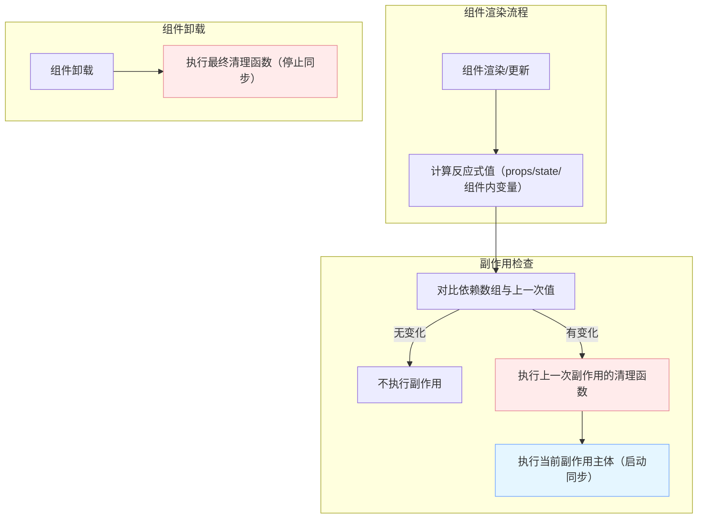

# 反应式(响应式)副作用的生命周期

原文地址：[https://react.nodejs.cn/learn/lifecycle-of-reactive-effects](https://react.nodejs.cn/learn/lifecycle-of-reactive-effects)

## 核心概念：副作用与组件生命周期的区别

组件和副作用的生命周期存在本质差异，这是理解React副作用机制的基础：

| **组件生命周期** | **副作用生命周期** |
|------------------|------------------|
| 包含挂载（mount）、更新（update）、卸载（unmount）三个阶段 | 仅包含两个核心动作：开始同步（启动）、停止同步（清理） |
| 以组件为中心，描述组件在DOM中的存在状态变化 | 以同步过程为中心，独立于组件生命周期，专注于外部系统与React状态的同步 |
| 由React自动触发（如初始渲染、props/state变化、DOM移除） | 由依赖变化触发，可能在组件挂载后多次启动和停止 |

## 副作用的生命周期：同步的启动与停止

每个副作用本质上是一个**独立的同步过程**，其核心逻辑由两部分组成：

- **启动逻辑**：副作用函数主体，定义如何开始与外部系统同步（如连接服务器、订阅事件）。
- **清理逻辑**：副作用返回的函数，定义如何停止同步（如断开连接、取消订阅）。

### 副作用的执行流程（以ChatRoom组件为例）

```mermaid
graph TD
    subgraph 组件状态变化
        A[组件挂载，roomId="general"]
        B[roomId更新为"travel"]
        C[roomId更新为"music"]
        D[组件卸载]
    end
    
    subgraph 副作用响应
        A --> A1[启动同步：连接"general"房间]
        B --> B1[清理旧同步：断开"general"连接]
        B1 --> B2[启动新同步：连接"travel"房间]
        C --> C1[清理旧同步：断开"travel"连接]
        C1 --> C2[启动新同步：连接"music"房间]
        D --> D1[最终清理：断开"music"连接]
    end
```

### 关键特性：自动重新同步

当副作用依赖的**反应式值**（如props、state）变化时，React会自动执行“清理旧同步→启动新同步”的流程，确保外部系统与最新状态保持一致。例如：当`roomId`从“general”变为“travel”时，副作用会先断开旧房间连接，再连接新房间。

## 反应式值与依赖数组

### 什么是反应式值？

反应式值是指在组件渲染过程中计算、并参与React数据流的变量，包括：

- 组件接收的`props`（如`roomId`）
- 组件内通过`useState`声明的`state`（如`serverUrl`）
- 基于props/state计算的组件内变量（如`const serverUrl = selectedUrl ?? defaultUrl`）

反应式值的核心特点是**会随组件重新渲染而变化**，因此需要被副作用跟踪以触发重新同步。

### 依赖数组的作用

依赖数组（`useEffect`的第二个参数）是控制副作用重新同步的“开关”，其工作机制如下：

1. 组件每次重新渲染时，React会对比依赖数组中当前值与上一次渲染的值（使用`Object.is`比较）。
2. 若任意值发生变化，React会先执行上一次副作用的清理函数，再执行新的副作用主体。
3. 若依赖数组为空（`[]`），副作用仅在组件挂载时启动，卸载时清理（开发环境会额外触发一次重新同步以验证逻辑）。

#### 示例：正确声明依赖

```jsx
function ChatRoom({ roomId }) {
  const [serverUrl, setServerUrl] = useState('https://localhost:1234');
  // 依赖roomId和serverUrl，两者变化时重新同步
  useEffect(() => {
    const connection = createConnection(serverUrl, roomId);
    connection.connect();
    return () => connection.disconnect();
  }, [serverUrl, roomId]); // ✅ 声明所有反应式依赖
}
```

## React如何验证副作用的正确性？

### Linter的核心作用

React通过ESLint规则（如`react-hooks/exhaustive-deps`）自动检查副作用依赖的完整性，确保：

- 副作用中使用的所有反应式值均被列为依赖。
- 不存在冗余或无效的依赖（如非反应式值）。

#### 常见Linter错误场景

```jsx
// ❌ Linter错误：未声明反应式依赖roomId和serverUrl
useEffect(() => {
  const connection = createConnection(serverUrl, roomId);
  connection.connect();
  return () => connection.disconnect();
}, []); // 遗漏依赖

// ✅ 正确写法：声明所有反应式依赖
useEffect(() => {
  const connection = createConnection(serverUrl, roomId);
  connection.connect();
  return () => connection.disconnect();
}, [serverUrl, roomId]); // 完整依赖列表
```

### 开发环境的额外验证

在开发环境中，React会对每个组件进行**额外的重新挂载**，强制副作用执行一次“启动→清理→再启动”的流程，以此验证：

- 清理函数是否能正确停止旧同步（如断开连接、移除事件监听）。
- 副作用是否能在重新同步后正常工作，避免残留状态导致的问题。

## 最佳实践与常见问题

### 1. 每个副作用对应独立的同步过程

避免在单个副作用中混合多个不相关的逻辑，应按同步目标拆分副作用。例如，“记录访问”和“连接房间”是两个独立过程：

```jsx
// ✅ 正确：拆分独立副作用
useEffect(() => {
  logVisit(roomId); // 记录访问的同步过程
}, [roomId]);

useEffect(() => {
  const connection = createConnection(serverUrl, roomId); // 连接房间的同步过程
  connection.connect();
  return () => connection.disconnect();
}, [serverUrl, roomId]);
```

### 2. 处理不希望的频繁重新同步

若副作用因依赖变化过于频繁触发（如输入框每次击键都重新连接），可通过以下方式优化：

- **排除非反应式值**：将常量或组件外定义的值移到副作用内部或组件外部。
- **避免依赖不稳定值**：函数、对象等在每次渲染时会重新创建，若需作为依赖，可通过`useCallback`/`useMemo`缓存。
- **拆分副作用**：将高频变化的逻辑与稳定逻辑分离。

#### 示例：修复输入框导致的频繁重连

```jsx
// ❌ 问题：message变化时会触发重新同步（因未声明依赖数组，默认每次渲染都执行）
useEffect(() => {
  const connection = createConnection(serverUrl, roomId);
  connection.connect();
  return () => connection.disconnect();
}); // 缺少依赖数组

// ✅ 修复：声明正确依赖，message变化不影响
useEffect(() => {
  const connection = createConnection(serverUrl, roomId);
  connection.connect();
  return () => connection.disconnect();
}, [serverUrl, roomId]); // 仅roomId或serverUrl变化时重连
```

### 3. 不要抑制Linter错误

Linter标记的依赖问题均为真实潜在错误（如使用旧状态、同步失效），禁止通过`// eslint-ignore-next-line`忽略。正确的解决方式包括：

- 补充遗漏的反应式依赖。
- 将非反应式值移到组件外部或副作用内部。
- 用`useCallback`/`useMemo`稳定依赖值。

## 总结

1. **生命周期差异**：组件关注挂载/更新/卸载，副作用关注同步的启动与停止。
2. **重新同步机制**：当依赖的反应式值变化时，React自动执行“清理旧同步→启动新同步”。
3. **依赖规则**：副作用必须声明所有使用的反应式值为依赖，Linter会强制验证。
4. **最佳实践**：拆分独立同步过程、避免依赖不稳定值、不忽略Linter错误。

通过正确理解副作用的生命周期和依赖管理，可确保React应用中外部系统与状态的可靠同步，提升代码可维护性。

## 副作用生命周期流程图


