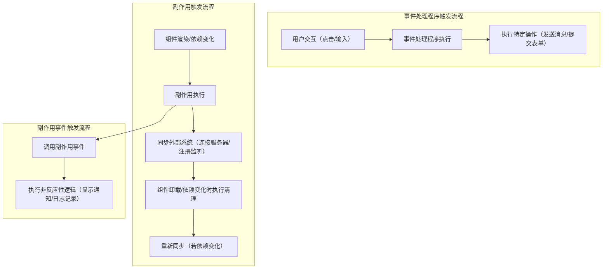

# 将事件与副作用分开

原文地址：[https://react.nodejs.cn/learn/separating-events-from-effects](https://react.nodejs.cn/learn/separating-events-from-effects)

## 核心概念：事件处理程序与副作用的本质区别

在React中，事件处理程序和副作用分别承担不同的职责，其核心区别在于**触发时机**和**响应逻辑**：

| **特性**         | **事件处理程序**                              | **副作用（Effect）**                          |
|------------------|---------------------------------------------|---------------------------------------------|
| **触发原因**     | 响应用户的特定交互（如点击按钮、输入文本）        | 为保持与外部系统的同步（如连接服务器、订阅事件），与具体交互无关 |
| **执行时机**     | 仅在用户执行对应交互时运行                      | 在组件挂载、依赖变化或卸载时自动运行，确保状态同步       |
| **反应性**       | 非反应性：不随反应值变化自动重新执行              | 反应性：依赖的反应值变化时，会重新执行（需声明依赖）     |
| **典型场景**     | 发送消息、提交表单、触发导航等用户驱动操作        | 建立连接、注册监听、数据持久化等同步操作            |

## 反应值与逻辑的反应性特性

### 什么是反应值？

反应值是指在组件渲染过程中计算、并参与React数据流的变量，包括：

- 组件接收的`props`（如`roomId`、`theme`）
- 组件内通过`useState`声明的`state`（如`message`、`canMove`）
- 基于props/state计算的组件内变量（如`numberOfItems = items.length`）

反应值的核心特点是**会随组件重新渲染而变化**，并影响依赖它的逻辑。

### 事件处理程序：非反应性逻辑

事件处理程序中的逻辑**不随反应值变化自动执行**，仅响应用户交互。例如，发送消息的逻辑不应因输入框内容（`message`）变化而自动触发，仅在用户点击“发送”按钮时执行：

```jsx
function ChatRoom({ roomId }) {
  const [message, setMessage] = useState('');
  
  // 事件处理程序：仅在点击时执行，非反应性
  function handleSendClick() {
    sendMessage(message); // 仅用户点击时发送消息
  }
  
  return (
    <>
      <input value={message} onChange={e => setMessage(e.target.value)} />
      <button onClick={handleSendClick}>Send</button>
    </>
  );
}
```

### 副作用：反应性逻辑

副作用中的逻辑**会随依赖的反应值变化自动重新执行**，以保持与外部系统的同步。例如，连接聊天室的逻辑需随`roomId`变化重新连接：

```jsx
function ChatRoom({ roomId }) {
  // 副作用：反应性逻辑，依赖roomId变化
  useEffect(() => {
    const connection = createConnection(serverUrl, roomId);
    connection.connect();
    return () => connection.disconnect();
  }, [roomId]); // roomId变化时重新同步
}
```

## 问题场景：混合反应性与非反应性逻辑

当副作用中同时包含需要反应性的同步逻辑和不需要反应性的非同步逻辑时，会出现问题。例如：连接聊天室时显示通知，通知主题（`theme`）变化不应触发重新连接，但`theme`作为反应值需声明为依赖，导致主题切换时不必要的重连：

```jsx
// 问题代码：theme变化导致聊天室重新连接
function ChatRoom({ roomId, theme }) {
  useEffect(() => {
    const connection = createConnection(serverUrl, roomId);
    connection.on('connected', () => {
      showNotification('Connected!', theme); // 非反应性逻辑
    });
    connection.connect();
    return () => connection.disconnect();
  }, [roomId, theme]); // theme变化触发重连，不合理
}
```

## 解决方案：副作用事件（Effect Events）

### 什么是副作用事件？

副作用事件（通过实验性API `useEffectEvent`声明）是从副作用中提取的**非反应性逻辑片段**，用于打破副作用的反应性链条。它类似事件处理程序，但由副作用触发，而非用户交互。

### 声明与使用副作用事件

通过`useEffectEvent`声明副作用事件，将非反应性逻辑从副作用中分离，避免不必要的依赖：

```jsx
import { useEffect, experimental_useEffectEvent as useEffectEvent } from 'react';

function ChatRoom({ roomId, theme }) {
  // 声明副作用事件：非反应性逻辑
  const onConnected = useEffectEvent(() => {
    showNotification('Connected!', theme); // 读取最新theme，但不触发副作用重连
  });

  // 副作用：仅依赖roomId，反应性逻辑
  useEffect(() => {
    const connection = createConnection(serverUrl, roomId);
    connection.on('connected', onConnected); // 调用副作用事件
    connection.connect();
    return () => connection.disconnect();
  }, [roomId]); // 仅roomId变化时重连，解决主题切换问题
}
```

### 流程图：副作用事件解决依赖问题

```mermaid
graph TD
    subgraph 问题场景：混合逻辑
        A[theme变化] --> B[副作用依赖theme]
        B --> C[不必要的聊天室重连]
        D[roomId变化] --> B
        B --> E[必要的聊天室重连]
    end
    
    subgraph 优化后：使用副作用事件
        F[theme变化] --> G[副作用事件读取theme]
        G --> H[不触发副作用重连]
        I[roomId变化] --> J[副作用依赖roomId]
        J --> K[必要的聊天室重连]
    end
```

## 使用副作用事件读取最新属性和状态

副作用事件可读取最新的反应值，而不将其列为副作用依赖，避免抑制linter错误。例如，记录页面访问时包含购物车数量，但不希望购物车变化触发重新记录：

```jsx
function Page({ url }) {
  const { items } = useContext(ShoppingCartContext);
  const numberOfItems = items.length;

  // 声明副作用事件：读取最新numberOfItems
  const onVisit = useEffectEvent((visitedUrl) => {
    logVisit(visitedUrl, numberOfItems); // 非反应性逻辑
  });

  // 副作用：仅依赖url，反应性逻辑
  useEffect(() => {
    onVisit(url); // 触发副作用事件
  }, [url]); // 仅url变化时记录访问，正确依赖
}
```

### 优势：避免抑制linter

无需使用`// eslint-disable-next-line`抑制依赖检查，同时确保逻辑正确性：

- 副作用仅依赖必要的反应值（如`url`）
- 副作用事件读取最新的其他反应值（如`numberOfItems`），但不影响副作用的依赖

## 副作用事件的限制

`useEffectEvent`是实验性API，使用时有严格限制：

1. **仅在副作用内部调用**：不能在组件渲染逻辑、事件处理程序或其他地方调用。
2. **禁止传递给其他组件/钩子**：必须在声明它的组件的副作用中直接使用，不能作为参数传递。

```jsx
// 错误示例：传递副作用事件给其他钩子
function Timer() {
  const onTick = useEffectEvent(() => { /* ... */ });
  useTimer(onTick); // 🔴 禁止：副作用事件不能传递给其他钩子
}

// 正确示例：在当前组件副作用中使用
function Timer() {
  const onTick = useEffectEvent(() => { /* ... */ });
  useEffect(() => {
    const id = setInterval(onTick, 1000); // ✅ 正确：副作用内直接调用
    return () => clearInterval(id);
  }, []);
}
```

## 为何不应抑制依赖Linter？

抑制linter（如`// eslint-disable-next-line react-hooks/exhaustive-deps`）会导致隐蔽错误：

- 副作用可能使用陈旧的反应值（如初始渲染时的`canMove`状态）。
- 无法及时发现新增依赖导致的同步问题。

例如，抑制linter导致鼠标移动逻辑始终使用初始`canMove`值：

```jsx
// 错误示例：抑制linter导致陈旧值
useEffect(() => {
  window.addEventListener('pointermove', handleMove);
  return () => window.removeEventListener('pointermove', handleMove);
  // eslint-disable-next-line react-hooks/exhaustive-deps
}, []); // 🔴 未声明handleMove依赖，handleMove内canMove值始终为初始值
```

使用副作用事件可避免此问题，无需抑制linter：

```jsx
// 正确示例：使用副作用事件
const onMove = useEffectEvent(e => {
  if (canMove) setPosition({ x: e.clientX, y: e.clientY });
});

useEffect(() => {
  window.addEventListener('pointermove', onMove);
  return () => window.removeEventListener('pointermove', onMove);
}, []); // ✅ 无依赖问题，onMove读取最新canMove
```

## 回顾

1. **事件处理程序**：响应用户交互，非反应性，不随反应值变化自动执行。
2. **副作用**：确保与外部系统同步，反应性，依赖变化时自动重新执行。
3. **反应值**：props、state及组件内计算值，随渲染变化，影响副作用的依赖。
4. **副作用事件**：通过`useEffectEvent`声明的非反应性逻辑，解决混合逻辑导致的不必要重同步。
5. **最佳实践**：不抑制依赖linter，使用副作用事件分离非反应性逻辑，避免陈旧值问题。

## 副作用与事件处理程序的触发流程对比


