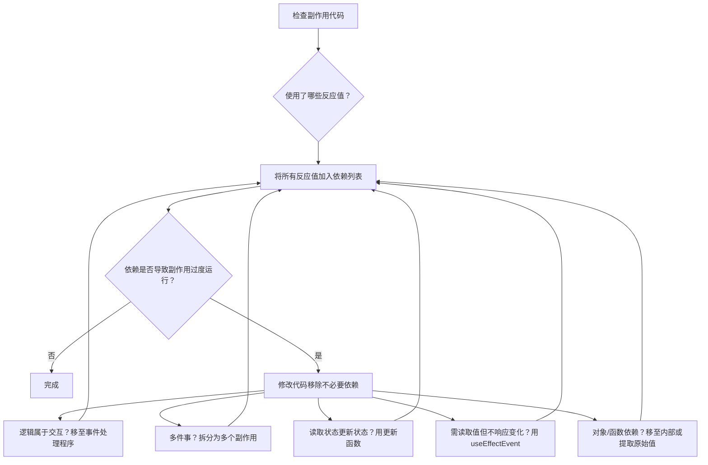

# 移除副作用依赖

原地址：<https://react.nodejs.cn/learn/removing-effect-dependencies>  

## 一、副作用依赖的核心原则

副作用（`useEffect`）的依赖列表必须包含其内部读取的所有**反应值**（如 props、state、组件内声明的变量/函数等）。这是为了确保副作用能与组件最新的状态和属性同步。  

- **依赖列表的本质**：是副作用代码所使用的所有反应值的“描述”，而非可随意选择的列表。依赖必须与代码匹配，否则会导致副作用运行时机错误（如遗漏更新或过度运行）。  
- **常见问题**：不必要的依赖会导致副作用频繁触发（甚至无限循环），而缺失依赖则会导致副作用使用过时的值，引发 bugs。  

## 二、依赖必须与代码匹配

### 1. linter 的作用

React 的 linter 会自动检查副作用中使用的反应值是否都包含在依赖列表中。例如，若副作用使用了 `roomId` 这个 prop，linter 会强制要求将其加入依赖列表：  

```jsx
function ChatRoom({ roomId }) {
  useEffect(() => {
    const connection = createConnection(roomId); // 使用了 roomId
    connection.connect();
    return () => connection.disconnect();
  }, [roomId]); // linter 要求必须包含 roomId
  // ...
}
```

若忽略 linter 提示（如手动删除依赖或添加注释抑制），会导致副作用使用旧值，引发难以调试的错误。例如，若 `roomId` 变化但未更新依赖，副作用会继续使用旧的 `roomId` 连接聊天房间。

### 2. 如何“移除”依赖？

不能直接从依赖列表中删除反应值，必须通过**修改代码**证明该值不是反应性的（即不会因重新渲染而变化）。例如：  

- 将 `roomId` 移到组件外部，使其成为非反应值：  

  ```jsx
  const roomId = 'music'; // 非反应值（不会随渲染变化）
  function ChatRoom() {
    useEffect(() => {
      const connection = createConnection(roomId);
      connection.connect();
      return () => connection.disconnect();
    }, []); // 此时可安全使用空依赖
    // ...
  }
  ```

## 三、移除不必要依赖的常见场景与解决方案

### 场景 1：逻辑应属于事件处理程序

若副作用中的逻辑是响应**特定用户交互**（如表单提交），而非“同步外部系统”，应将其移至事件处理程序，避免依赖变化触发意外运行。  

**问题示例**：  

```jsx
function Form() {
  const [submitted, setSubmitted] = useState(false);
  const theme = useContext(ThemeContext); // 反应值
  // 错误：用副作用处理提交逻辑，theme 变化会重新触发
  useEffect(() => {
    if (submitted) {
      post('/api/register');
      showNotification('注册成功', theme); // 使用 theme
    }
  }, [submitted, theme]); // 依赖包含 theme

  function handleSubmit() {
    setSubmitted(true);
  }
  // ...
}
```

**解决方案**：将逻辑移至 `handleSubmit` 事件处理程序：  

```jsx
function Form() {
  const theme = useContext(ThemeContext);
  function handleSubmit() {
    post('/api/register');
    showNotification('注册成功', theme); // 仅在提交时运行
  }
  // ...
}
```

### 场景 2：副作用包含多件不相关的事

若一个副作用同时处理多个独立的同步逻辑（如同时依赖 `country` 和 `city`），会导致其中一个依赖变化时，整个副作用重新运行，引发不必要的操作（如重复请求）。  

**问题示例**：  

```jsx
function ShippingForm({ country }) {
  const [cities, setCities] = useState(null);
  const [city, setCity] = useState(null);
  const [areas, setAreas] = useState(null);
  // 错误：一个副作用处理两个独立逻辑（依赖 country 和 city）
  useEffect(() => {
    // 逻辑1：根据 country 获取 cities
    fetch(`/api/cities?country=${country}`).then(res => setCities(res.json()));
    // 逻辑2：根据 city 获取 areas
    if (city) {
      fetch(`/api/areas?city=${city}`).then(res => setAreas(res.json()));
    }
  }, [country, city]); // 任一依赖变化都会重新运行
  // ...
}
```

**解决方案**：拆分为两个独立的副作用，各自管理自己的依赖：  

```jsx
function ShippingForm({ country }) {
  // 副作用1：仅依赖 country
  useEffect(() => {
    fetch(`/api/cities?country=${country}`).then(res => setCities(res.json()));
  }, [country]);

  // 副作用2：仅依赖 city
  useEffect(() => {
    if (city) {
      fetch(`/api/areas?city=${city}`).then(res => setAreas(res.json()));
    }
  }, [city]);
  // ...
}
```

### 场景 3：读取状态计算下一个状态

若副作用中通过读取当前状态（如 `messages`）来更新状态，会被迫将该状态加入依赖，导致状态变化时副作用重新运行（如聊天消息更新导致重新连接）。  

**问题示例**：  

```jsx
function ChatRoom({ roomId }) {
  const [messages, setMessages] = useState([]);
  // 错误：依赖 messages，新消息会触发副作用重新运行
  useEffect(() => {
    const connection = createConnection(roomId);
    connection.on('message', (msg) => {
      setMessages([...messages, msg]); // 读取 messages
    });
    return () => connection.disconnect();
  }, [roomId, messages]); // 包含 messages
  // ...
}
```

**解决方案**：使用**更新函数**（`setState(prev => ...)`），避免读取当前状态，从而移除依赖：  

```jsx
useEffect(() => {
  const connection = createConnection(roomId);
  connection.on('message', (msg) => {
    setMessages(prevMessages => [...prevMessages, msg]); // 不读取当前 messages
  });
  return () => connection.disconnect();
}, [roomId]); // 无需包含 messages
```

### 场景 4：读取值但不响应其变化

若需读取某个反应值（如 `isMuted`），但不希望其变化触发副作用重新运行（如静音状态变化不应导致聊天重新连接），可使用**副作用事件**（`useEffectEvent`，实验性 API）。  

**问题示例**：  

```jsx
function ChatRoom({ roomId }) {
  const [isMuted, setIsMuted] = useState(false);
  // 错误：依赖 isMuted，静音状态变化会重新连接
  useEffect(() => {
    const connection = createConnection(roomId);
    connection.on('message', (msg) => {
      if (!isMuted) playSound(); // 读取 isMuted
    });
    return () => connection.disconnect();
  }, [roomId, isMuted]); // 包含 isMuted
  // ...
}
```

**解决方案**：用 `useEffectEvent` 抽离非反应性逻辑：  

```jsx
import { useEffectEvent } from 'react';

function ChatRoom({ roomId }) {
  const [isMuted, setIsMuted] = useState(false);
  // 副作用事件：非反应性，读取最新 isMuted 但不成为依赖
  const onMessage = useEffectEvent((msg) => {
    if (!isMuted) playSound();
  });

  useEffect(() => {
    const connection = createConnection(roomId);
    connection.on('message', onMessage); // 调用副作用事件
    return () => connection.disconnect();
  }, [roomId]); // 无需包含 isMuted
  // ...
}
```

### 场景 5：对象/函数依赖意外变化

对象和函数在每次渲染时会被重新创建（即使内容相同），若作为依赖会导致副作用频繁运行（如输入框变化触发聊天重新连接）。  

**问题示例**：  

```jsx
function ChatRoom({ roomId }) {
  const [message, setMessage] = useState('');
  // 错误：options 每次渲染都会重新创建
  const options = { serverUrl: 'xxx', roomId }; 
  useEffect(() => {
    const connection = createConnection(options); // 使用 options
    connection.connect();
    return () => connection.disconnect();
  }, [options]); // 依赖 options，输入变化会重新运行
  // ...
}
```

**解决方案**：  

1. **移到副作用内部**：对象在副作用内创建，不再作为依赖：  

   ```jsx
   useEffect(() => {
     const options = { serverUrl: 'xxx', roomId }; // 内部创建
     const connection = createConnection(options);
     connection.connect();
     return () => connection.disconnect();
   }, [roomId]); // 仅依赖 roomId（原始值）
   ```

2. **提取原始值**：从对象中提取字符串/数字等原始值作为依赖：  

   ```jsx
   function ChatRoom({ options }) {
     const { roomId, serverUrl } = options; // 提取原始值
     useEffect(() => {
       const connection = createConnection({ roomId, serverUrl });
       connection.connect();
       return () => connection.disconnect();
     }, [roomId, serverUrl]); // 依赖原始值，避免对象变化
   }
   ```

## 四、处理副作用依赖的流程



## 五、关键结论

1. **依赖必须与代码匹配**：副作用使用的所有反应值必须包含在依赖列表中，linter 提示不可忽略。  
2. **移除依赖需修改代码**：通过证明值是非反应性的（如移至组件外）、拆分逻辑或使用更新函数等方式，而非直接删除依赖。  
3. **避免对象/函数依赖**：对象和函数每次渲染都会重新创建，易导致副作用过度运行，优先使用原始值作为依赖。  
4. **副作用事件的作用**：实验性 API `useEffectEvent` 可分离反应性与非反应性逻辑，避免不必要的依赖。  

通过合理处理依赖，可确保副作用仅在必要时运行，提升组件性能和可靠性。
