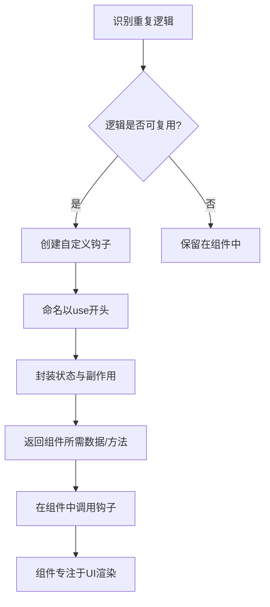

# 使用自定义钩子重用逻辑

原地址：<https://react.nodejs.cn/learn/reusing-logic-with-custom-hooks>

在 React 中，当多个组件需要共享相同的逻辑（如数据获取、状态管理、事件监听等）时，自定义钩子（Custom Hooks）是实现逻辑重用的高效方式。本文详细介绍了自定义钩子的概念、创建方法、使用规则及最佳实践，帮助开发者封装可复用逻辑，提升代码可维护性。

## 一、自定义钩子的核心概念

自定义钩子是一种函数，名称以 `use` 开头，可调用其他钩子（如 `useState`、`useEffect` 等），用于封装组件间可共享的逻辑。其核心价值在于将重复逻辑抽离为独立函数，实现代码复用。

### 1. 为何需要自定义钩子？

- **避免逻辑重复**：多个组件若使用相同逻辑（如表单验证、定时器管理），通过自定义钩子可消除代码冗余。
- **提高可维护性**：逻辑集中在钩子中，修改时只需调整一处，无需在多个组件中重复修改。
- **分离关注点**：将复杂逻辑从组件中抽离，使组件更专注于 UI 渲染，钩子专注于逻辑处理。

### 2. 自定义钩子与普通函数的区别

| **特性**         | **自定义钩子**                              | **普通函数**                          |
|------------------|-------------------------------------------|---------------------------------------|
| **命名规范**     | 必须以 `use` 开头（如 `useWindowSize`）    | 无强制命名规范                        |
| **钩子调用**     | 可调用其他钩子（如 `useState`、`useEffect`） | 不能调用任何 React 钩子                |
| **使用场景**     | 仅在组件或其他自定义钩子中调用              | 可在任何地方调用                      |
| **状态隔离**     | 每个组件使用钩子时，状态独立（不共享）      | 若包含状态，可能导致共享状态问题        |

## 二、创建自定义钩子的步骤

创建自定义钩子需遵循特定规则，确保其符合 React 钩子的运行机制。

### 1. 步骤1：识别重复逻辑

分析多个组件中的重复逻辑（如数据获取、事件监听等），确定可抽离的部分。

#### 示例：重复的窗口大小监听逻辑

两个组件都需要监听窗口大小变化：

```javascript
// 组件A
function ComponentA() {
  const [size, setSize] = useState({ width: 0, height: 0 });
  useEffect(() => {
    function updateSize() {
      setSize({ width: window.innerWidth, height: window.innerHeight });
    }
    window.addEventListener('resize', updateSize);
    updateSize();
    return () => window.removeEventListener('resize', updateSize);
  }, []);
  // ...
}

// 组件B（包含相同逻辑）
function ComponentB() {
  const [size, setSize] = useState({ width: 0, height: 0 });
  useEffect(() => {
    // 与ComponentA相同的逻辑
  }, []);
  // ...
}
```

### 2. 步骤2：抽离逻辑为自定义钩子

将重复逻辑封装到以 `use` 开头的函数中，并返回组件所需的数据或方法。

#### 示例：创建 `useWindowSize` 钩子

```javascript
// hooks/useWindowSize.js
import { useState, useEffect } from 'react';

// 自定义钩子：监听窗口大小变化
export function useWindowSize() {
  // 定义状态
  const [size, setSize] = useState({ width: 0, height: 0 });

  // 定义副作用（监听窗口大小）
  useEffect(() => {
    function updateSize() {
      setSize({ width: window.innerWidth, height: window.innerHeight });
    }
    window.addEventListener('resize', updateSize);
    updateSize(); // 初始化
    return () => window.removeEventListener('resize', updateSize);
  }, []);

  // 返回窗口大小
  return size;
}
```

### 3. 步骤3：在组件中使用自定义钩子

组件通过调用自定义钩子获取逻辑处理后的结果，无需重复编写逻辑。

#### 示例：组件使用 `useWindowSize`

```javascript
// 组件A（简化后）
function ComponentA() {
  const size = useWindowSize(); // 调用自定义钩子
  return <div>Width: {size.width}</div>;
}

// 组件B（简化后）
function ComponentB() {
  const size = useWindowSize(); // 调用自定义钩子
  return <div>Height: {size.height}</div>;
}
```

- **效果**：两个组件共享窗口大小监听逻辑，且各自的状态独立（不会相互影响）。

## 三、自定义钩子的使用规则

为确保自定义钩子正常工作，需遵循 React 钩子的通用规则：

### 1. 命名规则

- 函数名称必须以 `use` 开头（如 `useFetch`、`useLocalStorage`），便于 React 识别和 lint 工具检查。
- 名称应清晰反映钩子的功能（如 `useForm` 用于表单处理，`useOnlineStatus` 用于网络状态监听）。

### 2. 调用规则

- 只能在 **组件顶层** 或 **其他自定义钩子** 中调用，不能在循环、条件、嵌套函数中调用。
- 每个组件调用自定义钩子时，钩子内部的状态和副作用都是独立的（不会与其他组件共享）。

### 3. 状态隔离

自定义钩子中的状态（如 `useState`）和引用（如 `useRef`）在每个使用该钩子的组件中都是独立的。例如，两个组件调用 `useWindowSize` 时，各自的 `size` 状态互不干扰。

## 四、常见自定义钩子示例

以下是几个实用的自定义钩子示例，展示不同场景下的逻辑封装。

### 1. 数据请求钩子：`useFetch`

封装数据请求逻辑，处理加载、成功、错误状态：

```javascript
// hooks/useFetch.js
import { useState, useEffect } from 'react';

export function useFetch(url) {
  const [data, setData] = useState(null);
  const [loading, setLoading] = useState(true);
  const [error, setError] = useState(null);

  useEffect(() => {
    let ignore = false; // 用于忽略过时请求
    async function fetchData() {
      try {
        setLoading(true);
        const response = await fetch(url);
        if (!response.ok) throw new Error('请求失败');
        const json = await response.json();
        if (!ignore) setData(json);
      } catch (err) {
        if (!ignore) setError(err);
      } finally {
        if (!ignore) setLoading(false);
      }
    }
    fetchData();
    return () => { ignore = true; }; // 清理函数：忽略旧请求
  }, [url]);

  return { data, loading, error };
}
```

**使用示例**：

```javascript
function UserProfile({ userId }) {
  const { data: user, loading, error } = useFetch(`/api/users/${userId}`);
  if (loading) return <p>加载中...</p>;
  if (error) return <p>错误：{error.message}</p>;
  return <h1>{user.name}</h1>;
}
```

### 2. 本地存储钩子：`useLocalStorage`

封装本地存储（`localStorage`）的读写逻辑，同步状态与本地存储：

```javascript
// hooks/useLocalStorage.js
import { useState, useEffect } from 'react';

export function useLocalStorage(key, initialValue) {
  // 从本地存储初始化状态
  const [value, setValue] = useState(() => {
    const stored = localStorage.getItem(key);
    return stored ? JSON.parse(stored) : initialValue;
  });

  // 当value变化时，同步到本地存储
  useEffect(() => {
    localStorage.setItem(key, JSON.stringify(value));
  }, [key, value]);

  return [value, setValue];
}
```

**使用示例**：

```javascript
function ThemeSwitcher() {
  // 使用本地存储保存主题偏好
  const [theme, setTheme] = useLocalStorage('theme', 'light');
  return (
    <button onClick={() => setTheme(theme === 'light' ? 'dark' : 'light')}>
      当前主题：{theme}
    </button>
  );
}
```

### 3. 表单处理钩子：`useForm`

封装表单状态管理逻辑，处理输入变化和提交：

```javascript
// hooks/useForm.js
import { useState } from 'react';

export function useForm(initialValues) {
  const [values, setValues] = useState(initialValues);

  const handleChange = (e) => {
    const { name, value } = e.target;
    setValues(prev => ({ ...prev, [name]: value }));
  };

  const reset = () => setValues(initialValues);

  return { values, handleChange, reset };
}
```

**使用示例**：

```javascript
function LoginForm() {
  const { values, handleChange, reset } = useForm({
    username: '',
    password: ''
  });

  const handleSubmit = (e) => {
    e.preventDefault();
    console.log('提交：', values);
    reset();
  };

  return (
    <form onSubmit={handleSubmit}>
      <input
        name="username"
        value={values.username}
        onChange={handleChange}
        placeholder="用户名"
      />
      <input
        name="password"
        type="password"
        value={values.password}
        onChange={handleChange}
        placeholder="密码"
      />
      <button type="submit">登录</button>
    </form>
  );
}
```

## 五、提取自定义钩子的时机

并非所有重复逻辑都需要提取为自定义钩子，以下情况适合提取：

### 1. 逻辑在多个组件中重复出现

当相同逻辑（如数据请求、事件监听）出现在两个或更多组件中，提取为钩子可减少冗余。

### 2. 组件逻辑过于复杂

若单个组件的钩子逻辑（如多个 `useEffect`、`useState`）过于冗长，可拆分为多个自定义钩子，使组件更简洁。

### 3. 逻辑可抽象为通用功能

若逻辑具有通用性（如表单处理、定时器管理），即使当前仅在一个组件中使用，也可提取为钩子，便于未来复用。

## 六、自定义钩子的最佳实践

### 1. 单一职责

每个自定义钩子应专注于单一功能（如 `useFetch` 处理数据请求，`useForm` 处理表单），避免创建“万能钩子”。

### 2. 暴露清晰的接口

钩子的返回值应明确（如对象或数组），便于组件理解和使用。例如，`useFetch` 返回 `{ data, loading, error }`，清晰标识各状态。

### 3. 文档化钩子功能

为自定义钩子添加注释，说明其用途、参数、返回值及使用注意事项，提高可维护性。

```javascript
/**
 * 监听窗口大小变化的钩子
 * @returns {Object} 包含窗口宽度和高度的对象
 * @example
 * const { width, height } = useWindowSize();
 */
export function useWindowSize() { /* ... */ }
```

### 4. 避免过度抽象

不要为简单逻辑强行创建钩子（如仅一行代码的逻辑），以免增加代码复杂度。

## 七、核心要点回顾

1. **自定义钩子**：以 `use` 开头的函数，用于封装组件间可共享的逻辑，可调用其他钩子。
2. **核心价值**：消除代码冗余，提高可维护性，分离 UI 与逻辑。
3. **使用规则**：
   - 命名必须以 `use` 开头。
   - 只能在组件或其他自定义钩子的顶层调用。
   - 每个组件使用钩子时，状态独立。
4. **创建步骤**：识别重复逻辑 → 抽离为钩子 → 在组件中使用。
5. **最佳实践**：单一职责、接口清晰、文档化、避免过度抽象。

## 八、自定义钩子开发流程图


