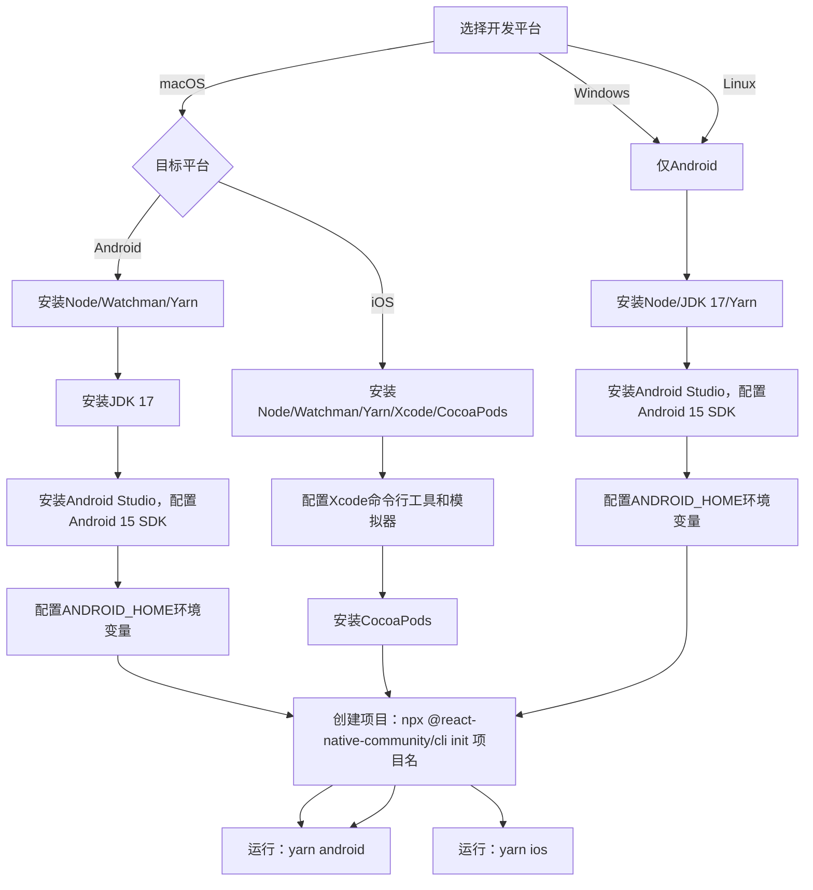

# 搭建开发环境

原文地址：[https://reactnative.cn/docs/next/environment-setup](https://reactnative.cn/docs/next/environment-setup)

## 环境搭建概述

React Native开发环境主要分为两种类型，适用于不同场景：

| **环境类型**       | **特点**                                                                 | **适用场景**                     |
|--------------------|--------------------------------------------------------------------------|----------------------------------|
| 完整原生环境       | 需配置原生开发工具（Android Studio/Xcode），支持自定义原生模块和完整功能 | 正式开发、需要集成原生代码的项目 |
| 简易沙盒环境（Expo） | 依赖Expo CLI，无需配置原生工具，快速启动项目                             | 快速原型开发、简单演示项目       |

> **注意**：沙盒环境依赖国外网络，且不支持自定义原生组件，国内用户不建议使用。本文重点介绍**完整原生环境**的搭建。

## 开发平台与目标平台的对应关系

React Native环境搭建需根据开发设备（开发平台）和目标设备（目标平台）选择不同步骤：

| 开发平台 | 支持的目标平台       | 说明                                  |
|----------|----------------------|---------------------------------------|
| macOS    | Android、iOS         | 唯一支持iOS开发的平台（依赖Xcode）    |
| Windows  | Android              | 不支持iOS开发（苹果限制）             |
| Linux    | Android              | 不支持iOS开发，需通过虚拟机或远程Mac |

## 各平台环境搭建详细步骤

### 1. macOS平台

#### 1.1 开发Android应用

##### 依赖安装

- **Node & Watchman**：使用Homebrew安装，Node需18+版本（LTS版）。

  ```bash
  brew install node@18
  brew install watchman  # 提升文件监听性能
  ```

  - 配置npm镜像（国内推荐）：`npx nrm use taobao`
  - 禁用cnpm（路径问题会导致错误）。

- **Yarn**：替代npm的包管理工具，加速依赖下载。

  ```bash
  npm install -g yarn
  ```

- **JDK**：需安装Zulu OpenJDK 17（React Native 0.73+要求）。

  ```bash
  brew install --cask zulu@17
  # 安装后通过brew info --cask zulu@17获取路径，手动安装pkg文件
  ```

  - 配置`JAVA_HOME`：指向`/Library/Java/JavaVirtualMachines/zulu-17.jdk/Contents/Home`。

- **Android Studio**：
  - 安装时选择"Custom"，确保勾选`Android SDK`、`Android SDK Platform`、`Android Virtual Device`。
  - 安装Android 15（VanillaIceCream）SDK：
    - 在SDK Manager中勾选`Android SDK Platform 35`和对应模拟器镜像（如`Intel x86 Atom_64 System Image`）。
    - 安装`Android SDK Build-Tools 35.0.0`。

##### 环境配置

- 配置`ANDROID_HOME`环境变量（添加到`~/.zshrc`或`~/.bash_profile`）：

  ```bash
  export ANDROID_HOME=$HOME/Library/Android/sdk
  export PATH=$PATH:$ANDROID_HOME/emulator
  export PATH=$PATH:$ANDROID_HOME/platform-tools
  ```

  - 执行`source ~/.zshrc`生效，通过`echo $ANDROID_HOME`验证。

##### 创建与运行项目

- 卸载旧版CLI（若有）：`npm uninstall -g react-native-cli @react-native-community/cli`
- 创建项目：`npx @react-native-community/cli init AwesomeProject`
  - 项目名不可用关键字（如`class`、`native`）或特殊符号。
- 运行项目：
  - 启动模拟器或连接真机。
  - 执行`cd AwesomeProject && yarn android`（首次运行需下载大量依赖，依赖稳定代理）。

#### 1.2 开发iOS应用

##### 依赖安装

- **Node & Watchman & Yarn**：同Android开发（见1.1）。
- **Xcode**：需14.1+版本，通过App Store或苹果开发者官网下载。
  - 安装命令行工具：在`Xcode | Preferences | Locations`中选择`Command Line Tools`。
  - 安装iOS模拟器：在`Xcode | Preferences | Components`中添加所需iOS版本。
- **CocoaPods**：iOS依赖管理工具（需1.10+版本）。

  ```bash
  brew install cocoapods  # 或sudo gem install cocoapods
  ```

##### 创建与运行项目

- 创建项目：同Android（`npx @react-native-community/cli init AwesomeProject`）。
- 运行项目：
  - 启动iOS模拟器。
  - 执行`cd AwesomeProject && yarn ios`（首次运行需通过CocoaPods安装依赖，依赖代理）。

### 2. Windows平台

仅支持Android开发，步骤如下：

#### 依赖安装

- **Node**：下载安装Node 18+（LTS版），配置npm镜像（`npx nrm use taobao`）。
- **JDK**：安装JDK 17（如Temurin或Oracle JDK），验证版本：`javac -version`。
- **Yarn**：`npm install -g yarn`。
- **Android Studio**：
  - 安装时勾选`Android SDK`、`Android SDK Platform`、`Android Virtual Device`。
  - 安装Android 15 SDK（同macOS，需`Android SDK Platform 35`和`Build-Tools 35.0.0`）。

#### 环境配置

- 配置`ANDROID_HOME`：
  - 路径：`C:\Users\用户名\AppData\Local\Android\Sdk`。
  - 通过“控制面板→系统→高级系统设置→环境变量”添加系统变量`ANDROID_HOME`。
- 添加工具路径到`Path`：
  - 新增`%ANDROID_HOME%\platform-tools`。

#### 创建与运行项目

- 创建项目：`npx @react-native-community/cli init AwesomeProject`（使用系统自带CMD或PowerShell，避免git bash等终端）。
- 运行项目：`cd AwesomeProject && yarn android`（需启动模拟器或连接真机）。

### 3. Linux平台

仅支持Android开发，步骤如下：

#### 依赖安装

- **Node**：参考Node官方Linux安装指南，安装18+版本，配置npm镜像。
- **Watchman**：从源码编译安装（提升文件监听性能）。
- **JDK**：安装JDK 17，验证版本：`javac -version`。
- **Yarn**：`npm install -g yarn`。
- **Android Studio**：同macOS/Windows，安装Android 15 SDK及Build-Tools 35.0.0。

#### 环境配置

- 配置`ANDROID_HOME`（添加到`~/.zshrc`或`~/.bash_profile`）：

  ```bash
  export ANDROID_HOME=$HOME/Library/Android/sdk
  export PATH=$PATH:$ANDROID_HOME/platform-tools
  export PATH=$PATH:$ANDROID_HOME/emulator
  ```

  - 执行`source ~/.zshrc`生效。

#### 创建与运行项目

- 创建项目：`npx @react-native-community/cli init AwesomeProject`。
- 运行项目：`cd AwesomeProject && yarn android`（需启动模拟器或连接真机）。

## 项目修改与实时刷新

1. 用编辑器打开项目中的`App.js`（或`App.tsx`）修改代码。
2. 刷新应用：
   - Android：按两下`R`键，或通过开发者菜单选择“Reload”。
   - iOS：在模拟器中按`⌘+R`。

## 常见问题与注意事项

1. **网络问题**：国内用户需稳定代理，否则依赖下载会频繁超时（可尝试阿里云maven镜像）。
2. **版本兼容**：
   - React Native 0.73+需JDK 17，0.67-0.72需JDK 11，0.67以下需JDK 8。
   - Xcode需14.1+，Android Build-Tools需35.0.0。
3. **项目命名**：不可用关键字、中文、空格，避免权限敏感目录（如System32）。
4. **环境变量**：确保`ANDROID_HOME`和`JAVA_HOME`路径正确，否则编译失败。
5. **模拟器性能**：建议开启虚拟加速技术（如Intel HAXM）提升Android模拟器性能。

## 环境搭建流程总览



## 总结

React Native环境搭建的核心是根据开发平台和目标平台配置对应工具链，重点包括：

- 安装Node（18+）、JDK（17+）、包管理工具（Yarn/CocoaPods）。
- 配置Android Studio（Android开发）或Xcode（iOS开发，仅macOS）。
- 正确设置环境变量（如`ANDROID_HOME`）确保编译工具可被识别。
- 国内用户需解决网络问题（代理或镜像）以避免依赖下载失败。

完成配置后，通过`yarn android`或`yarn ios`即可运行项目（要保证设备连接），并支持代码修改后的实时刷新，快速验证开发效果。
