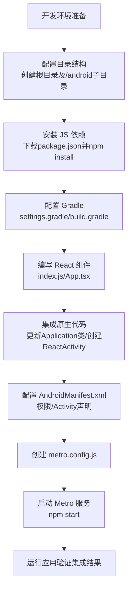
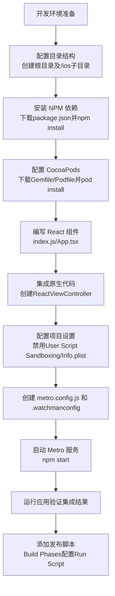

# 集成到现有原生应用

原地址：<https://reactnative.cn/docs/next/integration-with-existing-apps>  

## 概述

本文档详细介绍了如何将 React Native 组件集成到现有 Android（Java/Kotlin）和 iOS（Objective-C/Swift）原生应用中，适用于希望在现有应用中添加 React Native 视图或业务流程的场景。集成过程需根据目标平台差异分别配置，核心思路是通过配置项目结构、依赖管理、原生代码集成和测试验证，实现 React Native 与原生应用的无缝衔接。

## 核心概念

### Android 集成核心步骤

1. 配置项目目录结构  
2. 安装 JavaScript 依赖  
3. 在 Gradle 中配置 React Native 依赖  
4. 编写 React Native 组件（TS/JS 代码）  
5. 通过 `ReactActivity` 集成到原生代码  
6. 启动 Metro 服务验证集成结果  

### iOS 集成核心步骤

1. 设置项目目录结构  
2. 安装 NPM 依赖  
3. 在 Podfile 中配置 React Native  
4. 编写 React Native 组件（TS/JS 代码）  
5. 通过 `RCTRootView` 集成到原生代码  
6. 启动 Metro 服务验证集成结果  

## 开发环境准备

- 需先完成 React Native 开发环境搭建（参考官方开发环境搭建教程）。  
- 建议参考 **React Native Community Template** 作为配置模板，通过 `npx react-native init NewProject` 创建最新项目，参考其 `Podfile`、`gradle` 等配置。  

## Android 集成详细步骤

### 1. 配置项目目录结构

- 创建根目录，在其中新建 `android` 子目录，将现有 Android 项目拷贝至 `android` 目录下。  

### 2. 安装 JavaScript 依赖

- 在根目录下载社区模板的 `package.json`：  

  ```shell
  curl -O https://raw.githubusercontent.com/react-native-community/template/refs/heads/0.75-stable/template/package.json
  ```  

- 安装依赖：  

  ```shell
  # 使用 npm 或 yarn
  npm install 或 yarn install
  ```  

- 将 `node_modules/` 添加至 `.gitignore`（参考社区模板的 `.gitignore`）。  

### 3. 配置 Gradle

#### 步骤 3.1：修改 `settings.gradle`

添加 React Native Gradle 插件配置，支持自动链接第三方库：  

```groovy
// 自动链接第三方原生库的插件配置
pluginManagement { includeBuild("../node_modules/@react-native/gradle-plugin") }
plugins { id("com.facebook.react.settings") }
extensions.configure(com.facebook.react.ReactSettingsExtension){ ex -> ex.autolinkLibrariesFromCommand() }
includeBuild("../node_modules/@react-native/gradle-plugin")
// 引入现有 Gradle 模块（如 include(":app")）
```

#### 步骤 3.2：修改顶层 `build.gradle`

添加 React Native Gradle 插件依赖：  

```diff
buildscript {
    repositories {
        google()
        mavenCentral()
    }
    dependencies {
        classpath("com.android.tools.build:gradle:7.3.1")
+       classpath("com.facebook.react:react-native-gradle-plugin")  // 添加插件
    }
}
```

#### 步骤 3.3：修改 `app/build.gradle`

应用插件并添加 React Native 依赖：  

```diff
apply plugin: "com.android.application"
+apply plugin: "com.facebook.react"  // 应用 React 插件
repositories {
    mavenCentral()
}
dependencies {
    // 其他依赖
+   implementation "com.facebook.react:react-android"  // React Android 依赖
+   implementation "com.facebook.react:hermes-android"  // Hermes 引擎依赖
}
+react {
+   autolinkLibrariesWithApp()  // 启用自动链接
+}
```

### 4. 编写 React Native 组件

#### 步骤 4.1：创建 `index.js`（入口文件）

```js
import { AppRegistry } from 'react-native';
import App from './App';
AppRegistry.registerComponent('HelloWorld', () => App);  // 注册组件，名称需与原生一致
```

#### 步骤 4.2：创建 `App.tsx`（React 根组件）

```tsx
import React from 'react';
import { SafeAreaView, ScrollView, StatusBar, StyleSheet, Text, View } from 'react-native';
// 其他导入...

function App(): React.JSX.Element {
  // 组件内容，参考社区模板
  return (
    <SafeAreaView>
      {/* 布局内容 */}
    </SafeAreaView>
  );
}
export default App;
```

### 5. 集成原生 Android 代码

#### 步骤 5.1：更新 `MainApplication` 类

实现 `ReactApplication` 接口，初始化 React Native 运行时：  

```java
// Java 示例
public class MainApplication extends Application implements ReactApplication {
  @Override
  public ReactNativeHost getReactNativeHost() {
    return new DefaultReactNativeHost(this) {
      @Override
      protected List<ReactPackage> getPackages() { return new PackageList(this).getPackages(); }
      @Override
      protected String getJSMainModuleName() { return "index"; }  // 对应 index.js
      @Override
      public boolean getUseDeveloperSupport() { return BuildConfig.DEBUG; }  // 开发支持开关
      @Override
      protected boolean isNewArchEnabled() { return BuildConfig.IS_NEW_ARCHITECTURE_ENABLED; }
      @Override
      protected Boolean isHermesEnabled() { return BuildConfig.IS_HERMES_ENABLED; }
    };
  }

  @Override
  public void onCreate() {
    super.onCreate();
    SoLoader.init(this, OpenSourceMergedSoMapping);  // 初始化 SoLoader
    if (BuildConfig.IS_NEW_ARCHITECTURE_ENABLED) {
      DefaultNewArchitectureEntryPoint.load();  // 新架构加载
    }
  }
}
```

#### 步骤 5.2：创建 `MyReactActivity`（承载 React 视图）

```java
// Java 示例
public class MyReactActivity extends ReactActivity {
  @Override
  protected String getMainComponentName() {
    return "HelloWorld";  // 需与 index.js 中注册的名称一致
  }
  @Override
  protected ReactActivityDelegate createReactActivityDelegate() {
    return new DefaultReactActivityDelegate(this, getMainComponentName(), 
      DefaultNewArchitectureEntryPoint.getFabricEnabled());
  }
}
```

#### 步骤 5.3：配置 `AndroidManifest.xml`

添加权限和 Activity 声明：  

```diff
<manifest>
  <uses-permission android:name="android.permission.INTERNET" />  <!-- 网络权限 -->
  <application>
+   <activity
+     android:name=".MyReactActivity"
+     android:label="@string/app_name"
+     android:theme="@style/Theme.AppCompat.Light.NoActionBar">  <!-- 无 ActionBar 主题 -->
+   </activity>
  </application>
</manifest>
```

- 调试版本需在 `src/debug/AndroidManifest.xml` 中允许明文传输：  

  ```xml
  <application android:usesCleartextTraffic="true" tools:targetApi="28" />
  ```

### 6. 测试集成结果

#### 步骤 6.1：创建 `metro.config.js`

```js
const { getDefaultConfig } = require('@react-native/metro-config');
module.exports = getDefaultConfig(__dirname);  // 基础配置
```

#### 步骤 6.2：启动 Metro 服务

```shell
npm start 或 yarn start  # 启动 bundler
```

#### 步骤 6.3：运行应用

通过 Android Studio 或 Gradle 命令构建运行，在应用中打开 `MyReactActivity` 即可看到 React 视图。

### 7. 发布构建

通过 Android Studio 或命令行生成 release 包：  

```shell
cd android
./gradlew :app:assembleRelease  # 生成 APK
# 或 ./gradlew :app:bundleRelease  # 生成 AAB
```

## iOS 集成详细步骤

### 1. 设置项目目录结构

创建根目录，将现有 iOS 项目拷贝至 `ios` 子目录下。  

### 2. 安装 NPM 依赖

- 下载社区模板的 `package.json`：  

  ```shell
  curl -O https://raw.githubusercontent.com/react-native-community/template/refs/heads/0.78-stable/template/package.json
  ```  

- 安装依赖：  

  ```shell
  npm install 或 yarn install
  ```  

### 3. 配置 CocoaPods

#### 步骤 3.1：下载 `Gemfile` 和 `Podfile`

```shell
# 根目录下载 Gemfile
curl -O https://raw.githubusercontent.com/react-native-community/template/refs/heads/0.78-stable/template/Gemfile
# ios 目录下载 Podfile
cd ios && curl -O https://raw.githubusercontent.com/react-native-community/template/refs/heads/0.78-stable/template/ios/Podfile
```

#### 步骤 3.2：安装 Ruby Gems 和 Pods

```shell
cd ios
bundle install  # 安装 Ruby 依赖
bundle exec pod install  # 安装 Pod 依赖
```

### 4. 编写 React Native 组件

与 Android 相同，创建 `index.js` 和 `App.tsx`（代码一致）。  

### 5. 集成原生 iOS 代码

#### 步骤 5.1：创建 `ReactViewController`（承载 React 视图）

##### Swift 实现：

```swift
import UIKit
import React
import React_RCTAppDelegate
import ReactAppDependencyProvider

class ReactViewController: UIViewController {
  var reactNativeFactory: RCTReactNativeFactory?
  var reactNativeFactoryDelegate: RCTReactNativeFactoryDelegate?

  override func viewDidLoad() {
    super.viewDidLoad()
    reactNativeFactoryDelegate = ReactNativeDelegate()
    reactNativeFactoryDelegate!.dependencyProvider = RCTAppDependencyProvider()
    reactNativeFactory = RCTReactNativeFactory(delegate: reactNativeFactoryDelegate!)
    // 加载 React 组件（名称需与 index.js 中注册一致）
    view = reactNativeFactory!.rootViewFactory.view(withModuleName: "HelloWorld")
  }
}

class ReactNativeDelegate: RCTDefaultReactNativeFactoryDelegate {
  override func sourceURL(for bridge: RCTBridge) -> URL? { bundleURL() }
  override func bundleURL() -> URL? {
    #if DEBUG
    RCTBundleURLProvider.sharedSettings().jsBundleURL(forBundleRoot: "index")  // 调试时从 Metro 加载
    #else
    Bundle.main.url(forResource: "main", withExtension: "jsbundle")  // 发布时加载本地 bundle
    #endif
  }
}
```

##### Objective-C 实现：

类似逻辑，通过 `RCTReactNativeFactory` 创建视图，实现 `RCTReactNativeFactoryDelegate` 提供 bundle URL。

#### 步骤 5.2：配置原生跳转（示例：按钮打开 React 视图）

在现有 `ViewController` 中添加按钮，点击跳转至 `ReactViewController`：  

```swift
// Swift 示例
class ViewController: UIViewController {
  var reactViewController: ReactViewController?
  override func viewDidLoad() {
    super.viewDidLoad()
    let button = UIButton(type: .system)
    button.setTitle("Open React Native", for: .normal)
    button.addAction(UIAction { [weak self] _ in
      self?.reactViewController = ReactViewController()
      self?.present(self!.reactViewController!, animated: true)
    }, for: .touchUpInside)
    view.addSubview(button)
    // 布局按钮约束...
  }
}
```

### 6. 配置项目设置

#### 步骤 6.1：禁用 User Script Sandboxing

在 Xcode 构建设置中，设置 `User Script Sandboxing` 为 `NO`。

#### 步骤 6.2：配置 `Info.plist`

```xml
<key>UIViewControllerBasedStatusBarAppearance</key>
<false/>  <!-- 禁用视图控制器级状态栏控制 -->
```

### 7. 测试集成结果

#### 步骤 7.1：创建 `metro.config.js` 和 `.watchmanconfig`

```js
// metro.config.js（同 Android）
const { getDefaultConfig } = require('@react-native/metro-config');
module.exports = getDefaultConfig(__dirname);
```

```shell
echo {} > .watchmanconfig  # 创建空的 watchman 配置
```

#### 步骤 7.2：启动 Metro 服务

```shell
npm start 或 yarn start
```

#### 步骤 7.3：运行应用

通过 Xcode 构建并运行，点击按钮跳转至 React 视图。

### 8. 发布构建

#### 步骤 8.1：添加 Run Script Phase

在 Xcode `Build Phases` 中添加脚本，用于打包 JS 代码：  

1. 点击 `+` → `New Run Script Phase`，命名为 `Bundle React Native code and images`。  
2. 脚本内容：  

   ```shell
   set -e
   WITH_ENVIRONMENT="$REACT_NATIVE_PATH/scripts/xcode/with-environment.sh"
   REACT_NATIVE_XCODE="$REACT_NATIVE_PATH/scripts/react-native-xcode.sh"
   /bin/sh -c "$WITH_ENVIRONMENT $REACT_NATIVE_XCODE"
   ```  

3. 将脚本拖至 `[CP] Embed Pods Frameworks` 之前。  

### 9. 传递初始属性

#### 步骤 9.1：原生代码传递属性

```swift
// Swift 示例：在 ReactViewController 中传递
view = reactNativeFactory!.rootViewFactory.view(
  withModuleName: "HelloWorld", 
  initialProperties: ["userID": "123456", "token": "secretToken"]
)
```

#### 步骤 9.2：React 组件接收属性

```tsx
// App.tsx
function App(props): React.JSX.Element {
  return (
    <View>
      <Text>UserID: {props.userID}</Text>
      <Text>Token: {props.token}</Text>
    </View>
  );
}
```

## 集成流程图

### Android 集成流程



### iOS 集成流程



## 关键注意事项

1. **社区模板参考**：建议通过 `npx react-native init NewProject` 创建最新项目，参考其配置文件（如 Gradle、Podfile）。  
2. **权限与配置**：Android 需配置网络权限和明文传输（调试），iOS 需配置状态栏和脚本沙盒。  
3. **版本兼容性**：React Native Gradle Plugin/Pod 依赖版本由工具自动管理，避免手动指定版本。  
4. **性能优化**：启用 Hermes 引擎和新架构可提升性能（通过 `gradle.properties` 或 `BuildConfig` 配置）。  
5. **热重载支持**：Metro 服务支持热重载，修改 React 代码后无需重新编译原生应用即可生效。
