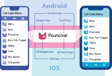

# 核心组件与原生组件

React Native 是一个使用React和应用平台的原生功能来构建 Android 和 iOS 应用的开源框架。通过 React Native，您可以使用 JavaScript 来访问移动平台的 API，以及使用 React 组件来描述 UI 的外观和行为：一系列可重用、可嵌套的代码。你可以在下一节了解更多关于 React 的信息。但首先，让我们介绍一下组件在 React Native 中是如何工作的。

在 Android 和 iOS 开发中，一个视图是 UI 的基本组成部分：屏幕上的一个小矩形元素、可用于显示文本、图像或响应用户输入。甚至应用程序最小的视觉元素（例如一行文本或一个按钮）也都是各种视图。某些类型的视图可以包含其他视图。全部都是视图。

## 原生组件

在 Android 开发中是使用 Kotlin 或 Java 来编写视图；在 iOS 开发中是使用 Swift 或 Objective-C 来编写视图。在 React Native 中，则使用 React 组件通过 JavaScript 来调用这些视图。在运行时，React Native 为这些组件创建相应的 Android 和 iOS 视图。由于 React Native 组件就是对原生视图的封装，因此使用 React Native 编写的应用外观、感觉和性能与其他任何原生应用一样。我们将这些平台支持的组件称为原生组件。

React Native 允许您为 Android 和 iOS 构建自己的 Native Components（原生组件），以满足您开发应用程序的独特需求。我们还有一个由社区贡献的繁荣生态系统，您可以到Native Directory来查找社区已创建的内容。

React Native 还包括一组基本的，随时可用的原生组件，您可以使用它们来构建您的应用程序。这些是 React Native 的核心组件。

## 核心组件

React Native 具有许多核心组件，从表单控件到活动指示器，应有尽有。你可以在找到它们。
