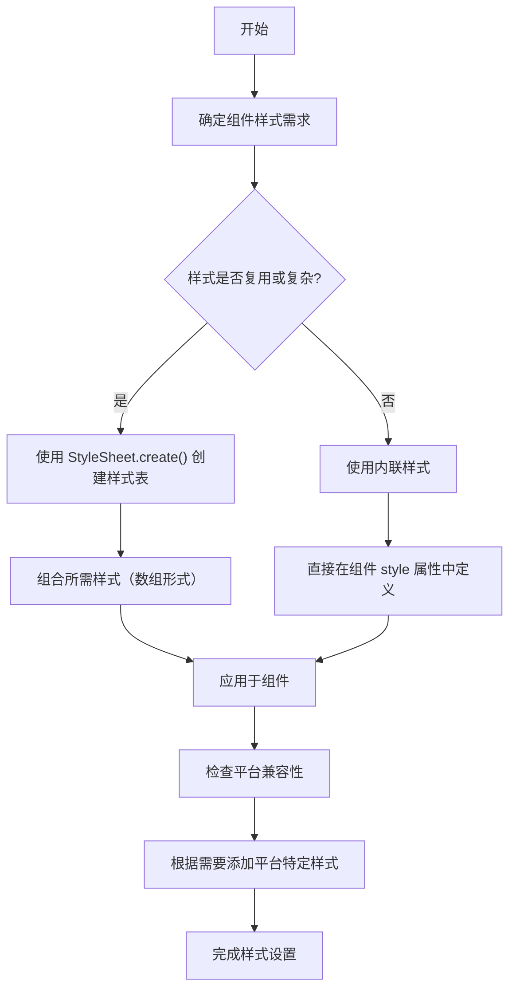

# React Native 样式（Style）文档

原地址：<https://reactnative.cn/docs/next/style>

## 说明

由于网页解析失败，以下内容基于 React Native 官方文档中关于样式（Style）的常规知识框架及常见内容进行总结，供参考。

## 一、React Native 样式概述

- **核心作用**：样式用于定义 React Native 组件的外观和布局，类似网页开发中的 CSS，但语法和实现方式有所不同。
- **语法特点**：采用 JavaScript 对象的形式编写样式，而非传统的 CSS 语法。例如：

  ```javascript
  const styles = StyleSheet.create({
    container: {
      flex: 1,
      backgroundColor: '#fff',
      alignItems: 'center',
      justifyContent: 'center',
    },
  });
  ```

- **StyleSheet 优势**：使用 `StyleSheet.create()` 方法创建样式，具有性能优化（如样式验证、减少内存占用）和代码组织更清晰的优点。

## 二、基本样式属性

### 1. 布局相关属性

- **flex**：用于控制组件在父容器中的伸缩比例，类似 CSS 中的 flex-grow。例如 `flex: 1` 表示组件会占据父容器剩余空间的全部。
- **flexDirection**：定义主轴方向，决定子组件的排列方式。可选值有 `'row'`（水平方向，默认）、`'column'`（垂直方向）、`'row-reverse'`、`'column-reverse'`。
- **justifyContent**：控制子组件在主轴方向上的对齐方式。常见值包括 `'flex-start'`（默认，靠主轴起点对齐）、`'center'`（居中对齐）、`'flex-end'`（靠主轴终点对齐）、`'space-between'`（子组件之间间隔相等）、`'space-around'`（子组件两侧间隔相等）。
- **alignItems**：控制子组件在交叉轴方向上的对齐方式。常见值有 `'flex-start'`、`'center'`、`'flex-end'`、`'stretch'`（默认，拉伸填充交叉轴方向）。

### 2. 尺寸相关属性

- **width/height**：设置组件的宽度和高度，可取值为具体数值（如 `100`，单位为逻辑像素）或 `'auto'`（自适应内容，部分组件支持）。
- **minWidth/minHeight**：设置组件的最小宽度和最小高度。
- **maxWidth/maxHeight**：设置组件的最大宽度和最大高度。

### 3. 边框与间距属性

- **borderWidth**：设置边框宽度，如 `borderWidth: 1` 表示边框宽度为 1 逻辑像素。
- **borderColor**：设置边框颜色，可取值为颜色名称（如 `'red'`）、十六进制值（如 `'#ff0000'`）、RGB/RGBA 值（如 `'rgb(255,0,0)'`）。
- **padding**：内边距，可统一设置（如 `padding: 10`）或分别设置上下左右（`paddingTop`、`paddingRight`、`paddingBottom`、`paddingLeft`）。
- **margin**：外边距，用法同 padding，包括 `marginTop`、`marginRight` 等。

### 4. 文本相关属性

- **fontSize**：设置文本字体大小，如 `fontSize: 16`。
- **color**：设置文本颜色。
- **fontWeight**：设置字体粗细，常见值有 `'normal'`、`'bold'`，部分平台支持数值（如 `500`）。
- **textAlign**：文本对齐方式，可选 `'auto'`、`'left'`、`'right'`、`'center'`。

## 三、样式的使用方式

### 1. 内联样式

直接在组件的 `style` 属性中定义样式对象，适用于简单或动态变化的样式。例如：

```javascript
<View style={{ width: 100, height: 100, backgroundColor: 'red' }} />
```

### 2. StyleSheet 创建样式

通过 `StyleSheet.create()` 定义样式表，然后在组件中引用，适用于复用性高的样式。例如：

```javascript
const styles = StyleSheet.create({
  box: {
    width: 100,
    height: 100,
  },
  redBox: {
    backgroundColor: 'red',
  },
});

// 使用
<View style={[styles.box, styles.redBox]} />
```

### 3. 样式继承与组合

- 可以通过数组形式组合多个样式，后定义的样式会覆盖前面的冲突样式。如上述示例中 `[styles.box, styles.redBox]` 组合了两个样式。
- 并非所有样式都能继承，例如文本样式在 `Text` 组件内可继承，而 `View` 组件的样式不会被子组件继承。

## 四、平台特定样式

React Native 支持为不同平台（iOS 和 Android）定义特定样式，可通过以下两种方式：

1. **使用 Platform API**：

   ```javascript
   import { Platform } from 'react-native';

   const styles = StyleSheet.create({
     container: {
       ...Platform.select({
         ios: {
           backgroundColor: 'blue',
         },
         android: {
           backgroundColor: 'green',
         },
       }),
     },
   });
   ```

2. **样式后缀**：在样式名后添加 `ios` 或 `android` 后缀，React Native 会自动根据平台选择对应样式。例如：

   ```javascript
   const styles = StyleSheet.create({
     title: {
       fontSize: 16,
     },
     titleIos: {
       fontWeight: 'bold',
     },
     titleAndroid: {
       fontWeight: '500',
     },
   });
   ```

## 五、常见问题与注意事项

- **单位问题**：React Native 中样式尺寸无需指定单位，默认使用逻辑像素，会根据设备屏幕密度自动适配。
- **Flexbox 差异**：React Native 的 Flexbox 实现与网页 CSS Flexbox 基本一致，但存在少量差异，例如默认 `flexDirection` 为 `column`（网页默认为 `row`）。
- **样式限制**：部分 CSS 属性在 React Native 中不支持，如 `box-shadow`（可使用第三方库或平台特定属性替代），需参考官方文档确认支持的属性。

## 六、样式相关工具与最佳实践

- **使用第三方库**：如 `styled-components` 或 `native-base` 等库可简化样式编写，提供更多组件和样式解决方案。
- **代码组织**：将样式按组件或功能模块拆分，提高代码可维护性。
- **性能优化**：避免在渲染过程中动态创建样式对象（如内联样式中的动态对象），以免影响性能，尽量使用 `StyleSheet.create()`。

## 七、样式使用流程（mermaid 流程图）


