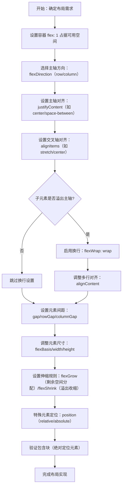

# Layout with Flexbox

原地址：<https://reactnative.dev/docs/next/flexbox>

## 一、Flexbox 概述

Flexbox 是 React Native 中用于定义组件子元素布局的核心算法，旨在不同屏幕尺寸上提供一致的布局效果。其核心思想是通过一系列属性控制子元素在父容器中的排列、对齐和空间分配方式。

### 与 Web CSS Flexbox 的差异

React Native 的 Flexbox 实现与 Web CSS 基本一致，但存在关键默认值差异：

- `flexDirection` 默认值为 `column`（Web 默认为 `row`）；
- `alignContent` 默认值为 `flex-start`（Web 中使用 Yoga 时默认为 `stretch`）；

  > Yoga:指 Yoga Layout，Facebook封装的布局引擎，原理基于 Flexbox（弹性盒模型）规范。

- `flexShrink` 默认值为 `0`（Web 默认为 `1`）；
- `flex` 参数仅支持单个数值（Web 支持多值语法如 `flex: 1 1 auto`）。

## 二、核心 Flexbox 属性详解

### 1. Flex：空间分配基础

- **作用**：控制子元素在父容器主轴方向上的空间分配比例，基于子元素 `flex` 值的总和分配剩余空间。
- **示例**：若父容器 `flex: 1`，子元素分别设置 `flex: 1`、`flex: 2`、`flex: 3`，则总比例为 6，子元素分别占据 `1/6`、`2/6`、`3/6` 的空间。
- **代码示例**：

  ```javascript
  <View style={{ flex: 1, padding: 20 }}>
    <View style={{ flex: 1, backgroundColor: 'red' }} />
    <View style={{ flex: 2, backgroundColor: 'darkorange' }} />
    <View style={{ flex: 3, backgroundColor: 'green' }} />
  </View>
  ```

### 2. Flex Direction：主轴方向定义

`flexDirection` 决定主轴方向（子元素排列方向），是布局的基础设置：

| 属性值           | 描述                                                                 |
|------------------|----------------------------------------------------------------------|
| `column`（默认） | 主轴为垂直方向，子元素从上到下排列；换行时新行从第一行右侧开始。       |
| `row`            | 主轴为水平方向，子元素从左到右排列；换行时新行从第一行下方开始。       |
| `column-reverse` | 主轴为垂直方向，子元素从下到上排列；换行时新行从第一行右侧开始（底部）。 |
| `row-reverse`    | 主轴为水平方向，子元素从右到左排列；换行时新行从第一行下方开始（右侧）。 |

### 3. Layout Direction：布局方向（文本与子元素流向）

控制文本和子元素的整体布局方向，影响 `start` 和 `end` 关键字的含义：

- `LTR`（默认）：从左到右布局，`start` 指左，`end` 指右；
- `RTL`：从右到左布局，`start` 指右，`end` 指左。

### 4. 主轴对齐：justifyContent

定义子元素在主轴方向上的对齐方式，适用于所有子元素整体的位置调整：

| 属性值          | 描述                                                                 |
|-----------------|----------------------------------------------------------------------|
| `flex-start`（默认） | 子元素靠主轴起点对齐。                                               |
| `flex-end`      | 子元素靠主轴终点对齐。                                               |
| `center`        | 子元素在主轴中心对齐。                                               |
| `space-between` | 子元素均匀分布，首尾元素靠主轴两端，中间元素间距相等。                 |
| `space-around`  | 子元素均匀分布，每个子元素两侧间距相等（首尾元素间距为中间的一半）。   |
| `space-evenly`  | 子元素均匀分布，首尾元素与容器边缘的间距和元素间间距完全相等。         |

### 5. 交叉轴对齐：alignItems 与 alignSelf

#### （1）alignItems（容器级交叉轴对齐）

控制容器内所有子元素在交叉轴方向的对齐方式：

| 属性值          | 描述                                                                 |
|-----------------|----------------------------------------------------------------------|
| `stretch`（默认） | 子元素拉伸至填满交叉轴方向容器高度（需子元素无固定交叉轴尺寸）。       |
| `flex-start`    | 子元素靠交叉轴起点对齐。                                             |
| `flex-end`      | 子元素靠交叉轴终点对齐。                                             |
| `center`        | 子元素在交叉轴中心对齐。                                             |
| `baseline`      | 子元素沿基线对齐（如文本基线）。                                     |

#### （2）alignSelf（子元素级交叉轴对齐）

单个子元素覆盖父容器 `alignItems` 的设置，属性值与 `alignItems` 一致，用于单独调整某个子元素的交叉轴对齐方式。

### 6. 多行对齐：alignContent

当子元素因 `flexWrap` 换行后，控制多行在交叉轴方向的对齐方式（仅在多行时生效）：

| 属性值          | 描述                                                                 |
|-----------------|----------------------------------------------------------------------|
| `flex-start`（默认） | 多行靠交叉轴起点对齐。                                               |
| `flex-end`      | 多行靠交叉轴终点对齐。                                               |
| `stretch`       | 多行拉伸至填满交叉轴容器高度（Web Yoga 默认值）。                     |
| `center`        | 多行在交叉轴中心对齐。                                               |
| `space-between` | 多行均匀分布，首行靠起点，末行靠终点，中间行间距相等。                 |
| `space-around`  | 多行均匀分布，每行两侧间距相等（首尾行间距为中间的一半）。             |
| `space-evenly`  | 多行均匀分布，首尾行与容器边缘间距和行间距完全相等。                   |

### 7. 换行控制：flexWrap

控制子元素在主轴方向溢出时是否换行：

- 默认值：不换行（子元素会被压缩以适应容器）；
- `wrap`：允许换行，溢出的子元素将在新行排列；
- `wrap-reverse`：允许换行，但新行排列方向与 `wrap` 相反（如垂直方向换行时新行在上方）。

**注意**：换行后需配合 `alignContent` 调整多行对齐方式。

### 8. 尺寸与伸缩：flexBasis、flexGrow、flexShrink

#### （1）flexBasis

定义子元素在主轴方向的初始尺寸（未进行伸缩前的基础尺寸）：

- 若主轴为水平方向（`row`），等效于 `width`；
- 若主轴为垂直方向（`column`），等效于 `height`。

#### （2）flexGrow

控制子元素在主轴方向分配剩余空间的比例（仅当有剩余空间时生效）：

- 默认值为 `0`（不分配剩余空间）；
- 取值为非负浮点数，比例越大，分配空间越多。

#### （3）flexShrink

控制子元素在主轴方向溢出时的收缩比例（仅当总尺寸超过容器时生效）：

- 默认值为 `0`（不收缩，可能溢出容器）；
- 取值为非负浮点数，比例越大，收缩越明显。

### 9. 间距控制：rowGap、columnGap、gap

- `rowGap`：设置行与行之间的间距；
- `columnGap`：设置列与列之间的间距；
- `gap`： shorthand 属性，同时设置 `rowGap` 和 `columnGap`（如 `gap: 10` 表示行和列间距均为 10）。

**应用**：配合 `flexWrap` 和 `alignContent` 可实现均匀间距的网格布局。

### 10. 尺寸设置：width 与 height

控制元素在交叉轴或主轴方向的尺寸，取值包括：

- `auto`（默认）：由内容自动计算尺寸；
- `pixels`：绝对像素值（逻辑像素，自动适配屏幕密度）；
- `percentage`：相对于父容器对应方向尺寸的百分比（如 `width: '50%'` 为父容器宽度的一半）。

### 11. 定位方式：position

定义元素的定位模式，影响元素在布局流中的行为：

#### （1）relative（默认）

- 元素遵循正常布局流，通过 `top`/`right`/`bottom`/`left` 相对于自身原始位置偏移；
- 偏移不影响其他元素的布局。

#### （2）absolute

- 元素脱离正常布局流，不占据空间；
- 位置由 `top`/`right`/`bottom`/`left` 相对于**包含块（containing block）** 计算。

#### （3）static（仅新架构支持）

- 元素遵循正常布局流，忽略 `top`/`right`/`bottom`/`left`；
- 不成为绝对定位元素的包含块（除非有 `transform` 等属性）。

### 12. 包含块（Containing Block）

绝对定位元素的位置和百分比尺寸参考的基准容器，规则如下：

- 相对定位（`relative`）或静态定位（`static`）元素的包含块为其父元素；
- 绝对定位（`absolute`）元素的包含块为最近的满足以下条件的祖先：
  - 定位方式为非 `static`（即 `relative` 或 `absolute`）；
  - 包含 `transform` 属性。

## 三、Flexbox 布局使用流程（mermaid 流程图）



## 四、关键注意事项

1. **默认值差异**：牢记 React Native 与 Web 的默认值不同（如 `flexDirection: column`、`flexShrink: 0`），避免布局意外。
2. **stretch 生效条件**：`alignItems: stretch` 需子元素无固定交叉轴尺寸（如水平主轴时子元素无固定 `height`）。
3. **绝对定位依赖包含块**：绝对定位元素的位置计算需明确其包含块，避免因祖先元素样式变化导致定位偏移。
4. **性能优化**：避免过度使用 `flex: 1` 嵌套，复杂布局可结合 `flexBasis` 和固定尺寸提升性能。
5. **工具辅助**：可使用 [Yoga Playground](https://yogalayout.com/playground/) 交互式工具调试 Flexbox 布局。
