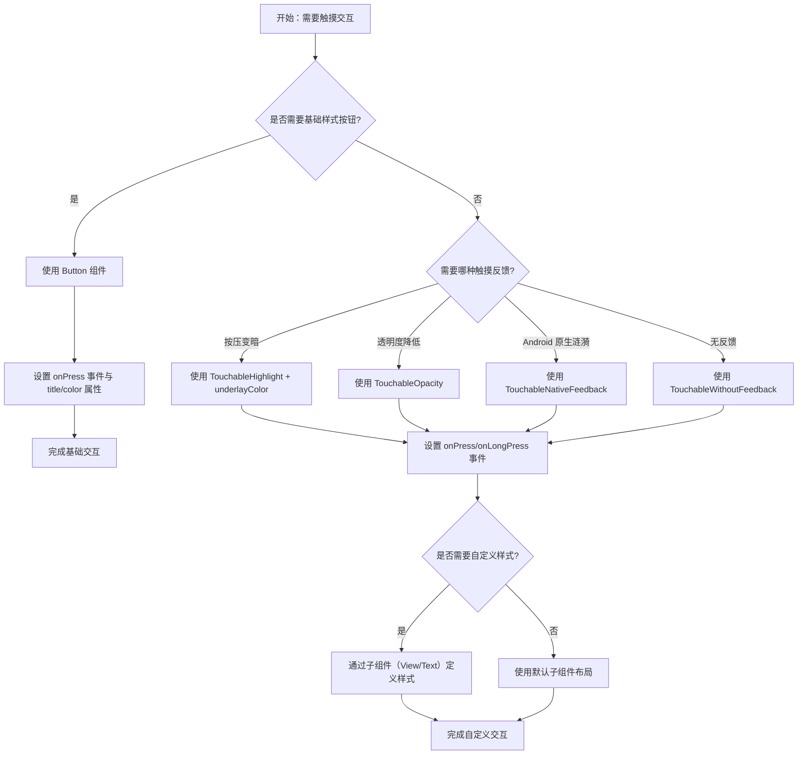

# Handling Touches

原地址：<https://reactnative.dev/docs/next/handling-touches>

## 一、概述

触摸交互是移动应用的核心交互方式，React Native 提供了多种组件用于处理触摸事件，包括基础的 `Button` 组件和灵活的 `Touchable` 系列组件，以满足不同场景下的交互需求和视觉反馈要求。

## 二、基础 Button 组件

`Button` 是 React Native 提供的基础按钮组件，具有跨平台的默认样式和触摸反馈，适用于简单的点击交互场景。

### 1. 核心属性

| 属性名 | 作用 | 示例 |
|--------|------|------|
| `onPress` | 点击事件回调函数，触发按钮点击后的逻辑 | `onPress={() => Alert.alert('Tapped!')}` |
| `title` | 按钮显示的文本内容 | `title="Press Me"` |
| `color` | 按钮的主色调（影响文本或背景色，因平台而异） | `color="#841584"`（紫色） |

### 2. 使用示例

以下示例展示了 `Button` 组件的基本用法，包括单按钮布局、颜色自定义和多按钮横向布局：

```javascript
import React from 'react';
import { Alert, Button, StyleSheet, View } from 'react-native';

const ButtonBasics = () => {
  const onPress = () => {
    Alert.alert('You tapped the button!'); // 点击后弹出提示
  };

  return (
    <View style={styles.container}>
      {/* 基础按钮 */}
      <View style={styles.buttonContainer}>
        <Button onPress={onPress} title="Press Me" />
      </View>

      {/* 自定义颜色按钮 */}
      <View style={styles.buttonContainer}>
        <Button onPress={onPress} title="Press Me" color="#841584" />
      </View>

      {/* 横向排列按钮 */}
      <View style={styles.alternativeLayoutButtonContainer}>
        <Button onPress={onPress} title="This looks great!" />
        <Button onPress={onPress} title="OK!" color="#841584" />
      </View>
    </View>
  );
};

// 样式定义
const styles = StyleSheet.create({
  container: {
    flex: 1,
    justifyContent: 'center', // 垂直居中布局
  },
  buttonContainer: {
    margin: 20, // 按钮外部间距
  },
  alternativeLayoutButtonContainer: {
    margin: 20,
    flexDirection: 'row', // 横向排列
    justifyContent: 'space-between', // 两端对齐
  },
});

export default ButtonBasics;
```

### 3. 特点与限制

- **优势**：无需自定义样式即可实现跨平台一致的按钮外观（iOS 为蓝色文本按钮，Android 为蓝色圆角背景按钮）；自带触摸反馈。
- **限制**：样式定制能力有限，仅支持 `color` 属性调整主色调，无法深度自定义布局或外观。

## 三、Touchable 系列组件

当基础 `Button` 无法满足样式或反馈需求时，可使用 `Touchable` 系列组件构建自定义按钮。这类组件本身无默认样式，但提供了灵活的触摸反馈控制和事件处理能力。

### 1. 核心特性

- 支持 `onPress`（点击事件）和 `onLongPress`（长按事件）回调。
- 可包裹任意子组件（如 `View`、`Text` 等），实现自定义外观。
- 不同组件提供不同的触摸反馈方式，适配不同交互场景。

### 2. 各组件详解

#### （1）TouchableHighlight

- **反馈方式**：触摸时底层视图背景会变暗（通过 `underlayColor` 定义高亮颜色），释放后恢复。
- **适用场景**：需要明显按压反馈的自定义按钮，类似 Web 中的链接或按钮交互。
- **核心属性**：`underlayColor`（触摸时的高亮颜色）。
- **示例代码**：

  ```javascript
  <TouchableHighlight 
    onPress={onPressButton} 
    underlayColor="white" // 触摸时底层变为白色
  >
    <View style={styles.button}>
      <Text style={styles.buttonText}>TouchableHighlight</Text>
    </View>
  </TouchableHighlight>
  ```

#### （2）TouchableOpacity

- **反馈方式**：触摸时整个组件透明度降低（默认从 1 降至 0.2），释放后恢复。
- **适用场景**：需要柔和反馈的场景，如卡片、列表项等轻交互元素。
- **优势**：反馈效果更柔和，不会改变背景色，适合复杂背景的组件。
- **示例代码**：

  ```javascript
  <TouchableOpacity onPress={onPressButton}>
    <View style={styles.button}>
      <Text style={styles.buttonText}>TouchableOpacity</Text>
    </View>
  </TouchableOpacity>
  ```

#### （3）TouchableNativeFeedback

- **反馈方式**：仅 Android 平台支持，触摸时显示系统原生的墨水扩散涟漪效果。
- **适用场景**：需要与 Android 系统原生交互体验一致的按钮。
- **核心属性**：`background`（定义涟漪效果样式，如 `TouchableNativeFeedback.SelectableBackground()`）。
- **平台限制**：iOS 平台无效果，需通过条件判断处理。
- **示例代码**：

  ```javascript
  <TouchableNativeFeedback 
    onPress={onPressButton} 
    background={
      Platform.OS === 'android' 
        ? TouchableNativeFeedback.SelectableBackground() // Android 原生涟漪
        : undefined 
    }
  >
    <View style={styles.button}>
      <Text style={styles.buttonText}>
        TouchableNativeFeedback (Android only)
      </Text>
    </View>
  </TouchableNativeFeedback>
  ```

#### （4）TouchableWithoutFeedback

- **反馈方式**：无任何视觉反馈。
- **适用场景**：需要处理触摸事件但无需反馈的场景（如隐藏交互区域）。
- **注意事项**：因无反馈可能影响用户体验，需谨慎使用。
- **示例代码**：

  ```javascript
  <TouchableWithoutFeedback onPress={onPressButton}>
    <View style={styles.button}>
      <Text style={styles.buttonText}>TouchableWithoutFeedback</Text>
    </View>
  </TouchableWithoutFeedback>
  ```

#### （5）长按事件（onLongPress）

所有 `Touchable` 组件均支持 `onLongPress` 属性，用于处理长按交互（默认长按时间为 500ms）。  
**示例代码**：

```javascript
<TouchableHighlight 
  onPress={onPressButton} 
  onLongPress={onLongPressButton} // 长按回调
  underlayColor="white"
>
  <View style={styles.button}>
    <Text style={styles.buttonText}>Touchable with Long Press</Text>
  </View>
</TouchableHighlight>
```

## 四、滚动与滑动手势

对于滑动、滚动等连续手势（如列表滚动、页面切换），React Native 推荐使用 `ScrollView` 核心组件。它支持垂直/水平滚动、滑动检测和内容容器布局，是处理长列表或大内容区域滚动的基础组件。

## 五、已知问题

- 触摸区域限制：触摸交互区域不会超出父视图的边界，需确保父视图布局正确包含交互区域。
- Android 兼容性：Android 平台不支持负边距（`margin` 为负值），可能导致触摸区域计算异常。

## 六、触摸交互组件选择流程（mermaid 流程图）


