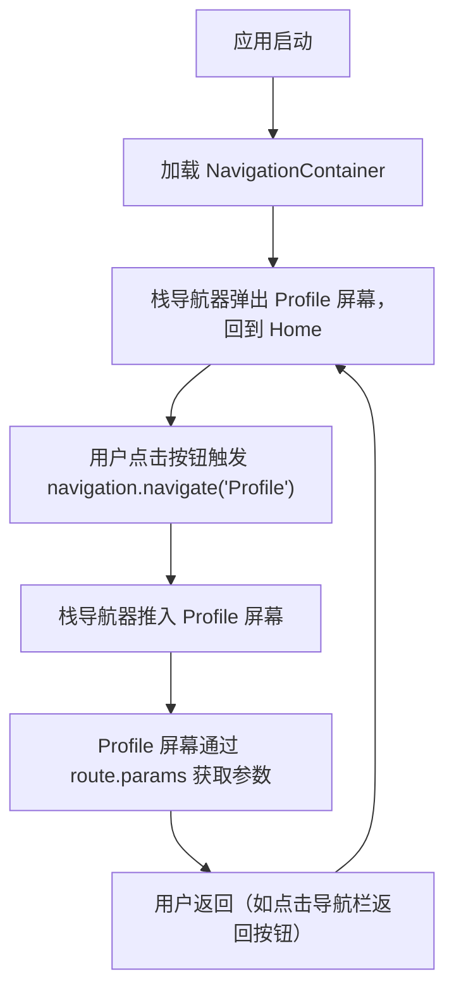

# Navigating Between Screens

原文地址：[https://reactnative.dev/docs/next/navigation](https://reactnative.dev/docs/next/navigation)

## 导航概述

移动应用通常包含多个屏幕，屏幕之间的展示和切换管理由**导航器（navigator）** 负责。React Native 中常用的导航解决方案有两种：

- **React Navigation**：社区主导的独立库，支持栈导航、标签导航等常见模式，适用于大多数场景。
- **react-native-navigation**：提供原生导航能力，适合已集成原生导航的应用或作为 React Navigation 的替代方案。

本文重点介绍 **React Navigation** 的使用方法。

## React Navigation 安装与配置

### 1. 安装核心依赖

首先安装导航核心库和栈导航组件：

```bash
npm install @react-navigation/native @react-navigation/native-stack
```

### 2. 安装 peer 依赖

根据项目类型选择对应命令：

- **Expo 管理项目**：

  ```bash
  npx expo install react-native-screens react-native-safe-area-context
  ```

- **原生 React Native 项目**：

  ```bash
  npm install react-native-screens react-native-safe-area-context
  ```

  - iOS 需额外安装 CocoaPods：

    ```bash
    cd ios && pod install && cd ..
    ```

### 3. 初始化导航容器

在入口文件（如 `index.js` 或 `App.js`）中，用 `NavigationContainer` 包裹整个应用，这是所有导航的根容器：

```tsx
import * as React from 'react';
import { NavigationContainer } from '@react-navigation/native';

const App = () => {
  return (
    <NavigationContainer>
      {/* 应用的其他内容 */}
    </NavigationContainer>
  );
};

export default App;
```

## 基本使用：栈导航（Stack Navigation）

栈导航是最常用的导航模式，类似原生应用中“推入”（push）和“弹出”（pop）屏幕的交互。

### 1. 创建栈导航器

使用 `createNativeStackNavigator` 创建栈导航器，并定义屏幕：

```tsx
import * as React from 'react';
import { NavigationContainer } from '@react-navigation/native';
import { createNativeStackNavigator } from '@react-navigation/native-stack';

// 创建栈导航器
const Stack = createNativeStackNavigator();

// 定义屏幕组件
const HomeScreen = () => { /* ... */ };
const ProfileScreen = () => { /* ... */ };

// 配置导航结构
const MyStack = () => {
  return (
    <NavigationContainer>
      <Stack.Navigator>
        {/* 首页屏幕 */}
        <Stack.Screen
          name="Home" // 屏幕唯一标识
          component={HomeScreen} // 对应的组件
          options={{ title: 'Welcome' }} // 配置标题等选项
        />
        {/* 个人资料屏幕 */}
        <Stack.Screen
          name="Profile"
          component={ProfileScreen}
        />
      </Stack.Navigator>
    </NavigationContainer>
  );
};
```

### 2. 屏幕间导航

每个屏幕组件会接收 `navigation` 属性，通过 `navigation.navigate` 方法实现跳转：

```tsx
// 首页屏幕：跳转到个人资料页并传递参数
const HomeScreen = ({ navigation }) => {
  return (
    <Button
      title="Go to Jane's profile"
      onPress={() => {
        // 传递参数 { name: 'Jane' } 到 Profile 屏幕
        navigation.navigate('Profile', { name: 'Jane' });
      }}
    />
  );
};

// 个人资料屏幕：接收参数
const ProfileScreen = ({ navigation, route }) => {
  // 通过 route.params 获取传递的参数
  return <Text>This is {route.params.name}'s profile</Text>;
};
```

### 3. 特性说明

- **原生性能**：`native-stack` 导航器使用原生 API（iOS 的 `UINavigationController` 和 Android 的 `Fragment`），性能和行为与原生应用一致。
- **配置灵活性**：通过 `options` 可自定义每个屏幕的标题、导航栏样式等。

## 其他导航模式

React Navigation 还支持多种导航模式，可根据需求选择：

- **标签导航（Tab Navigation）**：底部或顶部标签切换屏幕（如首页、我的）。
- **抽屉导航（Drawer Navigation）**：侧边滑出的菜单导航。

这些模式的使用流程与栈导航类似，需安装对应包（如 `@react-navigation/bottom-tabs` 用于标签导航）并配置相应组件。

## 导航流程示意图



## 关键注意事项

1. **屏幕命名唯一性**：`Stack.Screen` 的 `name` 属性需唯一，用于导航跳转时的标识。
2. **参数传递**：通过 `navigation.navigate` 的第二个参数传递数据，在目标屏幕用 `route.params` 接收。
3. **依赖警告**：安装过程中可能出现 peer 依赖警告，只要应用能正常构建，多数可忽略。
4. **原生一致性**：`native-stack` 依赖原生组件，确保项目已配置好原生环境（如 iOS 的 CocoaPods、Android 的 Gradle）。

## 总结

React Navigation 是 React Native 中管理多屏幕导航的主流方案，通过以下步骤即可实现基础导航：

1. 安装核心库和依赖。
2. 用 `NavigationContainer` 包裹应用。
3. 创建栈导航器并定义屏幕。
4. 使用 `navigation.navigate` 实现屏幕跳转和参数传递。

如需更复杂的导航模式（如标签、抽屉），可参考 React Navigation 官方文档扩展配置。
