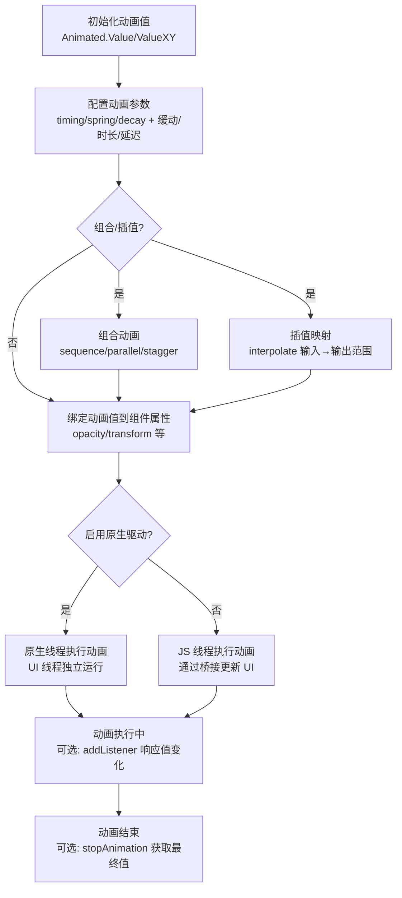

# Animations

原地址：<https://reactnative.dev/docs/next/animations>

## 概述

React Native 提供了两种互补的动画系统，用于创建符合物理规律、提升用户体验的交互效果：`Animated` API（用于精细、交互式控制特定值）和 `LayoutAnimation` API（用于全局布局事务动画）。本文档详细介绍了两种系统的使用方式、配置方法、组合技巧及性能优化策略。

## 1. Animated API

`Animated` API 专注于声明式定义输入与输出的关系，通过优化的方式实现高性能动画（避免频繁 `setState` 重渲染），支持在高优先级线程独立运行。

### 1.1 核心概念与基础使用

- **可动画组件**：`Animated` 内置支持 6 种组件：`View`、`Text`、`Image`、`ScrollView`、`FlatList`、`SectionList`；也可通过 `Animated.createAnimatedComponent()` 自定义可动画组件。
- **动画值（Animated.Value）**：动画的核心驱动单元，通过 `useRef` 初始化（如 `const fadeAnim = useRef(new Animated.Value(0)).current`），用于映射到组件属性（如 opacity、transform）。
- **基础示例**：组件挂载时淡入效果

  ```tsx
  // 初始化动画值为 0（透明）
  const fadeAnim = useRef(new Animated.Value(0)).current;
  // 组件挂载后启动动画：动画值从 0 过渡到 1（不透明）
  useEffect(() => {
    Animated.timing(fadeAnim, {
      toValue: 1,
      duration: 1000,
      useNativeDriver: true,
    }).start();
  }, [fadeAnim]);
  // 绑定到 View 的 opacity 属性
  <Animated.View style={{ opacity: fadeAnim }} />
  ```

### 1.2 动画配置

`Animated` 支持高度自定义的动画参数，核心动画类型及配置如下：

| 动画类型         | 描述                                                                 | 关键配置参数                                                                 |
|------------------|----------------------------------------------------------------------|------------------------------------------------------------------------------|
| `Animated.timing` | 随时间变化的动画，支持缓动函数                                       | `duration`（时长，默认 500ms）、`easing`（缓动函数，默认 easeInOut）、`delay`（延迟） |
| `Animated.spring` | 弹簧效果动画，模拟物理弹簧特性                                       | `stiffness`（刚度）、`damping`（阻尼）、`mass`（质量）                         |
| `Animated.decay`  | 减速动画，从初始速度逐渐停止                                         | `velocity`（初始速度）、`deceleration`（减速系数，默认 0.997）                 |

- **缓动函数（Easing）**：控制动画的加速/减速节奏，内置如 `Easing.back`（回退效果）、`Easing.linear`（线性）等，也可自定义。
- **示例**：2 秒回退动画

  ```tsx
  Animated.timing(xPosition, {
    toValue: 100,
    easing: Easing.back(),
    duration: 2000,
    useNativeDriver: true,
  }).start();
  ```

### 1.3 动画组合

通过组合方法将多个动画按顺序或并行执行，支持复杂交互逻辑：

| 组合方法           | 描述                                                                 | 特殊参数                 |
|--------------------|----------------------------------------------------------------------|--------------------------|
| `Animated.sequence` | 按顺序执行动画（前一个完成后执行下一个）                             | -                        |
| `Animated.parallel` | 并行执行动画（默认一个停止则全部停止）                               | `stopTogether: false`（允许单独停止） |
| `Animated.delay`    | 延迟执行后续动画                                                     | `delayTime`（延迟时长）  |
| `Animated.stagger`  | 按顺序启动动画，但每个动画间隔固定延迟                               | `delay`（间隔延迟）      |

- **示例**：先减速停止，再并行回弹和旋转

  ```tsx
  Animated.sequence([
    Animated.decay(position, { velocity: { x: vx, y: vy }, deceleration: 0.997 }),
    Animated.parallel([
      Animated.spring(position, { toValue: { x: 0, y: 0 } }),
      Animated.timing(twirl, { toValue: 360 }),
    ]),
  ]).start();
  ```

### 1.4 动画值运算与插值

#### 1.4.1 动画值组合

通过数学运算（加减乘除、取模）组合两个动画值，生成新动画值：

```tsx
const a = new Animated.Value(1);
const b = Animated.divide(1, a); // b = 1/a，当 a=2 时 b=0.5
```

#### 1.4.2 插值（Interpolation）

将动画值从输入范围映射到输出范围，支持数值、字符串（含单位/颜色）、缓动函数，及 extrapolation 配置：

- **基础映射**：0-1 → 0-100

  ```tsx
  value.interpolate({ inputRange: [0, 1], outputRange: [0, 100] });
  ```

- **多段映射**：复杂范围映射（如死区定义）

  ```tsx
  value.interpolate({
    inputRange: [-300, -100, 0, 100, 101],
    outputRange: [300, 0, 1, 0, 0], // 输入-400→输出450，输入50→输出0.5
  });
  ```

- **字符串映射**：动画旋转角度（单位）或颜色

  ```tsx
  // 旋转动画
  value.interpolate({ inputRange: [0, 360], outputRange: ['0deg', '360deg'] });
  // 颜色动画
  value.interpolate({ inputRange: [0, 1], outputRange: ['red', 'blue'] });
  ```

- **Extrapolation 配置**：控制输入超出范围时的输出行为，可选 `extend`（默认，扩展）或 `clamp`（限制在输出范围）。

### 1.5 动态值跟踪与 2D 交互

- **跟踪其他动画值**：将 `toValue` 设为另一个动画值，实现关联动画（如“跟随者”跟踪“领导者”）：

  ```tsx
  Animated.spring(follower, { toValue: leader }).start(); // follower 跟踪 leader
  ```

- **2D 交互处理**：`Animated.ValueXY` 封装两个 `Animated.Value`，简化平移、拖拽等 2D 动画：

  ```tsx
  const pan = new Animated.ValueXY(); // 包含 x 和 y 两个动画值
  ```

### 1.6 手势跟踪

通过 `Animated.event` 将手势/事件值映射到动画值，实现手势与动画的同步：

- **ScrollView 滚动跟踪**：

  ```tsx
  <Animated.ScrollView
    onScroll={Animated.event(
      [{ nativeEvent: { contentOffset: { x: scrollX } } }], // scrollX 关联滚动位置
      { useNativeDriver: true }
    )}
  />
  ```

- **PanResponder 手势跟踪**：

  ```tsx
  onPanResponderMove={Animated.event(
    [null, { dx: pan.x, dy: pan.y }], // 映射手势位移到 pan.x 和 pan.y
  )}
  ```

### 1.7 响应动画当前值

由于动画可能在原生线程执行，直接读取值需通过以下方式：

- `stopAnimation(callback)`：停止动画并在回调中获取最终值（适用于手势过渡）。
- `addListener(callback)`：动画运行时异步获取最近值（适用于非高频状态触发，如拖拽吸附）。

### 1.8 原生驱动（useNativeDriver）

通过 `useNativeDriver: true` 启用原生驱动，将动画配置发送到原生层，在 UI 线程独立执行，提升性能（JS 线程阻塞不影响动画）：

- **优势**：避免 JS-原生桥接延迟，动画更流畅。
- **局限性**：仅支持 `transform` 和 `opacity` 动画，不支持布局属性（如 Flexbox、position）；仅支持直接事件（如 `ScrollView#onScroll`），不支持冒泡事件（如 `PanResponder`）。
- **使用示例**：

  ```tsx
  Animated.timing(animatedValue, {
    toValue: 1,
    useNativeDriver: true, // 启用原生驱动
  }).start();
  ```

### 1.9 注意事项

- **Android 透视设置**：使用 `rotateX`/`rotateY` 等 3D 变换时，需添加 `perspective` 样式，否则可能不渲染：

  ```tsx
  <Animated.View style={{ transform: [{ rotateY: '45deg' }, { perspective: 1000 }] }} />
  ```

- **避免阻塞列表渲染**：长动画或循环动画需设置 `isInteraction: false`，防止影响 `VirtualizedList` 渲染：

  ```tsx
  Animated.timing(animatedValue, { toValue: 1, isInteraction: false }).start();
  ```

## 2. LayoutAnimation API

`LayoutAnimation` 用于全局配置布局更新动画，适用于 Flexbox 布局变化（如“展开/折叠”效果），无需手动计算属性变化：

- **特点**：全局生效，简化多组件同步动画，但控制粒度低。
- **Android 配置**：需先启用实验性 flag：

  ```tsx
  UIManager.setLayoutAnimationEnabledExperimental(true);
  ```

- **使用场景**：布局结构变化（如父组件尺寸变化推动子组件移动），避免手动协调多个组件的动画。

## 3. 动画性能优化

- **`requestAnimationFrame`**：浏览器兼容的帧更新 API，动画库底层使用，一般无需手动调用。
- **`setNativeProps`**：直接修改原生组件属性，避免 `setState` 重渲染，适合深层嵌套组件优化。
- **`InteractionManager`**：延迟计算密集型任务到动画完成后，避免阻塞动画：

  ```tsx
  InteractionManager.runAfterInteractions(() => {
    // 动画完成后执行 heavy 操作
  });
  ```

- **性能监控**：使用开发菜单的“FPS Monitor”监控帧率，确保动画达到 60fps。

## 4. Animated 动画工作流程（流程图）



## 总结

React Native 提供 `Animated` 和 `LayoutAnimation` 两种动画系统：`Animated` 适合精细控制、交互式动画（如手势跟踪、复杂插值），通过原生驱动和优化机制实现高性能；`LayoutAnimation` 适合全局布局变化，简化多组件同步动画。开发中需根据场景选择工具，注意原生驱动局限性、Android 兼容性及性能监控，以创建流畅的用户体验。
