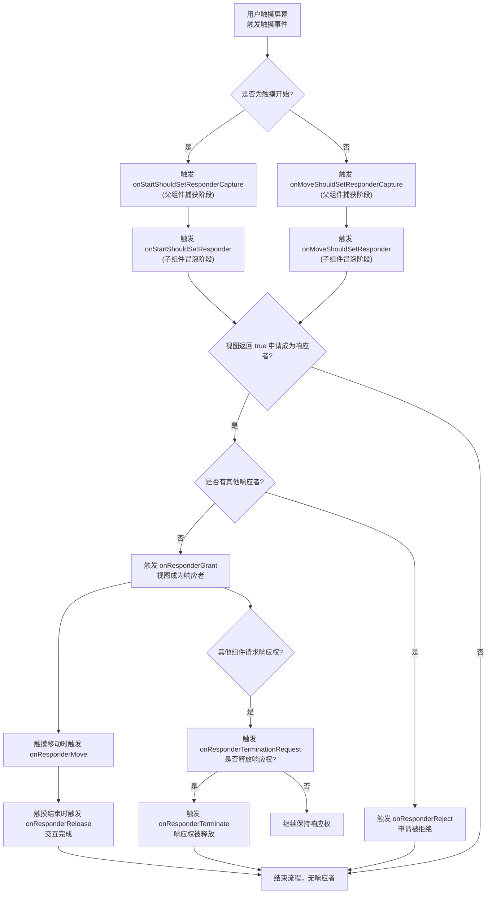

# Gesture Responder System

原地址：<https://reactnative.dev/docs/next/gesture-responder-system>

## 概述

React Native 的 **手势响应系统（Gesture Responder System）** 用于管理应用中手势的完整生命周期，处理触摸交互的各个阶段（如识别触摸意图、判断交互类型、处理同时存在的多个触摸等）。其核心作用是让组件在无需了解父/子组件关系的情况下，协商并处理触摸事件，确保交互逻辑的清晰与灵活。

## 1. 最佳实践（Best Practices）

为提升用户体验，手势交互需遵循两大核心原则：

- **反馈/高亮（Feedback/highlighting）**  
  当用户触摸元素时，需通过视觉反馈（如高亮、颜色变化）明确提示当前哪个元素正在响应触摸，让用户感知交互状态。
- **可取消性（Cancel-ability）**  
  允许用户在触摸过程中（如拖拽时）通过手势（如将手指移开目标区域）中途取消操作，减少误操作带来的困扰，增强用户使用信心。

## 2. Touchable 组件简化交互

由于手势响应系统的底层逻辑较复杂，React Native 提供了抽象的 **`Touchable` 系列组件**（如 `TouchableHighlight`、`TouchableOpacity` 等），封装了手势响应逻辑，支持 declarative 方式配置点击交互。  

- **适用场景**：替代网页中的按钮（Button）或链接（Link），快速实现可点击元素的交互效果。  
- **优势**：无需手动配置底层响应者事件，简化开发流程。

## 3. 响应者生命周期（Responder Lifecycle）

组件成为手势响应者需经历“请求-确认-交互-释放”的完整流程，核心事件与逻辑如下：

### 3.1 申请成为响应者（Request Phase）

视图通过以下方法判断是否申请成为手势响应者：

- `onStartShouldSetResponder: (evt) => boolean`  
  触摸开始时（`touchDown`）触发，返回 `true` 表示视图希望成为当前触摸的响应者。
- `onMoveShouldSetResponder: (evt) => boolean`  
  触摸移动时（`touchMove`）触发（视图尚未成为响应者时），返回 `true` 表示视图希望“认领”当前触摸的响应权。

### 3.2 确认响应者身份（Confirmation Phase）

若视图申请成为响应者，将触发以下事件之一：

- `onResponderGrant: (evt) => void`  
  视图成功成为响应者，此时应触发视觉反馈（如高亮），告知用户交互已生效。
- `onResponderReject: (evt) => void`  
  申请被拒绝（其他组件已持有响应权且未释放），视图未成为响应者。

### 3.3 响应者交互阶段（Interaction Phase）

视图成为响应者后，将接收以下触摸事件：

- `onResponderMove: (evt) => void`  
  用户移动手指时持续触发，可用于处理拖拽、滑动等动态交互（如更新元素位置）。
- `onResponderRelease: (evt) => void`  
  触摸结束时（`touchUp`）触发，通常用于处理“确认操作”（如点击完成、拖拽结束）。

### 3.4 响应者释放阶段（Termination Phase）

当其他组件申请成为响应者或系统强制收回响应权时，触发以下事件：

- `onResponderTerminationRequest: (evt) => boolean`  
  其他组件请求成为响应者，返回 `true` 表示当前视图同意释放响应权。
- `onResponderTerminate: (evt) => void`  
  响应权被强制收回（如iOS的控制中心/通知中心弹出），视图需重置交互状态（如取消高亮）。

## 4. 事件对象（evt）结构

所有响应者事件的 `evt` 为合成触摸事件，包含 `nativeEvent` 属性，核心字段如下：

| 字段              | 描述                                  |
|-------------------|---------------------------------------|
| `changedTouches`  | 自上次事件以来变化的触摸事件数组      |
| `identifier`      | 触摸的唯一ID（用于区分多触摸）        |
| `locationX`/`locationY` | 触摸在当前元素内的相对坐标          |
| `pageX`/`pageY`   | 触摸相对于根元素的绝对坐标            |
| `target`          | 接收触摸事件的元素节点ID              |
| `timestamp`       | 触摸事件的时间戳（用于计算速度等）    |
| `touches`         | 当前屏幕上所有活跃触摸的数组          |

## 5. 捕获阶段的 ShouldSet 处理程序（Capture ShouldSet Handlers）

默认情况下，响应者申请采用“冒泡模式”：最深层的组件优先触发 `onStartShouldSetResponder` 或 `onMoveShouldSetResponder`，因此最深层组件通常会成为响应者（符合多数交互场景，如按钮优先响应点击）。  

若父组件需优先成为响应者（阻止子组件响应），可使用 **捕获阶段事件**，在冒泡前拦截事件：

- `onStartShouldSetResponderCapture: (evt) => boolean`  
  触摸开始时的捕获阶段触发，返回 `true` 可阻止子组件成为响应者。
- `onMoveShouldSetResponderCapture: (evt) => boolean`  
  触摸移动时的捕获阶段触发，返回 `true` 可阻止子组件在移动时成为响应者。  

## 6. PanResponder 简介

对于更复杂的手势解析（如拖拽、缩放等高级交互），React Native 推荐使用 **`PanResponder`**，它基于手势响应系统提供了更高层次的封装，简化复杂手势逻辑的开发。

## 手势响应者生命周期流程图

## 总结

React Native 手势响应系统通过明确的生命周期事件（申请、确认、交互、释放）管理触摸交互，确保组件能独立协商响应权。核心要点包括：遵循反馈与可取消性的最佳实践、利用 `Touchable` 组件简化基础交互、理解响应者生命周期的事件触发逻辑、通过捕获阶段控制响应权优先级，以及使用 `PanResponder` 处理高级手势。掌握该系统可实现流畅、直观的用户交互体验。
