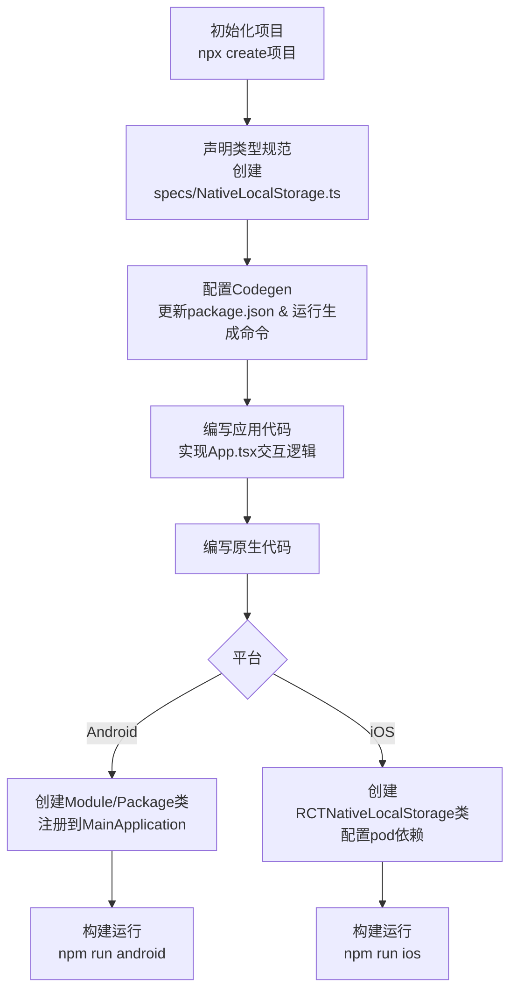

# Turbo Native Modules

原地址：<https://reactnative.dev/docs/next/turbo-native-modules-introduction>

## 概述

本文档是React Native官方关于**Turbo Native Modules**的入门指南，旨在指导开发者如何通过Turbo Native Module实现React Native应用与原生平台API的交互。当应用需要使用React Native或现有库未提供的原生平台API时，开发者可通过编写Turbo Native Module自行实现集成。本文以实现类似Web Storage API的`localStorage`功能为例（基于Android的`SharedPreferences`和iOS的`NSUserDefaults`），详细讲解了开发流程。

## 前置条件

需先通过以下命令初始化React Native项目：

```shell
npx @react-native-community/cli@latest init TurboModuleExample --version 0.76.0
```

## 核心步骤详解

### 1. 声明类型规范（Typed Specification）

React Native的Codegen工具可将TypeScript/Flow编写的类型规范转换为原生平台接口，因此需先定义模块的方法和数据类型。

#### 操作步骤：

- 在项目根目录创建`specs`文件夹；
- 在`specs`中创建`NativeLocalStorage.ts`（TypeScript）或`NativeLocalStorage.js`（Flow）文件，定义模块接口。

#### 示例代码（TypeScript）：

```typescript
// specs/NativeLocalStorage.ts
import type { TurboModule } from 'react-native';
import { TurboModuleRegistry } from 'react-native';

export interface Spec extends TurboModule {
  setItem(value: string, key: string): void;
  getItem(key: string): string | null;
  removeItem(key: string): void;
  clear(): void;
}

export default TurboModuleRegistry.getEnforcing<Spec>('NativeLocalStorage');
```

- 接口需继承`TurboModule`，声明与原生交互的方法（如`setItem`、`getItem`等）；
- 通过`TurboModuleRegistry.getEnforcing`注册模块，确保JS层可调用。

### 2. 配置Codegen

Codegen负责将类型规范转换为Android和iOS的原生代码，需在项目中配置并运行。

#### 配置`package.json`：

在`package.json`中添加`codegenConfig`，指定Codegen的输入和输出规则：

```json
{
  "codegenConfig": {
    "name": "NativeLocalStorageSpec",
    "type": "modules",
    "jsSrcsDir": "specs",
    "android": {
      "javaPackageName": "com.nativelocalstorage"
    },
    "ios": {
      "modulesProvider": {
        "NativeLocalStorage": "RCTNativeLocalStorage"
      }
    }
  }
}
```

- `name`：生成的原生代码名称；
- `jsSrcsDir`：类型规范文件所在目录；
- `android`/`ios`：分别指定Android原生代码的包名和iOS模块映射关系。

#### 运行Codegen：

- **Android**：通过Gradle任务生成代码

  ```shell
  cd android
  ./gradlew generateCodegenArtifactsFromSchema
  ```

- **iOS**：通过CocoaPods自动生成（集成在`pod install`中）

  ```shell
  cd ios
  bundle install
  bundle exec pod install
  ```

### 3. 编写应用代码

在React Native应用中使用定义的Turbo Module，实现前端交互逻辑。

#### 示例（App.tsx）：

```typescript
import React from 'react';
import { SafeAreaView, StyleSheet, Text, TextInput, Button } from 'react-native';
import NativeLocalStorage from './specs/NativeLocalStorage';

const EMPTY = '<empty>';

function App(): React.JSX.Element {
  const [value, setValue] = React.useState<string | null>(null);
  const [editingValue, setEditingValue] = React.useState<string | null>(null);

  // 初始化时读取存储的值
  React.useEffect(() => {
    const storedValue = NativeLocalStorage?.getItem('myKey');
    setValue(storedValue ?? '');
  }, []);

  // 保存值
  function saveValue() {
    NativeLocalStorage?.setItem(editingValue ?? EMPTY, 'myKey');
    setValue(editingValue);
  }

  // 清空所有值
  function clearAll() {
    NativeLocalStorage?.clear();
    setValue('');
  }

  // 删除指定值
  function deleteValue() {
    NativeLocalStorage?.removeItem('myKey');
    setValue('');
  }

  return (
    <SafeAreaView style={{ flex: 1 }}>
      <Text style={styles.text}>Current stored value is: {value ?? 'No Value'}</Text>
      <TextInput
        placeholder="Enter the text you want to store"
        style={styles.textInput}
        onChangeText={setEditingValue}
      />
      <Button title="Save" onPress={saveValue} />
      <Button title="Delete" onPress={deleteValue} />
      <Button title="Clear" onPress={clearAll} />
    </SafeAreaView>
  );
}

// 样式定义省略
export default App;
```

- 核心逻辑：通过`NativeLocalStorage`调用原生方法，实现值的存储、读取、删除和清空；
- 使用`TurboModuleRegistry`的`getEnforcing`确保模块可用，通过可选链（`?.`）处理模块未加载的情况。

### 4. 编写原生平台代码

分别为Android和iOS编写原生代码，实现模块的具体功能（基于生成的Codegen接口）。

#### Android原生实现

1. **创建Module类**：实现Codegen生成的`NativeLocalStorageSpec`接口，使用`SharedPreferences`存储数据。

   ```java
   // android/app/src/main/java/com/nativelocalstorage/NativeLocalStorageModule.java
   package com.nativelocalstorage;
   import android.content.Context;
   import android.content.SharedPreferences;
   import com.nativelocalstorage.NativeLocalStorageSpec;
   import com.facebook.react.bridge.ReactApplicationContext;

   public class NativeLocalStorageModule extends NativeLocalStorageSpec {
     public static final String NAME = "NativeLocalStorage";

     public NativeLocalStorageModule(ReactApplicationContext reactContext) {
       super(reactContext);
     }

     @Override
     public String getName() { return NAME; }

     @Override
     public void setItem(String value, String key) {
       SharedPreferences sharedPref = getReactApplicationContext().getSharedPreferences("my_prefs", Context.MODE_PRIVATE);
       SharedPreferences.Editor editor = sharedPref.edit();
       editor.putString(key, value);
       editor.apply();
     }

     @Override
     public String getItem(String key) {
       SharedPreferences sharedPref = getReactApplicationContext().getSharedPreferences("my_prefs", Context.MODE_PRIVATE);
       return sharedPref.getString(key, null);
     }

     // 实现removeItem和clear方法（省略）
   }
   ```

2. **创建Package类**：注册Module到React Native运行时。

   ```java
   // android/app/src/main/java/com/nativelocalstorage/NativeLocalStoragePackage.java
   package com.nativelocalstorage;
   import com.facebook.react.BaseReactPackage;
   import com.facebook.react.bridge.NativeModule;
   import com.facebook.react.bridge.ReactApplicationContext;
   // 其他导入省略

   public class NativeLocalStoragePackage extends BaseReactPackage {
     @Override
     public NativeModule getModule(String name, ReactApplicationContext reactContext) {
       if (name.equals(NativeLocalStorageModule.NAME)) {
         return new NativeLocalStorageModule(reactContext);
       } else {
         return null;
       }
     }

     // 实现getReactModuleInfoProvider（省略）
   }
   ```

3. **注册Package**：在`MainApplication`中添加Package到`getPackages`方法。

   ```java
   // android/app/src/main/java/com/turobmoduleexample/MainApplication.java
   // 其他代码省略
   @Override
   public List<ReactPackage> getPackages() {
     List<ReactPackage> packages = new PackageList(this).getPackages();
     packages.add(new NativeLocalStoragePackage()); // 添加自定义Package
     return packages;
   }
   ```

#### iOS原生实现

1. **创建Module类**：实现`NativeLocalStorageSpec`协议，使用`NSUserDefaults`存储数据。

   ```objective-c
   // ios/TurboModuleExample/NativeLocalStorage/RCTNativeLocalStorage.h
   #import <Foundation/Foundation.h>
   #import <NativeLocalStorageSpec/NativeLocalStorageSpec.h>

   NS_ASSUME_NONNULL_BEGIN
   @interface RCTNativeLocalStorage : NSObject <NativeLocalStorageSpec>
   @end
   NS_ASSUME_NONNULL_END
   ```

   ```objective-c
   // ios/TurboModuleExample/NativeLocalStorage/RCTNativeLocalStorage.mm
   #import "RCTNativeLocalStorage.h"
   static NSString *const RCTNativeLocalStorageKey = @"local-storage";

   @implementation RCTNativeLocalStorage
   - (id)init {
     if (self = [super init]) {
       _localStorage = [[NSUserDefaults alloc] initWithSuiteName:RCTNativeLocalStorageKey];
     }
     return self;
   }

   - (NSString * _Nullable)getItem:(NSString *)key {
     return [self.localStorage stringForKey:key];
   }

   // 实现setItem、removeItem、clear方法（省略）

   + (NSString *)moduleName { return @"NativeLocalStorage"; }
   @end
   ```

2. **配置模块映射**：在`package.json`的`codegenConfig`中指定iOS模块映射，确保React Native识别模块。
3. **重新生成依赖**：运行`cd ios && bundle exec pod install`更新配置。

### 5. 构建与运行

- **Android**：`npm run android` 或 `yarn run android`
- **iOS**：`npm run ios` 或 `yarn run ios`（需在Xcode中打开 workspace 构建）

## 核心概念说明

- **Turbo Native Module**：由类型规范（TypeScript/Flow）、原生代码实现和Codegen生成的接口组成，是JS与原生平台交互的桥梁。
- **Codegen**：React Native提供的工具，将JS类型规范转换为Android（Java/Kotlin）和iOS（Objective-C/Swift）的原生接口，减少手动编写跨平台交互代码的工作量。
- **适用场景**：当现有库未覆盖原生平台API时，需自定义Turbo Module实现交互（如本文的`localStorage`功能适配移动平台）。
- **架构支持**：本文示例适用于React Native新架构，如需支持旧架构需参考官方 backwards compatibility guide。

## 开发流程图



## 附录

- 支持的类型规范及原生类型映射可参考React Native官方附录文档。
- 模块分发：如需将Turbo Module作为npm包分发，可通过React Native的自动链接（autolinking）机制简化集成。
