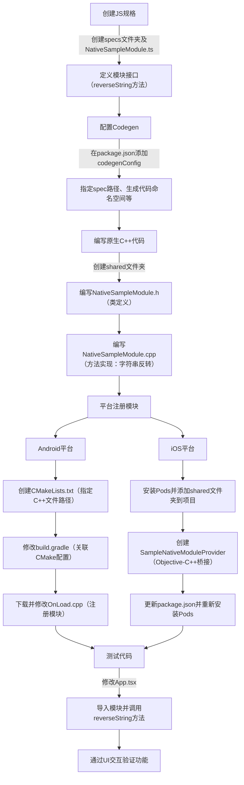

# Cross-Platform Native Modules (C++)

原地址：<https://reactnative.dev/docs/next/the-new-architecture/pure-cxx-modules>

## 概述

纯C++ Turbo Native Modules是React Native新架构中实现跨平台原生模块的解决方案，通过编写一次C++逻辑代码，即可在Android和iOS平台复用，无需编写平台特定代码。本文档详细介绍了创建、配置、实现、注册及测试纯C++ Turbo Native Module的完整流程。

## 核心步骤总结

### 1. 创建JS规格（JS Specs）

JS规格文件是连接JS层与原生C++模块的桥梁，用于定义模块接口，供Codegen生成脚手架代码。

- **创建文件夹与文件**：在项目根目录创建`specs`文件夹，新建`NativeSampleModule.ts`（文件名必须以`Native`为前缀，否则Codegen会忽略）。
- **文件内容**：定义模块接口，包含需暴露给JS的方法。  
  - TypeScript/Flow示例代码均需声明`Spec`接口继承`TurboModule`，并定义`reverseString`方法（输入字符串返回反转字符串）。  
  - 通过`TurboModuleRegistry.getEnforcing`获取模块实例并导出。
- **关键要求**：所有Turbo Module规格文件必须以`Native`为前缀，确保Codegen能识别。

### 2. 配置Codegen

Codegen用于根据JS规格文件生成原生代码脚手架，需在`package.json`中配置相关参数。

- **配置内容**：在`package.json`中添加`codegenConfig`字段：

  ```json
  "codegenConfig": {
    "name": "AppSpecs",
    "type": "modules",
    "jsSrcsDir": "specs",
    "android": {
      "javaPackageName": "com.sampleapp.specs"
    }
  }
  ```

- **配置说明**：  
  - `name`：生成代码的命名空间（此处为`AppSpecs`）。  
  - `type`：指定生成类型为`modules`。  
  - `jsSrcsDir`：指定JS规格文件所在目录（此处为`specs`）。  
  - `android.javaPackageName`：Android平台生成代码的Java包名。

### 3. 编写原生C++代码

C++代码是跨平台逻辑的核心，需实现JS规格中定义的方法，且只需编写一次即可跨平台复用。

- **创建文件夹**：在项目根目录创建`shared`文件夹（与`android`、`ios`文件夹同级），用于存放C++代码。
- **头文件（NativeSampleModule.h）**：  
  - 包含Codegen生成的规格头文件`AppSpecsJSI.h`。  
  - 定义`NativeSampleModule`类，继承自`NativeSampleModuleCxxSpec<NativeSampleModule>`。  
  - 声明构造函数（接收`CallInvoker`指针，用于与JS通信）和`reverseString`方法原型。
- **实现文件（NativeSampleModule.cpp）**：  
  - 实现构造函数，调用父类构造函数并传入`jsInvoker`。  
  - 实现`reverseString`方法，通过C++标准库反转输入字符串（`std::string(input.rbegin(), input.rend())`）。

### 4. 在平台注册模块

需为Android和iOS平台分别配置，使原生C++模块能被JS层调用（仅此处需编写平台特定代码）。

#### 4.1 Android平台

- **创建CMakeLists.txt**：  
  - 在`android/app/src/main/jni`目录下创建该文件，定义库名（`appmodules`）、引入React Native基础CMake配置、指定C++源文件路径（`../../../../../shared/NativeSampleModule.cpp`）和头文件目录。
- **修改build.gradle**：  
  - 在`android`块中添加`externalNativeBuild`配置，指定CMakeLists.txt路径：

    ```gradle
    externalNativeBuild {
      cmake {
        path "src/main/jni/CMakeLists.txt"
      }
    }
    ```

- **注册模块**：  
  - 从React Native仓库下载`OnLoad.cpp`（命令：`curl -O https://raw.githubusercontent.com/facebook/react-native/v0.76.0/packages/react-native/ReactAndroid/cmake-utils/default-app-setup/OnLoad.cpp`）。  
  - 修改`OnLoad.cpp`，引入`NativeSampleModule.h`，并在`cxxModuleProvider`函数中添加模块注册逻辑：

    ```cpp
    if (name == NativeSampleModule::kModuleName) {
      return std::make_shared<NativeSampleModule>(jsInvoker);
    }
    ```

#### 4.2 iOS平台

- **安装Pods与运行Codegen**：  
  - 进入`ios`目录，执行`bundle install`和`bundle exec pod install`，触发Codegen生成代码。
- **添加shared文件夹**：  
  - 打开Xcode工作区（`SampleApp.xcworkspace`），通过“Add files to "SampleApp"...”将`shared`文件夹添加到项目。
- **创建ModuleProvider**：  
  - 新建`SampleNativeModuleProvider`类（Objective-C++，文件后缀为`.mm`），实现`RCTModuleProvider`协议，在`getTurboModule`方法中返回C++模块实例。  
  - 头文件（`SampleNativeModuleProvider.h`）声明类继承`NSObject`并遵循`RCTModuleProvider`；实现文件（`SampleNativeModuleProvider.mm`）引入C++模块头文件，创建模块实例。
- **更新配置与重新安装Pods**：  
  - 在`package.json`的`codegenConfig`中添加iOS配置，关联JS模块名与ModuleProvider：

    ```json
    "ios": {
      "modulesProvider": {
        "NativeSampleModule": "NativeSampleModuleProvider"
      }
    }
    ```  

  - 重新执行`bundle exec pod install`并打开工作区。

### 5. 测试代码

通过JS层调用C++模块方法，验证功能正确性。

- **修改App.tsx**：  
  - 导入`NativeSampleModule`，添加UI组件（输入框、按钮、文本），实现输入字符串反转功能。  
  - 核心逻辑：通过`SampleTurboModule.reverseString(value)`调用C++模块方法，将结果展示在UI上。
- **测试流程**：输入字符串，点击“Reverse”按钮，验证反转后的字符串是否正确显示。

## 流程图（mermaid）



## 关键注意事项

- **命名规范**：JS规格文件名必须以`Native`为前缀，否则Codegen忽略。
- **跨平台核心**：C++代码在`shared`文件夹中编写，通过平台特定配置（Android的CMake/OnLoad.cpp、iOS的ModuleProvider）实现跨平台复用。
- **配置同步**：修改`package.json`或添加新模块后，需重新执行`pod install`（iOS）或同步Gradle配置（Android），确保Codegen重新生成代码。
- **最佳实践**：JS层建议通过单独文件封装规格模块，而非直接导入，便于控制输入和逻辑扩展。
