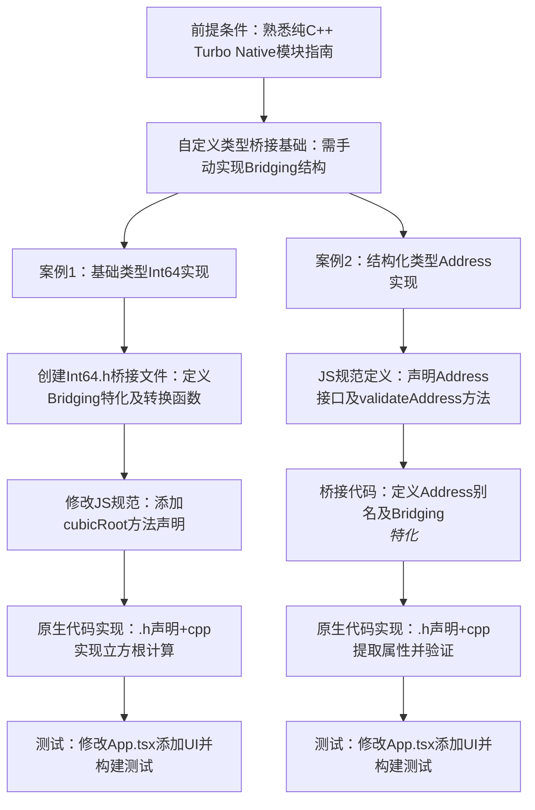

# 高级：自定义 C++ 类型

原地址：<https://www.react-native.cn/docs/next/the-new-architecture/custom-cxx-types>

该网页是 React Native 新架构下关于自定义 C++ 类型的高级指南，主要面向需要在 C++ Turbo Native 模块中使用非标准类型或结构化类型的开发者。文档明确指出，读者需先熟悉**纯 C++ Turbo Native 模块指南**，本文档在此基础上展开讲解。

## 前提条件与核心背景

- **基础支持**：C++ Turbo Native 模块默认支持大多数 `std::` 标准类型，可直接使用无需额外代码。
- **自定义类型需求**：若需使用新的自定义类型（如 `int64_t` 或结构化类型），需手动提供桥接头文件，实现 JavaScript 与 C++ 之间的类型转换逻辑。

## 核心内容：自定义 C++ 类型的实现案例

文档通过两个具体案例（基础类型 `int64_t` 和结构化类型 `Address`）详细讲解自定义类型的桥接流程。

### 案例 1：添加自定义基础类型 `Int64`

由于 JavaScript 不支持大于 2^53 的数字，需将 JS 字符串转换为 C++ 的 `int64_t` 类型，步骤如下：

#### 1. 创建桥接头文件

- **目的**：定义 JS 与 C++ 类型的双向转换逻辑。
- **操作**：在 `shared` 文件夹中创建 `Int64.h` 文件，核心代码包含：
  - 对 `Bridging<int64_t>` 结构的显式特化（模板指定 `int64_t` 类型）。
  - `fromJs` 函数：将 JS 字符串转换为 C++ `int64_t`（通过 `std::stoll` 解析字符串，校验格式合法性）。
  - `toJs` 函数：将 C++ `int64_t` 转换为 JS 字符串（通过 `std::to_string` 转换后调用桥接工具函数）。
- **注意**：iOS 需将 `Int64.h` 添加到 Xcode 项目中。

#### 2. 修改 JS 规范

- **目的**：在 JS 层声明使用自定义类型的方法，供 Codegen 生成绑定代码。
- **操作**：在 `specs/NativeSampleTurbomodule`（TypeScript/Flow 文件）中添加新方法 `cubicRoot`，参数类型为字符串（对应 JS 侧输入），返回值为数字。

#### 3. 实现原生代码

- **声明函数**：在 `specs/NativeSampleModule.h` 中添加函数声明 `int32_t cubicRoot(jsi::Runtime& rt, int64_t input);`（需引入 `Int64.h`）。
- **实现逻辑**：在 `specs/NativeSampleModule.cpp` 中，通过 `<cmath>` 库的 `cbrt` 函数计算立方根，接收 `int64_t` 类型参数并返回 `int32_t` 结果。

#### 4. 在应用中测试

- **修改 UI**：更新 `App.tsx`，添加输入框、按钮和结果展示区域，通过 `SampleTurboModule.cubicRoot` 调用原生方法。
- **构建运行**：分别通过 `yarn android` 和 `yarn ios` 构建并测试 Android 和 iOS 应用。

### 案例 2：添加结构化自定义类型 `Address`

以包含 `street`、`num`、`isInUS` 属性的 `Address` 类型为例，讲解结构化类型的桥接流程：

#### 1. 在 JS 规范中定义类型

- **目的**：声明结构化类型及使用该类型的函数，供 Codegen 生成辅助类型。
- **操作**：在 `specs/NativeSampleModule` 中定义 `Address` 接口（包含 `street: string`、`num: number`、`isInUS: boolean`），并添加 `validateAddress` 方法（参数为 `Address`，返回值为布尔值）。

#### 2. 定义桥接代码

- **Codegen 辅助类型**：Codegen 会自动生成 `NativeSampleModuleAddress`（类型定义）和 `NativeSampleModuleAddressBridging`（桥接基础设施）。
- **手动桥接声明**：在 `shared/NativeSampleModule.h` 中：
  - 定义 `Address` 类型别名：`using Address = NativeSampleModuleAddress<std::string, int32_t, bool>;`（模板参数顺序需与 `Address` 属性类型顺序一致）。
  - 特化 `Bridging` 结构：`struct Bridging<Address> : NativeSampleModuleAddressBridging<Address> {};`，复用 Codegen 生成的桥接逻辑。

#### 3. 实现原生代码

- **声明函数**：在 `shared/NativeSampleModule.h` 中添加 `bool validateAddress(jsi::Runtime &rt, jsi::Object input);`。
- **实现逻辑**：在 `shared/NativeSampleModule.cpp` 中，通过 JSI 接口（`getProperty`、`asString`、`asNumber` 等）从 `jsi::Object` 中提取 `street`、`num` 属性，验证逻辑为“街道非空且门牌号大于 0”。

#### 4. 在应用中测试

- **修改 UI**：更新 `App.tsx`，添加街道、门牌号输入框和验证按钮，通过 `SampleTurboModule.validateAddress` 调用原生方法，展示地址有效性结果。

## 核心要点总结

- **桥接核心**：自定义类型需通过 `Bridging` 结构特化实现双向转换，包含 `fromJs`（JS→C++）和 `toJs`（C++→JS）函数。
- **Codegen 作用**：结构化类型通过 JS 规范定义后，Codegen 生成类型定义和桥接基础设施，简化手动转换逻辑。
- **平台注意**：iOS 需将桥接头文件添加到 Xcode 项目，模板参数顺序需与类型属性顺序严格一致。

