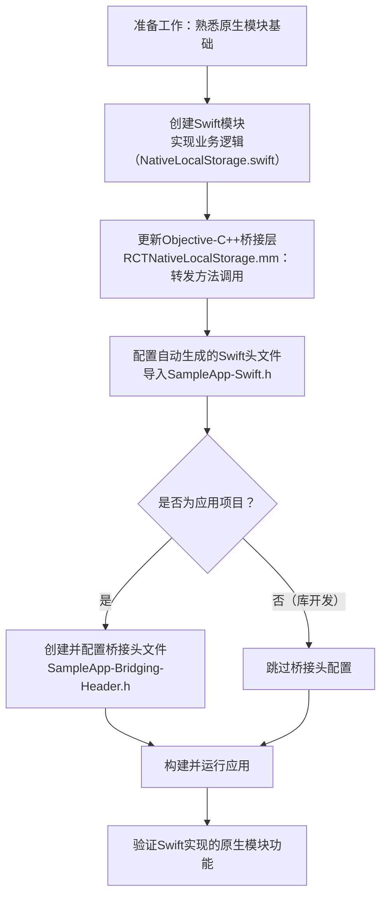

# iOS - Using Swift in Your Native Modules

原地址：<https://reactnative.dev/docs/next/the-new-architecture/turbo-modules-with-swift>

## 概述

本文档是React Native官方关于在iOS平台使用Swift编写原生模块（Turbo Modules）的指南。由于React Native核心主要使用C++编写，而Swift与C++的互操作性有限，因此无法实现纯Swift的原生模块，需借助少量Objective-C++代码作为桥接层。指南基于适配器设计模式，将业务逻辑放在Swift模块中，通过Objective-C++层转发方法调用，以最小化Objective-C++代码量，同时便于迁移现有模块到新架构。

## 前置条件

- 需熟悉React Native原生模块的基础实现（建议先完成官方原生模块示例）；
- 了解iOS开发工具Xcode的基本操作。

## 核心实现步骤

### 1. 采用适配器设计模式（Adapter Pattern）

通过适配器模式连接Swift模块与Objective-C++层，实现逻辑分离：

- **Swift模块**：包含所有业务逻辑（如数据处理、原生API调用）；
- **Objective-C++层**：作为桥接层，由React Native创建实例，持有Swift模块的引用，负责将方法调用转发给Swift实现，并管理生命周期。

### 2. 创建Swift模块

将原生模块的业务逻辑迁移到Swift文件中，需确保Swift类和方法可被Objective-C调用。

#### 操作步骤：

1. 在Xcode项目中新建空文件，命名为`NativeLocalStorage.swift`；
2. 实现Swift类，包含核心业务方法（以`localStorage`功能为例）：

```swift
// NativeLocalStorage.swift
import Foundation

@objc public class NativeLocalStorage: NSObject {
  // 使用UserDefaults存储数据，指定suiteName为"local-storage"
  let userDefaults = UserDefaults(suiteName: "local-storage")
  
  // 获取指定键的值
  @objc public func getItem(for key: String) -> String? {
    return userDefaults?.string(forKey: key)
  }
  
  // 存储键值对
  @objc public func setItem(for key: String, value: String) {
    userDefaults?.set(value, forKey: key)
  }
  
  // 删除指定键
  @objc public func removeItem(for key: String) {
    userDefaults?.removeObject(forKey: key)
  }
  
  // 清空所有存储
  @objc public func clear() {
    userDefaults?.dictionaryRepresentation().keys.forEach { removeItem(for: $0) }
  }
}
```

#### 关键注意事项：

- 类必须继承自`NSObject`，否则无法被Objective-C识别；
- 类和方法需添加`@objc`注解，并声明为`public`，确保Objective-C可访问；
- 方法命名遵循Swift规范（如`getItem(for:)`），Objective-C调用时会自动转换为兼容格式（如`getItemFor:`）。

### 3. 更新Objective-C++桥接层（RCTNativeLocalStorage.mm）

修改原Objective-C++实现，移除直接业务逻辑，改为转发调用到Swift模块。

#### 操作步骤：

1. 打开`RCTNativeLocalStorage.mm`文件；
2. 导入Swift自动生成的头文件（格式为`<App名称>-Swift.h`）；
3. 创建Swift模块实例，将方法调用转发给Swift实现：

```objective-c
// RCTNativeLocalStorage.mm
#import "RCTNativeLocalStorage.h"
#import "SampleApp-Swift.h"  // 导入Swift自动生成的头文件（替换SampleApp为实际项目名）

@implementation RCTNativeLocalStorage {
  NativeLocalStorage *storage;  // 持有Swift模块实例
}

- (id)init {
  if (self = [super init]) {
    storage = [NativeLocalStorage new];  // 初始化Swift模块
  }
  return self;
}

// 实现TurboModule接口
- (std::shared_ptr<facebook::react::TurboModule>)getTurboModule:(const facebook::react::ObjCTurboModule::InitParams &)params {
  return std::make_shared<facebook::react::NativeLocalStorageSpecJSI>(params);
}

// 转发getItem调用到Swift
- (NSString * _Nullable)getItem:(NSString *)key {
  return [storage getItemFor:key];  // 对应Swift的getItem(for:)
}

// 转发setItem调用到Swift
- (void)setItem:(NSString *)value key:(NSString *)key {
  [storage setItemFor:key value:value];  // 对应Swift的setItem(for:value:)
}

// 转发removeItem调用到Swift
- (void)removeItem:(NSString *)key {
  [storage removeItemFor:key];  // 对应Swift的removeItem(for:)
}

// 转发clear调用到Swift
- (void)clear {
  [storage clear];  // 对应Swift的clear()
}

// 指定模块名称（替代RCT_EXPORT_MODULE宏）
+ (NSString *)moduleName {
  return @"NativeLocalStorage";
}

@end
```

#### 关键说明：

- **自动生成的Swift头文件**：`SampleApp-Swift.h`由Xcode自动生成，包含Swift公开API的Objective-C兼容声明，需将`SampleApp`替换为项目实际名称；
- **模块注册**：不再需要`RCT_EXPORT_MODULE`宏，模块通过`package.json`配置注册（参考原生模块指南）；
- **方法转发**：Objective-C++方法仅作为转发层，核心逻辑由Swift模块实现，减少代码冗余。

### 4. 实现桥接头文件（Bridging Header）

桥接头文件用于让Swift代码访问Objective-C头文件，仅适用于应用项目（库开发无需此步骤）。

#### 操作步骤：

1. 在Xcode中新建文件，命名为`SampleApp-Bridging-Header.h`（`SampleApp`替换为项目名）；
2. 添加需要暴露给Swift的Objective-C头文件：

```objective-c
// SampleApp-Bridging-Header.h
// 导入需要让Swift访问的Objective-C头文件
#import <React-RCTAppDelegate/RCTDefaultReactNativeFactoryDelegate.h>
```

3. 配置项目关联桥接头文件：
   - 在Xcode项目导航中选择应用目标；
   - 进入`Build Settings`，搜索`Bridging Header`；
   - 在`Objective-C Bridging Header`中填入桥接头文件的相对路径（如`SampleApp-Bridging-Header.h`）。

### 5. 构建并运行

完成上述步骤后，按照原生模块指南的最后步骤构建并运行应用，此时原生模块的核心逻辑已由Swift实现。

## 核心优势与注意事项

### 优势

- **代码复用**：可重用现有Swift代码，减少迁移成本；
- **逻辑分离**：业务逻辑集中在Swift模块，Objective-C++仅作为桥接层，便于维护；
- **符合iOS生态**：使用Swift（iOS官方推荐语言）开发，适配未来发展。

### 注意事项

- **互操作性限制**：Swift与C++互操作性有限，需通过Objective-C++中转；
- **命名规范**：Swift方法名在Objective-C中会自动转换（如`getItem(for:)`变为`getItemFor:`），需注意调用一致性；
- **桥接头配置**：桥接头文件路径需正确配置，否则Swift无法访问Objective-C代码；
- **库开发例外**：库作者开发独立原生模块时，无需桥接头文件。

## 开发流程图



## 总结

本文档通过适配器模式实现了Swift与React Native原生模块的集成，核心是将业务逻辑放在Swift模块中，通过少量Objective-C++代码作为桥接层转发调用。这种方式既发挥了Swift的优势，又兼容React Native的C++核心，适合需要重用Swift代码或偏好Swift开发的场景。需注意桥接头配置和方法命名转换，确保跨语言调用的一致性。
