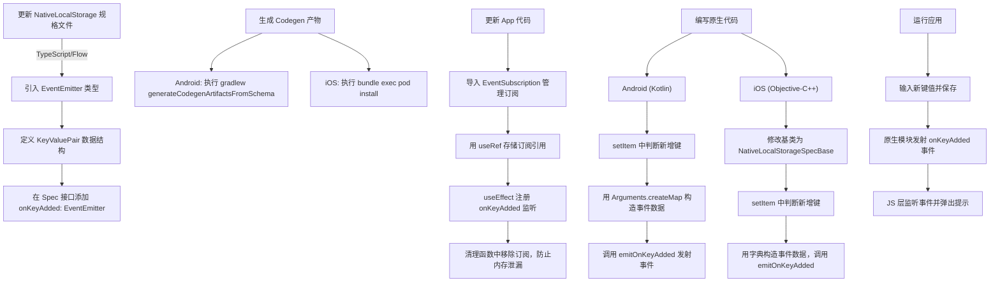

# Emitting Events in Native Modules

原地址：<https://reactnative.dev/docs/next/the-new-architecture/native-modules-custom-events>

## 概述

本文档详细介绍了在 React Native 新架构中，如何从原生模块（Native Modules）向 JavaScript 层发射自定义事件。通过实例演示了“当存储中新增键时发射事件”的完整流程，包括规格文件更新、Codegen 生成、应用代码修改、原生代码实现及应用运行验证，适用于原生模块需主动通知 JS 层状态变化（如长期任务进度、数据更新）的场景。

## 核心步骤总结

### 1. 更新 NativeLocalStorage 的规格文件（Specs）

需修改规格文件以声明模块可发射事件，使 React Native 识别事件类型及数据结构。

- **TypeScript/Flow 规格文件修改**：  
  打开 `NativeLocalStorage.ts`（TypeScript）或 `NativeLocalStorage.js`（Flow），添加事件相关类型定义和事件发射器声明：  

  ```typescript
  // TypeScript 示例
  import type { EventEmitter } from 'react-native/Libraries/Types/CodegenTypes';
  // 定义事件数据结构
  export type KeyValuePair = { key: string; value: string };
  export interface Spec extends TurboModule {
    // 原有方法：setItem、getItem、removeItem、clear
    setItem(value: string, key: string): void;
    getItem(key: string): string | null;
    removeItem(key: string): void;
    clear(): void;
    // 声明事件发射器，类型为 KeyValuePair
    readonly onKeyAdded: EventEmitter<KeyValuePair>;
  }
  ```

  - 关键说明：  
    - 需导入 `EventEmitter` 类型以定义事件发射器。  
    - 事件数据结构（`KeyValuePair`）需明确字段，确保原生与 JS 层数据一致。  
    - 事件名称 `onKeyAdded` 需在规格中声明为只读属性，类型为 `EventEmitter<数据类型>`。  

### 2. 生成 Codegen  artifacts

规格文件更新后，需通过 Codegen 生成原生代码脚手架，使原生层能识别事件发射逻辑。

- **Android 平台**：  
  执行 Gradle 任务生成 Codegen 产物：  

  ```bash
  cd android
  ./gradlew generateCodegenArtifactsFromSchema
  ```  

  该任务会根据规格文件生成对应原生代码，构建应用时会自动执行。

- **iOS 平台**：  
  通过 CocoaPods 触发 Codegen：  

  ```bash
  cd ios
  bundle install
  bundle exec pod install
  ```  

  CocoaPods 会在安装依赖时自动运行 Codegen，生成适配 iOS 的原生代码。  

### 3. 更新应用（App）代码

在 JavaScript 层添加事件监听逻辑，处理原生模块发射的事件。

- **修改 App.tsx**：  
  1. 导入 `EventSubscription` 类型以管理事件订阅。  
  2. 使用 `useRef` 存储事件订阅引用，避免重复订阅。  
  3. 在 `useEffect` 中注册事件监听，并在清理函数中移除订阅（防止内存泄漏）：  

     ```typescript
     import React from 'react';
     import { Alert, EventSubscription, SafeAreaView, ... } from 'react-native';
     import NativeLocalStorage from './specs/NativeLocalStorage';
     
     function App(): React.JSX.Element {
       const listenerSubscription = React.useRef<null | EventSubscription>(null);
       
       React.useEffect(() => {
         // 注册事件监听
         listenerSubscription.current = NativeLocalStorage?.onKeyAdded((pair) => 
           Alert.alert(`New key added: ${pair.key} with value: ${pair.value}`)
         );
         // 清理函数：移除监听
         return () => {
           listenerSubscription.current?.remove();
           listenerSubscription.current = null;
         };
       }, []);
       
       // 其他逻辑：保存、获取、删除键值对等
       return (...);
     }
     ```  

  - 关键说明：  
    - 事件监听需在组件挂载时注册，卸载时移除，确保资源正确释放。  
    - 事件回调函数接收原生发射的 `KeyValuePair` 数据，可用于更新 UI 或触发其他逻辑（如弹出提示）。  

### 4. 编写原生代码

在原生模块中实现事件发射逻辑：当新增键时，构造事件数据并发射事件。

#### 4.1 Android 平台（Kotlin）

- **修改 `NativeLocalStorageModule.kt`**：  
  在 `setItem` 方法中判断是否为新增键，若是则构造事件数据并发射：  

  ```kotlin
  import com.facebook.react.bridge.Arguments
  import com.facebook.react.bridge.WritableMap
  
  class NativeLocalStorageModule(reactContext: ReactApplicationContext) : NativeLocalStorageSpec(reactContext) {
    override fun setItem(value: String, key: String) {
      // 判断是否为新增键（原键不存在）
      val shouldEmit = getItem(key) == null
      // 存储键值对
      val sharedPref = reactContext.getSharedPreferences("my_prefs", Context.MODE_PRIVATE)
      sharedPref.edit().putString(key, value).apply()
      // 若为新增键，发射事件
      if (shouldEmit) {
        val eventData = Arguments.createMap().apply {
          putString("key", key)
          putString("value", value)
        }
        // 调用 Codegen 生成的 emit 方法
        emitOnKeyAdded(eventData)
      }
    }
    // 其他方法：getItem、removeItem、clear 等
  }
  ```  

  - 关键说明：  
    - 用 `Arguments.createMap()` 构造事件数据（`WritableMap`），确保键与 JS 层 `KeyValuePair` 一致。  
    - 调用 Codegen 自动生成的 `emitOnKeyAdded` 方法发射事件（方法名由 `onKeyAdded` 转换而来）。  

#### 4.2 iOS 平台（Objective-C++）

- **修改头文件 `RCTNativeLocalStorage.h`**：  
  将基类从 `NSObject` 改为 `NativeLocalStorageSpecBase`，以继承事件发射相关方法：  

  ```objective-c
  #import <NativeLocalStorageSpec/NativeLocalStorageSpec.h>
  
  @interface RCTNativeLocalStorage : NativeLocalStorageSpecBase <NativeLocalStorageSpec>
  @end
  ```  

- **修改实现文件 `RCTNativeLocalStorage.mm`**：  
  在 `setItem` 方法中判断新增键，构造事件数据并发射：  

  ```objective-c
  - (void)setItem:(NSString *)value key:(NSString *)key {
    // 判断是否为新增键
    BOOL shouldEmitEvent = ![self getItem:key];
    // 存储键值对
    [self.localStorage setObject:value forKey:key];
    // 若为新增键，发射事件
    if (shouldEmitEvent) {
      NSDictionary *eventData = @{@"key": key, @"value": value};
      // 调用生成的 emit 方法
      [self emitOnKeyAdded:eventData];
    }
  }
  ```  

  - 关键说明：  
    - `NativeLocalStorageSpecBase` 提供了 `emitOnKeyAdded` 方法，简化事件发射逻辑。  
    - 事件数据用字典构造，键需与 JS 层 `KeyValuePair` 一致。  

### 5. 运行应用

完成上述步骤后，运行应用即可验证事件发射功能：  

- 在输入框中输入新键和值，点击“Save”保存。  
- 原生模块检测到新增键，发射 `onKeyAdded` 事件。  
- JS 层监听到事件，弹出包含新增键和值的提示框。  

## 流程图（mermaid）



## 关键注意事项

- **事件数据一致性**：原生层构造的事件数据（键名、类型）必须与 JS 层 `KeyValuePair` 定义完全一致，否则数据解析会出错。  
- **事件监听清理**：JS 层需在组件卸载时移除事件订阅（`remove()`），避免内存泄漏和无效回调。  
- **Codegen 必要性**：规格文件更新后必须重新运行 Codegen，否则原生层无法识别新增的事件发射器方法。  
- **新增键判断逻辑**：原生模块中需准确判断“新增键”（原键不存在），避免重复发射事件（如更新已有键时不发射）。  
- **跨平台一致性**：Android 和 iOS 的事件发射逻辑需保持行为一致（如判断条件、数据结构），确保应用跨平台表现一致。
