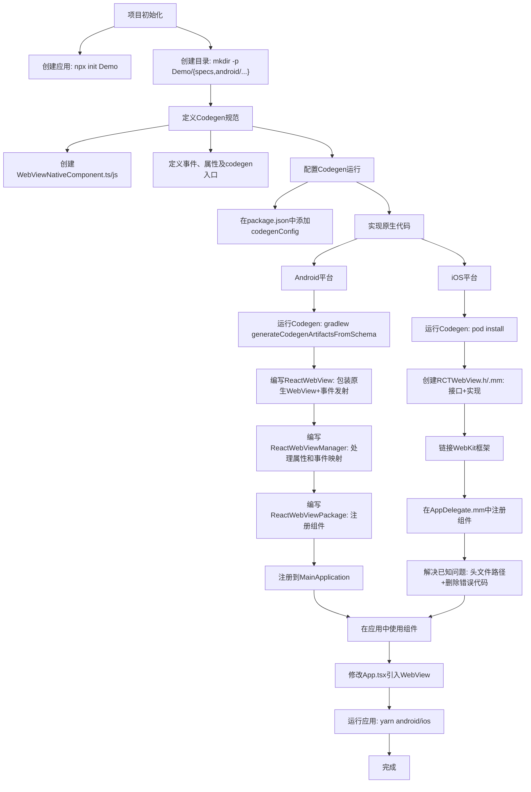

# 原生组件

原地址：<https://www.react-native.cn/docs/next/fabric-native-components-introduction>

## 一、概述

若需构建新架构的 React Native 组件以包装宿主组件（如 Android 上的 `CheckBox` 或 iOS 上的 `UIButton`），应使用 Fabric 原生组件。本文以实现 WebView 组件为例，详细介绍构建 Fabric 原生组件的完整流程，核心步骤包括：使用 Flow 或 TypeScript 定义 JavaScript 规范、配置依赖管理系统生成代码并自动链接、实现原生代码、在应用中使用组件。

## 二、项目初始化

### （一）创建基础应用

需通过以下命令创建一个基础模板应用，用于后续组件开发：

```bash
npx @react-native-community/cli@latest init Demo --install-pods false
```

### （二）创建文件夹结构

为组件代码创建专用目录，执行以下命令：

```bash
mkdir -p Demo/{specs,android/app/src/main/java/com/webview}
```

生成的目录结构及作用如下：

```txt
Demo
├── android/app/src/main/java/com/webview  # 存放 Android 原生代码
├── ios  # 存放 iOS 原生代码
└── specs  # 存放 Codegen 规范文件（用于代码生成）
```

## 三、构建 Fabric 原生组件的核心步骤

### （一）定义 Codegen 规范

Codegen 规范用于生成连接平台代码与 JavaScript 运行时的代码（C++、Objective-C++、Java），是组件开发的基础。

#### 1. 规范文件要求

- **语言**：需使用 TypeScript 或 Flow 定义。
- **命名格式**：文件名必须为 `<MODULE_NAME>NativeComponent.{ts|js}`，其中后缀 `NativeComponent` 是 Codegen 识别规范文件的标识。

#### 2. WebView 组件规范示例

以 TypeScript 为例，规范文件 `Demo/specs/WebViewNativeComponent.ts` 内容如下：

```typescript
import type {HostComponent, ViewProps} from 'react-native';
import type {BubblingEventHandler} from 'react-native/Libraries/Types/CodegenTypes';
import codegenNativeComponent from 'react-native/Libraries/Utilities/codegenNativeComponent';

// 定义事件数据类型：页面加载结果
type WebViewScriptLoadedEvent = {
  result: 'success' | 'error';
};

// 定义组件属性：继承 ViewProps，新增 sourceURL 和事件回调
export interface NativeProps extends ViewProps {
  sourceURL?: string;  // 网页 URL
  onScriptLoaded?: BubblingEventHandler<WebViewScriptLoadedEvent> | null;  // 加载完成事件
}

// 生成原生组件，名称为 CustomWebView（需与原生实现匹配）
export default codegenNativeComponent<NativeProps>(
  'CustomWebView',
) as HostComponent<NativeProps>;
```

#### 3. 规范组成说明

- **事件类型（WebViewScriptLoadedEvent）**：定义从原生代码传递到 JavaScript 的数据结构（如加载结果 `success`/`error`）。
- **组件属性（NativeProps）**：声明组件支持的属性，包括基础视图属性（ViewProps）和自定义属性（如 `sourceURL`）及事件回调（`onScriptLoaded`）。
- **代码生成入口（codegenNativeComponent）**：指定组件名称（`CustomWebView`），用于关联原生实现，Codegen 据此生成桥接代码。

### （二）配置 Codegen 运行

需在 `package.json` 中配置 Codegen 规则，确保其能找到规范文件并生成对应平台代码。

#### 关键配置如下：

```json
"codegenConfig": {
  "name": "AppSpec",  // 生成代码的名称
  "type": "components",  // 类型为组件
  "jsSrcsDir": "specs",  // 规范文件存放目录
  "android": {
    "javaPackageName": "com.webview"  // Android 生成代码的包名
  },
  "ios": {
    "componentProvider": {
      "CustomWebView": "RCTWebView"  // JS 组件名与 iOS 原生类映射
    }
  }
}
```

### （三）实现原生代码

需分别为 Android 和 iOS 平台编写原生代码，以实现 WebView 的渲染、属性处理和事件通信。

#### 1. Android 平台实现

##### （1）运行 Codegen 生成基础代码

执行以下命令生成 ViewManager 接口及委托类（供 IDE 识别）：

```bash
cd android
./gradlew generateCodegenArtifactsFromSchema
```

##### （2）编写 `ReactWebView` 组件

作用：包装 Android 原生 `WebView`，定义布局、行为及事件发射逻辑。  
文件路径：`android/app/src/main/java/com/webview/ReactWebView.java`（或 Kotlin），核心代码说明：

- **构造函数**：调用 `configureComponent` 初始化布局和 WebViewClient。
- **configureComponent**：设置布局为全屏（`MATCH_PARENT`），通过 `WebViewClient` 监听页面加载完成事件（`onPageFinished`），并发射 `onScriptLoaded` 事件。
- **事件发射（emitOnScriptLoaded）**：  
  步骤：获取 `ReactContext` → 提取 `surfaceId` 和 `eventDispatcher` → 构建事件 payload（`WritableMap`）→ 创建 `OnScriptLoadedEvent` 并通过 `eventDispatcher` 分发。
- **事件类型定义**：`OnScriptLoadedEventResult`（枚举加载结果）和 `OnScriptLoadedEvent`（继承 React Native `Event` 类）。

##### （3）编写 `ReactWebViewManager`

作用：连接 React Native 运行时与原生视图，负责创建视图、处理属性更新和事件映射。  
核心实现：

- 继承 `SimpleViewManager<ReactWebView>` 并实现 Codegen 生成的 `CustomWebViewManagerInterface`。
- `getName()`：返回组件名 `CustomWebView`（需与规范中一致）。
- `createViewInstance()`：实例化 `ReactWebView`。
- `@ReactProp(name = "sourceUrl")`：处理 `sourceURL` 属性，若 URL 为空则发射错误事件，否则加载 URL。
- `getExportedCustomBubblingEventTypeConstants()`：映射事件名，使 JavaScript 能接收 `onScriptLoaded` 事件。

##### （4）编写 `ReactWebViewPackage`

作用：注册组件到 React Native 运行时，继承 `TurboReactPackage`。  
关键方法：

- `createViewManagers`：返回 `ReactWebViewManager` 实例，用于创建视图管理器。
- `getModule`：根据组件名返回对应 ViewManager。
- `getReactModuleInfoProvider`：提供模块注册信息（如名称、是否为 TurboModule 等）。

##### （5）注册到应用

修改 `MainApplication.kt`，在 `getPackages` 方法中添加 `ReactWebViewPackage()`：

```kotlin
override fun getPackages(): List<ReactPackage> =
  PackageList(this).packages.apply {
    add(ReactWebViewPackage())  // 注册自定义组件包
  }
```

#### 2. iOS 平台实现

##### （1）运行 Codegen 生成代码

```bash
cd ios
bundle install
bundle exec pod install  # 触发 Codegen 生成桥接代码
```

> 注意：生成代码与 React Native 版本绑定，不应提交到仓库，需通过 `peerDependencies` 约束版本兼容性。

##### （2）创建 `RCTWebView` 组件

需创建头文件 `RCTWebView.h` 和实现文件 `RCTWebView.mm`（Objective-C++）。

- **头文件（RCTWebView.h）**：声明组件接口，继承 React Native 基础类 `RCTViewComponentView`。

  ```objective-c
  #import <React/RCTViewComponentView.h>
  #import <UIKit/UIKit.h>
  
  NS_ASSUME_NONNULL_BEGIN
  @interface RCTWebView : RCTViewComponentView
  @end
  NS_ASSUME_NONNULL_END
  ```

- **实现文件（RCTWebView.mm）**：核心逻辑包括：
  - 实现 `RCTCustomWebViewViewProtocol`（Codegen 生成）和 `WKNavigationDelegate`（WebKit 导航代理）。
  - `init`：初始化 `WKWebView` 并设置导航代理，添加到子视图。
  - `updateProps`：监听 `sourceURL` 属性变化，加载 URL 或发射错误事件。
  - `webView:didFinishNavigation:`：页面加载完成时发射 `onScriptLoaded` 事件。
  - `componentDescriptorProvider`：返回 Codegen 生成的 `CustomWebViewComponentDescriptor`。
  - `WebViewCls`：用于注册组件类。

##### （3）注册组件到应用

修改 `AppDelegate.mm`，重写 `thirdPartyFabricComponents` 方法注册组件：

```objective-c
- (NSDictionary<NSString *,Class<RCTComponentViewProtocol>> *)thirdPartyFabricComponents {
  NSMutableDictionary *dictionary = [super thirdPartyFabricComponents].mutableCopy;
  dictionary[@"CustomWebView"] = [RCTWebView class];  // 关联组件名与原生类
  return dictionary;
}
```

##### （4）注意事项

- **链接 WebKit 框架**：在 Xcode 中，项目 → 目标 → General → Frameworks, Libraries, and Embedded Contents 添加 `WebKit.framework`（因使用 `WKWebView`）。
- **解决已知问题**：  
  - 头文件路径：添加 `$(PODS_ROOT)/Headers/Private/Yoga` 到应用头文件搜索路径。  
  - 删除生成代码错误行：移除 `RCTThirdPartyFabricComponentsProvider.h` 和 `.mm` 中含 `WebViewCls` 的行（React Native 0.76.1 已修复）。

### （四）在应用中使用组件

#### 1. 修改 `App.tsx`

引入并使用自定义 WebView 组件：

```tsx
import React from 'react';
import {Alert, StyleSheet, View} from 'react-native';
import WebView from './specs/WebViewNativeComponent';

function App(): React.JSX.Element {
  return (
    <View style={styles.container}>
      <WebView
        sourceURL="https://react.dev/"  // 加载的网页 URL
        style={styles.webview}
        onScriptLoaded={() => {  // 页面加载完成事件
          Alert.alert('Page Loaded');
        }}
      />
    </View>
  );
}

const styles = StyleSheet.create({
  container: {flex: 1, alignItems: 'center'},
  webview: {width: '100%', height: '100%'},
});

export default App;
```

#### 2. 运行应用

- Android：`yarn run android`  
- iOS：`yarn run ios`  

## 四、流程图（mermaid）



## 五、注意事项

1. 本文组件仅支持 React Native 新架构，如需兼容旧架构需参考向后兼容指南。
2. Codegen 生成的代码特定于 React Native 版本，不应提交到代码仓库，需通过 `peerDependencies` 约束版本。
3. iOS 平台需注意头文件搜索路径和生成代码的错误处理（React Native 0.76.1 已修复部分问题）。
4. 事件发射和属性处理需严格遵循平台规范，确保 JavaScript 与原生代码通信正常。
