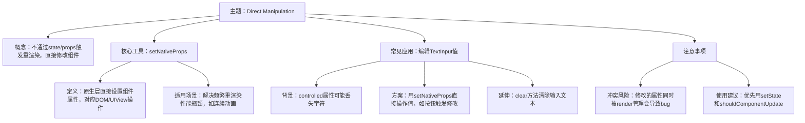

# Direct Manipulation

原地址：<https://www.react-native.cn/docs/next/the-new-architecture/direct-manipulation-new-architecture>

## 文档概述

该文档围绕 React Native 新架构中 Native Modules 开发的高级主题之一——**Direct Manipulation（直接操作）** 展开，详细介绍了其概念、核心工具、使用场景、注意事项等内容，旨在帮助开发者理解如何在原生组件开发中合理运用直接操作技术。

## 主要知识点总结

### 1. Direct Manipulation 概念

直接操作指在不通过状态（state）或属性（props）触发整个子树重新渲染的情况下，直接对组件进行修改的操作方式。这与在浏览器中使用 React 时直接修改 DOM 节点的逻辑类似，在移动应用中则体现为直接对视图（如 UIView 等）进行操作。

### 2. 核心工具：`setNativeProps`

- **定义**：`setNativeProps` 是 React Native 中实现直接操作的核心方法，相当于在原生层直接设置组件属性，其操作对象是原生层的节点（如 DOM、UIView 等）。
- **适用场景**：主要用于解决频繁重新渲染导致的性能瓶颈问题，典型场景包括创建连续动画时，通过直接操作避免组件层级渲染和视图协调的开销，提升性能。

### 3. `setNativeProps` 的常见应用案例：编辑 TextInput 值

- **问题背景**：TextInput 的 `controlled` 属性在 `bufferDelay` 较低且用户快速输入时，可能出现字符丢失的问题。
- **解决方案**：部分开发者选择忽略 `controlled` 属性，转而使用 `setNativeProps` 直接操作 TextInput 的值，以避免字符丢失。例如，可通过按钮点击事件触发 `setNativeProps` 来修改输入框内容。
- **延伸功能**：可以使用 `clear` 方法（基于相同的直接操作原理）清除 TextInput 的当前输入文本。

### 4. 注意事项：避免与渲染函数冲突

- **冲突风险**：如果通过 `setNativeProps` 修改的属性同时由渲染函数（render）管理，会导致不可预测的 bug。因为当组件重新渲染且该属性发生变化时，`setNativeProps` 之前设置的值会被完全忽略和覆盖。
- **使用建议**：在使用 `setNativeProps` 之前，应优先尝试通过 `setState` 和 `shouldComponentUpdate` 解决问题。由于 `setNativeProps` 是命令式操作，且状态存储在原生层而非 React 组件内部，过度使用会增加代码的复杂性和维护难度。

## 流程图（mermaid）

