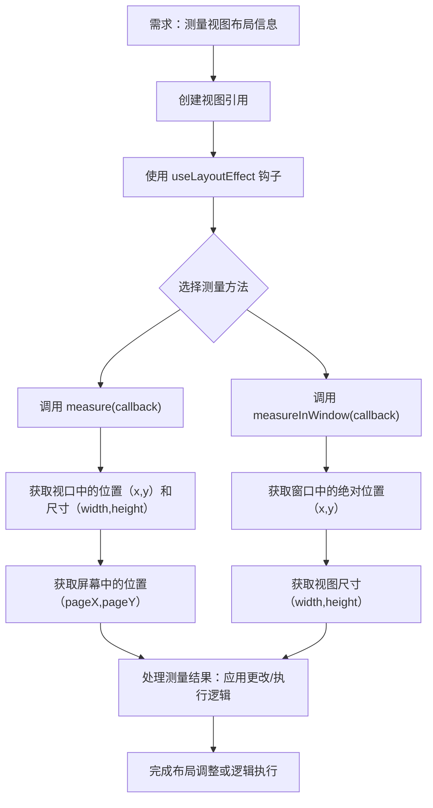

# 测量布局

原地址：<https://www.react-native.cn/docs/next/the-new-architecture/layout-measurements>

## 一、概述

在 React Native 开发中，有时需要测量当前视图的布局信息（如位置、宽高），以应用布局更改、执行特定逻辑或做出决策。React Native 提供了原生方法来获取视图的测量值，且推荐在 `useLayoutEffect` 钩子中调用这些方法，以确保获取最新测量值并能在同一帧中应用更改。

## 二、核心测量方法

React Native 提供了两种主要的布局测量方法，用于获取视图的位置和尺寸信息。

### （一）`measure(callback)`

#### 1. 功能

确定视图在视口中的位置（左上角坐标）和尺寸，通过异步回调返回测量结果。

#### 2. 回调参数

回调函数将接收以下参数，用于描述视图的测量信息：

- `x`：视图在视口中的左上角 x 坐标。
- `y`：视图在视口中的左上角 y 坐标。
- `width`：视图的宽度。
- `height`：视图的高度。
- `pageX`：视图在整个屏幕（通常指视口）中的左上角 x 坐标。
- `pageY`：视图在整个屏幕（通常指视口）中的左上角 y 坐标。

#### 3. 注意事项

- 返回的 `width` 和 `height` 是视图在当前视口中的实际尺寸。
- 该方法适用于获取视图相对视口的布局信息。

### （二）`measureInWindow(callback)`

#### 1. 功能

确定视图在当前窗口中的绝对位置和尺寸，通过异步回调返回结果。当 React 根视图嵌套在其他原生视图中时，此方法可提供绝对坐标。

#### 2. 回调参数

回调函数接收以下参数：

- `x`：视图在当前窗口中的左上角 x 坐标（绝对坐标）。
- `y`：视图在当前窗口中的左上角 y 坐标（绝对坐标）。
- `width`：视图的宽度。
- `height`：视图的高度。

#### 3. 适用场景

- 需获取视图相对于整个窗口的绝对位置时使用，尤其适用于 React 根视图非全屏或嵌套在其他原生视图中的场景。

## 三、使用示例

### （一）基础用法

通过 `useRef` 获取视图引用，在 `useLayoutEffect` 中调用测量方法，示例代码如下：

```tsx
function AComponent(children) {
  // 创建视图引用
  const targetRef = React.useRef(null);

  // 在 useLayoutEffect 中调用测量方法
  React.useLayoutEffect(() => {
    // 调用 measure 方法
    targetRef.current?.measure((x, y, width, height, pageX, pageY) => {
      // 处理测量结果，如应用布局更改或执行逻辑
      console.log('视图在视口中的位置：', x, y);
      console.log('视图尺寸：', width, height);
      console.log('视图在屏幕中的位置：', pageX, pageY);
    });

    // 调用 measureInWindow 方法（可选）
    targetRef.current?.measureInWindow((x, y, width, height) => {
      console.log('视图在窗口中的绝对位置：', x, y);
      console.log('视图尺寸：', width, height);
    });
  }, [/* 依赖数组：当依赖变化时重新测量 */]);

  // 渲染视图并绑定引用
  return (
    <View ref={targetRef}>
      {children}
    </View>
  );
}
```

### （二）关键说明

- **使用 `useLayoutEffect` 的原因**：该钩子在 DOM 布局更新后同步执行，能确保获取最新的布局测量值，且可在同一帧中应用基于测量结果的更改，避免视觉闪烁。
- **视图引用**：需通过 `React.useRef` 创建引用并绑定到目标视图，才能调用测量方法。
- **兼容性**：测量方法在大多数 React Native 默认组件中可用，但在非原生视图支持的复合组件（如自定义组合组件）中可能不可用。

## 四、流程图（mermaid）



## 五、注意事项

1. **方法可用性**：测量方法主要支持 React Native 默认组件，自定义复合组件（非原生视图直接支持）可能不支持这些方法。
2. **异步特性**：测量方法通过回调返回结果，属于异步操作，需注意代码执行顺序，避免依赖未获取的测量值。
3. **性能考量**：频繁调用测量方法可能影响性能，建议仅在必要时使用，并合理设置依赖数组以减少不必要的重测量。
4. **坐标差异**：`measure` 返回相对视口的坐标，`measureInWindow` 返回相对窗口的绝对坐标，需根据场景选择合适方法。
