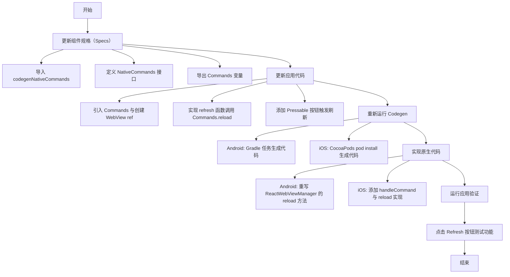

# Invoking native functions on your native component

原地址：<https://reactnative.dev/docs/next/the-new-architecture/fabric-component-native-commands>

## 一、概述

本文档聚焦于在 React Native 新架构（旧架构看官文）中，如何通过 **Native Commands** 机制从 JavaScript（JS）端 imperative 调用原生组件的函数，以实现更复杂的功能（如程序化刷新网页）。操作前需先了解《Native Components 指南》和 Codegen 相关知识，整体流程包括更新组件规格、应用代码集成、Codegen 重新生成、原生代码实现及应用运行验证。

## 二、核心步骤详细说明

### 1. 更新组件规格（Specs）

通过修改组件规格文件定义 Native Commands，为 JS 调用原生函数提供接口定义。

#### TypeScript 实现

- **导入工具函数**：引入 `codegenNativeCommands` 用于生成命令相关代码。  
- **定义命令接口**：声明 `NativeCommands` 接口，包含需调用的原生函数（如 `reload`），函数第一个参数必须为组件引用（`React.ElementRef`）。  
- **导出命令实例**：通过 `codegenNativeCommands` 生成支持的命令（如 `reload`），并导出 `Commands` 变量。  

  ```typescript
  // WebViewNativeComponent.ts
  import codegenNativeCommands from 'react-native/Libraries/Utilities/codegenNativeCommands';
  
  // 定义命令接口
  interface NativeCommands {
    reload: (viewRef: React.ElementRef<HostComponent<NativeProps>>) => void;
  }
  
  // 生成并导出命令实例
  export const Commands: NativeCommands = codegenNativeCommands<NativeCommands>({
    supportedCommands: ['reload'],
  });
  ```

#### Flow 实现

与 TypeScript 逻辑一致，语法适配 Flow 类型系统：  

  ```javascript
  // WebViewNativeComponent.js
  import codegenNativeCommands from 'react-native/Libraries/Utilities/codegenNativeCommands';
  
  interface NativeCommands {
    reload: (viewRef: React.ElementRef<HostComponent<NativeProps>>) => void;
  }
  
  export const Commands: NativeCommands = codegenNativeCommands<NativeCommands>({
    supportedCommands: ['reload'],
  });
  ```

#### 关键说明

- `codegenNativeCommands` 触发 Codegen 生成原生与 JS 通信的中间代码。  
- 命令函数必须以组件引用为第一个参数，确保定位到具体组件实例。  

### 2. 更新应用代码使用新命令

在 JS 应用中集成命令调用逻辑，通过组件引用触发原生函数。

#### 核心修改

- **引入 Commands**：从规格文件导入 `Commands` 变量。  
- **创建组件引用**：使用 `useRef` 创建 `webViewRef` 关联 WebView 组件，用于定位原生组件实例。  
- **实现调用函数**：定义 `refresh` 函数，通过 `Commands.reload(webViewRef.current)` 调用原生 reload 方法。  
- **添加交互按钮**：使用 `Pressable` 组件创建“Refresh”按钮，点击时触发 `refresh` 函数。  

  ```tsx
  // App.tsx 核心代码
  import WebView, { Commands } from '../specs/WebViewNativeComponent';
  
  function App() {
    const webViewRef = React.useRef<React.ElementRef<typeof WebView> | null>(null);
  
    const refresh = () => {
      if (webViewRef.current) {
        Commands.reload(webViewRef.current); // 调用原生 reload 命令
      }
    };
  
    return (
      <View>
        <WebView ref={webViewRef} sourceURL="https://react.dev/" />
        <Pressable onPress={refresh}>
          <Text>Refresh</Text>
        </Pressable>
      </View>
    );
  }
  ```

#### 关键说明

- `ref` 用于获取原生组件实例的引用，确保命令能精准作用于目标组件。  
- 按钮交互通过 `onPress` 触发命令调用，实现 JS 到原生的函数触发。  

### 3. 重新运行 Codegen

更新规格后需重新执行 Codegen，生成原生代码所需的类型和绑定逻辑，确保 JS 与原生接口匹配。

#### Android 操作

通过 Gradle 任务自动生成代码，执行以下命令：  

  ```bash
  cd android
  ./gradlew generateCodegenArtifactsFromSchema
  ```

该任务会在构建应用时自动运行，生成必要的 Java/Kotlin 绑定代码。

#### iOS 操作

通过 CocoaPods 脚本执行 Codegen，步骤如下：  

  ```bash
  cd ios
  bundle install
  bundle exec pod install
  ```

执行后会生成 `RCTCustomWebViewHandleCommand` 等自动验证命令的工具函数。

### 4. 实现原生代码

在原生平台（Android/iOS）中实现命令对应的函数逻辑，响应 JS 端的调用。

#### Android 实现（Java/Kotlin）

修改 `ReactWebViewManager`（管理原生 WebView 组件的类），重写 `reload` 方法，调用 WebView 原生的 `reload` 功能。  

  ```java
  // ReactWebViewManager.java
  @Override
  public void reload(ReactWebView view) {
    view.reload(); // 调用 Android WebView 的 reload 方法
  }
  ```

  ```kotlin
  // ReactWebViewManager.kt
  override fun reload(view: ReactWebView) {
    view.reload() // Kotlin 实现
  }
  ```

#### iOS 实现（Objective-C）

在 `RCTWebView.mm` 中添加命令处理逻辑：  

1. **添加 `handleCommand:args` 方法**：调用 Codegen 生成的 `RCTCustomWebViewHandleCommand` 函数，验证命令合法性并转发调用。  
2. **实现 `reload` 方法**：调用 WebKit 中 WebView 的 `reloadFromOrigin` 方法刷新页面。  

  ```objectivec
  // RCTWebView.mm
  - (void)handleCommand:(const NSString *)commandName args:(const NSArray *)args {
    RCTCustomWebViewHandleCommand(self, commandName, args); // 命令验证与转发
  }
  
  - (void)reload {
    [_webView reloadFromOrigin]; // 调用 WebKit 刷新方法
  }
  ```

#### 关键说明

- Android 通过 `ReactWebViewManager` 直接关联组件与命令；iOS 需通过 `handleCommand` 统一转发，确保命令调用安全验证。  

### 5. 运行应用验证功能

执行常规运行命令启动应用（如 `npx react-native run-android` 或 `npx react-native run-ios`），点击“Refresh”按钮验证网页是否刷新，确认 JS 与原生通信正常。

## 三、流程图（mermaid）



## 四、关键注意事项

- **TypeScript 类型兼容**：当前 `React.ElementRef` 已 deprecated，建议未来使用 `React.ComponentRef`（需等待 Codegen 修复相关 bug）。  
- **命令参数规范**：所有 Native Commands 第一个参数必须为组件引用（`React.ElementRef`），确保命令精准作用于目标实例。  
- **命名冲突防范**：Codegen 生成的命令处理函数（如 `RCTCustomWebViewHandleCommand`）依赖组件名称，需确保组件名唯一以避免冲突。  
- **线程安全**：原生代码实现需确保 UI 操作在主线程执行（如 Android 的 `reload` 自动在主线程运行，iOS 无需额外处理）。
