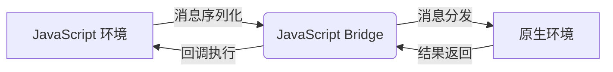

# 原生中的 JavaScript Bridge 核心原理

JavaScript Bridge（JS 桥）是混合开发中实现原生代码（如 Java/Kotlin/Swift/Objective-C）与 JavaScript 互相通信的核心机制。它允许两种不同执行环境的代码通过预定义接口进行数据交换和方法调用，是 React Native、Flutter WebView、小程序等跨平台框架的基础技术。

## 一、核心概念与架构

### 1. 执行环境隔离

- **JavaScript 环境**：运行在 JS 引擎（如 V8、Hermes、WebKit JSCore）中
- **原生环境**：运行在 Android JavaVM/iOS 原生线程中
- 两者无法直接互相调用，需通过中间层通信

### 2. 桥接层的角色

- **消息序列化/反序列化**：将方法调用转换为 JSON 格式消息
- **线程调度**：管理跨线程通信，确保 UI 线程不被阻塞
- **生命周期管理**：处理对象引用、内存释放和异常捕获



## 二、通信机制详解

### 1. JS 调用原生代码

主要实现方式有：

### （1）WebView 注入接口

- **原理**：在 WebView 加载时向 JS 环境注入原生对象
- **Android**：通过 `addJavascriptInterface()` 方法
- **iOS**：通过 WKWebView 的 `WKScriptMessageHandler`
- **示例**：

  ```java
  // Android Java 代码
  class WebAppInterface {
      @JavascriptInterface
      public String getDeviceInfo() {
          return "{\"model\":\"Pixel 6\",\"os\":\"Android 13\"}";
      }
  }
  
  webView.addJavascriptInterface(new WebAppInterface(), "NativeBridge");
  ```

  ```javascript
  // JS 调用
  const deviceInfo = JSON.parse(window.NativeBridge.getDeviceInfo());
  ```

### （2）URL Scheme 拦截

- **原理**：JS 通过修改 location.href 发送特殊 URL，原生拦截并解析
- **优点**：兼容性强，支持所有 WebView
- **缺点**：需处理 URL 长度限制和编码问题
- **示例**：

  ```javascript
  // JS 发送请求
  window.location.href = "native://api?method=getUser&id=123";
  ```

  ```java
  // Android 拦截处理
  webView.setWebViewClient(new WebViewClient() {
      @Override
      public boolean shouldOverrideUrlLoading(WebView view, String url) {
          if (url.startsWith("native://")) {
              // 解析参数并执行原生逻辑
              return true; // 拦截 URL
          }
          return super.shouldOverrideUrlLoading(view, url);
      }
  });
  ```

### （3）MessageChannel 机制

- **原理**：使用 HTML5 MessageChannel API 建立双向通信
- **优点**：异步通信，性能更高
- **示例**：

  ```javascript
  // JS 端
  const channel = new MessageChannel();
  window.postMessage('init', '*', [channel.port2]);
  
  channel.port1.onmessage = (event) => {
      console.log('收到原生消息:', event.data);
  };
  ```

### 2. 原生调用 JS 代码

主要实现方式有：

### （1）WebView 执行 JS 代码

- **Android**：`webView.evaluateJavascript()`（异步）或 `loadUrl("javascript:xxx")`（同步）
- **iOS**：`webView.evaluateJavaScript()`
- **示例**：

  ```java
  // Android 调用 JS 函数
  webView.evaluateJavascript(
      "javascript:updateUI('" + data + "')",
      null
  );
  ```

### （2）事件监听机制

- **原理**：JS 预先注册事件监听，原生触发事件
- **示例**：

  ```javascript
  // JS 注册监听
  document.addEventListener('nativeEvent', (event) => {
      console.log('收到原生事件:', event.detail);
  });
  ```

  ```swift
  // iOS Swift 触发事件
  webView.evaluateJavaScript("""
      const event = new CustomEvent('nativeEvent', {detail: {"key":"value"}});
      document.dispatchEvent(event);
  """)
  ```

## 三、性能优化技术

### 1. JSI（JavaScript Interface）

- **原理**：直接在 JS 引擎和原生代码间建立同步调用通道
- **优点**：
  - 消除 JSON 序列化开销
  - 支持同步方法调用（需谨慎使用以避免阻塞 UI）
- **适用场景**：高频调用场景（如动画、实时数据处理）

### 2. 批量消息处理

- **原理**：将多次调用合并为一次消息传递
- **实现方式**：
  - 在 JS 端缓存调用请求，定时批量发送
  - 在原生端批量处理并返回结果

### 3. 预加载与懒加载

- **预加载**：应用启动时初始化桥接层
- **懒加载**：首次使用时动态加载模块，减少启动时间

## 四、安全与稳定性考虑

### 1. 安全漏洞防范

- **注入攻击**：避免直接 eval 未经验证的 JS 代码
- **XSS 防护**：对传递的 JSON 数据进行严格校验
- **权限控制**：对敏感操作进行权限检查

### 2. 异常处理

- **跨语言异常捕获**：

  ```java
  // Android 示例
  try {
      // 执行 JS 代码
  } catch (Exception e) {
      Log.e("JSBridge", "执行 JS 失败: " + e.getMessage());
  }
  ```

### 3. 内存管理

- **避免循环引用**：JS 对象与原生对象间的引用需手动释放
- **弱引用机制**：对非必要对象使用弱引用

## 五、典型应用场景

1. **混合应用开发**：
   - React Native、Flutter WebView 等框架的核心通信机制
   - 原生渲染 + JS 逻辑的混合架构

2. **原生能力扩展**：
   - 调用相机、文件系统、推送通知等原生 API
   - 集成第三方 SDK（如支付、地图）

3. **性能优化**：
   - 将性能敏感代码（如加密、大数据处理）移至原生
   - 使用原生渲染引擎提升 UI 性能

## 六、主流框架实现对比

| 框架          | 桥接核心技术         | 通信方式       | 性能特点               |
|---------------|----------------------|----------------|------------------------|
| React Native  | JSI + TurboModules   | 异步消息队列   | 高性能，支持同步调用   |
| Flutter        | MethodChannel        | 异步消息       | 中等性能，全平台一致   |
| Cordova       | URL Scheme + 注入    | 异步为主       | 兼容性强，性能一般     |
| 微信小程序    | 双线程模型           | 异步消息       | 隔离性好，性能优化明显 |

## 七、调试与监控

1. **日志工具**：
   - Android：Logcat
   - iOS：Xcode Console
   - Chrome DevTools：调试 WebView 内的 JS 代码

2. **性能分析**：
   - Chrome DevTools Performance 面板
   - Systrace（Android）/Instruments（iOS）
   - 自定义性能监控埋点

JavaScript Bridge 是混合开发的核心基础设施，理解其原理和实现方式对构建高性能、安全可靠的跨平台应用至关重要。随着技术发展，桥接性能和开发体验正在不断优化，未来将支持更复杂的应用场景。
