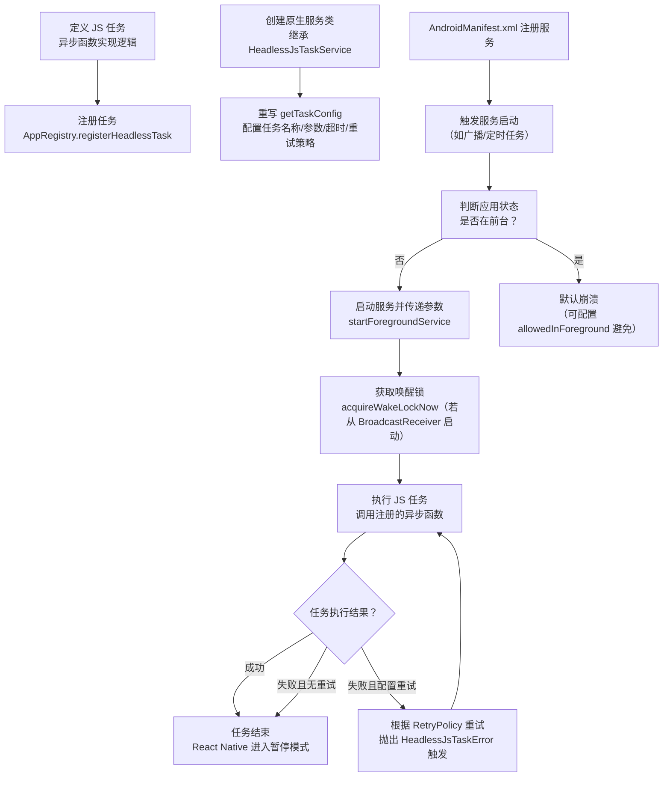

# Headless JS

原地址：<https://reactnative.dev/docs/next/headless-js-android>

## 概述

**Headless JS** 是 React Native 中用于在应用后台运行 JavaScript 任务的机制，支持在应用处于后台状态时执行同步数据、处理推送通知、播放音乐等操作。它通过连接 JavaScript 代码与 Android 原生服务（Service）实现后台任务调度，核心优势是无需用户交互即可在后台完成指定逻辑。

## 1. JS API：注册后台任务

Headless JS 任务通过 `AppRegistry` 注册，以 JavaScript 异步函数的形式定义，供原生服务调用。

### 1.1 任务注册

使用 `AppRegistry.registerHeadlessTask` 注册任务，指定任务名称与对应的任务模块：

```tsx
import { AppRegistry } from 'react-native';

// 注册任务：任务名称为"SomeTaskName"，对应任务模块为"SomeTaskName.js"
AppRegistry.registerHeadlessTask('SomeTaskName', () => require('SomeTaskName'));
```

### 1.2 任务实现

任务模块需导出一个异步函数，接收原生传递的参数（`taskData`），执行后台逻辑（注意：**不可操作 UI**）：

```tsx
// SomeTaskName.js
module.exports = async (taskData) => {
  // 执行后台任务（如网络请求、数据同步等）
  console.log('后台任务参数：', taskData);
  // 任务完成后自动结束（Promise  resolve 后 React Native 进入"暂停"模式）
};
```

## 2. 原生平台配置（Platform API）

Headless JS 任务需通过 Android 原生服务（Service）触发，需完成服务定义、注册与启动配置。

### 2.1 定义原生服务

创建继承 `HeadlessJsTaskService` 的服务类，重写 `getTaskConfig` 方法配置任务参数：

- **核心配置项**：任务名称、参数（从原生传递到 JS）、超时时间、是否允许前台运行。

#### Java 实现：

```java
package com.your_application_name;

import android.content.Intent;
import android.os.Bundle;
import com.facebook.react.HeadlessJsTaskService;
import com.facebook.react.bridge.Arguments;
import com.facebook.react.jstasks.HeadlessJsTaskConfig;
import javax.annotation.Nullable;

public class MyTaskService extends HeadlessJsTaskService {
  @Override
  protected @Nullable HeadlessJsTaskConfig getTaskConfig(Intent intent) {
    Bundle extras = intent.getExtras(); // 获取原生传递的参数
    if (extras != null) {
      return new HeadlessJsTaskConfig(
          "SomeTaskName", // 任务名称（需与 JS 注册的名称一致）
          Arguments.fromBundle(extras), // 参数转换为 JS 可识别的格式
          5000, // 任务超时时间（毫秒）
          false // 是否允许在前台运行（默认 false）
        );
    }
    return null;
  }
}
```

#### Kotlin 实现：

```kotlin
package com.your_application_name;

import android.content.Intent
import com.facebook.react.HeadlessJsTaskService
import com.facebook.react.bridge.Arguments
import com.facebook.react.jstasks.HeadlessJsTaskConfig

class MyTaskService : HeadlessJsTaskService() {
    override fun getTaskConfig(intent: Intent?): HeadlessJsTaskConfig? {
        return intent?.extras?.let {
            HeadlessJsTaskConfig(
                "SomeTaskName", // 任务名称
                Arguments.fromBundle(it), // 任务参数
                5000, // 超时时间
                false // 允许前台运行？默认 false
            )
        }
    }
}
```

### 2.2 注册服务

在 `AndroidManifest.xml` 的 `application` 标签内注册服务，确保系统可识别：

```xml
<service android:name="com.your_application_name.MyTaskService" />
```

### 2.3 启动服务

通过原生代码（如 Activity、BroadcastReceiver）启动服务，传递任务参数：

#### Java 启动服务：

```java
// 构建服务意图
Intent service = new Intent(getApplicationContext(), MyTaskService.class);
Bundle bundle = new Bundle();
bundle.putString("foo", "bar"); // 传递参数
service.putExtras(bundle);
// 启动前台服务（Android 8.0+ 要求后台服务使用 startForegroundService）
getApplicationContext().startForegroundService(service);
```

#### Kotlin 启动服务：

```kotlin
val service = Intent(applicationContext, MyTaskService::class.java)
val bundle = Bundle()
bundle.putString("foo", "bar") // 传递参数
service.putExtras(bundle)
applicationContext.startForegroundService(service)
```

## 3. 重试机制（Retries）

默认情况下，Headless JS 任务失败后不会重试。如需重试，需配置 `HeadlessJsRetryPolicy` 并在任务中抛出特定错误。

### 3.1 重试策略配置

使用 `LinearCountingRetryPolicy`（线性重试策略）或自定义策略，设置最大重试次数和重试间隔：

#### Java 配置重试：

```java
import com.facebook.react.jstasks.LinearCountingRetryPolicy;
import com.facebook.react.jstasks.HeadlessJsRetryPolicy;

// 定义重试策略：最多重试 3 次，每次间隔 1000ms
HeadlessJsRetryPolicy retryPolicy = new LinearCountingRetryPolicy(
  3, // 最大重试次数
  1000 // 重试间隔（毫秒）
);

// 在任务配置中传入重试策略
return new HeadlessJsTaskConfig(
  "SomeTaskName",
  Arguments.fromBundle(extras),
  5000, // 任务超时时间
  false, // 是否允许前台运行
  retryPolicy // 重试策略
);
```

#### Kotlin 配置重试：

```kotlin
import com.facebook.react.jstasks.LinearCountingRetryPolicy

val retryPolicy = LinearCountingRetryPolicy(
  3, // 最大重试次数
  1000 // 重试间隔（毫秒）
)

return HeadlessJsTaskConfig(
  "SomeTaskName",
  Arguments.fromBundle(extras),
  5000,
  false,
  retryPolicy
)
```

### 3.2 触发重试的条件

在 JavaScript 任务中，需抛出 `HeadlessJsTaskError` 才能触发重试机制：

```tsx
import { HeadlessJsTaskError } from 'HeadlessJsTask';

module.exports = async (taskData) => {
  const condition = /* 任务执行条件判断 */;
  if (!condition) {
    // 抛出特定错误，触发重试
    throw new HeadlessJsTaskError();
  }
};
```

## 4. 注意事项（Caveats）

- **前台运行限制**：默认情况下，若应用处于前台时启动 Headless JS 任务，应用会崩溃。可通过 `HeadlessJsTaskConfig` 的第四个参数（`allowedInForeground`）设置为 `true` 允许前台运行（需谨慎使用，避免影响 UI 性能）。
- **唤醒锁（Wake Lock）**：从 `BroadcastReceiver` 启动服务时，需在 `onReceive` 方法中调用 `HeadlessJsTaskService.acquireWakeLockNow(context)` 获取唤醒锁，防止设备在任务执行过程中休眠。
- **任务超时**：`HeadlessJsTaskConfig` 中的超时时间（如 `5000` 毫秒）用于限制任务最大执行时长，超时后任务会被强制终止。

## 5. 示例用法：网络状态监听

以下示例通过 Headless JS 实现网络状态变化时的后台任务：当网络连接状态改变且应用处于后台时，触发后台任务同步网络信息。

### 5.1 注册广播接收器

在 `AndroidManifest.xml` 中注册监听网络变化的广播接收器：

```xml
<receiver android:name=".NetworkChangeReceiver">
  <intent-filter>
    <action android:name="android.net.conn.CONNECTIVITY_CHANGE" />
  </intent-filter>
</receiver>
```

### 5.2 实现广播接收器

在接收器中判断应用是否处于前台，若处于后台则启动 Headless JS 服务并传递网络状态：

#### Java 实现：

```java
import android.app.ActivityManager;
import android.content.BroadcastReceiver;
import android.content.Context;
import android.content.Intent;
import android.net.ConnectivityManager;
import android.net.NetworkCapabilities;
import com.facebook.react.HeadlessJsTaskService;

public class NetworkChangeReceiver extends BroadcastReceiver {
  @Override
  public void onReceive(Context context, Intent intent) {
    // 仅当应用处于后台时执行任务
    if (!isAppOnForeground(context)) {
      boolean hasInternet = isNetworkAvailable(context); // 判断网络是否可用
      // 启动 Headless JS 服务
      Intent serviceIntent = new Intent(context, MyTaskService.class);
      serviceIntent.putExtra("hasInternet", hasInternet); // 传递网络状态
      context.startForegroundService(serviceIntent);
      // 获取唤醒锁，确保任务执行完成
      HeadlessJsTaskService.acquireWakeLockNow(context);
    }
  }

  // 判断应用是否处于前台
  private boolean isAppOnForeground(Context context) {
    ActivityManager activityManager = (ActivityManager) context.getSystemService(Context.ACTIVITY_SERVICE);
    for (ActivityManager.RunningAppProcessInfo appProcess : activityManager.getRunningAppProcesses()) {
      if (appProcess.processName.equals(context.getPackageName()) 
          && appProcess.importance == ActivityManager.RunningAppProcessInfo.IMPORTANCE_FOREGROUND) {
        return true;
      }
    }
    return false;
  }

  // 判断网络是否可用
  private boolean isNetworkAvailable(Context context) {
    ConnectivityManager cm = (ConnectivityManager) context.getSystemService(Context.CONNECTIVITY_SERVICE);
    if (android.os.Build.VERSION.SDK_INT >= android.os.Build.VERSION_CODES.M) {
      NetworkCapabilities capabilities = cm.getNetworkCapabilities(cm.getActiveNetwork());
      return capabilities != null && (
        capabilities.hasTransport(NetworkCapabilities.TRANSPORT_WIFI) ||
        capabilities.hasTransport(NetworkCapabilities.TRANSPORT_CELLULAR) ||
        capabilities.hasTransport(NetworkCapabilities.TRANSPORT_ETHERNET)
      );
    } else {
      // 兼容旧版本 API
      return cm.getActiveNetworkInfo() != null && cm.getActiveNetworkInfo().isConnected();
    }
  }
}
```

#### Kotlin 实现：

```kotlin
import android.app.ActivityManager
import android.content.BroadcastReceiver
import android.content.Context
import android.content.Intent
import android.net.ConnectivityManager
import android.net.NetworkCapabilities
import com.facebook.react.HeadlessJsTaskService

class NetworkChangeReceiver : BroadcastReceiver() {
  override fun onReceive(context: Context, intent: Intent?) {
    if (!isAppOnForeground(context)) {
      val hasInternet = isNetworkAvailable(context)
      val serviceIntent = Intent(context, MyTaskService::class.java)
      serviceIntent.putExtra("hasInternet", hasInternet)
      context.startForegroundService(serviceIntent)
      HeadlessJsTaskService.acquireWakeLockNow(context)
    }
  }

  private fun isAppOnForeground(context: Context): Boolean {
    val activityManager = context.getSystemService(Context.ACTIVITY_SERVICE) as ActivityManager
    val appProcesses = activityManager.runningAppProcesses ?: return false
    val packageName = context.packageName
    return appProcesses.any { 
      it.importance == ActivityManager.RunningAppProcessInfo.IMPORTANCE_FOREGROUND 
      && it.processName == packageName 
    }
  }

  private fun isNetworkAvailable(context: Context): Boolean {
    val cm = context.getSystemService(Context.CONNECTIVITY_SERVICE) as ConnectivityManager
    return if (android.os.Build.VERSION.SDK_INT >= android.os.Build.VERSION_CODES.M) {
      val capabilities = cm.getNetworkCapabilities(cm.activeNetwork) ?: return false
      capabilities.hasTransport(NetworkCapabilities.TRANSPORT_WIFI) ||
      capabilities.hasTransport(NetworkCapabilities.TRANSPORT_CELLULAR) ||
      capabilities.hasTransport(NetworkCapabilities.TRANSPORT_ETHERNET)
    } else {
      cm.activeNetworkInfo?.isConnected ?: false
    }
  }
}
```

## 6. Headless JS 任务执行流程（流程图）



## 总结

Headless JS 是 React Native 实现 Android 后台任务的核心机制，通过“JS 任务注册-原生服务配置-事件触发-后台执行”的流程，支持在应用后台完成数据同步、状态监听等操作。核心步骤包括注册 JS 任务、定义原生服务、配置重试策略，需注意唤醒锁获取、前台运行限制等细节。适用于需在后台持续运行或响应系统事件的场景，有效扩展了 React Native 应用的后台处理能力。
