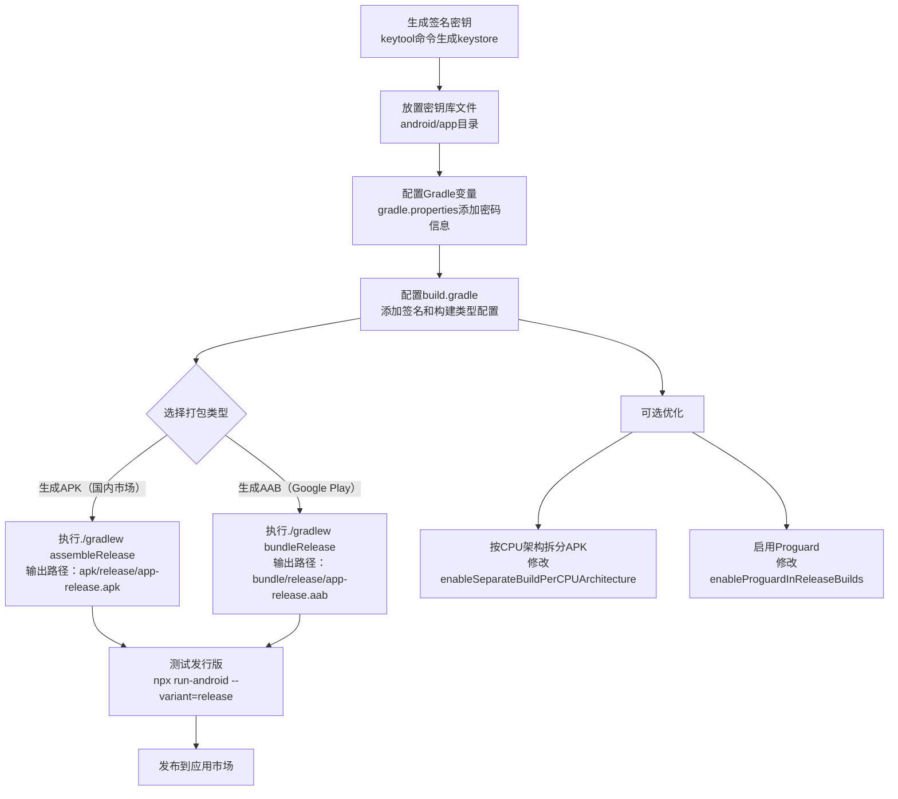

# 打包发布

原地址：<https://www.react-native.cn/docs/next/signed-apk-android>

## 概述

本文档是React Native中文网关于Android平台签名打包的指南，详细介绍了如何为React Native应用生成签名的APK（适用于国内应用市场）和AAB（适用于Google Play）包。Android系统要求所有应用必须经过数字签名才能安装，因此发布前需完成签名配置。本文涵盖从生成密钥、配置Gradle变量到打包发布的完整流程，并提供了优化APK大小的实用技巧。

## 核心步骤详解

### 1. 生成签名密钥

使用Java开发工具包（JDK）中的`keytool`命令生成私有密钥库（keystore），用于后续应用签名。

#### 操作命令：

```shell
keytool -genkeypair -v -storetype PKCS12 -keystore my-release-key.keystore -alias my-key-alias -keyalg RSA -keysize 2048 -validity 10000
```

- **参数说明**：
  - `-storetype PKCS12`：指定密钥库格式为PKCS12（现代标准格式）；
  - `-keystore my-release-key.keystore`：生成的密钥库文件名；
  - `-alias my-key-alias`：密钥别名（签名时需使用，建议记录）；
  - `-keyalg RSA`：加密算法为RSA；
  - `-keysize 2048`：密钥长度2048位；
  - `-validity 10000`：密钥有效期10000天（约27年）。
- **执行流程**：命令运行后需输入密钥库密码、密钥密码及发行信息（如组织、城市等），最终生成`my-release-key.keystore`文件。
- **注意事项**：密钥库文件需妥善保管，切勿上传至版本库或公开渠道。

### 2. 设置Gradle变量

将密钥库文件路径和密码配置为Gradle变量，方便在构建脚本中引用，避免明文硬编码。

#### 操作步骤：

1. **放置密钥库文件**：将生成的`my-release-key.keystore`复制到项目的`android/app`目录下。
2. **配置Gradle属性**：
   - 编辑全局配置文件`~/.gradle/gradle.properties`（对所有项目生效）或项目配置文件`android/gradle.properties`（仅当前项目生效）；
   - 添加如下内容（替换`****`为实际密码）：

     ```properties
     MYAPP_RELEASE_STORE_FILE=my-release-key.keystore  # 密钥库文件名
     MYAPP_RELEASE_KEY_ALIAS=my-key-alias              # 密钥别名
     MYAPP_RELEASE_STORE_PASSWORD=*****                # 密钥库密码
     MYAPP_RELEASE_KEY_PASSWORD=*****                  # 密钥密码
     ```

- **安全提示**：macOS用户可将密码存储在钥匙串（Keychain）中，省略后两行密码配置，增强安全性。

### 3. 配置Gradle签名信息

在项目的Gradle构建脚本中引用前面定义的变量，配置应用的签名信息。

#### 操作步骤：

编辑项目目录下的`android/app/build.gradle`文件，添加签名配置：

```gradle
android {
    ...
    defaultConfig { ... }  // 已有的默认配置
    // 添加签名配置
    signingConfigs {
        release {
            // 仅当Gradle变量存在时才应用签名配置
            if (project.hasProperty('MYAPP_RELEASE_STORE_FILE')) {
                storeFile file(MYAPP_RELEASE_STORE_FILE)  // 密钥库文件路径
                storePassword MYAPP_RELEASE_STORE_PASSWORD  // 密钥库密码
                keyAlias MYAPP_RELEASE_KEY_ALIAS  // 密钥别名
                keyPassword MYAPP_RELEASE_KEY_PASSWORD  // 密钥密码
            }
        }
    }
    // 配置发行版本的构建类型
    buildTypes {
        release {
            ...  // 已有的其他配置
            signingConfig signingConfigs.release  // 应用签名配置
        }
    }
}
```

- **作用**：通过此配置，Gradle在构建发行版本（release）时会自动使用指定的密钥签名应用。

### 4. 生成发行版APK

使用Gradle命令构建签名后的APK文件，用于发布到国内应用市场。

#### 操作命令：

```shell
cd android  # 进入android目录
./gradlew assembleRelease  # 构建发行版APK
```

- **命令说明**：
  - `assembleRelease`：Gradle任务，用于打包发行版本，会将所有JavaScript代码和静态资源内置到APK中；
  - Windows传统CMD环境需去掉`./`，直接执行`gradlew assembleRelease`。
- **输出路径**：生成的APK文件位于`android/app/build/outputs/apk/release/app-release.apk`。
- **注意事项**：
  - 确保`gradle.properties`中没有`org.gradle.configureondemand=true`，否则会跳过JS代码打包，导致APK无法运行；
  - 若需测试发行版，可通过`npx react-native run-android --variant=release`安装到设备，但需先卸载debug版本避免签名冲突。

### 5. 生成发行版AAB（适用于Google Play）

AAB（Android App Bundle）是Google Play推荐的发布格式，可动态生成适配用户设备的APK。

#### 操作命令：

```shell
cd android  # 进入android目录
./gradlew bundleRelease  # 构建发行版AAB
```

- **输出路径**：生成的AAB文件位于`android/app/build/outputs/bundle/release/app-release.aab`。
- **注意事项**：上传AAB到Google Play前需配置“由Google Play签名”（App Signing by Google Play），若更新现有应用需参考官方迁移指南。

## 优化APK大小的技巧

### 1. 按CPU架构生成单独APK

默认APK包含多种CPU架构的原生代码，可通过配置生成针对不同架构的APK，减小文件体积。

#### 操作步骤：

修改`android/app/build.gradle`：

```diff
- def enableSeparateBuildPerCPUArchitecture = false
+ def enableSeparateBuildPerCPUArchitecture = true  // 启用按架构拆分APK
```

- **效果**：生成多个APK（如`app-armeabi-v7a-release.apk`、`app-x86-release.apk`），分别对应不同CPU架构；
- **适用场景**：上传至支持架构定位的应用商店（如Google Play、Amazon AppStore），用户会自动获取适配的版本；
- **通用APK**：若需上传至不支持多APK的平台，可开启通用APK生成：

  ```diff
  - universalApk false
  + universalApk true  // 额外生成通用APK
  ```

### 2. 启用Proguard混淆压缩

Proguard可移除未使用的Java字节码，进一步减小APK体积（可选配置）。

#### 操作步骤：

修改`android/app/build.gradle`：

```gradle
/**
 * Run Proguard to shrink the Java bytecode in release builds.
 */
def enableProguardInReleaseBuilds = true  // 默认为false，改为true启用
```

- **注意事项**：
  - 启用后必须全面测试应用，Proguard可能混淆必要代码导致功能异常；
  - 需在`app/proguard-rules.pro`中为原生库添加额外配置（如保留特定类或方法）。

## 发行版本测试

在发布前需测试发行版本，确保功能正常：

```shell
npx react-native run-android --variant=release
```

- **说明**：`--variant=release`参数指定安装发行版本，需先完成签名配置；
- **冲突处理**：debug和release版本签名不同，安装前需卸载旧版本，否则会提示“签名不匹配”错误。

## 开发流程图



## 核心概念说明

- **签名作用**：Android通过数字签名验证应用身份，确保应用未被篡改，同一应用的更新需使用相同签名；
- **APK与AAB区别**：APK是完整安装包，可直接安装；AAB是Google Play推荐格式，由应用商店动态生成适配设备的APK，能减小用户下载体积；
- **密钥安全**：密钥库文件和密码是应用的核心资产，丢失会导致无法更新应用，泄露可能导致恶意篡改，需妥善保管。

## 常见问题提示

- **签名冲突**：debug和release版本切换安装时需先卸载旧版本；
- **APK为空**：检查`gradle.properties`中是否有`org.gradle.configureondemand=true`，如有需移除；
- **Proguard问题**：启用后功能异常需在`proguard-rules.pro`中添加保留规则，参考官方文档或库的说明；
- **密钥丢失**：无法更新现有应用，需重新发布新应用（包名需不同）。
