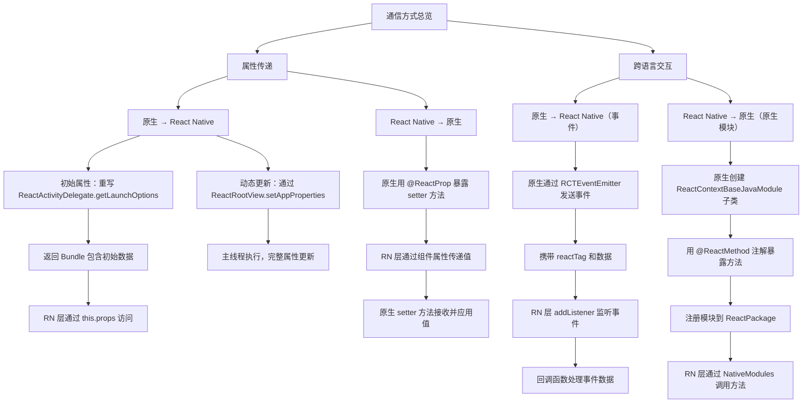

# 和原生端通信

原地址：<https://www.react-native.cn/docs/next/communication-android>

## 概述

本文档详细介绍了 React Native 与 Android 原生端之间的通信方式，包括属性传递、事件机制及原生模块调用等核心技术。在 React Native 与原生组件整合过程中，需通过跨语言通信机制实现数据传递与交互，本文总结了各类通信方式的实现方法、适用场景及注意事项。

## 核心知识点总结

### 1. 通信基础与信息流

React Native 沿用 React 的单向信息流理念：  

- **自上而下的数据传递**：通过属性（props）从父组件向子组件传递数据。  
- **自下而上的交互反馈**：通过回调函数处理子组件对父组件的通知。  
- **混合场景需求**：当整合 React Native 与原生组件时，需特殊机制实现跨语言（JS 与 Java/Kotlin）通信。  

### 2. 属性传递（Props）

属性是跨组件通信的基础方式，支持从原生到 React Native 及从 React Native 到原生的双向数据传递。

#### 2.1 从原生组件传递属性到 React Native

通过配置初始属性或动态更新属性，将原生数据传递到 React Native 层。

- **初始属性传递**：  
  重写 `ReactActivityDelegate` 的 `getLaunchOptions` 方法，返回包含初始属性的 `Bundle` 对象。  
  - Java 示例：

    ```java
    public class MainActivity extends ReactActivity {
      @Override
      protected ReactActivityDelegate createReactActivityDelegate() {
        return new ReactActivityDelegate(this, getMainComponentName()) {
          @Override
          protected Bundle getLaunchOptions() {
            Bundle initialProperties = new Bundle();
            ArrayList<String> imageList = new ArrayList<>(Arrays.asList(
              "http://foo.com/bar1.png", "http://foo.com/bar2.png"
            ));
            initialProperties.putStringArrayList("images", imageList);
            return initialProperties;
          }
        };
      }
    }
    ```

  - Kotlin 示例：

    ```kotlin
    class MainActivity : ReactActivity() {
      override fun createReactActivityDelegate(): ReactActivityDelegate {
        return object : ReactActivityDelegate(this, mainComponentName) {
          override fun getLaunchOptions(): Bundle {
            val imageList = arrayListOf("http://foo.com/bar1.png", "http://foo.com/bar2.png")
            return Bundle().apply { putStringArrayList("images", imageList) }
          }
        }
      }
    }
    ```

  - React Native 层接收：在顶层组件中通过 `this.props` 访问属性，例如渲染图片列表。

- **动态更新属性**：  
  通过 `ReactRootView` 的 `appProperties` 属性动态更新，需注意：  
  - 更新操作必须在主线程执行，getter 可在任意线程调用。  
  - 不支持部分更新，需更新完整属性集合。  
  - Java 示例：

    ```java
    Bundle updatedProps = mReactRootView.getAppProperties();
    ArrayList<String> imageList = new ArrayList<>(Arrays.asList(
      "http://foo.com/bar3.png", "http://foo.com/bar4.png"
    ));
    updatedProps.putStringArrayList("images", imageList);
    mReactRootView.setAppProperties(updatedProps);
    ```

#### 2.2 从 React Native 传递属性到原生组件

通过 `@ReactProp` 或 `@ReactPropGroup` 注解暴露原生组件的 setter 方法，使 React Native 可像操作普通组件一样设置属性。

- 实现方式：在原生自定义视图的管理类中，用 `@ReactProp` 注解定义属性 setter 方法，例如设置文本颜色：

  ```java
  @ReactProp(name = "textColor")
  public void setTextColor(MyCustomView view, Integer color) {
    view.setTextColor(color);
  }
  ```

- React Native 层使用：在 JS 中直接通过属性传递值，例如 `<MyCustomView textColor="#ff0000" />`。

#### 2.3 属性的限制

- **不支持回调函数**：无法实现自下而上的数据绑定（如 RN 视图通知原生父视图移除自己）。  
- **单向传递为主**：属性设计为自上而下传递，虽支持动态更新，但不适合频繁的双向实时交互。  

### 3. 跨语言交互方式

当属性无法满足需求时，可通过**事件**（原生调用 RN）和**原生模块**（RN 调用原生）实现更灵活的跨语言交互。

#### 3.1 从原生调用 React Native 函数（事件机制）

原生端通过发送事件触发 React Native 层的处理函数，适用于原生主动通知 RN 状态变化。

- **实现流程**：  
  1. 原生端：在自定义视图中通过 `ReactContext` 发送事件，需指定事件名称和数据：

     ```java
     WritableMap event = Arguments.createMap();
     event.putString("message", "Hello from native!");
     reactContext.getJSModule(RCTEventEmitter.class).receiveEvent(
       view.getId(),  // reactTag，用于标识组件实例
       "onCustomEvent",  // 事件名称
       event
     );
     ```

  2. React Native 层：通过 `addListener` 监听事件，在回调中处理数据：

     ```jsx
     componentDidMount() {
       this._subscription = this.refs.customView.addListener('onCustomEvent', (e) => {
         console.log(e.message); // 输出 "Hello from native!"
       });
     }
     ```

- **注意事项**：  
  - 事件在单独线程处理，无法保证执行时间。  
  - 存在命名空间冲突风险，冲突无法静态检测，调试困难。  
  - 多实例组件需通过 `reactTag` 区分，避免事件混淆。  

#### 3.2 从 React Native 调用原生函数（原生模块）

原生模块是导出函数供 RN 调用的 Java/Kotlin 类，适用于 RN 主动触发原生操作（如调用原生 API）。

- **实现流程**：  
  1. 原生端：创建继承 `ReactContextBaseJavaModule` 的类，通过 `@ReactMethod` 注解暴露方法：

     ```java
     public class MyNativeModule extends ReactContextBaseJavaModule {
       @Override
       public String getName() {
         return "MyNativeModule"; // 模块名称，JS 中通过此名称访问
       }

       @ReactMethod
       public void showToast(String message) {
         Toast.makeText(getReactApplicationContext(), message, Toast.LENGTH_SHORT).show();
       }
     }
     ```

  2. 注册模块：创建 `ReactPackage` 并添加模块，在 `MainApplication` 中注册：

     ```java
     public class MyAppPackage implements ReactPackage {
       @Override
       public List<NativeModule> createNativeModules(ReactApplicationContext reactContext) {
         List<NativeModule> modules = new ArrayList<>();
         modules.add(new MyNativeModule(reactContext));
         return modules;
       }
     }
     ```

  3. React Native 层：导入 `NativeModules` 并调用方法：

     ```jsx
     import { NativeModules } from 'react-native';
     NativeModules.MyNativeModule.showToast('Hello from RN!');
     ```

- **注意事项**：  
  - 所有原生模块共享命名空间，需确保模块名称唯一。  
  - 方法参数支持基本类型、数组、对象等，复杂类型需通过 `ReadableMap`/`WritableMap` 转换。  
  - 异步方法需通过回调或 Promise 处理返回结果（如 `@ReactMethod(isBlockingSynchronousMethod = true)` 不推荐用于主线程操作）。  

## 流程图（mermaid）



## 关键注意事项

- **属性更新线程**：原生端动态更新属性（`setAppProperties`）必须在主线程执行，否则可能导致异常。  
- **事件命名冲突**：事件共享命名空间，需规范命名（如添加模块前缀），避免冲突。  
- **原生模块命名空间**：所有原生模块共享同一命名空间，模块名称需唯一，否则会覆盖。  
- **多实例区分**：事件和原生模块操作多实例组件时，需通过 `reactTag` 或自定义标识符区分实例。  
- **回调限制**：属性不支持回调函数，自下而上通信优先使用事件或原生模块的回调参数。
