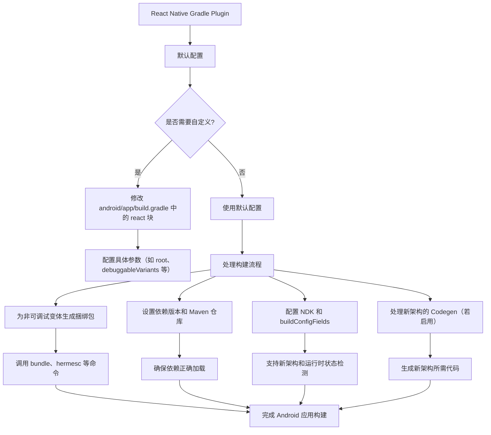

# React Native Gradle Plugin

原地址：<https://www.react-native.cn/docs/next/react-native-gradle-plugin>

## 一、概述

React Native Gradle Plugin（简称 RNGP）是用于为 Android 构建 React Native 应用的插件，作为独立 NPM 包分发，会随 `react-native` 自动安装。对于使用 `npx react-native init` 创建的新项目，插件已默认配置好，无需额外安装步骤；若将 React Native 集成到现有项目，则需参考专门的安装说明。

## 二、插件配置

插件默认使用合理的默认值，可通过修改 `android/app/build.gradle` 中的 `react` 块自定义行为，基础配置格式如下：

```groovy
apply plugin: "com.facebook.react"

react {
  // 自定义配置项
}
```

各配置项详细说明如下：

| 配置项               | 作用描述                                                                 | 默认值                                      | 自定义示例                                                                 |
|----------------------|--------------------------------------------------------------------------|---------------------------------------------|----------------------------------------------------------------------------|
| `root`               | 指定 React Native 项目根目录（含 `package.json`）                        | `..`（上一级目录）                           | `root = file("../")`                                                       |
| `reactNativeDir`     | 指定 `react-native` 包所在文件夹                                         | `../node_modules/react-native`               | `reactNativeDir = file("../node_modules/react-native")`                   |
| `codegenDir`         | 指定 `react-native-codegen` 包所在文件夹                                  | `../node_modules/react-native-codegen`       | `codegenDir = file("../node_modules/@react-native/codegen")`               |
| `cliFile`            | 指定 React Native CLI 入口文件（用于生成捆绑包）                          | `../node_modules/react-native/cli.js`        | `cliFile = file("../node_modules/react-native/cli.js")`                    |
| `debuggableVariants` | 定义可调试的构建变体列表（需运行 Metro 服务）                            | `["debug"]`                                 | `debuggableVariants = ["liteDebug", "prodDebug"]`                          |
| `nodeExecutableAndArgs` | 指定用于脚本的 node 命令及参数                                          | `[node]`                                     | `nodeExecutableAndArgs = ["node"]`                                         |
| `bundleCommand`      | 指定创建应用捆绑包的命令（如使用 RAM Bundles）                            | `bundle`                                     | `bundleCommand = "ram-bundle"`                                             |
| `bundleConfig`       | 指定传递给 `bundle --config` 的配置文件路径                               | 空（不使用配置文件）                         | `bundleConfig = file(../rn-cli.config.js)`                                 |
| `bundleAssetName`    | 指定生成的捆绑包文件名                                                   | `index.android.bundle`                       | `bundleAssetName = "MyApplication.android.bundle"`                        |
| `entryFile`          | 指定用于生成捆绑包的入口文件                                             | 搜索 `index.android.js` 或 `index.js`        | `entryFile = file("../js/MyApplication.android.js")`                      |
| `extraPackagerArgs`  | 指定传递给 `bundle` 命令的额外标志列表                                    | 空列表                                       | `extraPackagerArgs = []`                                                   |
| `hermesCommand`      | 指定 `hermesc`（Hermes 编译器）的路径（通常无需自定义）                   | React Native 附带的版本                      | -                                                                          |
| `hermesFlags`        | 指定传递给 `hermesc` 的标志列表                                          | `["-O", "-output-source-map"]`               | `hermesFlags = ["-O", "-output-source-map"]`                               |

## 三、使用 Flavors 与 Build Variants

### （一）基本概念

- **Build Types**：默认包含 `debug`（调试版）和 `release`（发布版），可自定义（如 `staging`）。
- **Flavors**：用于生成不同版本应用（如 `full` 完整版、`lite` 轻量版）。
- **Build Variants**：Build Types 与 Flavors 的组合，例如 `fullDebug`、`fullStaging` 等。

### （二）配置可调试变体

若使用自定义变体（如 `staging`），需通过 `debuggableVariants` 配置指定可调试变体，示例如下：

```groovy
apply plugin: "com.facebook.react"

react {
  debuggableVariants = ["fullStaging", "fullDebug"]  // 声明可调试的变体
}
```

- 原因：插件会跳过 `debuggableVariants` 中变体的 JS 捆绑包生成，需运行 Metro 服务才能运行这些变体。
- 注意：可调试变体无法直接发布到应用商店，因其缺少捆绑包。

## 四、插件的幕后工作

RNGP 负责配置应用构建流程，核心职责包括：

1. 为非可调试变体添加 `createBundle<Variant>JsAndAssets` 任务，调用 `bundle`、`hermesc` 和 `compose-source-map` 命令生成捆绑包。
2. 根据 `react-native` 的 `package.json` 中的版本，设置 `com.facebook.react:react-android` 和 `com.facebook.react:hermes-android` 的适当版本。
3. 配置必要的 Maven 仓库（如 Maven Central、Google Maven Repo 等），以获取依赖项。
4. 设置 NDK，支持新架构应用的构建。
5. 配置 `buildConfigFields`，使应用在运行时可获取 Hermes 或新架构的启用状态。
6. 将 Metro DevServer 端口设为 Android 资源，确保应用能连接到正确端口。
7. 若使用新架构的 Codegen，调用 React Native Codegen 工具。

## 五、流程图（mermaid）



## 六、注意事项

1. 新项目无需手动安装插件，`npx react-native init` 已自动配置。
2. 自定义构建变体后，必须通过 `debuggableVariants` 声明可调试变体，否则可能导致构建错误。
3. `hermesCommand` 通常无需修改，插件会使用 React Native 附带的 Hermes 编译器版本。
4. 对于 Monorepo 或非标准项目结构，需调整 `root`、`reactNativeDir` 等路径配置，确保插件能正确找到所需文件。
