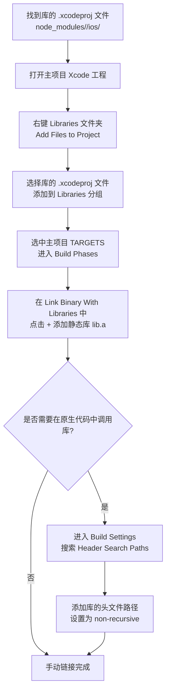

# Linking Libraries

原地址：<https://reactnative.dev/docs/next/linking-libraries-ios>

## 概述

React Native 中，**库链接（Linking Libraries）** 是将包含原生代码的库集成到 iOS 应用中的过程。由于并非所有应用都需要使用全部原生功能，React Native 将这些功能封装为独立的静态库，开发者可根据需求按需集成，避免增加应用二进制文件大小。本文详细介绍了 iOS 平台下原生库的自动链接和手动链接方法，确保包含原生代码的库能正常工作。

## 1. 原生库的基本概念

React Native 的原生库分为两类：

- **纯 JavaScript 库**：无需链接，直接通过 `require` 或 `import` 引入即可使用。
- **含原生代码的库**：包含 Objective-C/Swift 原生代码，需通过链接过程将其集成到 iOS 项目中，否则使用时会抛出错误。这些库通常在 `node_modules` 目录下，且包含 `.xcodeproj` 文件（iOS 项目文件）。

## 2. 自动链接（Automatic Linking）

对于大多数现代 React Native 库，推荐使用自动链接机制，简化集成流程。

### 2.1 自动链接步骤

1. **安装库**  
   使用 npm 或 yarn 安装包含原生依赖的库，并通过 `--save` 或 `--save-dev` 标记将其添加到 `package.json` 的依赖中（**必须添加依赖标记，自动链接依赖于此识别库**）：  

   ```shell
   npm install <library-with-native-dependencies> --save
   # 或使用 yarn
   yarn add <library-with-native-dependencies>
   ```

2. **自动集成**  
   安装完成后，下次构建应用时，React Native 的自动链接机制会自动处理原生代码的集成，无需手动配置 Xcode 项目。

## 3. 手动链接（Manual Linking）

当自动链接失败或库不支持自动链接时，需手动完成链接步骤。

### 3.1 步骤 1：添加库的 Xcode 项目到工程

1. 找到库目录下的 `.xcodeproj` 文件（通常位于 `node_modules/<library-name>/ios/` 目录）。  
2. 打开你的 iOS 项目（`.xcodeproj` 或 `.xcworkspace`），在 Xcode 左侧导航栏中右键点击 `Libraries` 文件夹，选择 **Add Files to "<ProjectName>"**。  
3. 选择库的 `.xcodeproj` 文件，添加到项目的 `Libraries` 分组下。  

   （示意图参考原文描述）

### 3.2 步骤 2：链接静态库到目标工程

1. 在 Xcode 中，选中你的主项目目标（位于左侧导航栏的 `TARGETS` 下），切换到 **Build Phases** 标签。  
2. 在 **Link Binary With Libraries** 部分，点击 `+` 按钮。  
3. 从库的 `Products` 文件夹中选择静态库文件（通常命名为 `lib<LibraryName>.a`，如 `libRCTPushNotification.a`），添加到列表中。  

   （示意图参考原文描述）

### 3.3 步骤 3：配置头文件搜索路径（可选）

仅当需要在原生代码中调用该库时，才需配置此步骤（纯 JavaScript 调用无需配置）：  

1. 在 Xcode 中，选中主项目目标，切换到 **Build Settings** 标签。  
2. 搜索 **Header Search Paths**，点击添加按钮（`+`）。  
3. 输入库的头文件所在路径（如 `$(SRCROOT)/../node_modules/<library-name>/ios`），并设置为 **non-recursive**（不推荐使用 `recursive`，可能导致构建失败）。  

   （示意图参考原文描述）

## 4. 手动链接流程图



## 5. 注意事项

- **避免递归搜索**：配置 `Header Search Paths` 时使用 `non-recursive`，防止因递归搜索导致的构建冲突或性能问题。  
- **依赖管理**：自动链接依赖 `package.json` 中的 `dependencies` 或 `devDependencies`，确保安装库时使用 `--save` 或 `--save-dev`。  
- **库兼容性**：部分旧库可能不支持自动链接，需手动按步骤集成；优先选择支持自动链接的库以减少配置工作量。  

## 总结

React Native iOS 库链接的核心是将含原生代码的库集成到项目中，确保原生代码能被编译和调用。自动链接通过 npm 安装即可完成，适用于大多数现代库；手动链接需分三步完成（添加项目、链接静态库、配置头文件路径），适用于自动链接失败的场景。合理选择链接方式可高效集成原生功能，避免构建错误。
