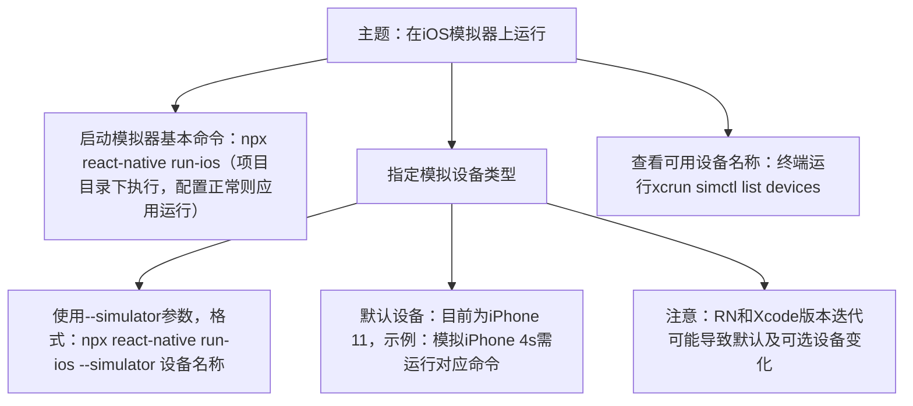

# 在iOS模拟器上运行

原地址：<https://www.react-native.cn/docs/next/running-on-simulator-ios>

## 文档概述

该文档主要介绍了在 iOS 模拟器上运行 React Native 项目的相关操作，包括启动模拟器的基本命令、指定模拟设备类型的方法以及查看可用设备名称的途径，为开发者在 iOS 环境下调试和运行项目提供了指导。

## 主要知识点总结

### 1. 启动模拟器的基本命令

在完成 React Native 新项目的初始化后，开发者可以在项目目录下通过运行命令 `npx react-native run-ios` 来启动 iOS 模拟器。如果项目的各项配置均无问题，应用将很快在 iOS 模拟器上运行起来，方便开发者进行后续的调试和开发工作。

### 2. 指定模拟的设备类型

- **基本方法**：可以使用 `--simulator` 参数来指定要模拟的设备类型，在该参数后加上目标设备的名称即可。目前默认的模拟设备为“iPhone 11”。
- **示例**：若要模拟 iPhone 4s，运行的命令为 `npx react-native run-ios --simulator "iPhone 4s"`。
- **注意事项**：随着 React Native（RN）和 Xcode 版本的不断迭代更新，默认的模拟设备以及可选的模拟设备列表可能会发生变化，开发者需要根据实际使用的版本情况进行调整。

### 3. 查看可用设备名称的方法

为了获取具体可用的设备名称，以便准确指定模拟设备，开发者可以在终端中运行命令 `xcrun simctl list devices`。通过该命令，终端会列出当前环境下可用的 iOS 模拟器设备名称，帮助开发者选择合适的设备进行项目运行和调试。

## 流程图（mermaid）

