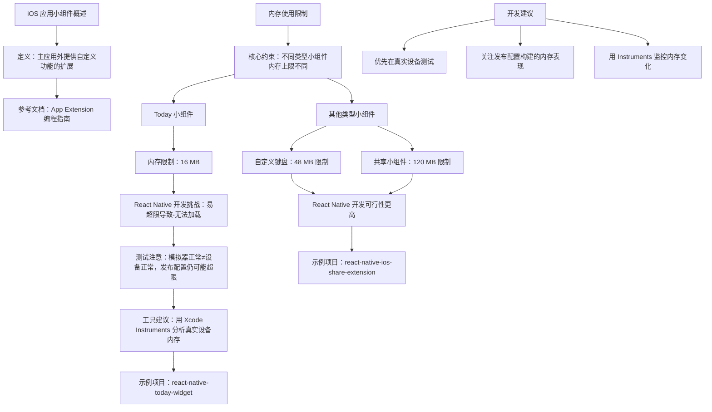

# iOS 应用小组件

原地址：<https://www.react-native.cn/docs/next/app-extensions>

## 概述

本文档主要介绍了 iOS 应用中小组件（App Extensions）的开发注意事项，重点强调了内存使用限制对不同类型小组件的影响，以及 React Native 在开发小组件时的可行性和实践建议。iOS 应用小组件允许在主应用外提供自定义功能和内容，不同类型的小组件有不同的内存限制，这对开发和测试提出了特定要求。

## 核心知识点总结

### 1. 小组件的基本概念

- **定义**：小组件（App Extensions）是 iOS 应用的扩展功能，可在主应用程序之外提供自定义功能和内容，如 Today 视图、自定义键盘、共享功能等。
- **参考文档**：所有类型的 iOS 应用小组件均在 Apple 官方的《App Extension 编程指南》中有详细介绍。

### 2. 小组件的内存使用限制

内存限制是开发 iOS 小组件的核心约束，不同类型的小组件有不同的内存上限，直接影响其稳定性和可行性。

#### 2.1 Today 小组件

- **内存限制**：严格限制为 **16 MB**。
- **React Native 开发挑战**：  
  使用 React Native 实现 Today 小组件可能不可靠，因为 React Native 本身的内存占用较高，容易超出限制。  
  - 超出限制的表现：小组件显示“Unable to Load（无法加载）”。  
  - 测试注意事项：  
    - 模拟器中可能运行正常，但实际设备上易失败（调试配置构建比发布配置构建更易超限制）。  
    - 即使发布配置构建初期正常，执行常见操作（如 API 数据获取）也可能快速超限。  
  - 分析工具建议：使用 Xcode 的 Instruments 分析真实设备上的内存使用情况，确保内存占用远离 16 MB 阈值。  
  - 示例项目：可参考 `react-native-today-widget` 项目了解 React Native 实现 Today 小组件的实践。

#### 2.2 其他类型小组件

相比 Today 小组件，其他类型的小组件内存限制更高，使用 React Native 开发更可行。

- **自定义键盘小组件**：内存限制为 **48 MB**。  
- **共享小组件**：内存限制为 **120 MB**。  
- **示例项目**：可参考 `react-native-ios-share-extension` 项目，了解 React Native 实现共享小组件的概念验证。

### 3. 开发与测试建议

- **优先在真实设备测试**：模拟器内存环境与实际设备差异较大，无法准确反映内存限制问题。  
- **关注发布配置构建**：调试配置构建的内存占用通常高于发布配置，需以发布配置下的内存表现为准。  
- **主动监控内存使用**：通过 Xcode Instruments 跟踪内存变化，尤其是在执行数据加载、UI 渲染等操作时，避免突发内存增长。  

## 流程图（mermaid）

## 关键注意事项

- **内存限制的绝对性**：所有小组件必须严格遵守对应内存限制，超限直接导致功能失效，无容错机制。  
- **React Native 的适用性差异**：Today 小组件因内存限制严格，不推荐用 React Native 开发；其他高内存限制的小组件（如共享、键盘）可尝试，但仍需监控内存。  
- **测试环境一致性**：必须在真实设备上测试，且以发布配置构建的内存表现为最终标准，避免依赖模拟器结果。  
- **操作场景覆盖**：测试需包含常见功能（如数据获取、UI 更新），确保极端场景下内存不超限。
