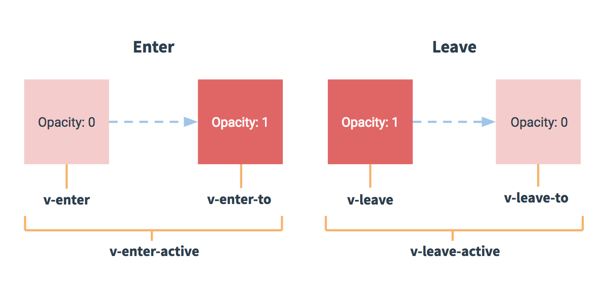

# 单元素/组件的过渡动画

Vue 提供了 `transition` 的封装组件，可以给任何元素和组件添加进入/离开过渡

* 条件渲染 (使用 v-if / v-else)
* 条件展示 (使用 v-show)
* 动态组件
* 组件根节点

例子：一个元素通过 `transition`组件，实现渐入渐出动效

```html
<style>
/* 这里是设定进入和离开动画 样式*/
.fade-enter-active, .fade-leave-active {
    /* 透明度动画类型，持续时间 5s */
  transition: opacity .5s;
}
.fade-enter, .fade-leave-to /* .fade-leave-active below version 2.1.8 */ {
  opacity: 0;
}
</style>

<div id="demo">
  <button v-on:click="show = !show">
    Toggle
  </button>
  <transition name="fade">
    <p v-if="show">hello</p>
  </transition>
</div>
<script>

new Vue({
  el: '#demo',
  data: {
    show: true
  }
})
<script>
```

## 过渡的类名

上面例子中，有用到几个class选择器样式，摘录官文说明：

* `v-enter`：定义进入过渡的开始状态。在元素被插入之前生效，在元素被插入之后的下一帧移除。
* `v-enter-active`：定义进入过渡生效时的状态。在整个进入过渡的阶段中应用，在元素被插入之前生效，在过渡/动画完成之后移除。这个类可以被用来定义进入过渡的过程时间，延迟和曲线函数。
* `v-enter-to`：2.1.8 版及以上定义进入过渡的结束状态。在元素被插入之后下一帧生效 (与此同时 v-enter 被移除)，在过渡/动画完成之后移除。
* `v-leave`：定义离开过渡的开始状态。在离开过渡被触发时立刻生效，下一帧被移除。
* `v-leave-active`：定义离开过渡生效时的状态。在整个离开过渡的阶段中应用，在离开过渡被触发时立刻生效，在过渡/动画完成之后移除。这个类可以被用来定义离开过渡的过程时间，延迟和曲线函数。
* `v-leave-to`：2.1.8 版及以上定义离开过渡的结束状态。在离开过渡被触发之后下一帧生效 (与此同时 v-leave 被删除)，在过渡/动画完成之后移除。



对于这些在过渡中切换的类名来说，如果你使用一个没有名字的 `<transition>`，则 `v-` 是这些类名的*默认前缀*。如果你使用了 `<transition name="my-transition">`，那么 `v-enter` 会替换为 `my-transition-enter`。

## 自定义过渡类名

我们可以通过以下 attribute 来自定义过渡类名，优先级高于普通的类名：

* `enter-class`
* `enter-active-class`
* `enter-to-class` (2.1.8+)
* `leave-class`
* `leave-active-class`
* `leave-to-class` (2.1.8+)

例子：

```html
<link href="https://cdn.jsdelivr.net/npm/animate.css@3.5.1" rel="stylesheet" type="text/css">

<div id="example-3">
  <button @click="show = !show">
    Toggle render
  </button>
  <!-- 这里就是自定义相关样式的类名 -->
  <transition
    name="custom-classes-transition"
    enter-active-class="animated tada"
    leave-active-class="animated bounceOutRight"
  >
    <p v-if="show">hello</p>
  </transition>
</div>

<script>
new Vue({
  el: '#example-3',
  data: {
    show: true
  }
})
</script>
```

---

## 两种css动画样式

分别是：`transition`（过渡） 和 `animation`（动画）

二者区别：`animation`中 `v-enter` 类名在节点插入 DOM 后不会立即删除，而是在 animationend 事件触发时删除，其他一样（个人认为没啥用）

例子：

```css
/* transition */
.slide-fade-enter-active {
  transition: all .3s ease;
}

/* animation */
.bounce-enter-active {
  animation: bounce-in .5s;
}
```

Vue 为了知道过渡的完成，必须设置相应的事件监听器。它可以是 `transitionend` 或 `animationend`，这取决于给元素应用的 CSS 规则。如果你使用其中任何一种，Vue 能自动识别类型并设置监听。但是，在一些场景中，你需要给同一个元素同时设置两种过渡动效，比如 animation 很快的被触发并完成了，而 transition 效果还没结束。在这种情况中，你就需要使用 `type` attribute 并设置 `animation` 或 `transition` 来明确声明你需要 Vue 监听的类型。

### 动画时间

`<transition>` 组件上的 duration prop 定制一个显性的过渡持续时间 (以毫秒计)：

```html
<!-- 定制过渡时间 -->
<transition :duration="1000">...</transition>
<!-- 定制进入和移出的持续时间 -->
<transition :duration="{ enter: 500, leave: 800 }">...</transition>
```
