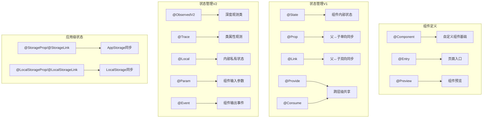

# ArkUI 基础语法-常见装饰器

## 一、组件与页面装饰器

用于定义组件类型、页面入口及预览方式，是构建UI的基础。

| 装饰器       | 作用说明                                                                 | 适用场景                     | 简单示例                                                                 |
|--------------|--------------------------------------------------------------------------|------------------------------|--------------------------------------------------------------------------|
| @Component   | 标记结构体为自定义组件，使其具备组件化能力，必须实现build()方法           | 所有自定义组件的定义         | ```@Component<br>struct MyComponent {<br>  build() { Text('自定义组件') }<br>}``` |
| @Entry       | 标记组件为应用入口页面，一个页面只能有一个@Entry装饰的组件                | 应用首页或独立页面           | ```@Entry<br>@Component<br>struct IndexPage {<br>  build() { Column() {} }<br>}``` |
| @Preview     | 标记组件可在开发工具中预览，支持指定设备、尺寸等参数                      | 组件开发时单独预览效果       | ```@Preview({ device: 'phone' })<br>@Component<br>struct PreviewComponent { ... }``` |
| @Reusable    | 标记组件为可复用组件（API 10+），在卡片等场景中优化性能                  | 鸿蒙卡片开发                 | ```@Reusable<br>@Component<br>struct CardItem { ... }```                  |

## 二、状态管理装饰器（V1）

用于管理组件内部状态及组件间数据同步，实现数据驱动UI。

### 1. 组件内部状态

| 装饰器 | 作用说明                                                                 | 特性                 | 简单示例                                                                 |
|--------|--------------------------------------------------------------------------|----------------------|--------------------------------------------------------------------------|
| @State | 标记组件内部状态变量，变量变化时触发自身及关联组件刷新                   | 私有状态，可内部修改 | ```@State count: number = 0;<br>Button('+').onClick(() => this.count++)``` |

### 2. 父子组件通信

| 装饰器 | 作用说明                                                                 | 数据流向               | 适用场景                                   |
|--------|--------------------------------------------------------------------------|------------------------|--------------------------------------------|
| @Prop  | 子组件接收父组件的状态，建立单向同步                                     | 父→子（子改不影响父）  | 子组件仅展示父组件数据，无需反向修改       |
| @Link  | 子组件与父组件建立双向同步，本质是父组件状态的引用                       | 父↔子（双向影响）      | 子组件需修改父组件数据（如表单输入）       |

**示例对比**：

```ts
// 父组件
@State parentCount: number = 0;
build() {
  // @Prop：单向传递
  ChildProp({ childCount: this.parentCount })
  // @Link：双向传递（注意$符号）
  ChildLink({ childCount: $parentCount })
}

// 子组件（@Prop）
@Prop childCount: number;

// 子组件（@Link）
@Link childCount: number;
```

### 3. 跨层级组件通信

| 装饰器   | 作用说明                                                                 | 用法特点                 | 简单示例                                                                 |
|----------|--------------------------------------------------------------------------|--------------------------|--------------------------------------------------------------------------|
| @Provide | 祖先组件提供可共享的状态，无需通过中间组件传递                           | 与@Consume配对使用       | ```@Provide themeColor: Color = Color.Blue;```                           |
| @Consume | 深层子组件消费@Provide提供的状态，建立双向同步                           | 直接使用共享状态         | ```@Consume themeColor: Color;<br>Text('文本').color(this.themeColor)``` |

### 4. 嵌套对象观测

| 装饰器     | 作用说明                                                                 | 用法特点                 | 简单示例                                                                 |
|------------|--------------------------------------------------------------------------|--------------------------|--------------------------------------------------------------------------|
| @Observed  | 标记类为可观测类，使其实例的属性变化可被追踪                             | 配合@ObjectLink使用      | ```@Observed<br>class User { name: string; age: number; }```             |
| @ObjectLink | 接收@Observed类的实例，建立双向同步                                       | 仅能接收@Observed类实例  | ```@ObjectLink user: User;<br>Text(`${this.user.name}`)```               |

## 三、状态管理装饰器（V2）

API 12+ 引入的增强版，解决深度观测和精准更新问题，与V1不兼容。

| 装饰器       | 作用说明                                                                 | 特性特点                     | 简单示例                                                                 |
|--------------|--------------------------------------------------------------------------|------------------------------|--------------------------------------------------------------------------|
| @ObservedV2  | 标记类为可深度观测类（替代V1的@Observed）                                | 需配合@Trace使用             | ```@ObservedV2<br>class User { ... }```                                  |
| @Trace       | 标记@ObservedV2类中需观测的属性                                          | 支持嵌套属性、数组等         | ```@ObservedV2<br>class User {<br>  @Trace name: string = '张三';<br>}``` |
| @Local       | 组件内部私有状态，无法从外部初始化（替代V1的@State）                      | 纯内部状态                   | ```@Local count: number = 0;```                                          |
| @Param       | 组件输入参数，支持外部初始化（替代V1的@Prop）                             | 复杂类型为引用传递           | ```@Param title: string = '默认标题';```                                 |
| @Event       | 组件输出事件，用于通知父组件状态变化（实现双向同步）                      | 需手动触发                   | ```@Event onChange: (value) => void;<br>// 触发：this.onChange('新值')``` |
| @Monitor     | 深度监听@Trace标记的属性变化                                              | 仅在最终状态稳定后触发回调   | ```@Monitor((val) => { ... })<br>@Param data: User;```                    |

## 四、应用级状态管理装饰器

用于跨页面、跨UIAbility的全局状态共享。

| 装饰器               | 作用说明                                                                 | 数据存储位置               | 简单示例                                                                 |
|----------------------|--------------------------------------------------------------------------|----------------------------|--------------------------------------------------------------------------|
| @StorageProp         | 与AppStorage建立单向同步（应用级存储）                                    | 应用全局存储AppStorage     | ```@StorageProp('userName') userName: string = '游客';```                 |
| @StorageLink         | 与AppStorage建立双向同步                                                  | 应用全局存储AppStorage     | ```@StorageLink('themeMode') mode: string = 'light';```                   |
| @LocalStorageProp    | 与LocalStorage建立单向同步（页面级存储）                                  | 页面私有存储LocalStorage   | ```@LocalStorageProp('count') count: number = 0;```                       |
| @LocalStorageLink    | 与LocalStorage建立双向同步                                                | 页面私有存储LocalStorage   | ```@LocalStorageLink('count') count: number = 0;```                       |

## 五、其他常用装饰器

| 装饰器       | 作用说明                                                                 | 简单示例                                                                 |
|--------------|--------------------------------------------------------------------------|--------------------------------------------------------------------------|
| @Builder     | 定义可复用的UI片段，简化重复UI结构                                       | ```@Builder<br>LabelText(text) {<br>  Text(text).fontSize(14)<br>}<br>// 使用：this.LabelText('姓名')``` |
| @BuilderParam | 接收@Builder定义的UI片段作为参数，实现组件内容自定义                       | ```@BuilderParam content: () => void;<br>// 父组件传递：Child({ content: () => Text('内容') })``` |
| @Watch       | 监听状态变量的变化，触发回调函数（V1）                                    | ```@Watch('onCountChange')<br>onCountChange(newVal, oldVal) { ... }```    |
| @Extend      | 扩展原生组件的样式，封装常用样式组合                                     | ```@Extend(Button)<br>function PrimaryButton() {<br>  .backgroundColor('#007DFF')<br>}<br>// 使用：Button('确定').PrimaryButton()``` |

## 六、使用注意事项

1. **版本兼容性**：V2装饰器（如@ObservedV2）仅支持API 12+，低版本需用V1。
2. **混用限制**：V1与V2装饰器不可混用（如同一组件不能同时用@State和@Local）。
3. **初始化要求**：状态变量必须初始化（如@State count: number = 0），否则编译报错。
4. **性能考量**：
   - 避免过度使用双向同步装饰器（@Link、@StorageLink），可能损耗性能。
   - 长列表中配合LazyForEach使用，减少不必要的渲染。
5. **装饰范围**：
   - @Component、@Entry等仅能装饰struct。
   - @State、@Prop等仅能装饰组件内部的成员变量。

## 七、装饰器功能关系图


