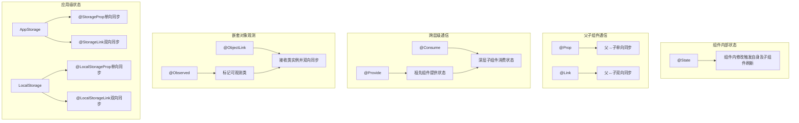

# ArkUI V1状态管理详细说明

在ArkUI框架中，V1状态管理机制通过一系列装饰器实现组件内部状态管理及组件间数据交互，核心思想是**数据驱动UI**，即状态变量的变化会自动触发相关UI组件的重新渲染。以下是V1状态管理的详细说明：

## 一、核心概念

1. **状态变量**：被状态装饰器修饰的变量（如`@State`、`@Prop`等），其值的变化会触发UI更新。
2. **常规变量**：未被装饰的变量，仅用于辅助计算，变化不会影响UI。
3. **数据源/同步源**：状态变量的原始来源，可同步给其他状态数据（通常是父组件传递给子组件的数据）。
4. **单向绑定**：数据只能从一个方向传递（如父组件→子组件）。
5. **双向绑定**：数据可在两个方向传递（如父组件↔子组件）。

## 二、组件级状态管理装饰器

用于同一页面内的组件间状态同步，按功能可分为内部状态、父子组件通信、跨层级通信三类。

### 1. 组件内部状态：`@State`

**作用**：标记组件内部的状态变量，变量变化时会触发当前组件及依赖该变量的子组件重新渲染。

**特性**：

- 私有性：仅在当前组件内部生效，子组件无法直接访问。
- 初始化：必须在声明时初始化（如`@State count: number = 0`）。
- 触发刷新：当变量值（或对象第一层属性）变化时，自动触发UI刷新。

**示例**：

```typescript
@Entry
@Component
struct StateExample {
  // 声明内部状态变量
  @State count: number = 0;

  build() {
    Column({ space: 10 }) {
      // 使用状态变量
      Text(`当前计数：${this.count}`)
      // 修改状态变量（会触发UI刷新）
      Button('+1').onClick(() => {
        this.count++;
      })
    }.padding(20)
  }
}
```

### 2. 父子组件通信

#### （1）单向同步：`@Prop`

**作用**：子组件接收父组件传递的状态，建立**父→子**的单向数据同步。

**特性**：

- 父组件修改时，子组件会自动更新。
- 子组件修改`@Prop`变量，不会影响父组件（单向性）。
- 子组件的`@Prop`变量必须通过父组件的命名参数初始化（可设置默认值）。

**示例**：

```typescript
// 子组件
@Component
struct ChildComponent {
  // 接收父组件传递的参数（单向同步）
  @Prop count: number = 0;

  build() {
    Column() {
      Text(`子组件计数：${this.count}`)
      // 子组件修改不会影响父组件
      Button('子组件+1').onClick(() => {
        this.count++;
      })
    }
  }
}

// 父组件
@Entry
@Component
struct ParentComponent {
  @State parentCount: number = 0;

  build() {
    Column({ space: 10 }) {
      Text(`父组件计数：${this.parentCount}`)
      Button('父组件+1').onClick(() => {
        this.parentCount++; // 父组件修改，子组件会同步更新
      })
      // 向子组件传递状态
      ChildComponent({ count: this.parentCount })
    }.padding(20)
  }
}
```

#### （2）双向同步：`@Link`

**作用**：子组件与父组件建立**父↔子**的双向数据同步，本质是对父组件状态变量的引用。

**特性**：

- 父组件修改，子组件自动更新；子组件修改，父组件也会同步更新。
- 父组件传递时需使用`$`符号（表示传递引用）。
- 子组件的`@Link`变量无需初始化（由父组件传递）。

**示例**：

```typescript
// 子组件
@Component
struct ChildComponent {
  // 与父组件双向同步
  @Link count: number;

  build() {
    Column() {
      Text(`子组件计数：${this.count}`)
      // 子组件修改，父组件会同步更新
      Button('子组件+1').onClick(() => {
        this.count++;
      })
    }
  }
}

// 父组件
@Entry
@Component
struct ParentComponent {
  @State parentCount: number = 0;

  build() {
    Column({ space: 10 }) {
      Text(`父组件计数：${this.parentCount}`)
      Button('父组件+1').onClick(() => {
        this.parentCount++; // 父组件修改，子组件同步更新
      })
      // 传递引用（双向同步），注意$符号
      ChildComponent({ count: $parentCount })
    }.padding(20)
  }
}
```

### 3. 跨层级组件通信：`@Provide`与`@Consume`

**作用**：实现跨多层级组件的状态共享，无需通过中间组件逐层传递参数（通过属性名或别名绑定）。

**特性**：

- `@Provide`：在祖先组件中声明可共享的状态（提供方）。
- `@Consume`：在深层子组件中接收共享状态（消费方）。
- 双向同步：提供方或消费方修改状态，所有关联组件都会同步更新。
- 绑定方式：默认通过属性名匹配，也可通过`alias`指定别名（解决命名冲突）。

**示例（按属性名绑定）**：

```typescript
// 祖先组件（提供方）
@Component
struct GrandparentComponent {
  // 提供可共享的状态
  @Provide themeColor: Color = Color.Blue;

  build() {
    Column() {
      ParentComponent()
      Button('切换主题色').onClick(() => {
        this.themeColor = this.themeColor === Color.Blue ? Color.Red : Color.Blue;
      })
    }
  }
}

// 中间父组件（无需传递参数）
@Component
struct ParentComponent {
  build() {
    Column() {
      ChildComponent()
    }
  }
}

// 深层子组件（消费方）
@Component
struct ChildComponent {
  // 消费共享状态（通过属性名匹配）
  @Consume themeColor: Color;

  build() {
    Text('跨层级共享的文本')
      .fontColor(this.themeColor) // 使用共享状态
      .fontSize(16)
  }
}

@Entry
@Component
struct Index {
  build() {
    GrandparentComponent()
  }
}
```

**示例（按别名绑定）**：

```typescript
// 提供方指定别名
@Provide('appTheme') themeColor: Color = Color.Blue;

// 消费方通过别名接收
@Consume('appTheme') currentColor: Color;
```

### 4. 嵌套对象观测：`@Observed`与`@ObjectLink`

**作用**：用于观测嵌套对象（多层级对象）的属性变化，解决`@State`等装饰器只能观测第一层属性的问题。

**特性**：

- `@Observed`：装饰类，标记该类为可观测类，使其实例的属性变化可被追踪。
- `@ObjectLink`：在组件中接收`@Observed`类的实例，建立双向同步。
- 深层观测：当`@Observed`类实例的深层属性变化时，`@ObjectLink`会触发UI刷新。

**示例**：

```typescript
// 1. 用@Observed装饰类
@Observed
class User {
  name: string;
  age: number;
  // 嵌套对象（也可被@Observed装饰）
  address: { city: string };

  constructor(name: string, age: number, city: string) {
    this.name = name;
    this.age = age;
    this.address = { city: city };
  }
}

// 2. 子组件用@ObjectLink接收实例
@Component
struct UserCard {
  @ObjectLink user: User;

  build() {
    Column({ space: 8 }) {
      Text(`姓名：${this.user.name}`)
      Text(`年龄：${this.user.age}`)
      Text(`城市：${this.user.address.city}`)
      Button('增加年龄').onClick(() => {
        this.user.age++; // 修改会同步到父组件
      })
      Button('修改城市').onClick(() => {
        this.user.address.city = '上海'; // 深层属性修改也会触发刷新
      })
    }.padding(10)
    .backgroundColor('#F5F5F5')
  }
}

// 3. 父组件使用
@Entry
@Component
struct ParentComponent {
  @State user: User = new User('张三', 25, '北京');

  build() {
    Column({ space: 10 }) {
      UserCard({ user: this.user })
      Button('修改姓名').onClick(() => {
        this.user.name = '李四'; // 父组件修改，子组件同步更新
      })
    }.padding(20)
  }
}
```

## 三、应用级状态管理

用于跨页面、跨UIAbility的全局状态共享，核心是`AppStorage`和`LocalStorage`两个存储容器。

### 1. `AppStorage`相关装饰器

`AppStorage`是应用级的单例内存数据库，与应用进程绑定，用于存储全局状态。

| 装饰器 | 作用 | 数据流向 |
|--------|------|----------|
| `@StorageProp` | 从`AppStorage`中读取数据，建立**AppStorage→组件**的单向同步 | 单向（全局→组件） |
| `@StorageLink` | 从`AppStorage`中读取数据，建立**AppStorage↔组件**的双向同步 | 双向（全局↔组件） |

**示例**：

```typescript
// 页面A：修改全局状态
@Entry
@Component
struct PageA {
  // 双向绑定全局变量'userName'
  @StorageLink('userName') userName: string = '游客';

  build() {
    Column() {
      Text(`当前用户：${this.userName}`)
      Button('修改用户名').onClick(() => {
        this.userName = '张三'; // 修改会同步到AppStorage
      })
    }.padding(20)
  }
}

// 页面B：读取全局状态
@Entry
@Component
struct PageB {
  // 单向绑定全局变量'userName'（仅AppStorage修改时更新）
  @StorageProp('userName') userName: string = '未知';

  build() {
    Column() {
      Text(`页面B显示：${this.userName}`)
    }.padding(20)
  }
}
```

### 2. `LocalStorage`相关装饰器

`LocalStorage`是页面级的内存数据库，仅在当前页面生效，用于页面内多个组件共享状态。

| 装饰器 | 作用 | 数据流向 |
|--------|------|----------|
| `@LocalStorageProp` | 从`LocalStorage`中读取数据，建立**LocalStorage→组件**的单向同步 | 单向（页面→组件） |
| `@LocalStorageLink` | 从`LocalStorage`中读取数据，建立**LocalStorage↔组件**的双向同步 | 双向（页面↔组件） |

**示例**：

```typescript
// 1. 页面初始化时创建LocalStorage
let pageStorage = new LocalStorage({ count: 0 });

// 2. 页面组件关联LocalStorage
@Entry({ storage: pageStorage })
@Component
struct MyPage {
  build() {
    Column({ space: 10 }) {
      ComponentA()
      ComponentB()
    }.padding(20)
  }
}

// 3. 组件A：双向绑定
@Component
struct ComponentA {
  @LocalStorageLink('count') count: number = 0;

  build() {
    Button(`A组件+1（当前：${this.count}`).onClick(() => {
      this.count++;
    })
  }
}

// 4. 组件B：单向绑定
@Component
struct ComponentB {
  @LocalStorageProp('count') count: number = 0;

  build() {
    Text(`B组件显示：${this.count}`)
  }
}
```

## 四、状态变化监听：`@Watch`

**作用**：监听状态变量的变化（包括自身及第一层属性变化），当变量变化时触发回调函数。

**用法**：

- 装饰器参数为回调函数名。
- 回调函数接收两个参数：新值（`newValue`）和旧值（`oldValue`）。

**示例**：

```typescript
@Entry
@Component
struct WatchExample {
  @State count: number = 0;

  // 监听count变化的回调函数
  onCountChange(newValue: number, oldValue: number) {
    console.log(`count从${oldValue}变为${newValue}`);
  }

  // 用@Watch装饰状态变量，指定回调函数
  @Watch('onCountChange')
  get watchedCount() {
    return this.count;
  }

  build() {
    Column() {
      Text(`count: ${this.count}`)
      Button('+1').onClick(() => {
        this.count++; // 触发onCountChange回调
      })
    }.padding(20)
  }
}
```

## 五、V1状态管理流程图



## 六、使用注意事项

1. **初始化要求**：所有状态变量必须在声明时初始化（如`@State count: number = 0`），否则编译报错。
2. **类型限制**：状态变量支持基本类型（number、string、boolean）、对象、数组，但不支持函数、Symbol等。
3. **性能优化**：
   - 避免频繁修改状态变量（如循环中），可能导致过度渲染。
   - 复杂对象建议拆分为多个状态变量，减少不必要的刷新。
4. **嵌套对象更新**：
   - 非`@Observed`类的对象，仅第一层属性变化会触发刷新（深层属性变化需重新赋值对象）。
   - 示例：`this.user.address.city = '上海'`（不触发刷新）→ 需改为`this.user = { ...this.user, address: { ...this.user.address, city: '上海' } }`。
5. **版本兼容性**：V1装饰器在API 9及以上支持，与V2装饰器（如`@ObservedV2`）不可混用。

通过合理使用V1状态管理装饰器，可实现组件内、组件间及应用级的高效数据同步，是ArkUI开发的核心基础。
