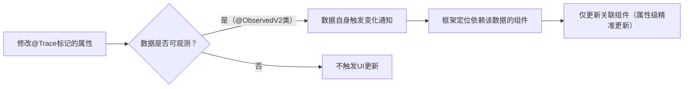

# ArkUI V2状态管理详细说明

ArkUI V2状态管理是API version 12引入的增强型状态管理机制，针对V1版本的局限性（如嵌套对象观测能力弱、更新粒度粗等）进行了全面优化，核心特点是**数据自身可观测**和**精准更新**。V2采用全新的装饰器体系，与V1不兼容，但能更高效地支持复杂应用的状态管理。

## 一、V2状态管理的核心改进

| V1版本局限性 | V2版本改进 |
|--------------|------------|
| 依赖代理对象观测数据，无法直接感知原始数据变化 | 数据本身具备可观测性，修改直接触发更新 |
| 仅支持对象第一层属性观测，嵌套属性变化需手动触发 | 支持深度观测（嵌套对象、数组元素），自动感知变化 |
| 装饰器耦合度高（如`@Observed`必须配合`@ObjectLink`） | 装饰器职责更清晰，扩展性更强 |
| 组件输入输出不明确，双向同步依赖框架隐式处理 | 明确区分输入（`@Param`）和输出（`@Event`），双向同步更可控 |
| 数组/集合元素变化可能导致整体重建 | 支持数组/集合元素级精准更新，减少冗余渲染 |

## 二、核心装饰器详解

### 1. 类观测装饰器：`@ObservedV2`与`@Trace`

用于标记可观测的类及其属性，支持深度观测（嵌套对象、继承类等）。

| 装饰器 | 作用 | 特性 |
|--------|------|------|
| `@ObservedV2` | 装饰类，使其成为可观测类 | 需配合`@Trace`使用；仅能装饰`class`，不能装饰`struct`或组件 |
| `@Trace` | 装饰`@ObservedV2`类中的属性，标记为需要观测的属性 | 支持基础类型、嵌套对象、数组、`Map`、`Set`、`Date`等；属性变化时触发UI更新 |

**示例：基础用法**

```typescript
// 1. 用@ObservedV2装饰类
@ObservedV2
class User {
  // 2. 用@Trace标记需要观测的属性
  @Trace name: string;
  @Trace age: number;
  // 嵌套对象（也需被@ObservedV2装饰）
  @Trace address: Address;

  constructor(name: string, age: number, address: Address) {
    this.name = name;
    this.age = age;
    this.address = address;
  }
}

// 嵌套类也需@ObservedV2装饰
@ObservedV2
class Address {
  @Trace city: string;
  constructor(city: string) {
    this.city = city;
  }
}
```

**示例：继承类观测**

```typescript
@ObservedV2
class Parent {
  @Trace id: number;
  constructor(id: number) {
    this.id = id;
  }
}

// 继承类无需额外装饰，自动继承观测能力
class Child extends Parent {
  @Trace name: string; // 子类新增@Trace属性
  constructor(id: number, name: string) {
    super(id);
    this.name = name;
  }
}
```

### 2. 组件内部状态：`@Local`

用于声明组件内部私有状态，与V1的`@State`类似，但**不可从外部初始化**。

**特性**：

- 仅在组件内部生效，外部无法通过参数初始化或修改。
- 变化时触发当前组件及依赖该状态的子组件刷新。
- 支持所有`@Trace`兼容的类型（基础类型、`@ObservedV2`对象等）。

**示例**：

```typescript
@ComponentV2
struct CounterComponent {
  // 组件内部私有状态，不可从外部初始化
  @Local count: number = 0;

  build() {
    Column({ space: 10 }) {
      Text(`当前计数：${this.count}`)
      Button('+1').onClick(() => {
        this.count++; // 修改触发UI刷新
      })
    }
  }
}

@Entry
@ComponentV2
struct Index {
  build() {
    Column() {
      CounterComponent() // 无法传递参数初始化count
    }.padding(20)
  }
}
```

### 3. 组件输入参数：`@Param`与`@Once`

用于接收父组件传递的参数，实现组件间数据输入，替代V1的`@Prop`。

| 装饰器 | 作用 | 数据流向 | 特性 |
|--------|------|----------|------|
| `@Param` | 接收父组件参数，建立动态同步 | 父→子（默认动态同步） | 复杂类型为**引用传递**，基础类型为值传递；父组件修改时子组件自动更新 |
| `@Once` | 与`@Param`配合，仅初始化时同步一次 | 父→子（仅初始化） | 父组件后续修改不影响子组件；用于固定初始化参数场景 |

**示例：`@Param`动态同步**

```typescript
// 子组件
@ComponentV2
struct ChildComponent {
  @Param message: string; // 接收父组件参数，动态同步

  build() {
    Text(`子组件显示：${this.message}`)
  }
}

// 父组件
@Entry
@ComponentV2
struct ParentComponent {
  @Local parentMsg: string = '初始消息';

  build() {
    Column({ space: 10 }) {
      Button('修改消息').onClick(() => {
        this.parentMsg = '更新后的消息'; // 父组件修改，子组件同步更新
      })
      ChildComponent({ message: this.parentMsg }) // 传递参数
    }.padding(20)
  }
}
```

**示例：`@Once`仅初始化一次**

```typescript
@ComponentV2
struct ChildComponent {
  @Once @Param initValue: number; // 仅初始化时同步

  build() {
    Text(`初始化值：${this.initValue}`)
  }
}

@Entry
@ComponentV2
struct ParentComponent {
  @Local count: number = 0;

  build() {
    Column({ space: 10 }) {
      Button('+1').onClick(() => { this.count++; }) // 父组件修改不影响子组件
      ChildComponent({ initValue: this.count }) // 仅传递初始值
    }.padding(20)
  }
}
```

### 4. 组件输出事件：`@Event`

用于子组件向父组件传递事件或数据，实现“子→父”通信，配合`@Param`可实现双向同步（替代V1的`@Link`）。

**特性**：

- 本质是函数类型参数，父组件传递回调函数，子组件触发调用。
- 支持传递任意类型的参数，实现数据反向传递。
- 显式声明输出，组件接口更清晰。

**示例：双向同步实现**

```typescript
// 子组件：输入@Param + 输出@Event
@ComponentV2
struct InputComponent {
  @Param value: string; // 接收父组件值（父→子）
  @Event onChange: (newValue: string) => void; // 向父组件传递新值（子→父）

  build() {
    TextInput({ text: this.value })
      .onChange((val) => {
        this.onChange(val); // 触发输出事件，传递新值
      })
  }
}

// 父组件：接收事件并更新状态
@Entry
@ComponentV2
struct ParentComponent {
  @Local inputValue: string = '';

  build() {
    Column({ space: 10 }) {
      Text(`输入内容：${this.inputValue}`)
      InputComponent({
        value: this.inputValue, // 传递当前值
        onChange: (val) => { this.inputValue = val; } // 接收新值并更新
      })
    }.padding(20)
  }
}
```

### 5. 跨层级通信：`@Provider`与`@Consumer`

与V1同名装饰器功能类似，用于跨多层级组件共享状态，但基于V2的可观测机制实现更高效的同步。

**特性**：

- `@Provider`：在祖先组件提供可共享状态。
- `@Consumer`：在深层子组件消费共享状态。
- 双向同步：任意层级修改状态，所有关联组件同步更新。
- 支持通过别名绑定（解决命名冲突）。

**示例**：

```typescript
// 祖先组件：提供状态
@ComponentV2
struct Grandparent {
  @Provider theme: string = 'light'; // 提供共享状态

  build() {
    Column() {
      Parent()
      Button('切换主题').onClick(() => {
        this.theme = this.theme === 'light' ? 'dark' : 'light';
      })
    }
  }
}

// 中间组件：无需传递
@ComponentV2
struct Parent {
  build() {
    Child()
  }
}

// 深层子组件：消费状态
@ComponentV2
struct Child {
  @Consumer theme: string; // 消费共享状态

  build() {
    Text(`当前主题：${this.theme}`)
  }
}

@Entry
@ComponentV2
struct Index {
  build() {
    Grandparent()
  }
}
```

### 6. 深度监听：`@Monitor`

用于监听`@Trace`标记的属性或`@Param`接收的可观测数据的**深度变化**，仅在最终状态稳定后触发回调（避免频繁触发）。

**特性**：

- 支持监听嵌套对象、数组等复杂类型的深层变化。
- 回调函数仅在数据最终稳定后执行（如连续修改多次只触发一次）。
- 可监听`@Param`、`@Local`、`@Consumer`等状态变量。

**示例**：

```typescript
@ObservedV2
class Data {
  @Trace value: number;
  constructor(value: number) { this.value = value; }
}

@ComponentV2
struct MonitorExample {
  @Param data: Data;

  // 深度监听data的变化（包括value属性）
  @Monitor((newVal: Data, oldVal: Data) => {
    console.log(`数据变化：${oldVal.value} → ${newVal.value}`);
  })
  get monitoredData() {
    return this.data;
  }

  build() {
    Button(`修改值为${this.data.value + 1}`)
      .onClick(() => {
        this.data.value++; // 触发监听回调
      })
  }
}

@Entry
@ComponentV2
struct Index {
  @Local data: Data = new Data(0);

  build() {
    Column() {
      MonitorExample({ data: this.data })
    }.padding(20)
  }
}
```

### 7. 计算属性：`@Computed`

用于声明依赖其他状态变量的计算结果，依赖变化时自动重新计算，优化性能（避免重复计算）。

**特性**：

- 必须是`get`访问器，无`set`。
- 依赖的状态变量变化时，自动重新计算并触发UI更新。
- 计算结果会被缓存，相同依赖下仅计算一次。

**示例**：

```typescript
@ComponentV2
struct ComputedExample {
  @Local a: number = 1;
  @Local b: number = 2;

  // 计算属性：依赖a和b
  @Computed get sum() {
    console.log('重新计算sum');
    return this.a + this.b;
  }

  build() {
    Column({ space: 10 }) {
      Text(`sum: ${this.sum}`) // 使用计算属性
      Button('修改a').onClick(() => { this.a++; }) // 触发sum重新计算
      Button('修改b').onClick(() => { this.b++; }) // 触发sum重新计算
    }.padding(20)
  }
}
```

## 三、集合类型的可观测操作

V2对`Array`、`Map`、`Set`、`Date`等集合类型提供原生支持，调用特定方法会自动触发UI更新：

| 类型 | 可观测操作（触发更新） |
|------|------------------------|
| `Array` | `push`、`pop`、`shift`、`unshift`、`splice`、`copyWithin`、`fill`、`reverse`、`sort` |
| `Map` | `set`、`delete`、`clear` |
| `Set` | `add`、`delete`、`clear` |
| `Date` | `setFullYear`、`setMonth`、`setDate`、`setHours`等（包括UTC方法） |

**示例：数组可观测操作**

```typescript
@ObservedV2
class ListData {
  @Trace items: string[] = ['Item 1', 'Item 2'];
}

@ComponentV2
struct ArrayExample {
  @Local data: ListData = new ListData();

  build() {
    Column({ space: 10 }) {
      Button('添加元素').onClick(() => {
        this.data.items.push(`Item ${this.data.items.length + 1}`); // 触发更新
      })
      ForEach(this.data.items, (item) => {
        Text(item)
      }, (item) => item)
    }.padding(20)
  }
}
```

## 四、V2与V1核心装饰器对比

| 功能场景 | V1装饰器 | V2装饰器 | 核心差异 |
|----------|----------|----------|----------|
| 组件内部状态 | `@State` | `@Local` | `@Local`不可从外部初始化；`@State`可通过父组件参数初始化 |
| 父→子单向同步 | `@Prop` | `@Param` | `@Prop`是深拷贝；`@Param`复杂类型为引用传递 |
| 父↔子双向同步 | `@Link` | `@Param` + `@Event` | `@Link`由框架隐式实现；V2需显式通过事件回调实现 |
| 嵌套对象观测 | `@Observed` + `@ObjectLink` | `@ObservedV2` + `@Trace` | V1仅支持第一层观测；V2支持深度观测 |
| 跨层级通信 | `@Provide` + `@Consume` | `@Provide` + `@Consumer` | 功能类似，但V2基于可观测数据实现更高效 |
| 状态监听 | `@Watch` | `@Monitor` | `@Watch`监听第一层变化；`@Monitor`支持深度监听且去抖动 |

## 五、V2状态更新流程



## 六、使用注意事项

1. **版本支持**：V2装饰器仅支持API version 12及以上，低版本需使用V1。
2. **混用限制**：V1与V2装饰器不可混用（如同一组件不能同时使用`@State`和`@Local`）。
3. **组件装饰器**：V2状态变量必须在`@ComponentV2`装饰的组件中使用（替代V1的`@Component`）。
4. **实例化要求**：`@ObservedV2`装饰的类必须通过`new`操作符实例化，否则不具备观测能力。
5. **序列化限制**：`@ObservedV2`类的实例不支持`JSON.stringify`序列化（会丢失观测能力）。
6. **性能优化**：
   - 避免给不需要观测的属性添加`@Trace`（减少性能开销）。
   - 长列表优先使用`LazyForEach`配合V2状态，实现元素级精准更新。

## 七、总结

V2状态管理通过`@ObservedV2`和`@Trace`实现了数据的深度可观测性，通过`@Local`、`@Param`、`@Event`等装饰器明确了组件的输入输出，解决了V1版本在复杂场景下的局限性。其核心优势在于：

- **深度观测**：无需手动处理嵌套对象更新，简化代码。
- **精准更新**：仅更新变化的属性和依赖组件，提升性能。
- **接口清晰**：输入输出分离，组件复用性和可维护性更强。

适用于中大型应用、包含复杂嵌套数据结构或需要高性能状态管理的场景。
