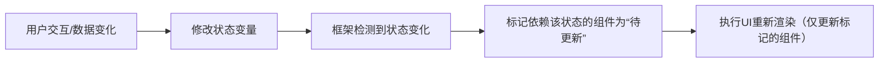

# 渲染控制

在 ArkUI 中，渲染控制是指通过特定语法或组件控制 UI 元素的创建、更新、复用和销毁，核心目标是实现**按需渲染**和**高效更新**，避免不必要的性能消耗。ArkUI 提供了丰富的渲染控制机制，包括条件渲染、循环渲染、懒加载、状态驱动渲染等，以下详细说明：

## 一、条件渲染（Conditional Rendering）

通过 `if`/`else if`/`else` 语法根据条件决定是否渲染组件，适用于动态显示/隐藏 UI 元素的场景。

### 1. 基本用法

```typescript
@Entry
@Component
struct ConditionalExample {
  @State isLogin: boolean = false;

  build() {
    Column() {
      // 条件为true时渲染
      if (this.isLogin) {
        Text('欢迎回来！')
          .fontSize(16)
      } else {
        // 条件为false时渲染
        Button('点击登录')
          .onClick(() => this.isLogin = true)
      }
    }.padding(20)
  }
}
```

### 2. 特性与注意事项

- **组件生命周期**：条件切换时，被隐藏的组件会被销毁（触发 `aboutToDisappear`），显示的组件会重新创建（触发 `aboutToAppear`）。
- **嵌套使用**：支持在容器组件（如 Column、Row）内嵌套条件渲染，也可在自定义组件中使用。
- **性能影响**：频繁切换条件会导致组件频繁销毁和重建，复杂场景建议使用 `visibility` 属性（仅隐藏不销毁）。

  ```typescript
  // 仅隐藏不销毁（性能更优）
  Text('临时信息')
    .visibility(this.show ? Visibility.Visible : Visibility.Hidden)
  ```

## 二、循环渲染（List Rendering）

通过 `ForEach` 组件基于数据源循环生成多个相同结构的子组件，适用于列表、网格等重复 UI 场景。

### 1. 基本语法

```typescript
ForEach(
  dataSource: Array,        // 数据源（数组）
  itemGenerator: (item: T, index?: number) => void,  // 生成子组件的函数
  keyGenerator?: (item: T, index?: number) => string  // 生成唯一key的函数（可选）
)
```

### 2. 示例：渲染用户列表

```typescript
@Entry
@Component
struct ForEachExample {
  @State users: { id: number; name: string }[] = [
    { id: 1, name: '张三' },
    { id: 2, name: '李四' },
    { id: 3, name: '王五' }
  ];

  build() {
    Column({ space: 10 }) {
      ForEach(
        this.users,
        (user, index) => {  // 生成每个列表项
          Row() {
            Text(`序号：${index + 1}`).width(80)
            Text(`姓名：${user.name}`)
          }.padding(10)
          .backgroundColor('#F5F5F5')
          .borderRadius(6)
        },
        (user) => `user_${user.id}`  // 生成唯一key（推荐用数据唯一标识）
      )
    }.padding(20)
  }
}
```

### 3. 关键特性

- **key的作用**：`keyGenerator` 生成的唯一 key 用于帮助框架识别组件身份，避免数据源变化时重复创建/销毁组件（仅更新变化的项）。  
  - 推荐使用数据自身的唯一标识（如 id）作为 key，而非索引（索引可能随数据增删变化）。
- **数据源限制**：必须是**数组类型**，且元素类型需为基本类型（number/string/boolean）或简单对象（不支持函数、Symbol等）。
- **动态更新**：当数据源（数组）发生变化（如 `push`/`splice`）时，框架会自动更新渲染结果（基于 key 对比差异）。

## 三、懒加载渲染（Lazy Rendering）

通过 `LazyForEach` 组件实现数据的**按需加载**和**复用**，适用于长列表（如通讯录、商品列表），大幅提升初始渲染性能和内存占用。

### 1. 与 ForEach 的核心区别

| 特性         | ForEach                  | LazyForEach               |
|--------------|--------------------------|---------------------------|
| 加载时机     | 一次性加载所有数据       | 仅加载可视区域内的数据    |
| 组件复用     | 不复用，数据变化时重建   | 复用不可见区域的组件      |
| 内存占用     | 随数据量增加线性增长     | 内存占用稳定（仅保留可视项） |
| 适用场景     | 短列表（数据量≤100）     | 长列表（数据量≥100）      |

### 2. 基本用法

需配合 `List` 或 `Grid` 等滚动容器使用，步骤如下：

1. 实现 `IEnumerable` 接口（提供数据加载能力）。
2. 通过 `LazyForEach` 绑定数据源和生成器。

```typescript
// 1. 实现数据源接口
class UserDataSource implements IDataSource {
  private users: { id: number; name: string }[] = [];
  private listener: DataChangeListener | null = null;

  constructor() {
    // 模拟1000条数据
    for (let i = 1; i <= 1000; i++) {
      this.users.push({ id: i, name: `用户${i}` });
    }
  }

  // 获取数据总数
  totalCount(): number {
    return this.users.length;
  }

  // 获取指定索引的数据
  getData(index: number): { id: number; name: string } {
    return this.users[index];
  }

  // 注册数据变化监听器
  registerDataChangeListener(listener: DataChangeListener): void {
    this.listener = listener;
  }

  // 取消注册
  unregisterDataChangeListener(): void {
    this.listener = null;
  }
}

// 2. 使用LazyForEach渲染长列表
@Entry
@Component
struct LazyForEachExample {
  private dataSource: UserDataSource = new UserDataSource();

  build() {
    List() {
      LazyForEach(
        this.dataSource,
        (user) => {
          ListItem() {
            Text(`ID: ${user.id}  姓名: ${user.name}`)
              .padding(20)
              .width('100%')
          }
        },
        (user) => `lazy_${user.id}`  // 唯一key
      )
    }.width('100%')
  }
}
```

### 3. 注意事项

- **必须配合滚动容器**：`LazyForEach` 仅能在 `List`、`Grid`、`Scroll` 等滚动容器中使用，否则无法触发懒加载逻辑。
- **数据不可直接修改**：修改数据源后需调用 `listener.onDataReloaded()` 通知框架更新（复杂修改需实现对应接口方法）。
- **key的稳定性**：key 必须唯一且稳定（不随位置变化），否则会导致组件复用异常。

## 四、状态驱动的渲染更新

ArkUI 采用**数据驱动UI**模式，状态变量（被 `@State`/`@Link` 等装饰器修饰）的变化会自动触发关联组件的重新渲染。

### 1. 渲染更新流程



### 2. 精准更新机制

- **依赖追踪**：框架会自动追踪组件与状态变量的依赖关系（如组件在 `build` 中使用了 `this.count`，则依赖 `count`）。
- **最小化更新**：仅重新渲染依赖变化状态的组件，不影响其他组件（如修改 `count` 仅更新使用 `count` 的 `Text`，不更新无关的 `Button`）。

### 3. 优化渲染性能的实践

- **减少状态粒度**：将状态拆分为更小的变量（如用 `isLoading` 单独控制加载状态，而非修改大对象）。
- **避免不必要的状态**：非UI相关的数据无需用状态装饰器（如临时计算变量）。
- **使用计算属性**：通过 `@Computed` 缓存计算结果，避免重复计算触发渲染。

  ```typescript
  @State a: number = 1;
  @State b: number = 2;
  @Computed get sum() { return this.a + this.b; }  // 仅a或b变化时重新计算

  build() {
    Text(`和为：${this.sum}`)  // 依赖sum，间接依赖a和b
  }
  ```

## 五、渲染控制的高级技巧

### 1. 组件复用与缓存

- **@Builder 片段复用**：将重复的UI结构封装为 `@Builder` 方法，避免重复编写。

  ```typescript
  @Builder
  ItemLabel(text: string) {
    Text(text)
      .fontSize(12)
      .color('#666')
  }

  build() {
    Column() {
      this.ItemLabel('姓名')  // 复用片段
      this.ItemLabel('年龄')
    }
  }
  ```

- **自定义组件复用**：将常用UI单元封装为自定义组件，通过参数动态适配不同场景（如通用按钮、输入框）。

### 2. 阻止不必要的渲染

- **条件渲染 vs 样式隐藏**：频繁切换的元素优先用 `visibility` 或 `opacity` 隐藏（不销毁组件），而非 `if` 条件渲染（销毁重建）。
- **控制状态更新范围**：使用 `@Provide`/`@Consume` 而非多层参数传递，减少中间组件的不必要渲染。

### 3. 调试渲染问题

- **使用 `console.log` 跟踪状态变化**：在状态修改处打印日志，确认是否频繁更新。
- **查看UI层级**：通过 DevEco Studio 的 UI Inspector 工具查看组件渲染结构，定位冗余组件。
- **性能分析**：使用 Performance 工具检测渲染帧率（FPS），识别卡顿场景（如长列表未用 `LazyForEach`）。

## 六、总结

ArkUI 的渲染控制机制围绕**“按需渲染”和“高效更新”**设计，核心要点包括：

- 用 `if`/`else` 实现条件性渲染，注意组件销毁重建的性能影响。
- 用 `ForEach` 处理短列表，`LazyForEach` 处理长列表，通过 key 优化复用。
- 依赖状态驱动的自动更新机制，通过合理设计状态粒度提升性能。
- 结合 `@Builder`、自定义组件等实现UI复用，减少重复渲染。

掌握这些机制可有效提升应用的渲染性能和用户体验，尤其在复杂界面和大数据场景中至关重要。
