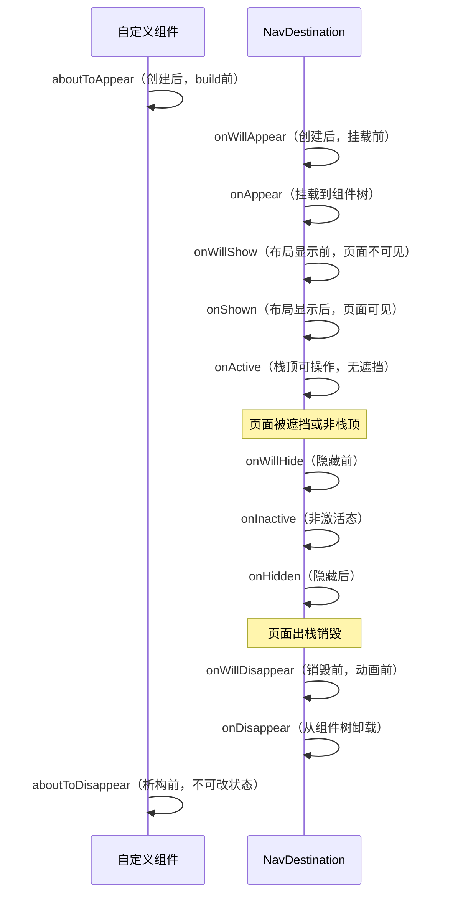

# 组件导航 (Navigation)(推荐)

原地址：[https://developer.huawei.com/consumer/cn/doc/harmonyos-guides/arkts-navigation-navigation](https://developer.huawei.com/consumer/cn/doc/harmonyos-guides/arkts-navigation-navigation)

## 一、组件导航概述

Navigation是HarmonyOS中用于实现页面间及组件内部跳转的路由导航根视图容器，通常作为页面（@Entry）的根容器。其核心功能包括：

- 支持页面间参数传递和灵活的跳转栈操作，便于页面访问与复用。
- 适用于模块内和跨模块的路由切换，提供自然流畅的转场体验及多种标题栏样式。
- 支持“一次开发，多端部署”，可根据窗口大小自动适配显示效果（如宽屏自动切换分栏模式）。

**组成结构**：

- 导航页：包含标题栏（含菜单栏）、内容区和工具栏，可通过`hideNavBar`属性隐藏，不进入页面栈。
- 子页：通过路由操作与导航页、子页之间进行切换。

**API版本差异**：

- API version 9：需配合NavRouter组件实现路由。
- API version 10及以上：推荐使用NavPathStack实现路由。

## 二、设置页面显示模式

Navigation通过`mode`属性设置显示模式，支持三种类型：

| 模式 | 说明 | 适用场景 | 代码示例 |
|------|------|----------|----------|
| 自适应模式（Auto） | 默认模式，根据页面宽度自动切换：<br>- API 9及以前：宽度≥520vp时为分栏模式，否则为单栏模式<br>- API 10及以后：宽度≥600vp时为分栏模式，否则为单栏模式 | 多设备适配场景（如同时支持手机、平板） | `Navigation() { ... }.mode(NavigationMode.Auto)` |
| 单页面模式（Stack） | 窄屏设备适用，路由跳转时整个页面被替换 | 手机等窄屏设备 | `Navigation() { ... }.mode(NavigationMode.Stack)` |
| 分栏模式（Split） | 宽屏设备适用，分为左右两部分，跳转时仅右侧子页替换 | 平板、桌面等宽屏设备 | `Navigation() { ... }.mode(NavigationMode.Split)`（示例含完整布局及子页跳转逻辑） |

## 三、设置标题栏模式

标题栏位于界面顶部，用于展示名称和操作入口，通过`titleMode`属性设置模式：

| 模式 | 说明 | 适用场景 | 代码示例 |
|------|------|----------|----------|
| Mini模式 | 普通型标题栏，不突出标题 | 一级页面无需强调标题的场景 | `Navigation() { ... }.titleMode(NavigationTitleMode.Mini)` |
| Full模式 | 强调型标题栏，突出标题 | 一级页面需要强调标题的场景 | `Navigation() { ... }.titleMode(NavigationTitleMode.Full)` |

**显示条件**：Navigation或NavDestination未设置主副标题且无返回键时，标题栏不显示。

## 四、设置菜单栏

菜单栏位于Navigation右上角，通过`menus`属性配置，支持两种参数类型：`Array<NavigationMenuItem>`和`CustomBuilder`。

- **显示限制**：竖屏最多显示3个图标，横屏最多5个，多余图标自动归入“更多”菜单。
- **图标引用**：可使用本地路径（如`./image/xxx.svg`）或resources资源（如`resources/base/media/xxx.svg`）。
- **代码示例**：

  ```typescript
  let menuItem: NavigationMenuItem = {'value': "", 'icon': "./image/ic_public_highlights.svg", 'action': ()=> {}};
  Navigation() { ... }.menus([menuItem, menuItem, menuItem]) // 竖屏显示3个图标
  ```

## 五、设置工具栏

工具栏位于Navigation底部，通过`toolbarConfiguration`属性配置，参数为`ToolbarItem`数组。

- **ToolbarItem结构**：包含`value`（文本）、`icon`（图标路径）、`action`（点击事件）。
- **代码示例**：

  ```typescript
  let toolItem: ToolbarItem = {'value': "func", 'icon': "./image/ic_public_highlights.svg", 'action': ()=> {}};
  Navigation() { ... }.toolbarConfiguration([toolItem, toolItem, toolItem])
  ```

## 六、路由操作

基于`NavPathStack`（页面栈）实现，需为每个Navigation创建并传入`NavPathStack`对象。主要涉及页面跳转、页面返回、页面替换、页面删除、参数获取、路由拦截等功能。

```ts
@Entry
@Component
struct Index {
  // 创建一个导航控制器对象并传入Navigation
  pageStack: NavPathStack = new NavPathStack();

  build() {
    Navigation(this.pageStack) {
    }
    .title('Main')
  }
}
```

主要操作包括：

### 6.1 页面跳转

通过`push`相关接口实现，支持三种类型：

- **普通跳转**：指定页面名称和参数

  ```typescript
  this.pageStack.pushPath({ name: "PageOne", param: "参数" });
  this.pageStack.pushPathByName("PageOne", "参数");
  ```

- **带返回回调的跳转**：页面出栈时获取返回信息

  ```typescript
  this.pageStack.pushPathByName('PageOne', "参数", (popInfo) => {
    console.log('返回页面：' + popInfo.info.name + '，结果：' + popInfo.result);
  });
  ```

- **带错误码的跳转**：异步回调返回错误信息

  ```typescript
  this.pageStack.pushDestination({name: "PageOne"})
    .catch((error) => console.error('跳转失败：' + error.code))
    .then(() => console.log('跳转成功'));
  ```

### 6.2 页面返回

通过`pop`相关接口实现：

- `pop()`：返回到上一页
- `popToName("PageOne")`：返回到指定名称的页面
- `popToIndex(1)`：返回到索引为1的页面（栈底为0）
- `clear()`：返回到根首页（清空栈中所有页面）

### 6.3 页面替换

通过`replace`相关接口替换栈顶页面：

```typescript
this.pageStack.replacePath({ name: "PageOne", param: "参数" });
this.pageStack.replaceDestination({name: "PageOne"}).catch((error) => console.error(error));
```

### 6.4 页面删除

通过`remove`相关接口删除特定页面：

- `removeByName("PageOne")`：删除所有名称为PageOne的页面
- `removeByIndexes([1,3])`：删除索引为1和3的页面
- `removeByNavDestinationId("1")`：删除指定ID的页面

### 6.5 移动页面

将指定页面移至栈顶：

- `moveToTop("PageOne")`：移动名称为PageOne的页面到栈顶
- `moveIndexToTop(1)`：移动索引为1的页面到栈顶

### 6.6 参数获取

- **子页初始化时**：通过`onReady`回调获取

  ```typescript
  NavDestination() { ... }.onReady((context) => {
    this.param = context.pathInfo.param; // 获取参数
  })
  ```

- **主动查询**：通过`NavPathStack`的`get`接口

  ```typescript
  this.pageStack.getAllPathName(); // 所有页面名称
  this.pageStack.getParamByName("PageOne"); // PageOne的参数
  ```

### 6.7 路由拦截

通过`setInterception`方法设置拦截回调，实现重定向等功能：

```typescript
this.pageStack.setInterception({
  willShow: (from, to, operation, animated) => {
    if (to.pathInfo.name === 'PageTwo') { // 拦截跳转到PageTwo的请求
      to.pathStack.pop(); // 取消原跳转
      to.pathStack.pushPathByName('PageOne'); // 重定向到PageOne
    }
  }
});
```

| 回调函数 | 描述 |
|----------|------|
| `willShow` | 页面跳转前触发，可修改路由栈（当前跳转生效） |
| `didShow` | 页面跳转后触发，修改路由栈将在下一次跳转生效 |
| `modeChange` | Navigation单/分栏模式变更时触发 |

### 6.8 单例跳转

通过`LaunchMode`设置单实例跳转规则：

- `LaunchMode.MOVE_TO_TOP_SINGLETON`：查找指定名称页面，移至栈顶（替换栈顶）
- `LaunchMode.POP_TO_SINGLETON`：查找指定名称页面，移除其上方所有页面（替换栈顶）

**触发事件**：单例页面移至栈顶时，触发`onNewParam`回调。

## 七、子页面

以`NavDestination`为根容器，支持独立标题栏、菜单栏及生命周期管理。

### 7.1 页面显示类型

| 类型 | 说明 | 代码示例 |
|------|------|----------|
| 标准类型（STANDARD） | 默认类型，生命周期随栈中位置变化 | `NavDestination() { ... }.mode(NavDestinationMode.STANDARD)` |
| 弹窗类型（DIALOG） | 透明显示，显示/消失不影响下层页面生命周期，可与下层同时显示 | `NavDestination() { ... }.mode(NavDestinationMode.DIALOG).backgroundColor('rgba(0,0,0,0.5)')` |

### 7.2 页面生命周期

包含三类生命周期（自定义组件、通用组件、自有），时序如下：



- **自定义组件生命周期**：`aboutToAppear`（创建后build前）、`aboutToDisappear`（析构前）。
- **通用组件生命周期**：`onAppear`（挂载时）、`onDisappear`（卸载时）。
- **自有生命周期**：如`onActive`（激活态）、`onInactive`（非激活态）等。

### 7.3 页面监听和查询

- **页面信息查询**：通过`queryNavDestinationInfo`方法获取当前页面信息

  ```typescript
  import { uiObserver } from '@kit.ArkUI';
  @Component
  struct MyComponent {
    navInfo: uiObserver.NavDestinationInfo | undefined;
    aboutToAppear() { this.navInfo = this.queryNavDestinationInfo(); }
    build() { Text("页面名称：" + this.navInfo?.name) }
  }
  ```

- **页面状态监听**：通过`uiObserver`注册监听

  ```typescript
  // 监听生命周期变化
  uiObserver.on('navDestinationUpdate', (info) => {
    console.log('页面状态更新：' + JSON.stringify(info));
  });
  // 监听页面切换
  uiObserver.on('navDestinationSwitch', this.context, (info) => {
    console.log('页面切换：' + JSON.stringify(info));
  });
  ```

## 八、页面转场

支持系统默认转场、关闭转场、自定义转场及共享元素转场。

### 8.1 关闭转场

- **全局关闭**：通过`disableAnimation`方法

  ```typescript
  aboutToAppear() { this.pageStack.disableAnimation(true); } // 关闭所有转场
  ```

- **单次关闭**：在`push`/`pop`等接口中设置`animated`为`false`

  ```typescript
  this.pageStack.pushPath({ name: "PageOne" }, false); // 单次无转场
  this.pageStack.pop(false);
  ```

### 8.2 自定义转场

- **Navigation自定义**：通过`customNavContentTransition`事件，需实现转场协议对象`NavigationAnimatedTransition`（含超时时间、转场动画方法、结束回调）。
- **NavDestination自定义**：通过`customTransition`属性，实现转场代理（返回`NavDestinationTransition`对象，含动画逻辑、时长、曲线等）。

### 8.3 共享元素转场

通过`geometryTransition`实现元素在页面间的平滑过渡：

1. 起始页和目的页的共享组件设置相同`id`：

   ```typescript
   // 起始页
   Image($r('app.media.icon')).geometryTransition('sharedId')
   // 目的页
   Image($r('app.media.icon')).geometryTransition('sharedId')
   ```

2. 在`animateTo`闭包中执行路由操作（关闭系统转场）：

   ```typescript
   this.getUIContext()?.animateTo({ duration: 1000 }, () => {
     this.pageStack.pushPath({ name: 'ToPage' }, false); // 关闭系统转场
   });
   ```

## 九、跨包动态路由

用于解决模块间依赖耦合及首页加载慢问题，支持系统路由表和自定义路由表。

### 9.1 系统路由表（API 12+）

步骤：

1. 在目标模块`module.json5`中配置路由表路径：

   ```json
   { "module": { "routerMap": "$profile:route_map" } }
   ```

2. 在`resources/base/profile`创建`route_map.json`：

   ```json
   {
     "routerMap": [
       {
         "name": "PageOne",
         "pageSourceFile": "src/main/ets/pages/PageOne.ets",
         "buildFunction": "PageOneBuilder",
         "data": { "description": "PageOne描述" }
       }
     ]
   }
   ```

3. 目标页面定义入口`@Builder`函数（与`buildFunction`同名）：

   ```typescript
   @Builder export function PageOneBuilder() { PageOne(); }
   @Component struct PageOne { ... }
   ```

4. 通过`pushPathByName`跳转（无需配置`navDestination`）：

   ```typescript
   this.pageStack.pushPathByName("PageOne", null);
   ```

### 9.2 自定义路由表

实现方案：

1. 定义路由配置（页面名称、模块名、路径等）。
2. 动态加载目标模块（通过`import`），调用模块方法获取页面`Builder`。
3. 在`Navigation`的`navDestination`中执行`Builder`实现跳转。

## 十、示例代码

提供多个场景的示例参考，包括：

- Navigation系统路由
- 组件导航和页面路由概述
- 导航转场
- 页面栈继承
- Navigation单例跳转
- Navigation自定义转场
- NavDestination自定义转场
- Navigation自定义动态路由等
