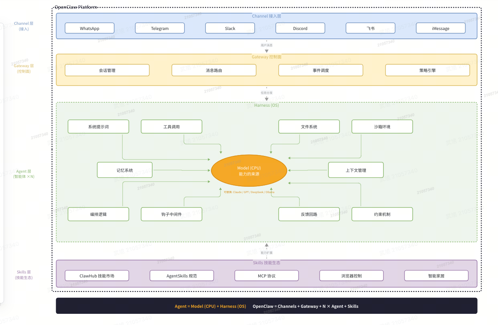
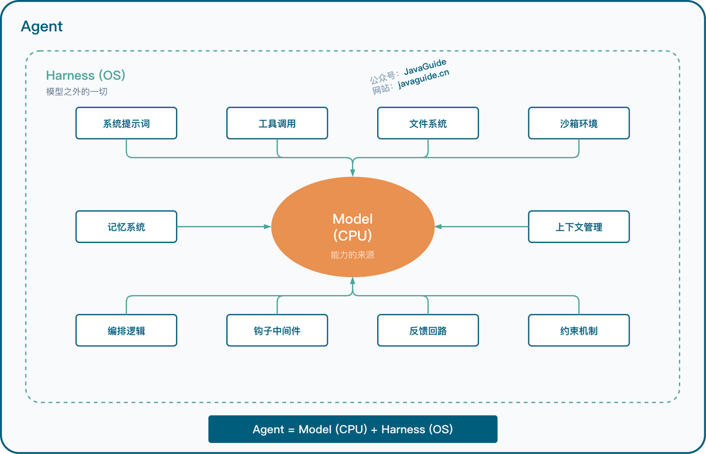
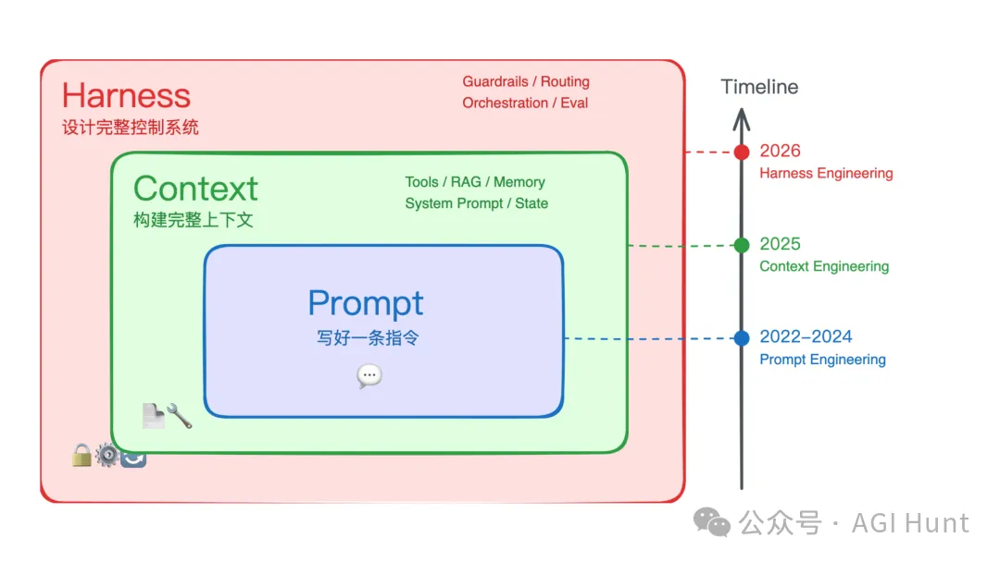
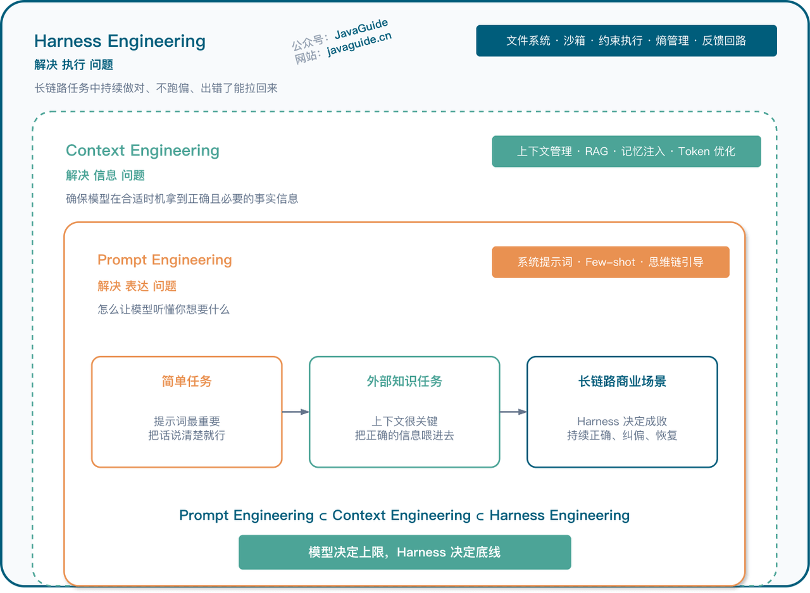
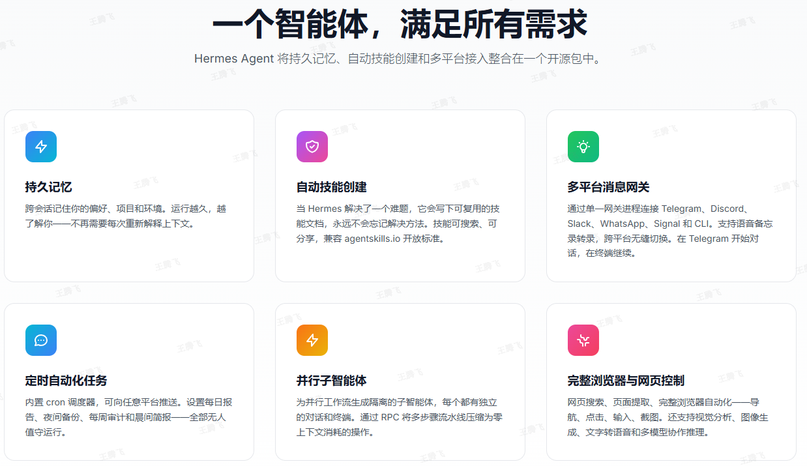
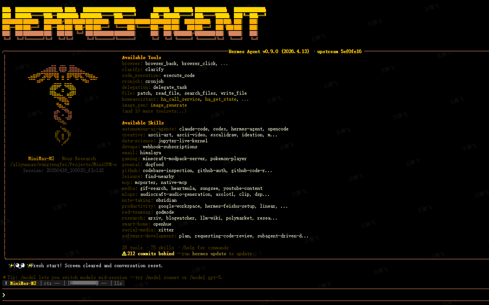

KEY: Agent、OpenClaw、Harness
目录
暂时无法在办公平台文档外展示此内容

---
[图片]

1. 背景 - 什么是
1.1 概念定义

大语言模型（LLM）
基于 Transformer 架构的神经网络模型，通过自注意力机制实现序列数据的并行处理。运行机制是预测下一个词元（Token）。
目前的基本特性：

1. 没有独立于输出的「思考」过程，推理就是生成本身;
2. 上下文就是全部记忆，窗口之外的内容是不存在的;
3. 生成具有概率性，同样的输入可能产生不同的输出。

智能体（Agent）
这里仅考虑基于 LLM 的 Agent。
OpenAI 定义：以 LLM 为大脑驱动的系统，具备自主理解、感知、规划、记忆和使用工具的能力。
公式：$$Agent = LLM + 规划 + 记忆 + 工具使用$$

多智能体通信协议（MCP）
基于 JSON-RPC 2.0 规范的智能体通信协议，核心消息格式包含 method（调用方法）、params（参数列表）、id（请求标识）三大字段。通信流程遵循"连接建立→身份认证→资源发现→数据传输"四阶段模型，确保跨智能体系统的可靠交互。

智能体间协作协议（A2A）
定义智能体能力描述与任务分发的标准化协议，通过 AgentCard JSON Schema 实现能力声明，包含 name（名称）、url（访问地址）、version（版本号）、capabilities（功能列表）、skills（技能描述）、authentication（认证信息）等关键字段。任务分发流程实现"注册-匹配-分配-执行-反馈"的闭环管理。

技能（Skill）
Skill被定义为：Agent在特定场景下，为完成某一具体任务，通过预设逻辑、工具调用或接口交互，实现从“任务需求”到“任务输出”的可复用、可组合的能力单元。其核心特征的是可调用性、可描述性、可组合性——可被LLM的规划模块主动调用。常见的标准由 Anthropic 定义 Agent Skills 开放标准。
my-skill/
├── SKILL.md          # Required: instructions + metadata
├── scripts/          # Optional: executable code
├── references/       # Optional: documentation
└── assets/           # Optional: templates, resources
技能采用渐进式披露机制高效管理上下文：

- 发现阶段：启动时，智能体仅加载可用技能的名称与描述，信息仅够判断其是否可能与当前任务相关。
- 激活阶段：当任务与某一技能描述匹配时，智能体将完整的 SKILL.md 指令加载至上下文。
- 执行阶段：智能体依照指令执行，按需加载引用文件或执行捆绑代码。
该机制在保证智能体响应速度的同时，支持其按需获取更多上下文信息。

智能体通信协议（ACP）
智能体通信协议（ACP）是智能体之间进行通信和协作的一套开放标准。它旨在解决不同智能体之间难以互通、通信方式各异的问题，通过定义统一的规范，实现智能体功能的复用和协作效率的最优化，从而降低企业和开发者的应用开发成本。

Harness Engineering
一套控制 LLM 稳定运行的系统工程。
公式：$$Agent = LLM + Harness$$

---

暂时无法在办公平台文档外展示此内容
2. Agent 核心能力 - 有什么
2.1 核心能力组件
2.1.1 LLM 推理引擎
LLM 推理引擎是 Agent 的决策核心，负责自然语言理解与指令生成。其技术实现基于预训练 Transformer 模型，通过函数调用格式实现与其他组件交互。比如 OpenClaw 使用的 Pi，QwenPaw 使用的 AgentScope，DeepSearch 使用的 LongGraph。
函数调用API格式示例：
{
  "role": "assistant",
  "content": null,
  "function_call": {
    "name": "execute_shell",
    "parameters": {
      "command": "ls -l | grep .py"
    }
  }
}

2.1.2 记忆系统
记忆系统分为短期记忆与长期记忆。
短期记忆就是上下文。
长期记忆是 LLM 外部的存储系统（记忆系统）。可以采用向量数据库实现高效存储与检索，即检索增强生成（RAG）。也可以用 Markdown 文件。比如 QwenPaw 使用的 ReMe、字节开源的 OpenViking。
向量存储数据结构：
HNSW（Hierarchical Navigable Small World）索引结构实现近似最近邻搜索，时间复杂度为O(log N)。
相似度计算算法：
余弦相似度计算公式：
similarity(u, v) = (u · v) / (‖u‖ ‖v‖)
向量检索Python实现：
import faiss
import numpy as np

class VectorMemory:
    def __init__(self, dimension=768):
        self.dimension = dimension
        self.index = faiss.IndexHNSWFlat(dimension, 32)
        self.index.hnsw.efConstruction = 200
        self.index.hnsw.efSearch = 50
        self.documents = []

    def store(self, vector, metadata):
        if isinstance(vector, list):
            vector = np.array(vector, dtype=np.float32).reshape(1, -1)
        self.index.add(vector)
        self.documents.append(metadata)
    
    def search(self, query_vector, k=5):
        if isinstance(query_vector, list):
            query_vector = np.array(query_vector, dtype=np.float32).reshape(1, -1)
        distances, indices = self.index.search(query_vector, k)
        results = []
        for dist, idx in zip(distances[0], indices[0]):
            if idx < len(self.documents):
                results.append({
                    'distance': float(dist),
                    'metadata': self.documents[idx]
                })
        return results

2.1.3 工具调用模块
工具调用模块实现 Agent 与外部系统的标准化交互。需要 LLM 模型针对 tools 使用进行过优化。
工具注册Schema定义：
{
  "name": "execute_shell",
  "description": "Execute shell commands in a secure sandbox",
  "parameters": {
    "type": "object",
    "properties": {
      "command": {
        "type": "string",
        "description": "The shell command to execute"
      },
      "timeout": {
        "type": "integer",
        "description": "Execution timeout in seconds",
        "default": 30
      }
    },
    "required": ["command"]
  }
}
工具调用框架实现：
from typing import Dict, Any, Callable
import inspect

class ToolRegistry:
    def __init__(self):
        self.tools: Dict[str, Callable] = {}
        self.schemas: Dict[str, Dict] = {}

    def register(self, name: str, description: str):
        def decorator(func):
            self.tools[name] = func
            sig = inspect.signature(func)
            params = {}
            for param_name, param in sig.parameters.items():
                params[param_name] = {
                    "type": str(param.annotation) if param.annotation != inspect.Parameter.empty else "any",
                    "default": param.default if param.default != inspect.Parameter.empty else None
                }
            self.schemas[name] = {
                "name": name,
                "description": description,
                "parameters": params
            }
            return func
        return decorator
    
    def call(self, name: str, **kwargs) -> Dict[str, Any]:
        if name not in self.tools:
            return {"status": "error", "message": f"Tool {name} not found"}
        try:
            result = self.tools[name](**kwargs)
            return {"status": "success", "result": result}
        except Exception as e:
            return {"status": "error", "message": str(e)}
    
    def get_schemas(self) -> Dict[str, Dict]:
        return self.schemas

# 使用示例

registry = ToolRegistry()

@registry.register("calculate_mean", "Calculate mean of a list of numbers")
def calculate_mean(data: list[float]) -> float:
    return sum(data) / len(data)

@registry.register("read_file", "Read file content")
def read_file(path: str) -> str:
    with open(path, 'r') as f:
        return f.read()

2.1.4 规划与任务分解能力
规划能力使 Agent 能够将复杂目标分解为可执行的子任务序列。实现包括：Plan-and-Execute 机制、Replan 机制、ReAct 范式、固定思维链 Prompt。
任务分解算法：
from typing import List, Dict
import re

class TaskPlanner:
    def __init__(self):
        self.task_patterns = {
            "analyze_data": ["read_data", "clean_data", "analyze", "generate_report"],
            "create_api": ["design_api", "implement_routes", "add_validation", "write_tests"],
            "deploy_service": ["build", "test", "deploy", "verify"]
        }

    def decompose(self, goal: str) -> List[Dict]:
        goal_lower = goal.lower()
        for pattern, steps in self.task_patterns.items():
            if pattern in goal_lower:
                return [
                    {"step": i, "action": step, "status": "pending"}
                    for i, step in enumerate(steps)
                ]
        return self.chain_of_thought_decomposition(goal)
    
    def chain_of_thought_decomposition(self, goal: str) -> List[Dict]:
        prompt = f"""
        目标：{goal}
        
        请将此目标分解为具体可执行的步骤，每步包含：
        1. 步骤编号
        2. 执行动作
        3. 所需工具
        
        输出格式为JSON数组。
        """
        # 这里应该调用LLM生成分解结果
        # 示例返回
        return [
            {"step": 1, "action": "分析需求", "tool": "llm", "status": "pending"},
            {"step": 2, "action": "制定计划", "tool": "planner", "status": "pending"},
            {"step": 3, "action": "执行任务", "tool": "executor", "status": "pending"}
        ]

2.1.5 反馈与自我修正机制
反馈机制使 Agent 能够根据执行结果优化行为策略。
状态机实现：
from enum import Enum
from typing import Dict, Callable

class AgentState(Enum):
    IDLE = "idle"
    PLANNING = "planning"
    EXECUTING = "executing"
    WAITING = "waiting"
    COMPLETED = "completed"
    ERROR = "error"

class AgentStateMachine:
    def __init__(self):
        self.state = AgentState.IDLE
        self.transitions: Dict[AgentState, Callable] = {}
        self.setup_transitions()

    def setup_transitions(self):
        self.transitions[AgentState.IDLE] = {
            "receive_task": AgentState.PLANNING,
            "error": AgentState.ERROR
        }
        self.transitions[AgentState.PLANNING] = {
            "plan_complete": AgentState.EXECUTING,
            "error": AgentState.ERROR
        }
        self.transitions[AgentState.EXECUTING] = {
            "task_complete": AgentState.COMPLETED,
            "need_input": AgentState.WAITING,
            "error": AgentState.ERROR
        }
        self.transitions[AgentState.WAITING] = {
            "input_received": AgentState.EXECUTING,
            "error": AgentState.ERROR
        }
        self.transitions[AgentState.COMPLETED] = {
            "new_task": AgentState.PLANNING,
            "idle": AgentState.IDLE
        }
        self.transitions[AgentState.ERROR] = {
            "retry": AgentState.PLANNING,
            "abort": AgentState.IDLE
        }
    
    def transition(self, event: str) -> bool:
        if self.state in self.transitions and event in self.transitions[self.state]:
            new_state = self.transitions[self.state][event]
            print(f"State transition: {self.state.value} -> {new_state.value}")
            self.state = new_state
            return True
        return False
    
    def get_state(self) -> AgentState:
        return self.state

2.2 工作流程与自主性体现
Agent 的工作流程遵循"感知-规划-执行-反馈"的闭环模型。
公式： $$Agent = LLM + Loop$$
执行流程UML序列图描述：
暂时无法在办公平台文档外展示此内容
各阶段数据格式规范：

1. 任务输入格式：
{
  "task_id": "task-001",
  "goal": "分析销售数据并生成报告",
  "parameters": {
    "time_range": "2024Q1",
    "metrics": ["revenue", "profit"]
  },
  "deadline": "2024-04-01T12:00:00Z"
}
2. 计划输出格式：
{
  "plan_id": "plan-001",
  "steps": [
    {
      "step_id": "step-001",
      "action": "query_database",
      "tool": "sql_client",
      "parameters": {
        "query": "SELECT * FROM sales WHERE quarter='2024Q1'"
      }
    }
  ],
  "estimated_duration": 300
}
3. 执行结果格式：
{
  "step_id": "step-001",
  "status": "completed",
  "result": {
    "data": [...],
    "record_count": 1000
  },
  "execution_time": 15.3,
  "timestamp": "2024-03-31T10:15:00Z"
}

---

3. Harness Engineering 介绍

什么是 Harness Engineering？
Harness Engineering 是设计和实现系统的学科，这些系统能够：
1. 约束 ：定义 AI 智能体可以做什么（架构边界、依赖规则）
2. 告知 ：告诉智能体应该做什么（ 上下文工程 、文档体系）
3. 验证 ：检查智能体是否正确完成任务（测试、 linting、CI 验证）
4. 修正 ：当智能体出错时引导其自我修复（ 反馈循环 、自我修正机制）
类比：AI 模型是一匹强大但无方向的骏马，Harness 是缰绳、马鞍和全套马具，人类工程师是骑手。没有 Harness 的 AI 是开阔场地里的纯种马——速度快、令人印象深刻，但完全无法用来完成任何实际工作。
Harness 和 Prompt/Context Engineering 是什么关系？
三者不是并列关系，而是嵌套关系。更重要的是， 每一层解决的是完全不同的问题 ：



层级
时间
解决的核心问题
关注点
典型工作
Prompt Engineering
2022-2024
表达——怎么写好指令
塑造局部概率空间，让模型听懂意图
系统提示词设计、Few-shot 示例、思维链引导
Context Engineering
2025
信息——给 Agent 看什么
确保模型在合适的时机拿到正确且必要的事实信息
上下文管理、RAG、记忆注入、Token 优化
Harness Engineering
2026 年 2 月起
执行——整个系统怎么防崩、怎么量化、怎么持续运转
长链路任务中的持续正确、偏差纠正、故障恢复
文件系统、沙箱、约束执行、熵管理、反馈回路
六层框架
层级
名称
解决什么问题
关键设计
L1
信息边界层
Agent 该知道什么、不该知道什么
定义角色与目标，裁剪无关信息，结构化组织任务状态
L2
工具系统层
Agent 怎么跟外部世界交互
工具的选拔、调用时机、结果的提炼与反馈
L3
执行编排层
多步骤任务怎么串起来
让模型像人一样走完“理解目标→判断信息→分析→生成→检查”的完整轨道
L4
记忆与状态层
长任务中间结果怎么管
独立管理当前任务状态、中间产物和长期记忆，防止系统混乱
L5
评估与观测层
Agent 怎么知道自己做对了没有
建立独立于生成过程的验证机制，让 Agent 具备“自知之明”
L6
约束、校验与恢复层
出错了怎么办
预设规则拦截错误，失败时（API 超时、格式混乱）提供重试或回滚机制

3.1 安全性设计（新增章节）
安全性是Agent系统的核心要求，主要包括：

__3.1.1 沙箱机制__

- __代码执行沙箱__：限制文件系统访问、网络请求、系统调用
- __权限分级__：读权限、写权限、执行权限的细粒度控制
- __资源限制__：CPU、内存、磁盘空间、网络带宽的配额管理

__3.1.2 输入验证与过滤__

- __Prompt注入防护__：检测和阻止恶意prompt构造
- __输出内容审查__：敏感信息过滤、合规性检查
- __工具参数验证__：确保工具调用参数在安全范围内

__3.1.3 审计与监控__

- __操作日志__：记录所有Agent操作和决策过程
- __异常检测__：识别异常行为模式和潜在攻击
- __回滚机制__：快速恢复到安全状态的能力

3.2 可观测性与监控（新增章节）
__3.2.1 关键指标__

- __性能指标__：响应时间、吞吐量、错误率
- __成本指标__：Token消耗、API调用次数、计算资源使用
- __质量指标__：任务成功率、用户满意度、准确性

__3.2.2 日志与追踪__

```python
# Agent操作日志示例
class AgentLogger:
    def __init__(self, log_level="INFO"):
        self.logger = logging.getLogger("agent")
        self.tracer = Tracer()  # 分布式追踪
    
    def log_action(self, action_type, params, result, duration):
        log_entry = {
            "timestamp": time.time(),
            "action_type": action_type,
            "params": params,
            "result_status": result.get("status"),
            "duration_ms": duration,
            "trace_id": self.tracer.get_current_trace_id()
        }
        self.logger.info(json.dumps(log_entry))
```

__3.2.3 健康检查__

- __组件健康状态__：各模块的运行状态监控
- __依赖服务检查__：外部API、数据库、缓存的可用性
- __自动告警__：异常情况的及时通知机制

3.3 调试与测试方法（新增章节）
__3.3.1 调试策略__

- __逐步执行__：单步执行Agent工作流，观察中间状态
- __上下文检查__：验证传递给LLM的上下文是否正确
- __工具模拟__：使用mock工具替代真实工具调用

__3.3.2 测试框架__

```python
# Agent测试示例
class AgentTestCase:
    def setUp(self):
        self.agent = create_test_agent()
        self.mock_tools = MockToolRegistry()
    
    def test_data_analysis_workflow(self):
        # 准备测试数据
        test_goal = "分析2024年Q1销售数据"
        
        # 执行Agent
        result = self.agent.execute(test_goal)
        
        # 验证结果
        assert result["status"] == "completed"
        assert "report" in result["output"]
        assert self.mock_tools.call_count("query_database") == 1
```

__3.3.3 回归测试__

- __场景快照__：保存成功的执行场景作为回归基准
- __差异对比__：新版本与基准版本的结果对比
- __自动化测试流水线__：集成到CI/CD流程中

---

4. Claw 系列介绍
常见框架有：OpenClaw、ZeroClaw、NanoClaw、PicoClaw、EdgeClaw(面壁)、NemoClaw、LoongClaw、NullClaw、QwenPaw（阿里）、DeerFlow（字节）、KimiClaw（月之暗面）、MaxClaw（MiniMax）、MiClaw（小米）、ArkClaw（字节）、QClaw（腾讯）、WorkBuddy（腾讯）、AutoClaw（智谱）
4.1 OpenClaw
[图片]
代码文档
主要语言：TypeScript
定位：本地优先、开源自托管的通用 AI 助手 / 智能体执行网关

4.1.1 架构设计
OpenClaw 采用事件驱动的 Gateway 架构，支持多渠道消息接入与路由。
┌────────────────────────────────────────────────────────┐
│                        用户                             │
│         (WhatsApp / Telegram / Slack / 飞书)            │
└────────────────────────────────────────────────────────┘
                           ↓
┌────────────────────────────────────────────────────────┐
│                   Gateway（网关）                        │
│    核心协调中心，管理所有连接和消息路由                    │
└────────────────────────────────────────────────────────┘
                           ↓
┌────────────────────────────────────────────────────────┐
│                    Agent（智能体）                       │
│    驱动思考过程，处理上下文和逻辑推理                      │
└────────────────────────────────────────────────────────┘
                           ↓
┌────────────────────────────────────────────────────────┐
│                   Skills（技能）                         │
│    执行具体操作：网页浏览、邮件发送、文件管理等             │
└────────────────────────────────────────────────────────┘
                           ↓
┌────────────────────────────────────────────────────────┐
│                   Memory（记忆）                         │
│    存储对话历史、用户偏好、长期记忆                        │
└────────────────────────────────────────────────────────┘
[图片]
4.1.2 核心组件
组件
功能
关键指标
Gateway层
协议转换、流量控制、服务发现
100 QPS、99.9%可用性
Pi Agent
多模型适配、资源调度、容错
加载时间缩短30%、资源利用率85%+
Skills模块
动态优先级、技能注册、冲突解决
上线周期15分钟、抢占延迟<10ms
Gateway 层：通信与调度中枢
Gateway 层基于 WebSocket 协议实现全双工通信，支持实时指令下发与状态回传。其核心功能包括：

- 协议转换：将 HTTP/HTTPS 协议与内部私有协议进行转换，适配不同客户端接入需求
- 流量控制：采用令牌桶算法限制单 IP 并发请求数，默认阈值为 100 QPS
- 服务发现：通过 ZooKeeper 实现执行节点的动态注册与健康检查，服务可用性达 99.9%
Pi Agent：智能模型调度引擎
Pi Agent 作为执行层核心组件，负责 AI 模型的生命周期管理，具备以下特性：
- 轻量化 + 跨环境：适配云 / 边 / 端异构场景，资源占用低、部署无侵入；
- 安全 + 自治：加密通信、细粒度权限控制，支持离线自治，适配弱网边缘场景；
- 灵活 + 可扩展：多类型任务执行、自定义采集，插件化架构支持功能扩展。
Skills 模块：任务优先级管理系统
Skills 模块通过优先级机制实现多任务协同，核心机制包括：
- 动态优先级：基于任务紧急度（P0-P3）和资源占用率实时调整执行顺序
- 技能注册：支持热插拔式技能扩展，新技能上线周期缩短至 15 分钟
- 冲突解决：采用时间片轮转法处理资源竞争，任务抢占延迟控制在 10ms 以内

4.2 QwenPaw
代码 文档
主要开发语言：Python
定位：个人助理
[图片]
QwenPaw与OpenClaw的对比：<https://qwenpaw.agentscope.io/docs/comparison>
QwenPaw 基于 AgentScope、ReMe 开发。
4.2.1 架构设计
┌────────────────────────────────────────────────────────┐
│                        用户                              │
│            (钉钉 / 飞书 / QQ / Discord / iMessage)        │
└────────────────────────────────────────────────────────┘
                              ↓
┌────────────────────────────────────────────────────────┐
│                Channel Adapter（通道适配器）              │
│          统一消息格式转换，处理各平台API差异               │
└────────────────────────────────────────────────────────┘
                              ↓
┌────────────────────────────────────────────────────────┐
│                  AgentScope Framework                    │
│  ┌──────────────┬──────────────┬──────────────┐        │
│  │   Model层    │   Agent层    │   Service层   │        │
│  │ (模型封装)    │  (ReAct范式) │ (工具/消息)   │        │
│  │ Qwen/OpenAI  │  推理+行动   │  工具调用链   │        │
│  │ Ollama/MLX   │  多步规划    │  消息路由     │        │
│  └──────────────┴──────────────┴──────────────┘        │
└────────────────────────────────────────────────────────┘
                              ↓
┌────────────────────────────────────────────────────────┐
│                    Skills（技能系统）                     │
│      Markdown定义 + Skills Hub导入 + 自定义开发          │
│         文档处理、新闻阅读、桌面操作、定时任务             │
└────────────────────────────────────────────────────────┘
                              ↓
┌────────────────────────────────────────────────────────┐
│                   Memory（三级记忆）                      │
│  会话记忆(滑动窗口) + 长期记忆(向量检索) + 文件记忆(知识库) │
└────────────────────────────────────────────────────────┘
                              ↓
┌────────────────────────────────────────────────────────┐
│              Plugin System（插件系统）                    │
│        MCP工具热插拔 + 自定义Provider/Hook/Command        │
└────────────────────────────────────────────────────────┘
4.2.2 核心组件
AgentScope
AgentScope 将 Agent 应用的基础组件抽象为四个核心模块：
模块
 功能描述
 设计特点
Message
多模态信息统一格式化
 支持文本、图像、音频等不同模态信息的统一传输
Model
LLMProvider统一接口
兼容OpenAI、Anthropic、DashScope、Gemini、Ollama等多种模型
Memory
 短期与长期记忆分离
 支持向量检索和文件监视的轻量级记忆管理
Tool
 MCP工具注册与调用
支持MCP协议扩展，允许动态注册外部工具
AgentScope 采用 ReAct（Reasoning + Acting） 范式作为主要Agent架构。关键特性：

- 并行工具调用：Agent 可同时发起多个工具调用，提升执行效率
- 异步执行：基于 Python asyncio 的异步设计，支持工业级性能
- 实时控制：支持在 Agent 执行过程中进行人工干预和状态调整
ReMeLight
核心技术：
- Embedding模型：支持DashScope text-embedding-v3等远程API
- 向量存储：基于文件的轻量级索引
- 文件监视：支持递归目录监视，自动重建索引
记忆类型
存储方式
生命周期
短期记忆
进程内存(RAM)
单次会话
工作记忆
文件系统(Markdown)
可配置
长期记忆
向量索引
持久化
检索流程：

1. 用户查询触发 memory_search()
2. 查询文本通过Embedding API转换为向量
3. 向量相似度搜索，返回Top-K相关记忆
4. 记忆内容注入Agent上下文

---

5. Code 系列
常见框架：Claude Code、CodeX、OpenCode、QwenCode、KiloCode
还有IDE类：Kiro、TRAE、Qoder
5.1 Claude Code
文档
Claude Code (CC) 是 Anthropic 官方推出的 AI 驱动编程代理工具，采用终端原生设计，旨在为开发者提供智能化的编程辅助。该工具深度集成 Claude 大语言模型，能够理解代码库上下文、自主执行代码操作、与开发工具无缝协作，显著提升开发效率。
可访问资源
CC 是项目驱动的，目标是完成项目。在目录中运行 claude 时，CC 可以访问：

- 项目。 目录和子目录中的文件，以及其他地方有许可的文件。
- 终端。 可以运行的任何命令：构建工具、git、包管理器、系统实用程序、脚本。
- git 状态。 当前分支、未提交的更改和最近的提交历史。
- CLAUDE.md。可以在其中存储项目特定的说明、约定和 Claude 应该在每个会话中了解的上下文。
- 自动内存。 Claude 自动保存的学习内容，如项目模式和偏好。MEMORY.md 的前 200 行或 25KB（以先到者为准）在每个会话开始时加载。
- 扩展。 用于外部服务的 MCP servers、用于工作流的 skills、用于委派工作的 subagents 和用于浏览器交互的 Claude in Chrome。
会话
Claude Code 将对话保存在本地。每条消息、工具使用和结果都被存储，这使得回退、恢复和分叉会话成为可能。在 Claude 进行代码更改之前，它还会对受影响的文件进行快照，以便需要时可以恢复。会话是独立的。 每个新会话都以新的上下文窗口开始，没有来自以前会话的对话历史。Claude 可以使用自动内存跨会话保持学习。
恢复或分叉会话。当使用 claude --continue 或 claude --resume 恢复会话时，使用相同的会话 ID 从中断处继续。新消息附加到现有对话。完整对话历史被恢复，但会话范围的权限不会，需要重新批准。
[图片]
要分支并尝试不同的方法而不影响原始会话，请使用 --fork-session 标志：
claude --continue --fork-session
这会创建一个新的会话 ID，同时保留到该点的对话历史。原始会话保持不变。与恢复一样，分叉的会话不继承会话范围的权限。
5.2 OpenCode
代码文档
[图片]
OpenCode 是一款开源 AI 编码助手，旨在帮助开发者在终端、IDE 或桌面应用中编写代码。该项目采用 Go 语言开发，使用 Bubble Tea 构建终端用户界面（TUI）。
核心特性
- LSP 支持: 自动为 LLM 加载正确的语言服务器，提供智能代码补全和诊断功能。
- 多会话并行: 支持在同一项目上并行启动多个助手会话，提高开发效率。
- 分享链接: 可生成分享链接，方便与团队成员共享会话内容或调试信息。
- 多平台登录认证:
  - GitHub Copilot：使用 GitHub 账号登录
  - OpenAI：支持 ChatGPT Plus/Pro 用户登录
- 75+ 模型支持: 通过 Models.dev 支持 75+ LLM 提供商，包括本地模型部署。
- 隐私优先: 不存储任何代码或上下文数据，保护用户隐私。
内置工具
工具
功能
bash
执行 shell 命令
edit
修改文件（精确字符串替换）
write
创建新文件
read
读取文件内容
grep
正则搜索文件内容
glob
文件模式匹配
list
列出目录内容
lsp
LSP 代码智能（实验性）
patch
应用补丁文件
skill
加载 SKILL.md 技能文件
todowrite
管理 Todo 列表
CLI 命令参考

# 基础命令

opencode tui              # 启动终端界面
opencode run "prompt"     # 非交互模式执行指定提示
opencode serve            # 启动无界面 API 服务器
opencode web              # 启动 Web 界面服务器
opencode attach           # 连接到运行中的服务器
opencode auth             # 管理 AI 提供商凭证
opencode models           # 列出可用模型
opencode session          # 管理会话
opencode init             # 初始化项目
opencode acp              # 作为ACP服务启动

5.4 Qwen Code
代码文档
阿里云的类CC开源产品。

---

6. Harnes 系列
常见服务：MaxHermes
Hermes Agent
代码文档
定位：随你成长的 AI 智能体


特性
说明
三层记忆系统
会话记忆（当前对话）、持久记忆（跨会话事实）、技能记忆（解决方案模式）
自我进化能力
完成复杂任务后自动创建技能，持续学习改进
终端访问
支持本地、Docker、SSH 三种终端后端，安全执行命令
多平台集成
支持 Telegram、Discord、Slack、WhatsApp 等消息平台
内置技能库
预置 40+ 技能（MLOps、GitHub、研究工具等）
MCP 集成
连接 MCP 服务器，安全扩展工具集
多配置文件
支持运行多个隔离的 Hermes 实例
~/.hermes/
├── config.yaml           # 主配置文件
├── .env                  # API 密钥和敏感信息
├── auth.json             # OAuth 凭证（Nous Portal 等）
├── SOUL.md               # 可选：全局人格设定
├── active_profile        # 当前激活的配置文件
├── memories/             # 持久化记忆
│   ├── MEMORY.md         # Agent 的记忆存储
│   └── USER.md           # 用户偏好记录
├── skills/               # Agent 创建的技能
├── cron/                 # 定时任务
├── sessions/             # Gateway 会话
├── state.db              # 状态数据库
└── logs/                 # 日志文件
    ├── errors.log        # 错误日志
    └── gateway.log       # Gateway 日志（密钥自动脱敏）
Skill的自进化
[图片]
Memory 和 Skill 都是存储系统，写入需要有人触发。Nudge Engine 就是这个触发器——运行时维护两个计数器，定时提醒 Agent 该停下来想想了。
OpenHarness
<https://github.com/HKUDS/OpenHarness>
OpenHarness 是由香港大学数据智能实验室（HKUDS）于 2026 年 4 月 1 日开源的轻量级 Python AI Agent 框架，遵循 MIT 许可协议。该项目旨在为大型语言模型（LLM）提供完整的 Agent 运行基础设施，包括工具调用、持久化记忆、精细化权限管理以及多 Agent 协同工作能力。
对标CC。

---

7. 安装和使用
7.1 Agent 的安装和配置
7.1.1 OpenClaw 的安装和配置
推荐 npm 安装
npm install -g openclaw
7.1.2 Claude Code 的安装和配置
中国区不可用，需要梯子。CLI 版本可以自定义第三方模型，其他版本绑定 Anthropic 官方模型接口。

# macOS / Linux / WSL

curl -fsSL <https://claude.ai/install.sh> | bash

# windows

irm <https://claude.ai/install.ps1> | iex

# npm 性能低于cli版本

npm install -g @anthropic-ai/claude-code
手动下载安装包

# 获取最新版本号, 如2.1.109

curl <https://storage.googleapis.com/claude-code-dist-86c565f3-f756-42ad-8dfa-d59b1c096819/claude-code-releases/latest>

# 获取manifest

wget <https://storage.googleapis.com/claude-code-dist-86c565f3-f756-42ad-8dfa-d59b1c096819/claude-code-releases/2.1.109/manifest.json>

# 确认平台：darwin-x64（Intel macOS）、darwin-arm64（Apple Silicon）、linux-x64（x86_64 Linux，glibc）、linux-x64-musl（x86_64 Linux，musl）、linux-arm64（ARM64 Linux，glibc）、linux-arm64-musl（ARM64 Linux，musl）

wget <https://storage.googleapis.com/claude-code-dist-86c565f3-f756-42ad-8dfa-d59b1c096819/claude-code-releases/2.1.109/linux-x64/claude>

# 放到 $HOME/.claude/downloads/claude-$version-$platform 安装

./claude install
配置第三方模型，修改 ~/.claude/settings.json
{
  "env": {
    "ANTHROPIC_AUTH_TOKEN": "XXX",
    "ANTHROPIC_BASE_URL": "<https://XXX/api/anthropic/>",
    "ANTHROPIC_MODEL": "XXX",
    "CLAUDE_CODE_DISABLE_LOGIN_PROMPT": true
  }
}
7.1.3 OpenCode 的安装
curl -fsSL <https://opencode.ai/install> | bash
配置私有模型，无法交互式添加，手动编辑~/.opencode/opencode.json
{
  "$schema": "https://opencode.ai/config.json",
  "provider": {
    "haier-ms-test": {
      "npm": "@ai-sdk/openai-compatible",
      "name": "Haier Mode Server",
      "options": {
        "baseURL": "https://***/model/v1",
        "apiKey": "***"
      },
      "models": {
        "MiniMax-M2": {
          "name": "MiniMax-M2"
        }
      }
    }
  }
}
7.1.4 QwenCode 的安装
curl -fsSL https://qwen-code-assets.oss-cn-hangzhou.aliyuncs.com/installation/install-qwen.sh | bash
模型配置 ~/.qwen/settings.json
{
  "model": {
    "name": "MiniMax-M2"
  },
  "security": {
    "auth": {}
  },
  "modelProviders": {
    "anthropic": [
      {
        "id": "MiniMax-M2",
        "name": "MiniMax-M2",
        "description": "MiniMax-M2",
        "envKey": "API_KEY",
        "baseUrl": "https://***/v1/messages"
      }
    ],
    "openai": [
      {
        "id": "MiniMax-M2",
        "name": "MiniMax-M2",
        "description": "MiniMax-M2",
        "envKey": "API_KEY",
        "baseUrl": "https://***/v1/chat/completions"
      }
    ]
  },
  "$version": 3
}
7.1.5 Hermes Agent 的安装和配置
curl -fsSL <https://raw.githubusercontent.com/NousResearch/hermes-agent/main/scripts/install.sh> | bash

# 如果github连接有问题, 用gitcode

curl -fsSL <https://raw.gitcode.com/GitHub_Trending/he/hermes-agent/blob/main/scripts/install.sh> | bash
配置
hermes setup

# 仅配置 网关

hermes setup gateway
安装后启动

# 直接启动交互式终端

hermes

# 启动网关, 可用于容器内

hermes gateway run

7.2 自己写 Skill
[图片]
skill管理：<https://git.haier.net/cv_algorithm_open/develop/cv-skills.git>

7.3 内部 Agent
HiAgent平台
地址：<https://agents.haier.net/>
[图片]
支持功能：插件、工作流、知识库、数据库、评测、观测。
支持发布：智能体中心、HIA应用、飞书、微信、API、MCP、Web、WebSDK。

小海Claw
目前为测试，按批次申请，不通内网。

7.4 Kiro
安装记忆
参考：<https://kiro.dev/docs/guides/learn-by-playing/07-extending-kiro-with-mcp/>
配置MCP，npm替代podman
{
  "mcpServers": {
    "memory": {
      "enabled": true,
      "command": "npx",
      "args": [
        "-y",
        "@modelcontextprotocol/server-memory"
      ],
      "autoApprove": [
        "create_entities",
        "create_relations",
        "add_observations",
        "delete_entities",
        "delete_observations",
        "delete_relations",
        "read_graph",
        "search_nodes",
        "open_nodes"
      ]
    },
    "sequentialthinking": {
      "enabled": true,
      "command": "npx",
      "args": [
        "-y",
        "@modelcontextprotocol/server-sequential-thinking"
      ],
      "autoApprove": [
        "sequentialthinking"
      ]
    }
  }
}
创建.kiro/steering/behavior.md
  Each time you start working, put a `user_request` type entity into the knowledge graph using the `create_entities` tool.
  After you work, add observations to that entity about what you did, how many files you touched, how many lines, etc.
  When planning how to do something, use the sequentialthinking tool to plan the next several steps.

配置skills
参考：<https://kiro.dev/docs/skills/>
遵循开放的Agent Skills标准。skill 的渐进披露：

1. 发现——启动时，Kiro只加载每个 skill 的名称和描述
2. 激活——当请求符合 skill 描述时，Kiro会加载完整的指令
3. 执行——Kiro遵循指令，仅在必要时加载脚本或引用文件
也可以直接在聊天输入中调用 skill，以/指令形式查看可用的 skill。选择/指令会加载完整的 skill 指令，能明确控制 skill 激活时间。
skill 可以通过工作区范围或全局范围创建。工作区 skill 存在于项目中的.kiro/skills/，且仅适用于该工作区。全局 skill 位于主目录中~/.kiro/skills/，所有工作区均可使用。如果全局 skill 和工作空间 skill 名称冲突，Kiro会优先使用工作空间 skill 。

---

8. 应用案例
8.1 关于 Harnes 的三个案例
1. OpenAI：三个人、五个月、一百万行、零手写代码
2. Anthropic 用大约两周时间，跑了 16 个并行 Claude Opus 实例，大约 2000 个 Claude Code 会话，产出了一个 GCC torture test 通过率 99% 的 C 编译器。
3. Stripe 的 Minions 系统代表了另一个极端——高度自动化的无人值守模式。开发者发一条 Slack 消息，Agent 就从写代码到跑 CI 到提 PR 全部搞定，人只在最后审查。每周超过 1300 个完全由 Minions 生产的、不含任何人写代码的 PR 被合并。

经验之谈：

1. 能用规则的不用LLM；
2. 不要把上下文塞满，不要压缩上下文，直接清空；
3. 要面向 Agent 开发，写 Agent 易懂的文档、代码、注释；
4. 不要在 Agent 输出风格上纠结，定义规则而不是修改；
5. 减少单个步骤的运行耗时，比如不超过1分钟；长耗时任务后台运行；
6. 定期清理；

8.2 基于 HiAgent 的 CodeReview
[图片]
[图片]
[图片]
在HiAgent平台配置处理CodeReview的流水线，通过飞书触发，将结果推送到git仓库。

8.3 Auto Research
<https://github.com/karpathy/autoresearch>
通过定义规则、固定的训练脚本、评估脚本，实现在降低指标上的循环实验。

9. 最佳实践与常见陷阱（新增章节）
9.1 最佳实践指南
__9.1.1 任务分解原则__

- __原子性__：每个子任务应该是不可再分的最小单元
- __独立性__：子任务之间尽量减少依赖关系
- __可验证性__：每个任务都应该有明确的成功/失败标准

__9.1.2 上下文管理策略__

- __动态裁剪__：根据当前任务需求动态调整上下文内容
- __分层注入__：将上下文分为必需信息和可选信息
- __缓存机制__：对频繁使用的上下文信息进行缓存

__9.1.3 工具设计规范__

- __幂等性__：工具调用应该具有幂等性，多次调用结果一致
- __错误处理__：提供详细的错误信息和恢复建议
- __参数验证__：严格的输入参数验证和边界检查

9.2 常见陷阱与解决方案
__9.2.1 循环依赖问题__

- __现象__：Agent在多个工具间无限循环调用
- __解决方案__：设置调用深度限制，引入状态检测机制

__9.2.2 上下文爆炸__

- __现象__：上下文长度超出模型限制，导致性能下降
- __解决方案__：实现智能上下文压缩，保留关键信息

__9.2.3 工具滥用__

- __现象__：过度依赖工具调用，忽略简单解决方案
- __解决方案__：设置工具调用成本，引导Agent选择最优路径

10. 成本优化策略（新增章节）
10.1 Token消耗优化

- __提示词精简__：移除不必要的说明和示例
- __输出控制__：限制生成长度，避免冗余内容
- __批量处理__：合并多个相似请求为单个请求

10.2 模型选择策略

- __分层模型__：简单任务用小模型，复杂任务用大模型
- __缓存结果__：对相同输入缓存模型输出
- __混合推理__：结合规则引擎和LLM的优势

10.3 资源调度优化

```
# 成本感知的任务调度器
class CostAwareScheduler:
    def __init__(self):
        self.model_costs = {
            "gpt-4": 0.03,  # 每1K tokens成本
            "gpt-3.5": 0.002,
            "claude-sonnet": 0.003
        }
    
    def select_model(self, task_complexity, budget):
        if task_complexity == "simple" and budget < 0.1:
            return "gpt-3.5"
        elif task_complexity == "complex":
            return "gpt-4"
        else:
            return "claude-sonnet"
```

11. 企业级应用考虑（新增章节）
11.1 安全与合规

- __数据隔离__：确保不同租户数据完全隔离
- __审计追踪__：完整的操作日志和决策过程记录
- __合规检查__：自动检查输出内容是否符合法规要求

11.2 高可用架构

- __多活部署__：跨区域多活部署，确保服务连续性
- __故障转移__：自动故障检测和转移机制
- __弹性伸缩__：根据负载自动调整资源规模

11.3 团队协作模式

- __角色分工__：Prompt工程师、工具开发者、运维工程师
- __版本控制__：Agent配置和技能的版本管理
- __A/B测试__：不同策略的并行测试和效果对比

12. 未来发展趋势（新增章节）
12.1 标准化进程

- __MCP协议演进__：更完善的工具调用标准
- __Agent互操作性__：不同Agent系统的无缝协作
- __技能市场__：标准化的技能交换和复用平台

12.2 技术融合方向

- __多模态Agent__：支持图像、音频、视频等多模态输入
- __边缘计算__：在设备端运行轻量级Agent
- __区块链集成__：确保Agent操作的不可篡改性

12.3 应用场景扩展

- __工业自动化__：制造业、能源行业的智能决策
- __医疗健康__：辅助诊断和治疗方案推荐
- __金融服务__：风险评估和投资策略优化

9. 问题思考
1. 哪些能做，哪些做不好？
能做：重复、固定、低风险、结构化的自动化工作
不能做：高危不可逆、决策判断、深度创意、复杂排障
不能高估 Agent，它可能在一个小问题上绕圈；不能低估 Agent，有些工具类、代码类工作效率很高。

2. 编程时是否需要 human-in-loop？
AI 写的代码占比越高，人类工程师可能对工程代码的理解越低。openai的实验 表明，开发人员会从具体代码开发转为架构设计。

3. 换了新模型，Harness 就得改怎么办？
需要抽象和拆解。但模型能力越来越强，Harness 会逐步减少。

4. 如何平衡创新与稳定？（新增问题）

- __渐进式部署__：新功能先在小范围内测试
- __回滚机制__：快速恢复到稳定版本的能力
- __监控告警__：及时发现和处理异常情况

参考：

1. <https://mp.weixin.qq.com/s/M46-Tw5l_jhZ8sncf_Triw>
2. <https://islinxu.github.io/claude-code-book/vol2/ch06_%E5%B7%A5%E5%85%B7%E8%B0%83%E7%94%A8%E4E8EFunction_Calling.html>
3. <https://javaguide.cn/ai/agent/harness-engineering.html>
4. <https://openai.com/zh-Hans-CN/index/harness-engineering/>
5. <https://developer.aliyun.com/article/1715683>
6. <https://langchain.readthedocs.io/en/latest/>
7. <https://docs.llamaindex.ai/en/stable/>
8. <https://github.com/microsoft/autogen>
