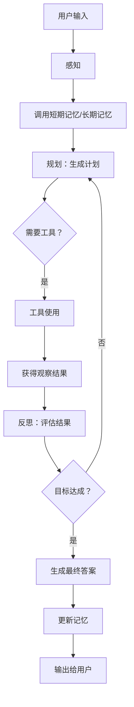

# Agent 完整详解：从概念到生产级实现

Agent 是继大模型和 Skill 之后，AI 应用工程的又一核心抽象。如果说 Skill 是“能力单元”，那么 Agent 就是“调度大脑”——它能够自主理解目标、规划步骤、调用 Skill 和工具、并根据执行结果动态调整，最终完成复杂任务。

本文将从概念、架构、实现、与 Skill 的关系、生产级落地等维度，全面介绍 Agent 的开发。

---

## 一、Agent 是什么？

**Agent（智能体）** 是一种能够**自主感知环境、做出决策、执行动作**的软件实体。在大模型应用语境下，Agent 通常指**基于 LLM 的推理引擎**，它接收用户目标，然后循环执行“思考-行动-观察”的过程，直到任务完成。

### 1.1 Agent vs Skill vs Tool vs Chain

| 概念 | 核心职责 | 抽象层次 | 是否包含推理 |
|------|----------|----------|--------------|
| **Tool** | 执行确定性操作（计算、查天气、发邮件） | 最低 | 否（纯函数） |
| **Skill** | 封装一个完整的任务能力（可包含多个 Tool 和模型调用） | 中 | 部分（可能包含内部 prompt） |
| **Agent** | 自主规划、决策、调用 Skill/Tool 完成任务 | 最高 | 是（核心是 LLM 推理） |
| **Chain** | 固定的执行步骤序列（无自适应） | 中 | 否 |

**一句话总结**：Agent 知道自己“要做什么、怎么做、做错了怎么办”，而 Skill 只知道“怎么做”。

## 二、Agent 的五要素

一个完整的 Agent 必须具备以下五个核心要素，缺一不可：

| 要素 | 英文 | 含义 | 类比人类 |
|------|------|------|----------|
| **感知** | Perception | 获取外部环境信息（用户输入、系统状态、工具返回结果等） | 用眼睛看、耳朵听 |
| **记忆** | Memory | 存储历史交互、中间结果、经验知识 | 大脑的记忆功能 |
| **规划** | Planning | 将复杂目标拆解为可执行的子任务，并决定执行顺序 | 制定旅行计划 |
| **工具使用** | Tool Use | 调用外部能力（计算器、搜索引擎、API、数据库） | 使用锤子、电脑 |
| **反思** | Reflection | 根据执行结果评估是否达成目标，并调整下一步策略 | 复盘、自我批评 |

这五个要素共同构成了 Agent 的智能闭环：**感知 → 规划 → 工具使用 → 反思 → 记忆更新 → 再次感知**。

根据五要素的实现复杂度，Agent 可以分为以下几类：

| Agent 类型 | 感知 | 记忆 | 规划 | 工具使用 | 反思 | 典型例子 |
|------------|------|------|------|----------|------|----------|
| **简单反射型** | 仅当前输入 | 无 | 无 | 极少 | 无 | 简单的聊天机器人 |
| **基于模型的** | 当前输入 + 模型内部状态 | 短期 | 简单 | 有 | 无 | 任务型对话系统 |
| **目标驱动型** | 丰富 | 短期+长期 | 分解目标 | 多种工具 | 基本 | ReAct Agent |
| **学习型** | 持续感知 | 经验积累 | 自适应 | 灵活 | 深度反思 | 能够自我进化的 Agent |

目前主流的 LLM Agent 属于“目标驱动型”或正在向“学习型”演进。

五要素的协作流程：



**示例（完整演示）：**

用户问：“帮我查一下北京天气，然后根据天气推荐一个活动。”

1. **感知**：接收用户问题
2. **记忆**：回忆之前用户问过上海天气（如果有）
3. **规划**：步骤1 = 获取天气；步骤2 = 推荐活动
4. **工具使用**：调用 `get_weather("北京")` → 得到“晴天，25度”
5. **反思**：天气获取成功，可以继续
6. **规划（继续）**：步骤2 = 推荐活动
7. **工具使用**（可选）：调用活动数据库或 LLM 直接推荐
8. **反思**：结果合理
9. **输出**：“北京明天晴天，25度，适合户外运动如骑车或徒步。”
10. **记忆更新**：将这次对话存入长期记忆

### 2.1.五要素细讲

#### 2.1.1 感知（Perception）

感知是 Agent 的“输入接口”。它负责从外部世界收集信息，并将这些信息转化为内部可处理的格式。

**感知的内容包括：**

- 用户的自然语言指令
- 系统状态（当前时间、用户位置、设备信息）
- 工具调用的返回结果
- 环境变化（如数据库数据更新）

**实现方式：**

- 对于文本输入：直接接收字符串
- 对于多模态（图像、音频）：通过专用的感知模型（如视觉模型、语音识别）转换为文本描述
- 对于结构化数据：解析 JSON、XML 等格式

**示例：**

```python
# 简单的文本感知
user_input = input("用户说：")
# 或者从 API 接收
request_data = request.json()
```

#### 2.1.2 记忆（Memory）

记忆让 Agent 能够“记住”过去发生的事情，从而做出更连贯、更合理的决策。记忆分为两种类型：

| 记忆类型 | 特点 | 存储内容 | 生命周期 |
|----------|------|----------|----------|
| **短期记忆** | 容量有限，快速读写 | 当前对话的几条消息、最近几次工具调用的结果 | 一个任务会话内 |
| **长期记忆** | 持久化存储，可检索 | 历史任务经验、用户偏好、常见问题解决方案 | 跨会话，永久保存 |

**短期记忆的实现：**

- 将对话消息列表保存在内存中
- 使用滑动窗口（保留最近 N 条消息）或摘要压缩

**长期记忆的实现：**

- 向量数据库（存储嵌入向量，用于语义检索）
- 传统数据库（存储结构化经验）
- 文件系统（存储日志）

**示例：**

```python
# 短期记忆
messages = [
    {"role": "user", "content": "北京天气如何？"},
    {"role": "assistant", "content": "我查一下..."}
]

# 长期记忆（向量检索）
import chromadb
collection = client.get_collection("memories")
results = collection.query(query_texts=["用户喜欢简洁回答"], n_results=3)
```

#### 2.1.3 规划（Planning）

规划是 Agent 的“大脑中枢”。它接收一个目标，将其分解为一系列可执行的步骤，并确定步骤之间的依赖关系。

**规划的层次：**

| 层次 | 说明 | 示例 |
|------|------|------|
| **目标分解** | 将大目标拆成小任务 | “写一份报告” → 收集数据、分析数据、撰写正文、生成图表 |
| **步骤排序** | 确定哪些任务必须先做 | 必须先收集数据，才能分析 |
| **资源分配** | 决定每个步骤用什么工具 | 收集数据用搜索引擎，分析用 Python 脚本 |

**实现方式：**

- 使用 LLM 直接生成计划（零样本或少样本提示）
- 使用专门的规划器（如 Chain-of-Thought、Tree-of-Thoughts）
- 结合固定流程模板（适用于确定性任务）

**示例（LLM 生成计划）：**

```
用户目标：帮我预订明天去上海的机票和酒店。

LLM 生成的计划：
1. 查询明天北京到上海的航班
2. 根据航班时间，选择附近的酒店
3. 预订机票
4. 预订酒店
5. 汇总信息发送给用户
```

#### 2.1.4 工具使用（Tool Use）

工具使用是 Agent 能够“动手做事”的关键。通过调用外部工具，Agent 可以执行计算、搜索、发送请求、操作文件等无法单纯靠语言模型完成的任务。

**工具的类型：**

| 工具类型 | 示例 | 调用方式 |
|----------|------|----------|
| 函数调用 | 计算器、字符串处理 | 直接执行本地函数 |
| API 调用 | 天气 API、支付接口 | HTTP 请求 |
| 数据库查询 | SQL 查询 | 数据库连接 |
| 脚本执行 | Python/Shell 脚本 | 子进程运行 |

**Agent 使用工具的典型流程：**

1. Agent 感知到需要某个工具
2. 生成工具调用请求（包括工具名和参数）
3. 执行工具，获得结果
4. 将结果放回感知中

**示例（Function Calling）：**

```python
# Agent 生成的工具调用请求
{
  "name": "get_weather",
  "arguments": {
    "city": "Beijing",
    "days": 3
  }
}
# 执行后得到结果
{ "temperature": 25, "condition": "sunny" }
```

#### 2.1.5 反思（Reflection）

反思是 Agent 的“自我修正”机制。它让 Agent 能够评估自己的行动结果，判断是否达成了目标，并根据评估结果调整后续策略。

**反思的步骤：**

1. **观察结果**：获得工具返回或环境变化
2. **评估**：是否达到预期？有没有错误？是否需要更多信息？
3. **调整**：如果未达成，修改计划、换用其他工具、向用户提问澄清
4. **学习**：将经验存入长期记忆，供未来使用

**示例：**

```
目标：获取北京明天的天气

行动：调用 get_weather(city="Beijing", date="2026-06-04")
观察：返回错误 "日期格式应为 YYYY-MM-DD"

反思：我的参数格式错了，应该是 "2026-06-04" 已经正确，可能是 API 不支持未来日期？
调整：尝试调用 get_weather_forecast(city="Beijing", days=1)
```

### 2.2. 如何实现一个最小 Agent（手写示例）

以下是一个不依赖任何框架的极简 Agent，它包含了五要素的基本思想：

```python
import json
from openai import OpenAI

client = OpenAI()

# 模拟长期记忆（向量检索简化版）
long_term_memory = []

def recall(query):
    """从长期记忆中检索相关信息（关键词匹配）"""
    for mem in long_term_memory:
        if query in mem:
            return mem
    return None

def agent_loop(user_input, max_steps=5):
    # 1. 感知
    messages = [{"role": "user", "content": user_input}]
    # 2. 调用短期记忆（messages 本身）
    # 3. 从长期记忆中检索相关经验
    hint = recall(user_input)
    if hint:
        messages.append({"role": "system", "content": f"相关经验：{hint}"})
    
    for step in range(max_steps):
        # 调用 LLM 进行推理和规划
        response = client.chat.completions.create(
            model="gpt-4o",
            messages=messages,
            tools=[{
                "type": "function",
                "function": {
                    "name": "get_weather",
                    "description": "获取天气",
                    "parameters": {"type": "object", "properties": {"city": {"type": "string"}}}
                }
            }]
        )
        msg = response.choices[0].message
        messages.append(msg)
        
        # 如果没有工具调用，结束
        if not msg.tool_calls:
            final_answer = msg.content
            break
        
        # 4. 工具使用
        for tc in msg.tool_calls:
            args = json.loads(tc.function.arguments)
            # 模拟工具执行
            result = f"{args['city']} 天气：晴天 25度"
            messages.append({
                "role": "tool",
                "tool_call_id": tc.id,
                "content": result
            })
        
        # 5. 反思（这里简单判断结果是否包含错误）
        if "error" in result.lower():
            # 调整策略：向用户确认
            messages.append({"role": "assistant", "content": "获取天气失败，请确认城市名是否正确"})
    
    # 更新长期记忆（将本次对话摘要存入）
    long_term_memory.append(f"用户问过{user_input[:20]}，回复是{final_answer[:50]}")
    
    return final_answer

print(agent_loop("北京天气怎么样？"))
```

这个例子虽然简单，但包含了五要素的雏形。

## 三、Agent 的经典架构

现代 LLM Agent 普遍采用 **ReAct（Reasoning + Acting）** 模式，由以下三个循环组件构成：

```
用户输入 → 推理(Reasoning) → 行动(Acting) → 观察(Observation) → 推理...
                ↑                                      │
                └──────────────────────────────────────┘
                                  ↓
                            最终答案
```

### 3.1 推理（Reasoning）

Agent 调用 LLM，在给定上下文（历史、可用工具描述、当前目标）下，输出推理过程和下一步计划。推理内容通常包括：

- 对用户意图的理解
- 对当前状态的分析
- 决定下一步调用哪个工具或直接回答

### 3.2 行动（Acting）

根据推理结果，Agent 执行一个具体动作：

- 调用一个 Skill/Tool，传入参数
- 向用户提问以获取更多信息
- 直接输出最终答案

### 3.3 观察（Observation）

执行动作后，Agent 获得外部返回结果（函数返回值、用户回复等），并将该结果作为新的“观察”添加到上下文中，供下一轮推理使用。

### 3.4 三种典型 Agent 变体

| 类型 | 工作方式 | 适用场景 |
|------|----------|----------|
| **ReAct** | 每步都输出显式的推理和行动 | 需要可解释性的复杂任务 |
| **Plan-and-Execute** | 先生成完整计划，再逐步执行 | 步骤可预知的任务（如数据流水线） |
| **Self-Ask** | 通过反复“追问自己”来检索信息 | 需要大量外部知识检索的任务 |

---

## 四、Agent 的两种主要实现方式

### 4.1 使用现成框架（推荐生产环境）

目前主流框架提供了开箱即用的 Agent 实现：

| 框架 | Agent 类型 | 特点 |
|------|------------|------|
| **LangChain** | `AgentExecutor` + `create_react_agent` | 生态最丰富，支持大量工具 |
| **LangGraph** | 基于状态图的 Agent | 高度可控，支持复杂循环和分支 |
| **AutoGen** | 多 Agent 协作 | 微软出品，适合多角色对话 |
| **CrewAI** | 角色化 Agent 团队 | 面向任务分解的角色协作 |
| **OpenAI Swarm** | 轻量级 Agent 编排 | 实验性质，简洁易用 |

**示例（LangChain ReAct Agent）**：

```python
from langchain.agents import create_react_agent, AgentExecutor
from langchain_openai import ChatOpenAI
from langchain.tools import tool

@tool
def get_weather(city: str) -> str:
    """获取指定城市天气"""
    return f"{city}：晴天，25度"

tools = [get_weather]
llm = ChatOpenAI(model="gpt-4o")

# ReAct 模板会自动提示模型按 Thought/Action/Observation 格式输出
agent = create_react_agent(llm, tools, prompt_template)
executor = AgentExecutor(agent=agent, tools=tools, verbose=True)

executor.invoke({"input": "北京天气如何？"})
```

### 4.2 手写 Agent 循环（理解原理）

如果你希望深入理解或定制行为，可以手写 Agent 主循环：

```python
import json
from openai import OpenAI

client = OpenAI()

def run_agent(user_input, tools, max_steps=5):
    messages = [{"role": "user", "content": user_input}]
    for _ in range(max_steps):
        # 调用 LLM，同时提供工具列表
        response = client.chat.completions.create(
            model="gpt-4o",
            messages=messages,
            tools=tools,   # 工具定义（OpenAI function calling 格式）
            tool_choice="auto"
        )
        msg = response.choices[0].message
        messages.append(msg)
        
        # 如果没有工具调用，直接返回最终回复
        if not msg.tool_calls:
            return msg.content
        
        # 执行工具调用
        for tool_call in msg.tool_calls:
            func_name = tool_call.function.name
            args = json.loads(tool_call.function.arguments)
            result = call_actual_tool(func_name, args)  # 实际执行函数
            messages.append({
                "role": "tool",
                "tool_call_id": tool_call.id,
                "content": str(result)
            })
    return "达到最大步数，任务未完成"
```

手写循环的优势是完全可控，但需要自己处理错误、重试、多轮、工具选择策略等。

---
