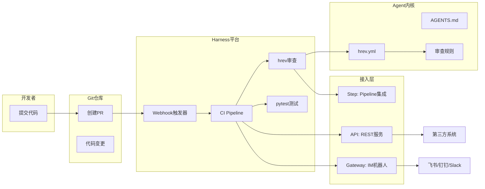

# Harness项目示例

## 🧰 第一步：准备工作

在开始前，请确保环境满足以下要求：

* **操作系统**：Windows, macOS, Linux
* **Node.js**：版本 >= 20
* **包管理器**：npm 或 yarn
* **Git**：版本控制工具
* **Git仓库**：一个 GitHub 或 Harness Code 仓库
* **LLM API Key**：OpenAI 或其他提供商的 API 密钥

### 验证环境

```bash
# 检查 Node.js 版本
node --version   # 需要 >= 20

# 检查 npm 版本
npm --version

# 检查 Git 版本
git --version
```

如果 Node.js 版本低于 20，请前往 [nodejs.org](https://nodejs.org/) 下载最新 LTS 版本。

### 安装 hrev

```bash
npm install -g @the-harness-dev/hrev
```

安装完成后，验证是否成功：

```bash
hrev --version
```

如果显示版本号，说明安装成功。

### 配置环境变量

```bash
# macOS / Linux
export HREV_API_KEY="your-api-key-here"
export HREV_API_URL="https://api.openai.com/v1"

# Windows (Command Prompt)
set HREV_API_KEY=your-api-key-here
set HREV_API_URL=https://api.openai.com/v1

# Windows (PowerShell)
$env:HREV_API_KEY="your-api-key-here"
$env:HREV_API_URL="https://api.openai.com/v1"
```

> **注意**：如果使用其他兼容 OpenAI 的端点，请相应修改 `HREV_API_URL`。
> **安全建议**：请勿在代码中硬编码 API 密钥。在 CI 环境中，应使用平台的密钥管理功能。

## 🏗️ 第二步：项目初始化

### 创建项目目录

```bash
# 创建项目目录
mkdir my-harness-project
cd my-harness-project

# 初始化 Git 仓库
git init

# 初始化 npm 项目
npm init -y
```

### 创建示例源代码

```bash
# 创建源码目录
mkdir -p src

# 创建一个示例 Python 文件作为被审查的代码
cat > src/calculator.py << 'EOF'
"""一个简单的计算器模块。"""

def add(a: int, b: int) -> int:
    return a + b

def subtract(a: int, b: int) -> int:
    return a - b

def multiply(a: int, b: int) -> int:
    return a * b

def divide(a: int, b: int) -> float:
    if b == 0:
        raise ValueError("Cannot divide by zero")
    return a / b
EOF
```

### 创建单元测试

```bash
# 创建测试目录
mkdir -p tests

# 创建测试文件
cat > tests/test_calculator.py << 'EOF'
import pytest
from src.calculator import add, subtract, multiply, divide

def test_add():
    assert add(1, 2) == 3

def test_subtract():
    assert subtract(5, 3) == 2

def test_multiply():
    assert multiply(4, 5) == 20

def test_divide():
    assert divide(10, 2) == 5

def test_divide_by_zero():
    with pytest.raises(ValueError):
        divide(10, 0)
EOF
```

### 配置 pytest

```bash
# 安装 pytest
npm install -g pytest || pip install pytest

# 创建 pytest 配置文件
cat > pytest.ini << 'EOF'
[pytest]
testpaths = tests
python_files = test_*.py
python_classes = Test*
python_functions = test_*
EOF
```

## ⚙️ 第三步：配置 hrev 规则

hrev 的核心是 `hrev.yml` 文件，它定义了 AI 审查需要检查的规则。我们创建一个包含三种规则类型的文件：

```yaml
# hrev.yml - AI 代码审查规则配置

# 全局模型配置，如果没有指定 API_URL，将通过环境变量 HREV_API_URL 获取
model: gpt-4o

rules:
  # 规则1: blocker 级别 - 业务完整性检查
  - id: audit-log-bypass
    description: "所有涉及资金变动的API必须记录审计日志，不允许绕过审计日志模块。"
    severity: blocker   # 违规会导致审查失败
    path: "src/payment/"

  # 规则2: warning 级别 - 代码组织检查
  - id: no-duplicate-utilities
    description: |
      请检查新增的工具函数是否已在项目中存在，避免重复造轮子。
      如果存在，建议复用现有函数而不是新建。可以使用 search_file 工具确认。
    severity: general   # warning 级别，提出警告但不阻断
    path: "src/utils/"

  # 规则3: 架构约束检查
  - id: mcp-first-design
    description: |
      所有新的核心操作逻辑必须首先设计为MCP工具，Web UI作为上层调用。
      如果发现直接将业务逻辑写在API层而没有通过MCP，应标记为违反规则。
    severity: blocker
    path: "src/"

  # 规则4: 自定义业务规则（按需添加）
  - id: no-silent-exceptions
    description: "禁止在 except 块中仅使用 pass 沉默异常，必须记录日志或向上抛出。"
    severity: general
    path: "src/"

  # 规则5: 强制依赖方向检查
  - id: dependency-direction
    description: |
      API层不能直接调用Repository层，必须通过Service层进行隔离。
      违反这个架构约束会导致维护困难。
    severity: blocker
    path: "src/api/"

  # 规则6: 使用更便宜的模型处理低优先级规则
  - id: naming-convention
    description: "私有方法应使用下划线前缀，如 _helper_method。"
    severity: nit          # nit 级别，最小的建议，完全不阻断
    model: gpt-4o-mini     # 此规则使用更便宜的模型
    path: "src/"
```

> **规则定义的最佳实践**：
>
> * 能用单元测试覆盖的逻辑，不要写成 AI 规则
> * 能用 Linter 自动修复的格式问题，不要写成 AI 规则
> * AI 规则适用于：架构约束、跨切面关注点、业务语义完整性

### 测试 hrev 配置

```bash
# 测试 hrev 配置是否有效
hrev --help
```

> **故障排查**：如果遇到模型解析错误，请检查环境变量 `HREV_MODEL` 或 `hrev.yml` 中的 `model` 字段是否正确配置。

## 📋 第四步：创建 AGENTS.md 文件

`AGENTS.md` 是给 AI Agent 看的"操作手册"，提供项目的核心背景和工作流程。

```markdown
# AGENTS.md - 代码审查项目操作手册

## 🎯 项目目标
这是一个演示 Harness 工程化方法的示例项目，包含 Python 计算器模块。

## 🏗️ 核心架构
本项目采用简洁的分层架构：
- `src/` 存放核心业务逻辑
- `tests/` 存放单元测试
- 禁止在 `src/` 内互相引用导致循环依赖

## 📏 代码审查重点关注
1. **语义正确性**：AI 生成代码的业务逻辑是否与需求一致
2. **架构约束**：是否遵循分层依赖规则
3. **完整性**：是否包含了必要的错误处理和单元测试

## ⚙️ 审查工作流程
1. 运行 `hrev` 进行语义规则审查
2. 运行 `pytest` 验证测试通过
3. 汇总结果并决定是否通过审查

## 🤖 可用的自动化工具
- `hrev`：基于自然语言规则的代码审查
- `pytest`：单元测试执行
```

> **注意**：`AGENTS.md` 应作为地图，保持 100 行以内的目录式结构，指向更详细的文档。

## 🔧 第五步：构建 CI/CD 流水线

在 Harness 平台中，我们创建一个自动化审查流水线。首先，在本地创建一个 YAML 配置文件 `harness-pipeline.yml`：

```yaml
# harness-pipeline.yml
# 将此文件放在项目的 .harness/ 目录下

pipeline:
  name: AI Code Review Pipeline
  identifier: ai_code_review
  projectIdentifier: your_project
  orgIdentifier: default

  stages:
    - stage:
        name: Code Review Stage
        identifier: code_review
        type: CI
        spec:
          cloneCodebase: true
          platform:
            os: Linux
            arch: Amd64
          runtime:
            type: Cloud
            spec: {}
          execution:
            steps:
              # Step 1: 安装依赖
              - step:
                  type: Run
                  name: Install Dependencies
                  identifier: install_deps
                  spec:
                    shell: Sh
                    command: |-
                      npm install -g @the-harness-dev/hrev
                      pip install pytest || echo "pytest already installed"

              # Step 2: 执行 hrev 语义审查
              - step:
                  type: Run
                  name: Run hrev Semantic Review
                  identifier: run_hrev
                  spec:
                    shell: Sh
                    command: |-
                      hrev --config hrev.yml --base main --head ${CI_COMMIT_REF_NAME} --json
                  # 可选：设置超时时间
                  timeout: 10m

              # Step 3: 运行 pytest 单元测试
              - step:
                  type: Run
                  name: Run Unit Tests
                  identifier: run_tests
                  spec:
                    shell: Sh
                    command: |-
                      pytest tests/ -v --tb=short

              # Step 4: 汇总审查结果
              - step:
                  type: Run
                  name: Aggregate Results
                  identifier: aggregate
                  spec:
                    shell: Sh
                    command: |-
                      echo "=== AI Code Review Complete ==="
                      echo "✅ hrev semantic check passed"
                      echo "✅ pytest unit tests passed"
```

### 在 Harness 平台创建流水线

如果你正在使用 Harness 平台，可以按照以下步骤创建 CI 流水线：

1. 登录 Harness 平台，进入你的项目。
2. 在左侧导航栏中，选择 **Pipelines** -> **Create a Pipeline**。
3. 填写流水线名称，如 `AI Code Review Pipeline`。
4. 添加一个 **CI Stage**，配置代码库连接。
5. 将上面的 YAML 内容填入流水线配置中。

## ⚡ 第六步：设置 Webhook 触发器

为了实现自动化，我们将配置 Webhook 触发器，让审查流水线在 PR 创建或更新时自动运行。

1. 在 Harness 平台中，进入你的流水线。
2. 点击 **Triggers** 选项卡 -> **New Trigger**。
3. 选择 **Webhook** 触发器类型。
4. 配置以下内容：
    * **Name**：例如 `pr-code-review-trigger`
    * **Connector**：选择你的 Git 仓库连接器
    * **触发事件 (Events)**：选择 `Pull Request` 操作，并勾选以下子事件：
        * `Opened` (PR 创建)
        * `Reopened` (PR 重新打开)
        * `Synchronize` (PR 有新的代码推送)
    * **Conditions**（可选）：你可以添加过滤条件，例如：
        * 仅当目标分支为 `main` 或 `master` 时触发
        * 仅当变更的文件符合某些模式时才触发（如 `src/**`）

5. 保存触发器。

保存后，Harness 会生成一个 Webhook URL。你需要将这个 URL 配置到你的 Git 仓库的 Webhook 设置中。对于 GitHub 仓库：

1. 进入你的 GitHub 仓库 -> **Settings** -> **Webhooks** -> **Add webhook**。
2. 将 Harness 提供的 URL 粘贴到 **Payload URL** 字段。
3. 选择 **Content type** 为 `application/json`。
4. 在 "Which events would you like to trigger this webhook?" 中，选择 **Let me select individual events**，然后勾选 **Pull requests**。
5. 点击 **Add webhook** 完成配置。

## ✅ 第七步：测试与验证

完成配置后，我们通过一个完整的变更流程来测试整个系统。

### 7.1 创建变更

```bash
# 创建新分支
git checkout -b feature/add-payment

# 模拟违反规则的代码变更
echo '
def process_payment(amount, user_id):
    # 违反 audit-log-bypass 规则：支付操作没有记录审计日志
    # 违反 no-silent-exceptions 规则：异常被静默吞噬
    try:
        result = amount * 100
        return result
    except:
        pass
' >> src/payment.py

# 提交变更
git add .
git commit -m "feat: add payment processing (test for review)"

# 推送到远程仓库
git push origin feature/add-payment
```

### 7.2 创建 Pull Request

1. 在 Git 仓库中，为 `feature/add-payment` 分支创建一个新的 PR，目标分支为 `main`。
2. PR 创建后，Harness Webhook 会自动触发我们之前创建的 `AI Code Review Pipeline`。

### 7.3 预期结果

流水线运行后，你会看到：

1. **hrev 审查步骤**会：
    * 检测到 `src/payment.py` 中的支付逻辑缺少审计日志，违反规则 `audit-log-bypass`（blocker 级别）。
    * 检测到 `except: pass` 语句静默吞噬异常，违反规则 `no-silent-exceptions`（general 级别）。

2. **pytest 单元测试步骤**会执行并验证现有代码的正确性。

3. **汇总结果**：由于检测到了 blocker 级别的违规，流水线最终会标记为 **失败 (Failed)**。

这个失败状态会通过 Webhook 回传到你的 Git 仓库，在 PR 页面上显示为“检查未通过”，从而阻止 PR 被合并，起到了代码质量门禁的作用。

## 🚀 第八步：三种接入形态的部署方式

开发完成后，可以根据使用场景选择不同的接入方式。

### 8.1 Step 形态：Harness Pipeline 原生集成

这是最简单、最正统的集成方式。

**操作步骤**：

1. 在 Harness 平台进入你的 Pipeline，点击 **Add Step** 或 **Edit Pipeline**。
2. 在 Step 库中搜索“Run”或“hrev”，选择 **Run** 步骤。
3. 在 Command 窗口中，输入以下命令：

    ```bash
    npm install -g @the-harness-dev/hrev
    hrev --config hrev.yml --base origin/main --head ${CI_COMMIT_BRANCH}
    ```

4. 保存 Pipeline，并将该 Step 拖放到 CI Stage 的合适位置。之后，该 Step 就会像普通插件一样在每个 Pipeline 运行时被执行。

### 8.2 API 形态：封装为 REST API 服务

**目标**：将 `hrev` 审查功能封装成 HTTP 服务，供外部系统调用。

```python
# app.py - FastAPI 应用
from fastapi import FastAPI, HTTPException
from pydantic import BaseModel
import subprocess
import os
import tempfile

app = FastAPI(title="Harness Code Review API")

class ReviewRequest(BaseModel):
    diff_content: str          # Git diff 内容
    rules_config: str = None   # 可选的自定义规则配置

class ReviewResponse(BaseModel):
    status: str
    violations: list

@app.post("/api/v1/review", response_model=ReviewResponse)
async def review_code(request: ReviewRequest):
    """执行代码审查并返回违规列表"""
    try:
        # 将 diff 内容保存到临时文件
        with tempfile.NamedTemporaryFile(mode='w', suffix='.diff', delete=False) as f:
            f.write(request.diff_content)
            diff_path = f.name

        # 执行 hrev 命令
        cmd = [
            "hrev", "--diff", diff_path, "--json"
        ]
        result = subprocess.run(cmd, capture_output=True, text=True)

        # 清理临时文件
        os.unlink(diff_path)

        if result.returncode == 0:
            return ReviewResponse(status="passed", violations=[])
        else:
            # 解析 JSON 输出获取违规详情
            import json
            violations = json.loads(result.stdout) if result.stdout else []
            return ReviewResponse(status="failed", violations=violations)

    except Exception as e:
        raise HTTPException(status_code=500, detail=str(e))

@app.get("/api/v1/health")
async def health_check():
    return {"status": "healthy"}
```

**启动服务**：

```bash
pip install fastapi uvicorn
uvicorn app:app --host 0.0.0.0 --port 8000 --reload
```

**调用示例**：

```bash
# 获取 Git diff
git diff main > changes.diff

# 调用 API
curl -X POST http://localhost:8000/api/v1/review \
  -H "Content-Type: application/json" \
  -d "{\"diff_content\": \"$(cat changes.diff)\"}"
```

### 8.3 Gateway 形态：多 IM 平台接入

Gateway 形态让你的 Agent 能够以机器人的形式出现在飞书、钉钉、Slack 等多个平台上。其核心工作流为：IM 平台收到用户消息 -> Gateway 统一格式 -> 转发到审查 Agent -> 处理 -> 返回结果。

**实现思路（Python + FastAPI 实现一个简单网关）**：

```python
# gateway.py - 统一消息网关
from fastapi import FastAPI, Request
from pydantic import BaseModel
import httpx

app = FastAPI(title="Harness Review Gateway")

class UnifiedMessage(BaseModel):
    platform: str        # feishu, dingtalk, slack
    user_id: str
    channel_id: str
    content: str

# 配置各个平台的 Webhook 地址
PLATFORM_WEBHOOKS = {
    "feishu": "https://open.feishu.cn/open-apis/bot/v2/hook/xxx",
    "dingtalk": "https://oapi.dingtalk.com/robot/send?access_token=xxx",
    "slack": "https://hooks.slack.com/services/xxx/xxx/xxx"
}

@app.post("/webhook/feishu")
async def feishu_webhook(request: Request):
    """接收飞书的消息"""
    payload = await request.json()
    # 将飞书格式转换为统一格式
    unified = UnifiedMessage(
        platform="feishu",
        user_id=payload.get("sender", {}).get("sender_id"),
        channel_id=payload.get("message", {}).get("chat_id"),
        content=payload.get("message", {}).get("text", "")
    )
    # 转发到审查 Agent
    return await forward_to_agent(unified)

@app.post("/webhook/dingtalk")
async def dingtalk_webhook(request: Request):
    """接收钉钉的消息"""
    payload = await request.json()
    unified = UnifiedMessage(
        platform="dingtalk",
        user_id=payload.get("senderStaffId"),
        channel_id=payload.get("conversationId"),
        content=payload.get("text", {}).get("content", "")
    )
    return await forward_to_agent(unified)

@app.post("/webhook/slack")
async def slack_webhook(request: Request):
    """接收 Slack 的消息"""
    payload = await request.json()
    unified = UnifiedMessage(
        platform="slack",
        user_id=payload.get("user_id"),
        channel_id=payload.get("channel_id"),
        content=payload.get("text", "")
    )
    return await forward_to_agent(unified)

async def forward_to_agent(message: UnifiedMessage):
    """将统一格式的消息转发给审查 Agent"""
    async with httpx.AsyncClient() as client:
        # 调用 Agent 的 API 端点
        response = await client.post(
            "http://localhost:8000/api/v1/review",
            json={"diff_content": message.content}
        )
        result = response.json()

    # 将结果按平台格式返回
    platform_response = format_by_platform(result, message.platform)
    async with httpx.AsyncClient() as client:
        await client.post(PLATFORM_WEBHOOKS[message.platform], json=platform_response)

    return {"status": "ok"}

def format_by_platform(result, platform):
    """根据平台格式化响应消息"""
    if platform == "feishu":
        return {
            "msg_type": "text",
            "content": {"text": f"审查结果: {result.get('status', 'unknown')}"}
        }
    elif platform == "dingtalk":
        return {
            "msgtype": "text",
            "text": {"content": f"审查结果: {result.get('status', 'unknown')}"}
        }
    else:  # slack
        return {"text": f"审查结果: {result.get('status', 'unknown')}"}
```

启动网关服务：

```bash
pip install fastapi uvicorn httpx
uvicorn gateway:app --host 0.0.0.0 --port 9000 --reload
```

**配置说明**：

1. 在飞书开发者后台创建机器人，将事件回调地址配置为 `http://your-domain/webhook/feishu`。
2. 在钉钉开发者后台创建机器人，将消息接收地址配置为 `http://your-domain/webhook/dingtalk`。
3. 在 Slack 创建 Slash Command 或 Event Subscription，将请求 URL 指向 `http://your-domain/webhook/slack`。

完成配置后，用户就可以在各个 IM 平台中直接与你的 AI 审查 Agent 交互。

## 📊 架构总览

整个项目打通了从规则配置到自动触发的完整链路，其核心架构如下：



## 📁 项目文件清单

完成以上步骤后，你的项目目录结构应该是这样的：

```
my-harness-project/
├── .harness/
│   └── harness-pipeline.yml   # 流水线配置
├── src/
│   ├── calculator.py          # 示例源码
│   └── payment.py             # 用于测试的变更文件
├── tests/
│   └── test_calculator.py     # 单元测试
├── AGENTS.md                  # Agent 操作手册
├── hrev.yml                   # AI 审查规则配置
├── pytest.ini                 # pytest 配置
├── app.py                     # API 服务 (可选)
├── gateway.py                 # IM 网关 (可选)
└── package.json               # npm 配置
```

## 💡 常见问题排查

| 问题 | 解决方案 |
| :--- | :--- |
| `hrev` 命令未找到 | 确保 Node.js >= 20，重新运行 `npm install -g @the-harness-dev/hrev` |
| 模型解析错误 | 检查 `hrev.yml` 中是否配置了 `model` 字段，或设置了 `HREV_MODEL` 环境变量 |
| Webhook 未触发 | 在 Harness 中检查 Trigger 配置，确保 Connector 权限正确；在 Git 仓库中验证 Webhook 是否配置成功 |
| API Key 认证失败 | 确认 `HREV_API_KEY` 环境变量已正确设置，且 API URL 与 Key 所属服务匹配 |

---

所有代码和配置文件已完整给出，你可以按照以上步骤一步步操作，就能搭建一个完整的、可工作的 AI 代码审查 Harness 项目。如果在某个步骤卡住了，欢迎继续提问。
