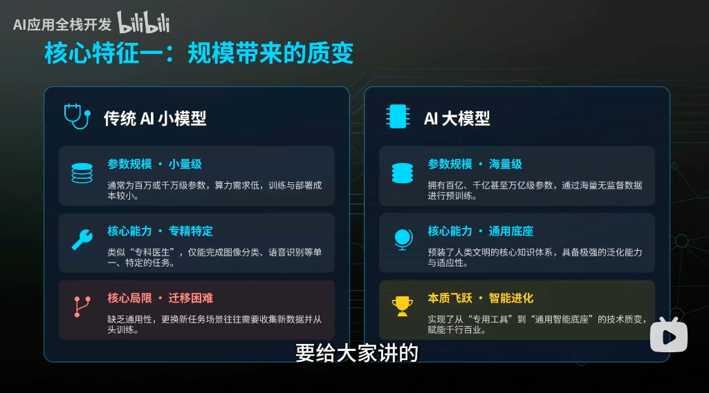
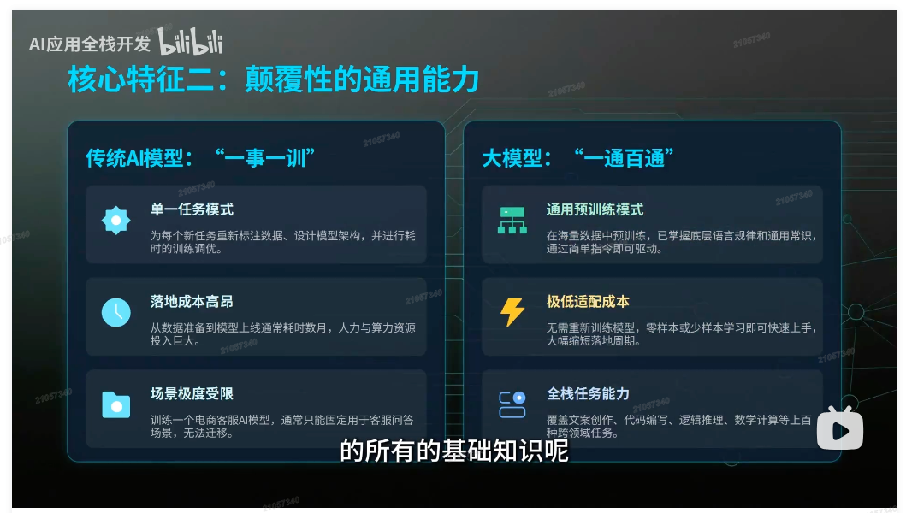
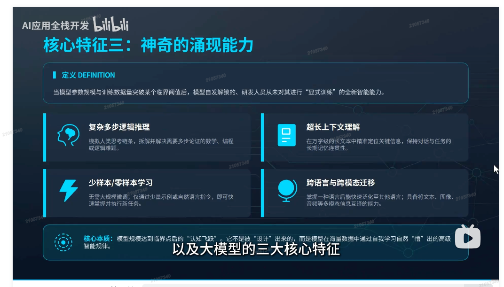
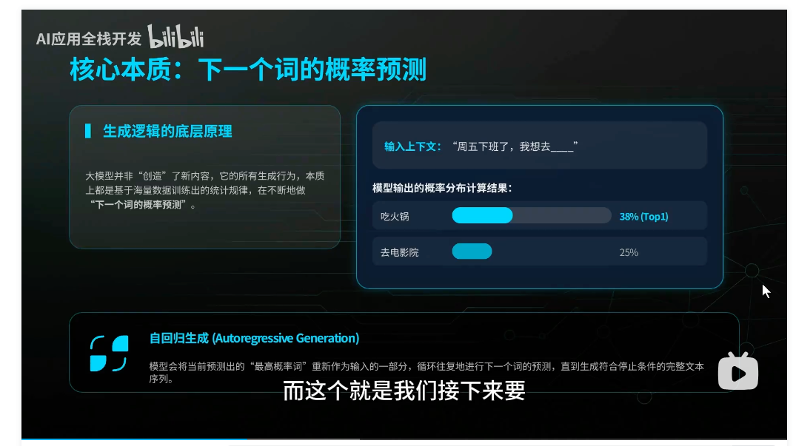
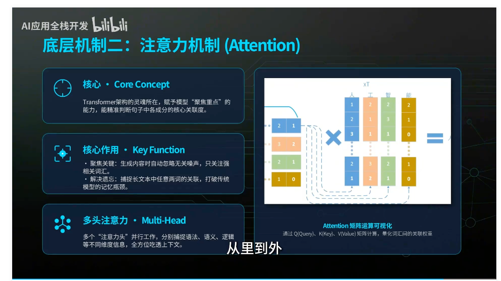
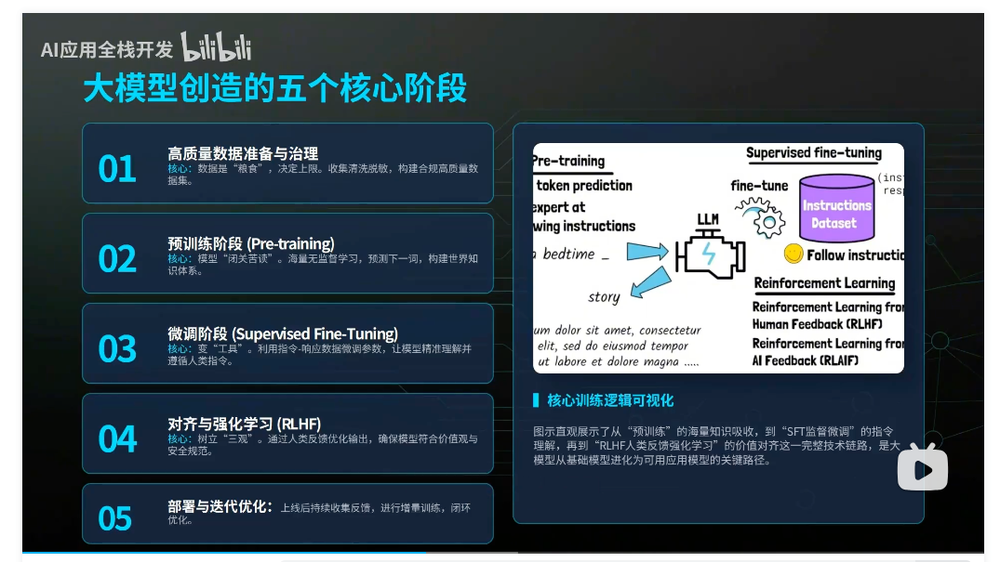
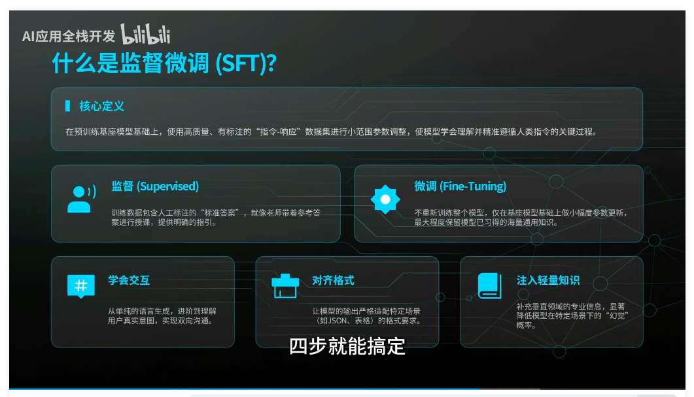
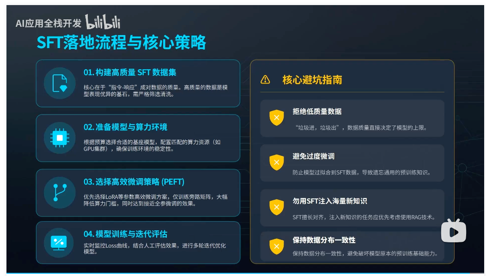
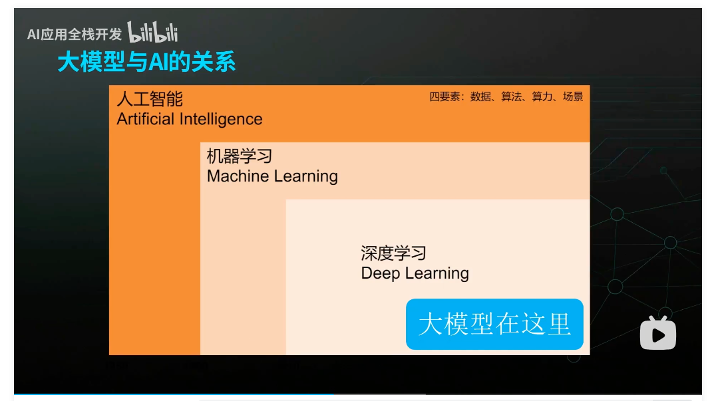

# 大模型

## 什么是大模型

- 广义：覆盖文本、图像、音频、视频等多种信息形态，具备综合感知与生产能力的多模态人工模型。   - 这里说一下所谓多模态其实就是多种领域形态的处理能力。
- 狭义：专注于语言理解与生成的大规模预训练语言模型（Large Language Model ，简称LLM），是当前AI领域的核心技术基座。
- 标准定义：基于海量合规数据预训练，具备百亿至万亿级参数，能深度理解生成人类语言，并可跨场景完成复杂智能任务的人工智能模型。

>我的理解，大模型更贴切的称呼是-大语言模型，能理解人类语言（这也是AI人工智能的核心）。  所谓多模态模型，其实就是能处理不同领域数据的模型，处理如文本、图像、音视频等数据

### 大模型与传统AI区别

大模型具有如下特征：

1. 量变引起质变： 传统AI模型数据量小，且只能专注一个任务领域，而现在的大模型通过海量数据进行训练，能够处理不同领域数据。  

2. 颠覆性的通用能力：原来AI小模型只能专注一个任务。  但现在通过算法进步、大量数据训练，大模型具备多领域学习能力，可以像人一样处理多个科目，且科目内容容变化不需要重新训练，因为模型已经在训练时通过海量数据掌握了这些内容，会自动适应。

3. 神奇的涌现能力：当训练突破某个临界值后，自发解锁，研发人员从未**显式**训练过的全新智能能力

## 大模型工作原理

核心本质：下一个词的概率预测 - 依据统计规律算出下一个词的概率，通过`自回归生成`处理将最高概率词作为输入的一部分，循环进行下一个词预测，最终生成符合停止条件的完整文本

### 底层机制-：词嵌入（Tokneization）

- 核心目的（Purpose）：将人类语言（文本）转换为计算机可以识别处理多维数字向量
- 执行过程（Process）：
    1. 拆分token：将文本切分为最小语义单元（中文：1词≈1.5字   英文：1词≈4个字符）
    2. 生成嵌入：为每个token生成包含语义、情感的”数字身份证“向量
- 机制效果（Effect） ：模型通过计算向量间的距离 理解语义关联，如：国王-男人 ≈ 国王-女人  这两种身份类似

### 底层机制二：注意力机制（Attention）

- 核心（Core Concept）：Transformer架构的灵魂所在，赋予模型聚焦重点的能力，能精准判断句子中各成分的核心关联度
- 核心作用（Key Function）
  - 聚焦关键：生成内容时自动忽略无关噪声，只关注强相关词汇
  - 解决遗忘：捕捉长文本中任意两词的关联，打破传统模型的记忆瓶颈
- 多头注意力（Multi-Head Attention）：多个”注意力头“并行工作，分别捕捉语法、语义、逻辑等不同维度信息，全方位吃透上下文

简单来说，有了注意力机制，大模型可以依据向量关联权重，将重点词汇提取出来，并忽略无关噪声，从而提高生成内容的质量。

---

## 大模型如何被创造出来的？

分三个模块，共5个核心阶段：

1. 打基础
    - 高质量数据准备与治理：数据是粮食，决定上限，收集清洗脱敏，构建合规高质量数据集。
    - 预训练阶段（Pre-training）：模型“闭关苦读”，海量无监督学习，预测下一词，构建世界知识体系
2. 懂规矩
    - 微调阶段（Supervised Fine-Tuning）：变“工具”。 利用指令-响应数据微调参数，让模型精准理解并遵循人类指令。

3. 持续成长
    - 对齐与强化学习（RLHF）：树立三观。通过人类反馈优化输出，确保模型符合价值观和安全规范。
    - 部署与迭代优化：上线后持续收集反馈，进行增量训练，闭环优化。

### 监督微调（SFT，Supervised Fine-Tuning）

核心定义：在预训练基座模型基础上，使用高质量、有标注的“指令”-“响应”数据集进行小范围参数调整，使得模型学会理解并遵循人类指令的关键过程。

#### SFT流程

1. 构建高质量SFT数据集
2. 准备模型与算力环境
3. 选择高效微调策略（PEFT）
4. 模型训练与迭代评估

---

## 大模型与AI（Artificial Intelligence，人工智能）的关系

大模型是AI的顶尖成果，但不是AI的全部

