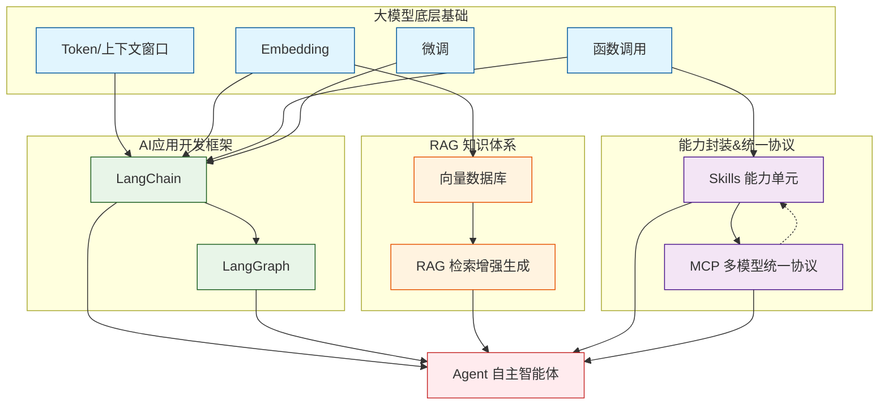

# 大模型应用结构学习路线

## 一、名词标准校正释义

1. **函数调用**：大模型识别意图、按规范调用外部工具，并用返回结果完成任务的基础能力。
2. **Skills**：封装好的标准化可复用**能力单元**，是能被模型/Agent直接调用的具体技能。
3. **MCP**：函数调用的进阶统一协议，**定义 Skills 接入标准**，屏蔽大模型接口差异，实现多模型、多技能互通调度。
4. **LangChain**：大模型AI应用开源开发框架，提供组件、链式调用、RAG、Agent 开发基础能力。
5. **LangGraph**：基于 LangChain 的**有状态复杂Agent编排框架**，支持分支、循环、多节点复杂流程。
6. **Agent**：具备感知、规划、工具调用、自主决策，能独立完成复杂目标的智能体。
7. **RAG**：检索增强生成，给模型外挂私有知识库，实时检索外部知识融入回答，弥补模型静态知识滞后。
8. **向量数据库**：专门存储 Embedding 向量、提供高性能语义检索，是 RAG 的核心存储检索组件。
9. **微调**：在预训练基座模型上，用业务专属数据二次训练，让模型适配行业话术、业务逻辑和风格。
10. **Embedding**：把文本、非结构化数据转换成**低维语义向量**，用于语义匹配和向量检索。
11. **Token / 上下文窗口**：Token 是模型处理、计数、计费最小单位；上下文窗口是模型单次能处理的最大 Token 容量上限。

## 二、核心层级逻辑（一句话版）

底层基本功：Token、Embedding、函数调用、微调
中间能力层：函数调用封装成 Skills，MCP 统一规范管控 Skills
知识外挂层：Embedding → 向量数据库 → RAG
开发框架层：LangChain 做底座，LangGraph 编排复杂流程
顶层应用：所有能力整合，产出可自主干活的 Agent

## 三、超好背记忆口诀

Token定长短，Embedding转向量；
函数调用会干活，微调驯化懂业务。

函数调用生技能，Skills打包成单元；
MCP立标准，统一管控所有Skills。

文本转向量存库，向量数据库来守住；
RAG外挂知识库，实时补全不会落伍。

LangChain搭底座，LangGraph编排复杂活；
所有能力凑一起，化身Agent自主干活。

## 四、完整版Mermaid关系图（已补全Skills与MCP关联）

复制到 <https://mermaid.live> 直接生成可视化图

## 五、关键关系总结

1. **Skills 是具体技能**，MCP 是技能的统一标准和调度规则，二者强绑定；
2. 所有底层能力、RAG、框架、Skills、MCP 最终都服务于 Agent；
3. 实线是依赖生成关系，虚线是标准约束关系。

你直接复制上面整段，存到备忘录、笔记软件就能永久复用。
