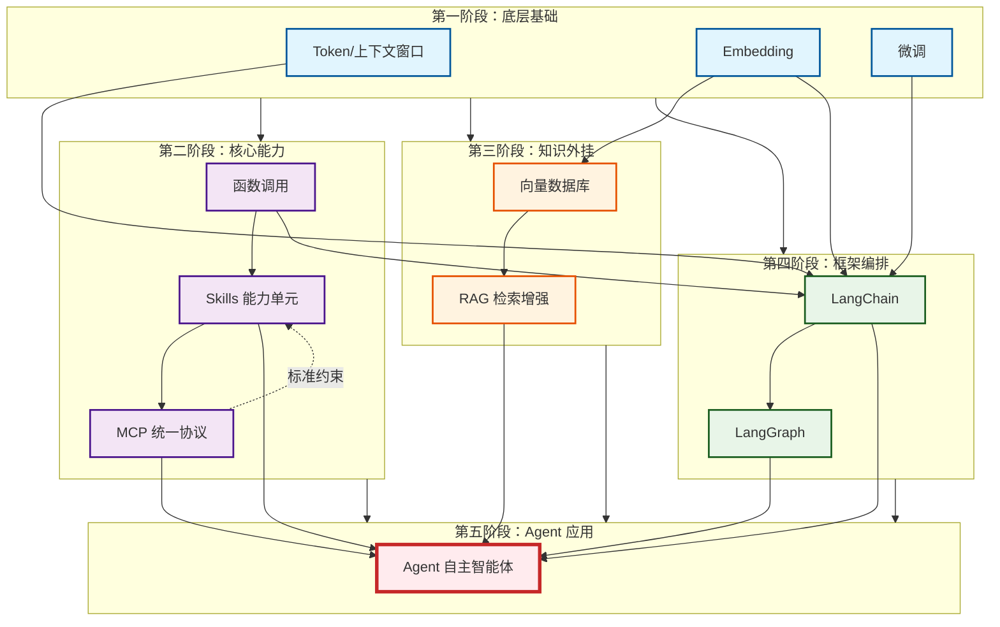

# 🚀 大模型应用开发全景学习指南

你好！我是灵码。基于你提供的《大模型-层级结构.md》文档内容，我为你规划了一份从基础概念到高级应用开发的系统性学习路线。

这份指南严格遵循“底层原理 → 核心能力 → 知识增强 → 框架编排 → 智能体构建”的递进逻辑，旨在帮助你建立完整的大模型应用开发知识体系。

## 📅 第一阶段：夯实底层基础 (The Foundation)

**目标**：理解大模型工作的基本单元和数据处理方式，掌握模型交互的底层逻辑。

### 1.1 大模型交互基石

* **核心概念**：`Token` 与 `上下文窗口`
* **学习重点**：
  * 理解 `Token` 作为计费、处理和计数的最小单位。
  * 掌握 `上下文窗口` 的限制及其对长文本处理的影响。
  * **实践**：计算不同长度文本的 Token 消耗，体验上下文溢出场景。

### 1.2 语义向量化技术

* **核心概念**：`Embedding`
* **学习重点**：
  * 理解如何将非结构化文本转换为低维语义向量。
  * 掌握向量空间中的相似度计算（如余弦相似度）。
  * **实践**：使用开源 Embedding 模型将句子转化为向量，并计算句子间的语义距离。

### 1.3 模型适配与优化

* **核心概念**：`微调` (Fine-tuning)
* **学习重点**：
  * 理解预训练基座模型与业务专属数据的结合方式。
  * 了解微调在适配行业话术、业务逻辑和风格中的作用。
  * **实践**：尝试使用少量数据集对一个小规模开源模型进行指令微调（SFT）。

---

## 🛠️ 第二阶段：掌握核心能力 (Core Capabilities)

**目标**：让大模型具备“行动”能力，并实现能力的标准化封装。

### 2.1 函数调用机制

* **核心概念**：`函数调用` (Function Calling)
* **学习重点**：
  * 理解模型如何识别意图并按规范调用外部工具。
  * 掌握定义工具描述（Schema）的技巧，确保模型准确参数提取。
  * **实践**：编写一个简单的天气查询或计算器工具，并通过 API 让模型调用它。

### 2.2 技能封装与标准化

* **核心概念**：`Skills` 与 `MCP` (Model Context Protocol)
* **学习重点**：
  * **Skills**：学习将具体的函数调用封装为可复用的标准化能力单元。
  * **MCP**：理解 MCP 作为统一协议，如何屏蔽不同模型接口差异，实现多模型、多技能的互通调度。
  * **关系**：明确 `函数调用` 生成 `Skills`，`MCP` 制定 `Skills` 接入标准。
  * **实践**：创建一个标准的 Skill 模块，并尝试通过 MCP 协议进行注册和调用。

---

## 📚 第三阶段：构建知识外挂 (RAG System)

**目标**：解决模型知识滞后问题，构建私有知识库检索增强系统。

### 3.1 向量存储与检索

* **核心概念**：`向量数据库`
* **学习重点**：
  * 了解主流向量数据库（如 Milvus, Chroma, Pinecone等）的基本操作。
  * 掌握向量的存入、索引构建和高性能语义检索流程。

### 3.2 检索增强生成实战

* **核心概念**：`RAG` (Retrieval-Augmented Generation)
* **学习重点**：
  * 理解 RAG 全流程：文档切片 → Embedding → 存入向量库 → 检索相关片段 → 注入 Prompt → 模型生成。
  * 掌握如何解决检索不精准、上下文丢失等常见痛点。
  * **实践**：搭建一个基于本地 PDF 文档的智能问答助手。

---

## 🏗️ 第四阶段：框架与编排 (Framework & Orchestration)

**目标**：利用成熟框架提高开发效率，处理复杂业务逻辑。

### 4.1 应用开发底座

* **核心概念**：`LangChain`
* **学习重点**：
  * 掌握 LangChain 的核心组件：Prompts, Models, Output Parsers, Chains。
  * 学习如何使用 LangChain 快速集成 LLM、向量数据库和工具。
  * **实践**：使用 LangChain 重构之前的 RAG 应用，简化代码结构。

### 4.2 复杂流程编排

* **核心概念**：`LangGraph`
* **学习重点**：
  * 理解基于图（Graph）的状态机编排理念。
  * 掌握分支、循环、多节点状态保持等复杂流程控制。
  * 对比 LangChain 的线性链式调用与 LangGraph 的有状态循环优势。
  * **实践**：设计一个包含“用户输入校验 → 搜索 → 结果评估 → 重试/输出”循环流程的 Agent。

---

## 🤖 第五阶段：智能体终极形态 (Agent Construction)

**目标**：整合所有能力，构建具备感知、规划、决策能力的自主智能体。

### 5.1 Agent 架构设计

* **核心概念**：`Agent`
* **学习重点**：
  * 理解 Agent 的核心闭环：感知 (Perception) → 规划 (Planning) → 工具调用 (Action) → 反思 (Reflection)。
  * 整合前四阶段知识：底层基础 + Skills/MCP + RAG + LangGraph 编排。
  * **实践**：构建一个全能型 Agent，既能回答私有知识库问题（RAG），又能执行具体任务（Skills），并能自主规划多步操作（LangGraph）。

### 5.2 综合项目实战

* **目标**：产出可自主干活的 Agent 应用。
* **建议项目**：
  * **智能研发助手**：能读取代码库（RAG），执行单元测试（Skills），并根据报错自动修复代码（Agent 循环）。
  * **个人生活管家**：能查询日程（Skills），检索个人笔记（RAG），并安排会议（Agent 规划）。

---

## 📊 学习框架关系图 (Mermaid)

你可以将以下代码复制到 Mermaid 编辑器中查看可视化的学习路径依赖关系：

## 💡 学习建议

1. **循序渐进**：不要跳过 `Embedding` 和 `函数调用` 直接上手 `Agent`，否则遇到调试问题时难以定位是模型问题、向量检索问题还是编排逻辑问题。
2. **重视 MCP**：随着生态发展，`MCP` 将成为连接模型与工具的标准桥梁，早期投入学习有助于未来兼容更多工具。
3. **动手优先**：每个阶段至少完成一个小型 Demo，理论记忆口诀（如文档中的“超好背记忆口诀”）辅助理解，但代码实践才是关键。

希望这份学习路线能帮助你系统地掌握大模型应用开发！如有具体技术点疑问，欢迎随时提问。
