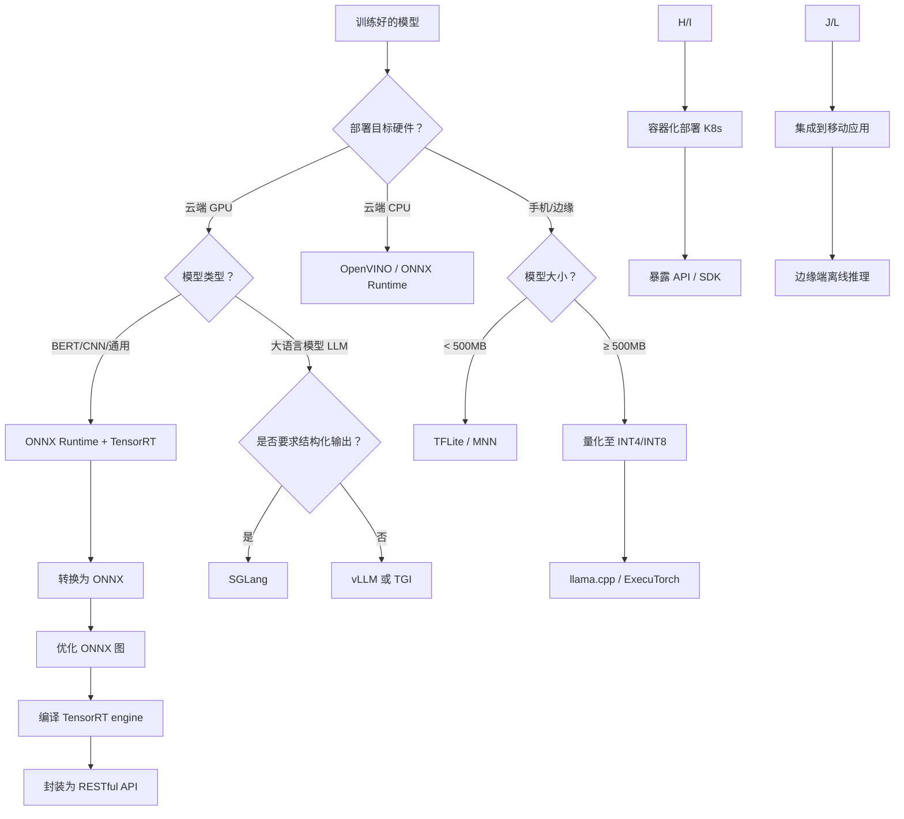

# 模型部署指南

> **范围说明**：本文档覆盖将训练完成的深度学习模型（包括大语言模型）部署到目标环境所需的完整技术环节。按以下四层组织：
>
> 1. 模型优化与压缩（量化、剪枝、蒸馏）
> 2. 模型转换与中间表示（ONNX、IR、TFLite）
> 3. 推理框架 / 推理引擎（ONNX Runtime、TensorRT、vLLM、MNN）
> 4. 服务化与集成（RESTful API、SDK、容器化、边缘端集成）

---

## 目录

- [1. 模型优化与压缩](#1-模型优化与压缩)
  - 1.1 量化
  - 1.2 剪枝
  - 1.3 知识蒸馏
- [2. 模型转换与中间表示](#2-模型转换与中间表示)
  - 2.1 ONNX
  - 2.2 各框架私有 IR
  - 2.3 TFLite 格式
- [3. 推理框架与推理引擎](#3-推理框架与推理引擎)
  - 3.1 云端通用引擎
  - 3.2 大语言模型专用引擎
  - 3.3 端侧引擎
  - 3.4 选型对比
- [4. 服务化与集成](#4-服务化与集成)
  - 4.1 RESTful API
  - 4.2 SDK 封装
  - 4.3 容器化部署
  - 4.4 边缘端集成
- [附录：部署决策流程图](#附录部署决策流程图)

---

## 1. 模型优化与压缩

模型优化与压缩是在不显著改变模型能力的前提下，减少计算量和内存占用的技术集合。压缩后的模型体积更小、推理更快、更适合部署。

### 1.1 量化

将模型参数从高精度（FP32/FP16）转换为低精度（INT8/INT4/NF4），降低显存和带宽需求。

| 量化类型 | 原始精度 | 目标精度 | 显存节省 | 精度损失 | 适用场景 |
|----------|----------|----------|----------|----------|----------|
| **FP16** | FP32 | FP16 | 50% | 可忽略 | GPU 原生支持，通用部署 |
| **INT8** | FP32/FP16 | INT8 | 75% | 较小（0.5~1%） | 对延迟敏感的云端推理 |
| **INT4** | FP16 | INT4 | 87.5% | 中等（1~3%） | 大模型（>7B）单卡部署 |
| **NF4** | FP16 | NF4 | 87.5% | 较小 | QLoRA 微调后部署 |

**常用工具**：

- **GPTQ**：大模型权重量化，无需训练数据或仅需少量校准集，支持 INT4/INT8。
- **AWQ**：激活感知量化，保护重要权重，精度优于 GPTQ。
- **llama.cpp 量化**：GGUF 格式，支持 2~8 位量化，广泛用于 CPU 推理。
- **PyTorch 自带量化**：`torch.quantization` 和 `torch.ao.quantization`，适合中小模型。

**实战建议**：

- 大语言模型（≥7B）优先尝试 INT4 + GPTQ/AWQ，单卡可部署。
- 计算机视觉模型（ResNet、YOLO）使用 INT8，精度损失极小。

### 1.2 剪枝

移除模型中冗余的神经元、通道或权重，形成稀疏结构，减少计算量。

| 剪枝类型 | 粒度 | 稀疏模式 | 加速效果 | 工具支持 |
|----------|------|----------|----------|----------|
| **非结构化剪枝** | 单个权重 | 不规则稀疏 | 依赖稀疏计算库 | PyTorch 内置、SparseML |
| **结构化剪枝** | 通道、滤波器、层 | 规则稀疏（可直接加速） | 立即可见 | NVIDIA ASP、TensorRT |
| **半结构化剪枝** | 2:4 稀疏 | 每 4 个连续权重中保留 2 个 | 受 Tensor Core 支持 | NVIDIA AMP |

**常用方法**：

- **幅度剪枝**：移除绝对值最小的权重。
- **正则化诱导剪枝**：训练时加入 L1/L2 正则化，使不重要权重趋近于零。
- **运动剪枝**：考虑权重在训练过程中的变化幅度。

**实战建议**：

- 非结构化剪枝需要配套稀疏推理引擎（如 DeepSparse）才能获得实际加速。
- 结构化剪枝后可直接部署到任何引擎，推荐优先使用。

### 1.3 知识蒸馏

用一个大型教师模型指导一个小型学生模型学习，使学生模型在参数量远小于教师的情况下，尽可能逼近教师的能力。

| 蒸馏类型 | 输入 | 损失函数 | 适用场景 |
|----------|------|----------|----------|
| **响应蒸馏** | 教师模型的 logits | KL 散度 + 交叉熵 | 分类任务，最简单 |
| **特征蒸馏** | 教师中间层特征 | MSE 或相似度损失 | 需要学生提取类似特征表示 |
| **关系蒸馏** | 样本间的距离或关系图 | 关系一致性损失 | 保持结构信息 |

**常用工具**：

- **TextbooksAreAllYouNeed** 系列：使用大模型生成数据训练小模型。
- **HuggingFace 蒸馏示例**：`DistilBERT`、`DistilGPT2` 等。
- **开源库**：`distiller` (Intel)、`TextBrewer`、`KD-Lib`。

**实战建议**：

- 蒸馏是压缩效果最明显、但成本最高的方法（需要运行教师模型生成数据）。
- 适合将 7B 模型蒸馏为 1B~3B 模型，部署到端侧或低资源环境。

---

## 2. 模型转换与中间表示

模型转换将训练框架（PyTorch、TensorFlow）产出的模型文件转换为与具体硬件无关的中间表示（IR），便于后续推理引擎加载和优化。

### 2.1 ONNX

**ONNX (Open Neural Network Exchange)** 是最通用的中间表示格式，被绝大多数推理引擎支持。

- **核心作用**：作为训练框架与推理引擎之间的“桥梁”。
- **支持算子**：常用算子覆盖率高（Conv、Attention、LayerNorm 等），但部分大模型特有算子（如 FlashAttention）可能需要自定义。
- **转换工具**：`torch.onnx.export`、`tf2onnx`。
- **优化工具**：`onnx-simplifier`（简化图结构）、`onnxruntime` 自带的图优化。

**转换示例（PyTorch → ONNX）**：

```python
import torch
import torch.onnx

model = ...  # 训练好的模型
dummy_input = torch.randn(1, 3, 224, 224)
torch.onnx.export(model, dummy_input, "model.onnx",
                  input_names=["input"], output_names=["output"],
                  dynamic_axes={"input": {0: "batch_size"}})
```

**实战建议**：

- 导出时设置 `opset_version` 为较高版本（如 17+）以支持更多算子。
- 使用 `dynamic_axes` 支持动态 batch 大小。

### 2.2 各框架私有 IR

部分推理框架定义了自有 IR 格式，通常能从 ONNX 转换得到，或直接由训练框架导出。私有 IR 可以携带框架特定的优化信息。

| 推理框架 | 私有 IR 格式 | 说明 |
|----------|--------------|------|
| **TensorRT** | `.engine` / `.plan` | 编译后的优化引擎，与 GPU 型号和驱动版本绑定 |
| **OpenVINO** | `.xml` + `.bin` | 英特尔推理引擎的中间表示 |
| **TFLite** | `.tflite` | TensorFlow Lite 的 FlatBuffer 格式 |
| **Core ML** | `.mlmodel` / `.mlpackage` | Apple 生态专用 |
| **TVM** | `.so` / `.tar` | TVM 编译后的运行时库和参数 |

**转换路径**：

```
PyTorch/TF → ONNX → TensorRT/OpenVINO/TFLite 等框架的专用 IR
```

### 2.3 TFLite 格式

TFLite 是 TensorFlow Lite 使用的中间表示，专门为移动端和嵌入式设备设计，基于 FlatBuffers，支持动态加载。

- **特点**：体积小、无解析延迟、支持量化（INT8/FP16）。
- **转换工具**：`tf.lite.TFLiteConverter`。
- **支持硬件**：ARM CPU、Android NNAPI、Hexagon DSP、GPU（OpenGL/Vulkan）。

**转换示例**：

```python
import tensorflow as tf
converter = tf.lite.TFLiteConverter.from_saved_model("saved_model")
converter.optimizations = [tf.lite.Optimize.DEFAULT]
tflite_model = converter.convert()
with open("model.tflite", "wb") as f:
    f.write(tflite_model)
```

---

## 3. 推理框架与推理引擎

推理引擎负责在目标硬件上高效执行前向计算。不同引擎针对不同场景（云端/端侧、通用/大模型）进行了专门优化。

### 3.1 云端通用引擎

适用于计算机视觉、传统 NLP 模型（BERT 等）、语音识别等非自回归模型。

| 引擎 | 开发者 | 硬件支持 | 特点 |
|------|--------|----------|------|
| **ONNX Runtime** | Microsoft | CPU、CUDA、TensorRT、OpenVINO、DirectML 等 | 多后端支持，图优化完备，易集成 |
| **TensorRT** | NVIDIA | NVIDIA GPU | 极致性能，算子融合和内核自动调优 |
| **OpenVINO** | Intel | Intel CPU、GPU、VPU | 对 Intel 硬件深度优化 |
| **TVM** | Apache 社区 | 数十种硬件后端（ARM、x86、GPU、FPGA） | 自动调度，支持自定义算子 |

**选型建议**：

- 通用需求：ONNX Runtime（平衡性能与易用性）。
- NVIDIA 纯 GPU 环境：TensorRT（性能最高）。
- Intel CPU 部署：OpenVINO。

### 3.2 大语言模型专用引擎

针对 LLM 的自回归解码特性（KV Cache、注意力机制）进行了专项优化。

| 引擎 | 核心优化 | 吞吐量 | 内存效率 | 结构化输出 | 适用硬件 |
|------|----------|--------|----------|------------|----------|
| **vLLM** | PagedAttention | 极高 | 极高 | 一般 | NVIDIA GPU |
| **SGLang** | RadixAttention（前缀缓存） | 高 | 高 | 强（约束解码） | NVIDIA GPU |
| **TGI** | 连续批处理 + FlashAttention | 高 | 高 | 一般 | 多厂商 GPU |
| **LMDeploy** | TurboMind + 量化 | 中高 | 极高 | 一般 | NVIDIA GPU |
| **llama.cpp** | GGUF 量化 + CPU 优化 | 中 | 极高（INT4） | 一般 | CPU（x86/ARM） |

**选型建议**：

- 高并发 API 服务：vLLM。
- 需要 JSON/SQL 等结构化输出：SGLang。
- 快速验证 HuggingFace 模型：TGI。
- 纯 CPU 推理：llama.cpp。

### 3.3 端侧引擎

面向手机、IoT、嵌入式设备，强调低内存、低功耗、快速启动。

| 引擎 | 开发者 | 支持的硬件 | 特点 |
|------|--------|------------|------|
| **MNN** | 阿里巴巴 | CPU、GPU、NPU（通过 HIAI、Neuron 等） | 轻量、高性能、支持大模型端侧部署 |
| **ExecuTorch** | Meta | ARM CPU、NPU | PyTorch 原生生态，支持 LLM 端侧 |
| **TFLite** | 理想汽车 | CPU、GPU、NPU | 生态成熟，与 Android 集成好 |
| **NCNN** | 腾讯 | CPU、GPU（Vulkan）、NPU | 轻量，适合移动端视觉模型 |

**选型建议**：

- Android 端：TFLite 或 MNN。
- iOS / macOS：Core ML（苹果官方）。
- 跨平台轻量级：NCNN。
- PyTorch 训练模型直接部署端侧：ExecuTorch。

### 3.4 推理引擎选型对比表

| 部署场景 | 推荐引擎 | 备选引擎 |
|----------|----------|----------|
| 云端通用模型（CNN、BERT） | ONNX Runtime | TensorRT（GPU）、OpenVINO（CPU） |
| 云端 LLM（高吞吐） | vLLM | TGI、SGLang |
| 云端 LLM（低显存） | LMDeploy | llama.cpp + GPU |
| 边缘端 LLM（CPU） | llama.cpp | MNN |
| 手机端视觉模型 | TFLite / NCNN | MNN |
| 手机端 LLM | ExecuTorch / MNN | llama.cpp（Android） |

---

## 4. 服务化与集成

将推理引擎封装为可被应用调用的服务，包括 API、SDK、容器镜像和边缘端集成。
>服务化的对象不是原始的模型文件（.pt、.h5），也不是单独的推理引擎库（.so），而是 “模型 + 引擎 + 运行环境” 这个整体——一个可被调用的推理能力单元。所以此阶段服务化的对象本质上是“推理引擎实例”（已经加载好模型的运行时）。

### 4.1 RESTful API

通过 HTTP 暴露推理接口，最通用的服务化形式。

**标准 API 设计建议**：

| 端点 | 方法 | 请求示例 | 响应示例 |
|------|------|----------|----------|
| `/v1/completions` | POST | `{"prompt": "你好", "max_tokens": 100}` | `{"text": "你好，有什么可以帮助你的？", "usage": {...}}` |
| `/v1/embeddings` | POST | `{"input": "文本内容"}` | `{"embedding": [0.1, -0.2, ...], "usage": {...}}` |
| `/health` | GET | - | `{"status": "ok"}` |

**实现要点**：

- 异步处理长请求（LLM 生成可能数秒至数十秒），支持 Server-Sent Events (SSE) 或 WebSocket 流式返回。
- 请求限流（基于用户或 API Key）。
- 请求 ID 全链路追踪。

**示例（FastAPI + vLLM 集成）**：

```python
from fastapi import FastAPI
from vllm import LLM, SamplingParams

app = FastAPI()
llm = LLM(model="meta-llama/Llama-2-7b-chat-hf")

@app.post("/generate")
async def generate(prompt: str, max_tokens: int = 100):
    sampling_params = SamplingParams(max_tokens=max_tokens)
    outputs = llm.generate([prompt], sampling_params)
    return {"text": outputs[0].outputs[0].text}
```

### 4.2 SDK 封装

提供多语言客户端 SDK（Python、Java、Go、Node.js 等），封装 API 调用细节。

**SDK 应包含**：

- 连接池管理、自动重试、超时控制。
- 请求批处理（自动合并多个推理请求）。
- 流式响应解析（SSE 或 WebSocket）。
- 本地缓存（相同请求直接返回缓存结果）。

**示例 SDK 接口**：

```python
client = InferenceClient(endpoint="http://localhost:8000", api_key="xxx")
response = client.generate("你好", max_tokens=100, stream=True)
for chunk in response:
    print(chunk.token, end="")
```

### 4.3 容器化部署

使用 Docker + Kubernetes 实现标准化部署、弹性伸缩和资源隔离。

**Dockerfile 示例（vLLM + FastAPI）**：

```dockerfile
FROM nvidia/cuda:12.1-runtime-ubuntu22.04
RUN pip install vllm fastapi uvicorn
COPY server.py /app/server.py
WORKDIR /app
CMD ["uvicorn", "server:app", "--host", "0.0.0.0", "--port", "8000"]
```

**Kubernetes 资源配置要点**：

- `resources.limits.nvidia.com/gpu`：指定需要的 GPU 数量。
- `readinessProbe`：健康检查端点 `/health`，确保模型已加载完成。
- `startupProbe`：针对大模型启动慢的情况，给予更长的初始等待时间。
- 使用 `Deployment` + `HPA`（基于 QPS 或 GPU 利用率自动伸缩）。
- 使用 `Service`（ClusterIP 或 LoadBalancer）暴露 API。

### 4.4 边缘端集成

将推理引擎直接嵌入到客户端设备（手机、IoT、边缘网关）中。

**集成方式**：

- **静态链接**：将引擎编译为 `.a` 或 `.so`，与应用程序链接（C/C++ 场景）。
- **动态加载**：应用通过 JNI（Android）或 FFI（其他语言）调用引擎库。
- **解释执行**：部分引擎（如 TFLite）提供解释器，直接加载 `.tflite` 文件。

**端侧部署流程**：

1. 训练模型 → 2. 量化（INT8/INT4）→ 3. 转换为端侧引擎格式（TFLite/MNN）→ 4. 集成到 App 中 → 5. 设备端推理（离线）。

**注意事项**：

- 端侧算力和内存有限，必须量化。
- 首次加载模型可能耗时，建议在后台线程预热。
- 对于大模型（≥1B），考虑分片加载或模型下载后再加载。

---

## 附录：部署决策流程图


