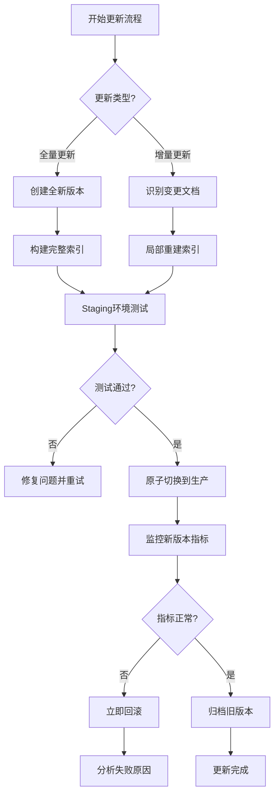

# RAG知识库版本管理与线上更新最佳实践

## 1. 版本管理策略

### 1.1 数据版本控制（Data Versioning）

```
知识库版本 = 文档内容版本 + 向量嵌入版本 + 元数据版本
```

**核心原则**：

- **不可变性**：每个版本的知识库数据都是不可变的，避免就地修改
- **原子性**：版本切换必须是原子操作，避免中间状态
- **可回滚**：任何版本都可以快速回滚到前一个稳定版本

**实现方式**：

```python
# 版本标识格式
version_id = f"{timestamp}_{commit_hash}_{embedding_model_version}"
# 示例: "20260522_abc123_bge-large-zh-v1.5"
```

### 1.2 多版本并行存储架构

```
向量数据库/
├── production/           # 当前生产版本
├── staging/             # 预发布版本  
├── v20260522_abc123/    # 历史版本1
├── v20260521_def456/    # 历史版本2
└── archive/             # 归档版本（冷存储）
```

## 2. 线上更新策略

### 2.1 蓝绿部署（Blue-Green Deployment）

这是最安全的生产更新策略：

```
阶段1: 当前生产环境
┌─────────────────┐    ┌─────────────────┐
│   蓝色环境       │    │   绿色环境       │
│  (当前生产)      │    │  (待部署)        │
│  version: v1     │    │  version: v2     │
└─────────────────┘    └─────────────────┘
         ↑                      ↓
     流量100%               流量0%

阶段2: 切换瞬间
┌─────────────────┐    ┌─────────────────┐
│   蓝色环境       │    │   绿色环境       │
│  (旧版本)        │    │  (新生产)        │
│  version: v1     │    │  version: v2     │
└─────────────────┘    └─────────────────┘
         ↓                      ↑
     流量0%                流量100%
```

**优势**：

- ✅ 零停机时间
- ✅ 快速回滚（秒级）
- ✅ 完全隔离，互不影响

### 2.2 金丝雀发布（Canary Release）

适用于需要渐进式验证的场景：

```
流量分配策略：
- 第1小时：95% v1, 5% v2
- 第2小时：80% v1, 20% v2  
- 第4小时：50% v1, 50% v2
- 第8小时：0% v1, 100% v2
```

**监控指标**：

- 检索准确率变化
- 响应延迟变化  
- 用户满意度指标
- 异常查询比例

## 3. 保证已有数据不受影响的技术方案

### 3.1 向量数据库的版本隔离

**Milvus 实现方案**：

```python
# 创建新集合（Collection）用于新版本
new_collection_name = f"knowledge_base_v{version_id}"

# 在新集合中构建索引
milvus.create_collection(new_collection_name, schema)
milvus.insert(new_collection_name, new_vectors)

# 原子切换别名
milvus.alter_alias("production_kb", new_collection_name)
# 此操作是原子的，毫秒级完成
```

**Pinecone 实现方案**：

```python
# 使用不同的Index Name
production_index = pinecone.Index("kb-production")
staging_index = pinecone.Index(f"kb-staging-{version_id}")

# 数据准备完成后切换路由配置
update_routing_config("kb-production", f"kb-staging-{version_id}")
```

### 3.2 双写策略（Dual Writing）

在更新期间同时写入新旧两个版本：

```python
def update_knowledge_document(doc_id, new_content):
    # 1. 更新源文档存储（如S3、数据库）
    update_source_document(doc_id, new_content)
    
    # 2. 同时向新旧版本向量库写入
    if enable_dual_write:
        embed_and_insert(production_index, doc_id, new_content)
        embed_and_insert(staging_index, doc_id, new_content)
    
    # 3. 记录更新日志用于一致性校验
    log_update_operation(doc_id, version_id, timestamp)
```

### 3.3 一致性校验机制

```python
def verify_consistency(old_version, new_version):
    """校验新旧版本数据一致性"""
    # 随机抽样对比
    sample_docs = random.sample(all_doc_ids, 1000)
    
    for doc_id in sample_docs:
        old_vector = old_version.get_vector(doc_id)
        new_vector = new_version.get_vector(doc_id)
        
        # 检查向量相似度（应该接近1.0）
        similarity = cosine_similarity(old_vector, new_vector)
        if similarity < 0.99:  # 允许微小差异
            raise ConsistencyError(f"Doc {doc_id} inconsistent")
    
    return True
```

## 4. 增量更新的最佳实践

### 4.1 增量更新流程

```
1. 识别变更 → 2. 局部重建 → 3. 验证测试 → 4. 原子切换
```

**详细步骤**：

1. **变更检测**：使用文件哈希或数据库CDC（Change Data Capture）识别新增/修改/删除的文档
2. **局部处理**：只对变更的文档进行分块、嵌入和索引
3. **合并策略**：将增量数据与现有索引合并（支持增量索引的向量库如FAISS、Milvus）
4. **验证测试**：在staging环境进行全面测试
5. **原子切换**：使用别名切换或配置更新实现无缝切换

### 4.2 支持增量更新的向量库特性

| 向量库 | 增量插入 | 增量删除 | 动态索引重建 | 推荐场景 |
|--------|----------|----------|--------------|----------|
| **Milvus** | ✅ | ✅ | ✅ | 生产环境首选 |
| **Pinecone** | ✅ | ✅ | ⚠️有限 | 托管服务场景 |
| **Weaviate** | ✅ | ✅ | ✅ | 图+向量混合 |
| **Qdrant** | ✅ | ✅ | ✅ | 高性能场景 |
| **FAISS** | ⚠️需重建 | ❌ | ❌ | 离线批处理 |

## 5. 完整的生产更新工作流



## 6. 关键成功要素

### 6.1 监控告警体系

- **数据一致性监控**：定期校验源数据与向量数据的一致性
- **性能监控**：检索延迟、QPS、内存使用率
- **质量监控**：检索准确率、用户反馈评分
- **异常检测**：突然的性能下降或错误率上升

### 6.2 自动化工具链

```bash
# 自动化更新脚本示例
./rag-update.sh \
  --source s3://knowledge-bucket/ \
  --vector-db milvus://prod-cluster \
  --strategy incremental \
  --validation strict \
  --rollback-auto true
```

### 6.3 灾难恢复计划

- **备份策略**：每日快照 + 增量日志
- **恢复时间目标（RTO）**：< 15分钟
- **恢复点目标（RPO）**：< 5分钟数据丢失

## 7. 实际案例参考

**电商产品知识库更新**：

- 数据规模：500万产品文档
- 更新频率：每小时增量更新
- 策略：蓝绿部署 + 双写
- 切换时间：< 100ms
- 回滚时间：< 30s

**金融法规知识库更新**：

- 数据规模：50万法规文档  
- 更新频率：每日全量更新
- 策略：金丝雀发布 + 严格验证
- 验证标准：100%一致性 + 专家审核
- 切换窗口：凌晨2-4点

---

**总结**：生产环境的RAG知识库版本管理关键在于**隔离、验证、原子切换**。通过合理的架构设计和技术选型，完全可以做到线上更新时保证已有数据不受影响，同时提供快速回滚能力以应对意外情况。

您是否希望我针对某个特定的向量数据库（如Milvus、Pinecone等）提供更详细的实现方案？
