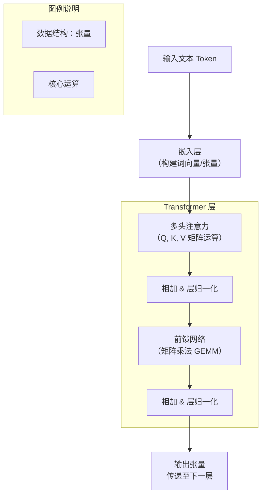

# 张量与矩阵运算

张量与矩阵运算，是大模型的“通用语言”和“底层燃料”。要理解大模型如何“思考”，就需要理解这些运算如何在其中扮演核心角色。它就像代码里的`Hello World`，是入门的第一步，也是最基础、最重要的一步。

## 🧩 张量与矩阵：定义

* **标量**：一个数字，代表模型的某个简单参数，比如温度系数。
* **向量**：一维数组，代表着单词的语义特征、用户偏好等多维信息。
* **矩阵**：二维数组，常作为神经网络的权重层，负责在不同维度的特征空间之间进行映射和转换。
* **张量**：三维及以上的高维数组，是大模型中最核心的数据容器。例如，输入模型的文本通常会变成一个形状为 `[batch_size, seq_len, embedding_dim]` 的三维张量，它代表了一“批”句子中，每个句子里的每个“词”的语义特征。

## ⚙️ 张量与矩阵运算的核心角色

在大模型的“流水线”上，张量和矩阵运算通过多种角色协同工作，共同构建了智能的基础。这里通过一个简化的Transformer模型示意图来直观展示它们的作用：

这张图从宏观上展示了张量作为“数据流”的骨架，接下来看看构成这些骨架的具体“关节”——各项运算所扮演的关键角色。

### 运算核心：GEMM

* **角色**：**计算主力与性能焦点**。它可以说是大模型背后的“无名英雄”，几乎所有核心计算都离不开它。
* **作用**：GEMM构成了计算负载的核心，通常占Transformer模型计算量的 **90% 以上**。正是这种高度集中的计算模式，为专用硬件加速提供了可能。

### 数据载体：张量

* **角色**：**信息承载与传递者**。张量是大模型处理数据的通用格式，从输入到输出，所有信息都以高维张量的形式在各层间流动和变换。
* **作用**：它为处理**批量数据**和**高维信息**（如文本、图像序列）提供了统一且高效的数据结构，是模型并行计算的基石。

### 信息过滤：注意力机制中的矩阵

* **角色**：**语义理解与信息筛选者**。注意力机制是Transformer架构的“大脑”，而`Q, K, V`矩阵是它的核心计算单元。
* **作用**：模型通过计算`Q`和`K`的相似度得到注意力权重，再作用于`V`，从而让模型能够聚焦于输入序列中的关键部分。这一步通常涉及复杂的矩阵乘法。

### 分布式基石：张量并行 (TP)

* **角色**：**突破限制的架构师**。当单个GPU的显存无法容纳整个模型时，TP技术是关键的解决方案。
* **作用**：TP将模型的巨大权重矩阵切分到多个GPU上协同运算。这极大地降低了对单卡显存的依赖，是训练千亿、万亿参数大模型不可或缺的技术。

### 性能引擎：张量核心

* **角色**：**硬件加速引擎**。现代GPU为加速深度学习中的矩阵乘法而专门设计的特殊硬件单元。
* **作用**：它能在单个时钟周期内完成**4x4矩阵的乘加运算**，大幅提升训练和推理速度。例如，NVIDIA从Volta架构开始引入张量核心，并且每代都在不断演进。

### 结构简化器：张量分解

* **角色**：**模型压缩与轻量化专家**。面对大模型巨大的参数量，张量分解提供了一种有效的“瘦身”方案。
* **作用**：它将大权重张量分解为几个结构更简单、参数更少的小张量乘积。在**模型压缩**（如 LoRA 微调）和**加速推理**中至关重要，可以大幅度减少参数量和计算量。

## 🔬 核心运算与具体应用举例

* **向量点积**：本质上是计算两个向量的**相似度**。注意力机制通过计算`Query`和`Key`向量的点积，来确定一个词和句子中其他词的关联强弱。
* **矩阵乘法**：是整个网络的“骨架”。前馈网络层（FFN）通过`Y = W·X + b`这种矩阵运算，对特征进行高维映射和提取。
* **逐元素运算**：操作简单但应用普遍，是残差连接（`输出 = 输入 + F(输入)`）和层归一化等操作的基础，保证模型训练的稳定和信息流的畅通。
* **卷积运算**：是处理图像等具有**空间结构的数据**的核心运算。在视觉大模型（ViT）和多模态模型中，它被用于将图像数据转换为可供Transformer处理的序列。

## 🌟 未来趋势

* **框架与硬件更紧密协同**：未来框架如 **TileLang**、CUTLASS将允许开发者以更高效率利用硬件特性，同时，混合精度训练和GPGPU等技术将提供更强的算力支持。
* **大模型应用向端侧渗透**：随着模型压缩和高效推理技术的发展，未来有望在手机等边缘设备上直接运行强大的大模型。
* **张量逻辑统一符号与神经网络**：“张量逻辑”等前沿研究可能在数学层面实现符号推理与神经网络的融合，催生新一代AI模型。

## 💎 总结

总的来说，张量与矩阵运算不仅是深度学习的基础数学语言，更是驱动大模型完成信息表示、特征提取、关系建模和智能决策的引擎。可以说，**没有张量和矩阵，就没有今天的大模型**。
