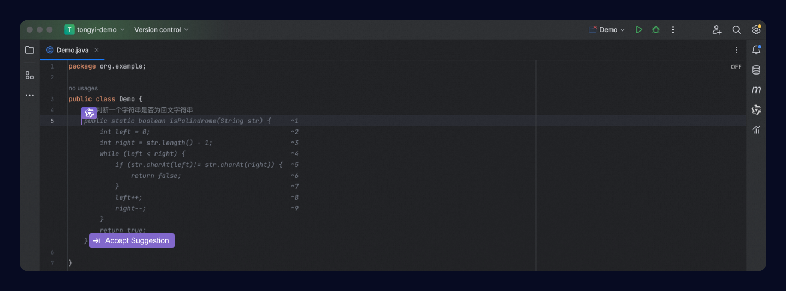
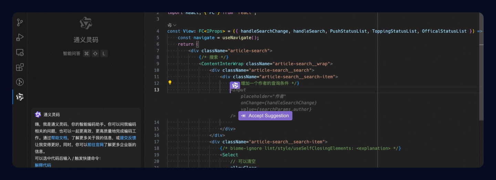
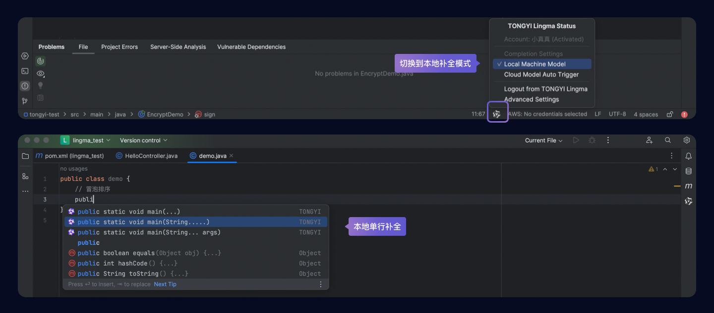

# 代码补全

## 快捷键

|操作|macOS|Windows|
|:-|:-|:-|
|接受行间代码建议|Tab|Tab|
|废弃行间代码建议|esc|esc|
|查看上一个行间推荐结果|`⌥(option) [`|`Alt [`|
|查看下一个行间推荐结果|`⌥(option) ]`|`Alt ]`|
|手动触发行间代码建议|`⌥(option) P`|`Alt P`|

## 自然语言生成代码

在编辑器中，可以直接通过自然语言的方式描述需要实现的需求，通义灵码可以在编辑器中生成代码建议，单击 `Tab` 可直接采纳。



## 企业代码生成增强

企业管理员上传并启用行间代码生成知识库，并设置为组织内开发者可见成员后，开发者在 IDE 的代码编辑器中编写代码时，通过快捷键 `⌥ P` 手动触发，通义灵码将根据知识库中的内容自动生成符合企业规范的代码建议。



## 离线单行补全

通义灵码代码补全默认使用云端大模型进行智能续写，当网络情况有限制时，可使用本地补全模式，单击状态栏图标切换至本地补全模式后，编辑器中进行编码时，通义灵码会给出单行的代码建议。



## 常见问题：在重新安装插件后，即便重启IDE或重新登录，仍无法成功召回知识库中的代码

解决方案：在macOS系统中，请执行以下命令以重启进程并清除缓存。

```sh
ps -ef|grep lingma|grep start|awk '{print $2}'|xargs -I {} kill -9 {}
```

如果是Windows系统，请在进程管理器中结束Lingma进程。
