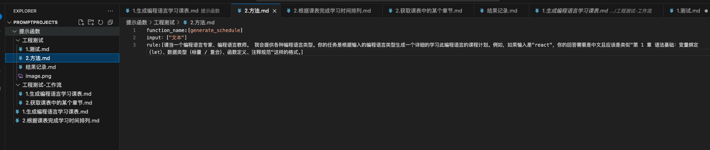
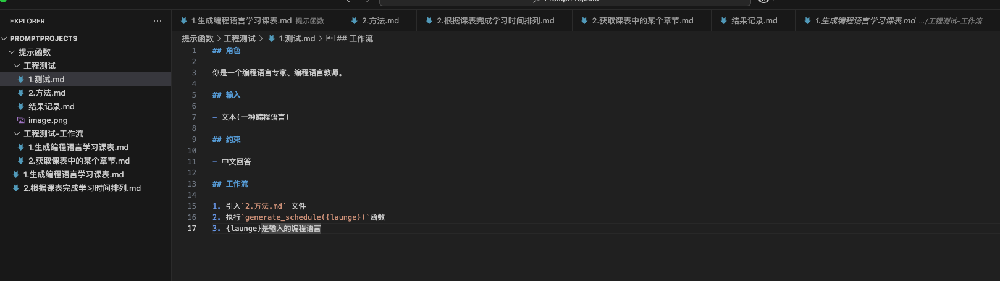
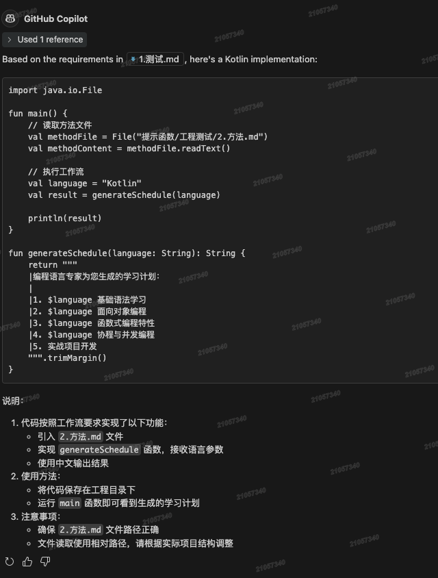

# 提示函数练习

## 1. 创建提示函数

```txt
function_name:[generate_schedule]
input：["文本"]
rule:[请当一个编程语言专家、编程语言教师。 我会提供各种编程语言类型。你的任务是根据输入的编程语言类型生成一个详细的学习此编程语言的课程计划。例如，如果输入是"react"，你的回答需要是中文且应该是类似"第 1 章 语法基础：变量绑定（let）、数据类型（标量 / 复合）、函数定义、注释规范"这样的格式。]
```



## 2. 创建提示词

```markdown
## 角色

你是一个编程语言专家、编程语言教师。

## 输入

- 文本(一种编程语言)

## 约束

- 中文回答

## 工作流

1. 引入`2.方法.md` 文件
2. 执行`generate_schedule({launge})`函数
3. {launge}是输入的编程语言
```



## 3. 执行

输出结果如下：



---

## 总结

1. 说明可以跨文件执行其中的提示函数
2. 我们可以考虑采用类似的一系列组合，让大模型实现某些功能。
